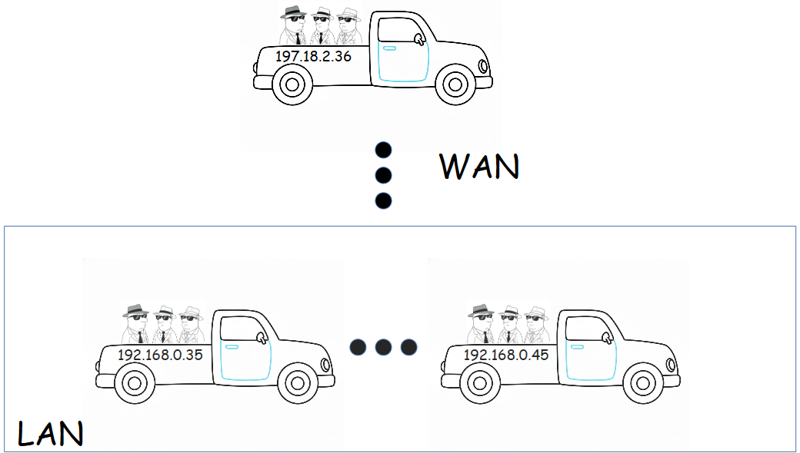
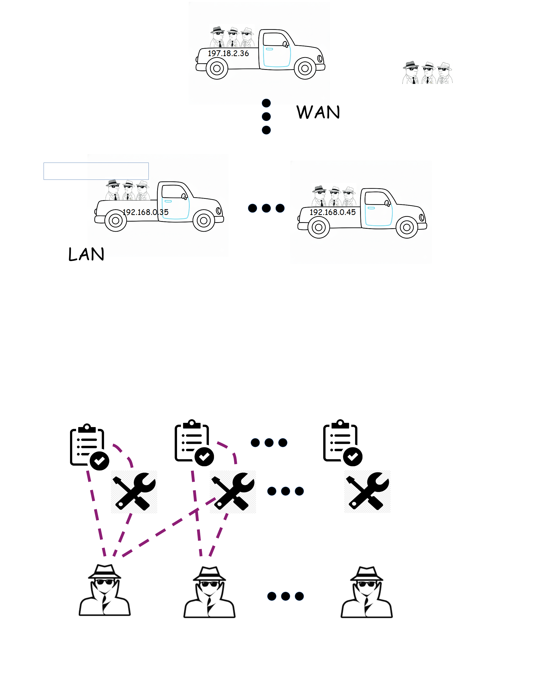
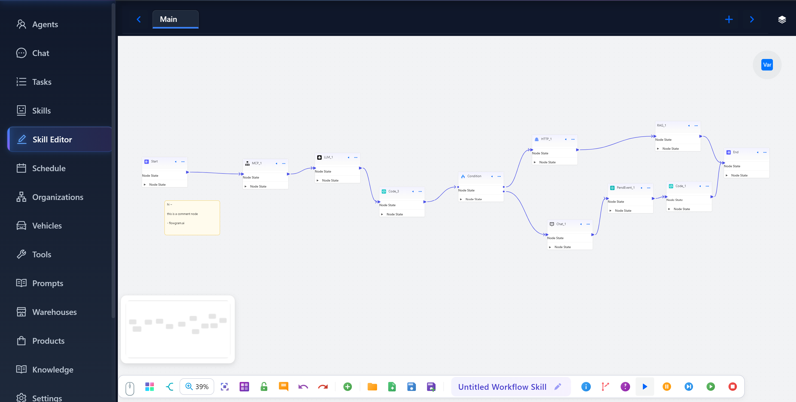

<p align="center">
  
</p>

# eCan.ai (E-Commerce Agent Network)
eCan.ai is an agent app for e-commerce, aimed at empowering sellers to run their multi-channel e-commerce businesses with minimal human overheads.
This will be achieved by allowing sellers to run every aspects of their e-commerce business with ai agents, from sourcing/procurement to selling, 
from marketing research to advertising, from legal counsel to customer service. Hopefully your agents can run by agents, so that you can be sitting on the beach :)

# Features

### Networked Agents

With eCan.ai, you can run many agents across many vehicles (a.k.a host computers) on a LAN or WAN or a combo of both. There will be at least 1 host computer that serves as a commander, and other 
computers serve as vehicles that carries a platoon of agents, a computer or a mobile device such as a smart phone or tablet can also serve as a staff officer, a staff officer 
computer can monitor and command the agents remotely thru the internet.

### A2A Protocol For Inter-Agent Communication

eCan.ai adopts the de-facto standard-in-making [A2A](https://github.com/a2aproject/A2A) protocol for messaging between agents. We also supports websocket based real time
chat between human and agents and between human and agents over the internet.



### Multi-Agent, Multi-Task

eCan.ai has built-in agents for several e-commerce tasks, but you can easily create your own agents, and assign tasks for them to do.
tasks can be run on a pre-assigned schedule, for example routine daily task can be created to run at certain time each day. Each task will run in its own thread.
A task doesn't just run by itself, it requires a skill to run, a skill is a work-flow description. So one must associate a task with an skill for it to run correctly.



### [Langgraph](https://github.com/langchain-ai/langgraph) based Agent Skills

eCan.ai builds on top of Langgraph (from [Langchain](https://www.langchain.com/)), the state of art agent development framework. Any agent task will require
at least one skill, which is work-flow described by langgraph.


#### Graphic [Flowgram](https://github.com/bytedance/flowgram.ai) based Langgraph IDE


eCan.ai includes a customized open-source [Flowgram](https://github.com/bytedance/flowgram.ai) editor to provide a graphic way to author a langgraph based workflow.
you can simply drag and drop nodes to the canvas, connect them with edges, and fill in the necessary parameters and/or codes, and be done 
Once you created a workflow graphically. You can also run/cancel/pause/resume/single-step(on a per-node basis) through the langgraph based workflow. Breakpoints can
be added on nodes to pause at certain nodes, and upon pausing, you can inspect the state of the langgraph run, or even modify the state 
attributes and then resume the run. Flowgram based visual programming of langgraph allows you to focus more effort on work flow rather than
coding up the langgraph. Here is a feature list of eCan.ai's skill editor:
* packaged functional nodes enables building workflow with no code or low code.
* code editor integrated into code node, can edit code directly on canvas.
* can run/pause/resume all on canvas.
* can add/clear breakpoints on nodes to pause at certain nodes.
* support multi-sheets to make large complicated workflow modular
* node can be left-right mirrored, or top-down mirrored, to support feedback workflow and ease of edge placement.
* supports bidirectional translation between flowgram and langgraph. Which means you can load graphically view, re-layout, a langgraph created by coded.

For more detailed user guide of the skill editor, please refer to [skill editor](gui_v2/src/modules/skill-editor/doc/skill_editor_help.md).

### Browser Automation.

Browser automation is a critical aspect of e-commerce, eCan.ai has integrated a rich set of state-of-art opensource web automation tools into the app.
These includes:
 * [Browser-use](https://github.com/browser-use/browser-use) -- easy to use, can be run as a langgraph node callable.
 * [Crawl4ai](https://github.com/unclecode/crawl4ai) --  -- easy to use, can be run as a langgraph node callable.
 * [Browsebase](https://github.com/browserbase) -- to be added.

While playwright is a state-of-art web automation tool, and pretty much become the de-facto standard for web automation,
we do realize it is still not the same as some of the popular fingerprint browser, to enable their use, we have added 
a rich set of tools based on selenium and webdriver (chromedriver) so that you can automate web interface with browsers 
such as [AdsPower](https://github.com/AdsPower)

In browser actions are nice, but they are some times not enough, pop-ups, captchas, etc., sometimes we need computer vision (CV) guided mouse 
and keyboard actions, we have made a state-of-art OCR service to allow CV guided screen understanding and actions, further allowing you
to fully control your browser or any other app in that matter.


### MCP
We have a rich set of ready to use MCP tools to work with LLM, refer to more details [here](docs/eCanMCP.md)
### RAG
We have RAG (Retrieve Augmented Generation) functionality built in to our app, so you can easily put your product related files, policy related files, 
or any business related files into vector DB and retrieve them to generate response for your customers.


### Interfacing with Agents over the internet
You will need to subscribe to ["Pro" plan](). With "Pro" plan, you can chat with any agent remotely even when you're on the road.

## 🔨 Building eCan.ai (On Local Machine)

eCan.ai supports multiple build modes for different use cases:

### Quick Build (Recommended for Development)
```bash
python build.py fast                    # Fast build with caching and parallel compilation
python build.py fast --force           # Force rebuild (ignore cache)
python build.py fast --skip-frontend   # Skip frontend build
python build.py fast --skip-installer  # Generate executable only
```

### Other Build Modes
```bash
python build.py dev                     # Development build (with console)
python build.py prod                    # Production build (fully optimized)
```

### Build Features
- **Parallel Compilation**: Uses multiple CPU cores for faster builds (all modes)
- **Parallel Installer Creation**: Multi-threaded compression for Windows installers
- **Smart Caching**: Incremental builds that only recompile changed files (fast mode only)
- **Auto Data Collection**: Automatically collects data files, binaries, and submodules from key packages
- **Cross-platform**: Works on Windows, macOS, and Linux
- **Optimized Packaging**: Excludes unnecessary dependencies to reduce size

### Build Mode Differences
- **fast**: Enables caching and parallel compilation for fastest builds (~2-5 min)
  - Uses ZIP compression for installer (fastest)
  - Minimal data collection for essential packages only
  - Optimized for development speed
- **dev**: Parallel compilation with console output for debugging (~5-10 min)
  - Uses ZIP compression for installer
  - Full data collection for comprehensive testing
  - Includes debug symbols and console output
- **prod**: Parallel compilation with full optimization and clean builds (~15-25 min)
  - Uses LZMA compression with solid compression (smallest size)
  - Complete data collection for all packages
  - Maximum compression for distribution

### Build Time Optimization
Choose the right mode for your needs:
- **Development**: Use `fast` mode for quick iterations (`python build.py fast`)
- **Testing**: Use `dev` mode for comprehensive testing (`python build.py dev`)
- **Distribution**: Use `prod` mode for final releases (`python build.py prod`)

If build time is critical:
- Skip installer creation: `python build.py [mode] --skip-installer`
- Use fast mode for development: `python build.py fast`

**Expected installer creation times:**
- fast/dev modes: 3-5 minutes (ZIP compression)
- prod mode: 15-25 minutes (LZMA compression with solid compression)

### Build Output
- Executable files are generated in the `dist/` directory
- Installation packages (if enabled) are created as something like `eCan-1.0.0-windows-amd64-Setup.exe` (Windows) or equivalent for other platforms

## Installation Guide

eCan.ai supports multiple build modes for different use cases:

## Documentations
You can acccess more comprehensive documentations [here](http://www.ecan.ai/docs/user_manual.php)

## API Ref
Coming soon...

## Cli Ref
Coming soon...

## Development
### Code
Visit Our Repo on [Github](https://github.com/), look at issues and let us know what you like to solve.

### Discuss
- the preferred technical discussion platform is github project discussion panel, 
-  We also have a [Discord](https://discord.gg/ebMYEPVr) server.

## Quick Links
