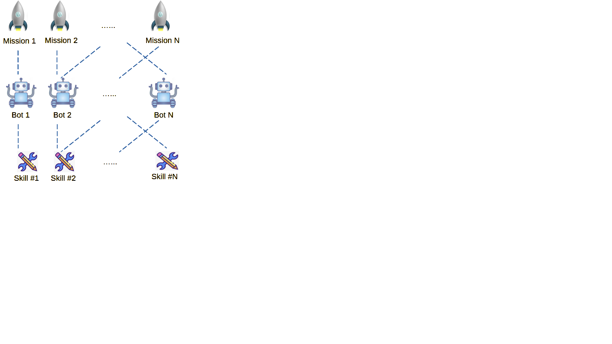
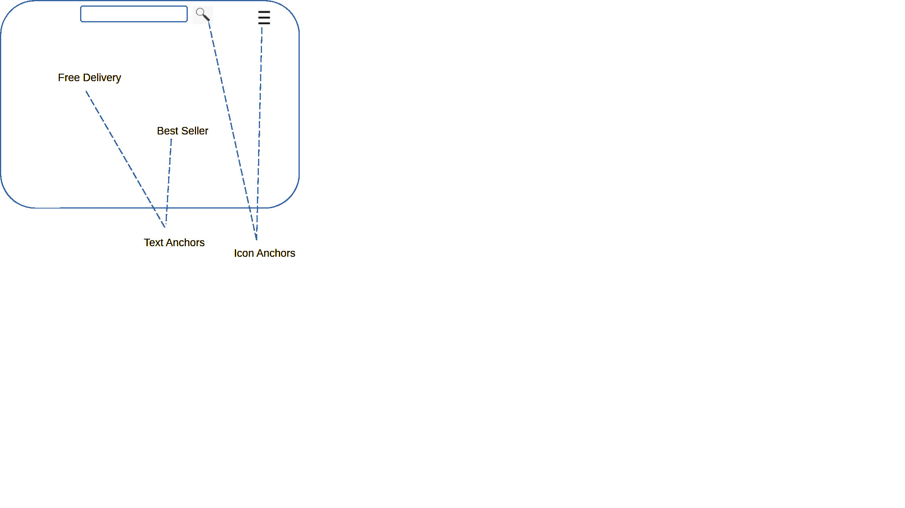
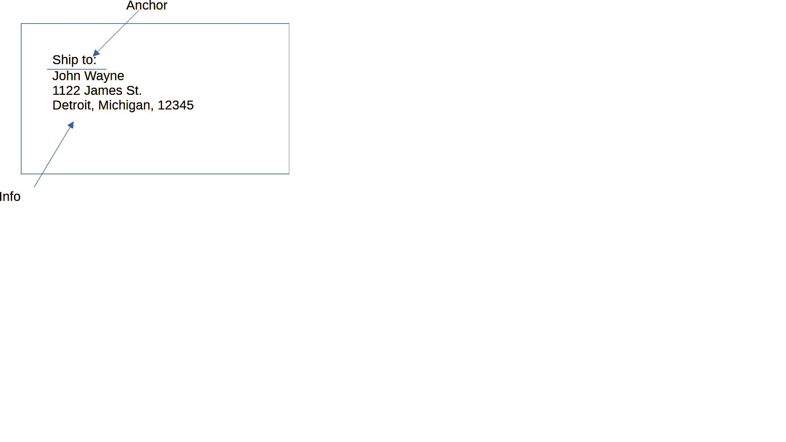

<p align="center">
  
</p>

# eCan.ai (E-Commerce Agent Network)
eCan.ai is an agent app for e-commerce, aimed at empowering sellers to run their multi-channel e-commerce businesses with minimal human overheads.
This will be achieved by allowing sellers to run every aspects of their e-commerce business with ai agents, from sourcing/procurement to selling, 
from marketing research to advertising, from legal counsel to customer service. Hopefully your agents can run by agents, so that you can be sitting on the beach :)

# Features

### Networked Agents

With eCan.ai, you can run many agents across many vehicles (a.k.a host computers) on a LAN or WAN or a combo of both. There will be at least 1 host computer that serves as a commander, and other 
computers serve as vehicles that carries a platoon of agents, a computer or a mobile device such as a smart phone or tablet can also serve as a staff officer, a staff officer 
computer can monitor and command the agents remotely thru the internet.

### A2A Protocol For Inter-Agent Communication

eCan.ai adopts the de-facto standard-in-making [A2A](https://github.com/a2aproject/A2A) protocol for messaging between agents. We also supports websocket based real time
chat between human and agents and between human and agents over the internet.


### Multi-Agent, Multi-Task

eCan.ai has built-in agents for several e-commerce tasks, but you can easily create your own agents, and assign tasks for them to do.
tasks can be run on a pre-assigned schedule, for example routine daily task can be created to run at certain time each day. Each task will run in its own thread.
A task doesn't just run by itself, it requires a skill to run, a skill is a work-flow description. So one must associate a task with an skill for it to run correctly.



### [Langgraph](https://github.com/langchain-ai/langgraph) based Agent Skills

eCan.ai builds on top of Langgraph (from Langchain), the state of art agent development framework. Any agent task will require
at least one skill, which is work-flow described by langgraph.


#### Graphic [Flowgram](https://github.com/bytedance/flowgram.ai) based Langgraph IDE


eCan.ai includes a customized open-source [Flowgram](https://github.com/bytedance/flowgram.ai) editor to provide a graphic way to author a langgraph based workflow.
you can simply drag and drop nodes to the canvas, connect them with edges, and fill in the necessary parameters and/or codes, and be done 
Once you created a workflow graphically. You can also run/cancel/pause/resume/single-step(on a per-node basis) through the langgraph based workflow. Breakpoints can
be added on nodes to pause at certain nodes, and upon pausing, you can inspect the state of the langgraph run, or even modify the state 
attributes and then resume the run. Flowgram based visual programming of langgraph allows you to focus more effort on work flow rather than
coding up the langgraph. Here is a feature list of eCan.ai's skill editor:
* packaged functional nodes enables building workflow with no code or low code.
* code editor integrated into code node, can edit code directly on canvas.
* can run/pause/resume all on canvas.
* can add/clear breakpoints on nodes to pause at certain nodes.
* support multi-sheets to make large complicated workflow modular
* node can be left-right mirrored, or top-down mirrored, to support feedback workflow and ease of edge placement.
* supports bidirectional translation between flowgram and langgraph. Which means you can load graphically view, re-layout, a langgraph created by coded.

For more detailed user guide of the skill editor, please refer to [skill editor](gui_v2/src/modules/skill-editor/doc/skill_editor_help.md).

### Browser Automation.

Browser automation is such an critical aspect of e-commerce, eCan.ai has integrated a rich set of state-of-art opensource web automation tools into the app.
These includes:
 * [Browser-use](https://github.com/browser-use/browser-use) -- easy to use, can be run as a langgraph node callable.
 * [Crawl4ai](https://github.com/unclecode/crawl4ai) --  -- easy to use, can be run as a langgraph node callable.
 * [Browsebase](https://github.com/browserbase) -- to be included.

While playwright is a state-of-art web automation tool, and pretty much become the de-facto standard for web automation,
we do realize it is still not the same as some of the popular fingerprint browser, to enable their use, we have added 
a rich set of tools based on selenium and webdriver (chromedriver) so that you can automate web interface with browsers 
such as [AdsPower](https://github.com/AdsPower)

In browser actions are nice, but they are some times not enough, pop-ups, captchas, etc., sometimes we need computer vision (CV) guided mouse 
and keyboard actions, we have made a state-of-art OCR service to allow CV guided screen understanding and actions, further allowing you
to fully control your browser or any other app in that matter.


###### Streamable HTTP MCP Tools Integration

eCan.ai makes a set of streamable HTTP accessible MCP tools available to the agents.
Here is the list of these MCP tools:


| Name                                     | Description                                             | Syntax                                                                                                                                                                                                                                                                                                                                                                                                                                                                                |
|------------------------------------------|---------------------------------------------------------|---------------------------------------------------------------------------------------------------------------------------------------------------------------------------------------------------------------------------------------------------------------------------------------------------------------------------------------------------------------------------------------------------------------------------------------------------------------------------------------|
| Mouse <br>Click                          | Execute a mouse click action                            | <pre>{<br>&nbsp;"type" : "Mouse Click",<br>&nbsp;&nbsp;"action": "string",<br>&nbsp;&nbsp;"action args": "string",<br>&nbsp;&nbsp;"save_rb": True/False,<br>&nbsp;&nbsp;"screen": "string",<br>&nbsp;&nbsp;"target_name": "string",<br>&nbsp;&nbsp;"target_type": "string",<br>&nbsp;&nbsp;"text": "string",<br>&nbsp;&nbsp;"nth": [x-int, y-int],<br>&nbsp;&nbsp;"offset from": "string",<br>&nbsp;&nbsp;"offset unit": "string",<br>&nbsp;&nbsp;"offset": [x-int, y-int]<br>}</pre> | 
| Mouse <br>Move                           | Execute a mouse move action                             | <pre>{<br>&nbsp;"type" : "Mouse Scroll",<br>&nbsp;&nbsp;"action": "string",<br>&nbsp;&nbsp;"screen": "string",<br>&nbsp;&nbsp;"amount": integer,<br>&nbsp;&nbsp;"resolution": "string",<br>&nbsp;&nbsp;"random_min": integer,<br>&nbsp;&nbsp;"random_max": integer,<br>&nbsp;&nbsp;"unit": "string"<br>}</pre>                                                                                                                                                                        |
| Mouse <br>Scroll                         | Execute a mouse scroll action                           | <pre>{<br>&nbsp;"type" : "Mouse Scroll",<br>&nbsp;&nbsp;"action": "string",<br>&nbsp;&nbsp;"screen": "string",<br>&nbsp;&nbsp;"amount": integer,<br>&nbsp;&nbsp;"resolution": "string",<br>&nbsp;&nbsp;"random_min": integer,<br>&nbsp;&nbsp;"random_max": integer,<br>&nbsp;&nbsp;"unit": "string"<br>}</pre>                                                                                                                                                                        | 
| Keyboard <br>Text <br>Typing             | Execute a keyboard text input action                    | <pre>{<br>&nbsp;"type" : "Text Input",<br>&nbsp;&nbsp;"action": "string",<br>&nbsp;&nbsp;"save_rb": True/False,<br>&nbsp;&nbsp;"text": "string",<br>&nbsp;&nbsp;"speed": float,<br>&nbsp;&nbsp;"key_after": "string",<br>&nbsp;&nbsp;"wait_after": "string"<br>}</pre>                                                                                                                                                                                                                | 
| Keyboard <br>Key <br>Press               | Execute a keyboard key stroke action                    | <pre>{<br>&nbsp;"type" : "Key Input",<br>&nbsp;&nbsp;"action": "string",<br>&nbsp;&nbsp;"action value": "string",<br>&nbsp;&nbsp;"save_rb": True/False,<br>&nbsp;&nbsp;"location": "string",<br>&nbsp;&nbsp;"wait_after": "string"<br>}</pre>                                                                                                                                                                                                                                         | 
| Screen <br>Content <br>Extraction        | Extract text and image info from a screen capture image | <pre>{<br>&nbsp;"type" : "Extract Info",<br>&nbsp;&nbsp;"root": obj,<br>&nbsp;&nbsp;"template": "string",<br>&nbsp;&nbsp;"option": "string",<br>&nbsp;&nbsp;"option": "string",<br>&nbsp;&nbsp;"data_sink": "string",<br>&nbsp;&nbsp;"page": "string",<br>&nbsp;&nbsp;"page_data_info": "string",<br>&nbsp;&nbsp;"theme": "string",<br>&nbsp;&nbsp;"section": "string"<br>}</pre>                                                                                                     | 
| Screen <br>Content <br>Search            | Search the result of a screen image extraction          | <pre>{<br>&nbsp;"type" : "Search",<br>&nbsp;&nbsp;"screen": "string",<br>&nbsp;&nbsp;"names": ["string"...],<br>&nbsp;&nbsp;"target_types": ["string"...],<br>&nbsp;&nbsp;"logic": "string",<br>&nbsp;&nbsp;"result": "string",<br>&nbsp;&nbsp;"site": "string",<br>&nbsp;&nbsp;"status": "string"<br>}</pre> |
| In-Browser Move (Playwright)             | In-Browser Move                                         | <pre>{<br>&nbsp;"type" : "Wait",<br>&nbsp;&nbsp;"random_min": integer,<br>&nbsp;&nbsp;"random_max": integer,<br>&nbsp;&nbsp;"time": integer<br>}</pre>                                                                                                                                                                                                                                                                                                                                | 
| In-Browser Move (Playwright)             | In-Browser Move                                         | <pre>{<br>&nbsp;"type" : "Wait",<br>&nbsp;&nbsp;"random_min": integer,<br>&nbsp;&nbsp;"random_max": integer,<br>&nbsp;&nbsp;"time": integer<br>}</pre>                                                                                                                                                                                                                                                                                                                                | 
| In-Browser Execute Script (Playwright)   | In-Browser Execute JS Script (Playwright)               | <pre>{<br>&nbsp;"type" : "Wait",<br>&nbsp;&nbsp;"random_min": integer,<br>&nbsp;&nbsp;"random_max": integer,<br>&nbsp;&nbsp;"time": integer<br>}</pre>                                                                                                                                                                                                                                                                                                                                | 
| In-Browser Wait For Element (Playwright) | In-Browser Wait For Web Element (Playwright)            | <pre>{<br>&nbsp;"type" : "Wait",<br>&nbsp;&nbsp;"random_min": integer,<br>&nbsp;&nbsp;"random_max": integer,<br>&nbsp;&nbsp;"time": integer<br>}</pre>                                                                                                                                                                                                                                                                                                                                | 
| In-Browser Keyboard Action (Playwright)  | In-Browser Keyboard Action (Playwright)                 | <pre>{<br>&nbsp;"type" : "Wait",<br>&nbsp;&nbsp;"random_min": integer,<br>&nbsp;&nbsp;"random_max": integer,<br>&nbsp;&nbsp;"time": integer<br>}</pre>                                                                                                                                                                                                                                                                                                                                | 
| In-Browser Text Input (Playwright)       | In-Browser Text Input (Playwright)                      | <pre>{<br>&nbsp;"type" : "Wait",<br>&nbsp;&nbsp;"random_min": integer,<br>&nbsp;&nbsp;"random_max": integer,<br>&nbsp;&nbsp;"time": integer<br>}</pre>                                                                                                                                                                                                                                                                                                                                | 
| In-Browser Move (Playwright)             | In-Browser Move                                         | <pre>{<br>&nbsp;"type" : "Wait",<br>&nbsp;&nbsp;"random_min": integer,<br>&nbsp;&nbsp;"random_max": integer,<br>&nbsp;&nbsp;"time": integer<br>}</pre>                                                                                                                                                                                                                                                                                                                                | 
| In-Browser Move (Playwright)             | In-Browser Move/Hover  (Playwright)                     | <pre>{<br>&nbsp;"type" : "Wait",<br>&nbsp;&nbsp;"random_min": integer,<br>&nbsp;&nbsp;"random_max": integer,<br>&nbsp;&nbsp;"time": integer<br>}</pre>                                                                                                                                                                                                                                                                                                                                |
| In-Browser Click (Playwright)            | In-Browser Mouse Click (Playwright)                     | <pre>{<br>&nbsp;"type" : "Create Data",<br>&nbsp;&nbsp;"data_type": "string",<br>&nbsp;&nbsp;"data_name": "string",<br>&nbsp;&nbsp;"key_name": "string",<br>&nbsp;&nbsp;"key_value": any<br>}</pre>                                                                                                                                                                                                                                                                                   |
| In-Browser Scroll (Playwright)           | In-Browser Mouse Click (Playwright)                     | <pre>{<br>&nbsp;"type" : "Fill Data",<br>&nbsp;&nbsp;"from": "string",<br>&nbsp;&nbsp;"to": "string",<br>&nbsp;&nbsp;"result": True/False<br>}</pre>                                                                                                                                                                                                                                                                                                                                  | 
| Selenium Execute Script                  | In-Browser Execute JS Script (Selenium)                 | <pre>{<br>&nbsp;"type" : "Check Condition",<br>&nbsp;&nbsp;"condition": "string",<br>&nbsp;&nbsp;"if_else": "string",<br>&nbsp;&nbsp;"if_end": "string"<br>}</pre>                                                                                                                                                                                                                                                                                                                    | 
| Selenium Wait For Element                | In-Browser Wait For Web Element (Selenium)              | <pre>{<br>&nbsp;"type" : "Repeat",<br>&nbsp;&nbsp;"lc_name": "string",<br>&nbsp;&nbsp;"until": "string",<br>&nbsp;&nbsp;"count": integer,<br>&nbsp;&nbsp;"end": "string"<br>}</pre>                                                                                                                                                                                                                                                                                                   | 
| Selenium Keyboard Action                 | In-Browser Keyboard Action (combo key) (Selenium)       | <pre>{<br>&nbsp;"type" : "Goto",<br>&nbsp;&nbsp;"goto": "string"<br>}</pre>                                                                                                                                                                                                                                                                                                                                                                                                           | 
| Selenium Text Input                      | In-Browser Text Input (Selenium)                        | <pre>{<br>&nbsp;"type" : "Exception Handler",<br>&nbsp;&nbsp;"cause": "string",<br>&nbsp;&nbsp;"cdata": any<br>}</pre>                                                                                                                                                                                                                                                                                                                                                                | 
| Selenium Move                            | In-Browser Mouse Move/Hover (Selenium)                  | <pre>{<br>&nbsp;"type" : "End Exception",<br>&nbsp;&nbsp;"cause": "string",<br>&nbsp;&nbsp;"cdata": any<br>}</pre>                                                                                                                                                                                                                                                                                                                                                                    | 
| Selenium Mouse Click                     | In-Browser Mouse Click (Selenium)                       | <pre>{<br>&nbsp;"type" : "Stub",<br>&nbsp;&nbsp;"stub name": "string",<br>&nbsp;&nbsp;"func name": "string"<br>}</pre>                                                                                                                                                                                                                                                                                                                                                                | 
| Selenium Scroll                          | In-Browser Mouse Scroll up/down (Selenium)              | <pre>{<br>&nbsp;"type" : "Call Function",<br>&nbsp;&nbsp;"fname": "string",<br>&nbsp;&nbsp;"args": "string",<br>&nbsp;&nbsp;"return_to": "string",<br>&nbsp;&nbsp;"output": "string"<br>}</pre>                                                                                                                                                                                                                                                                                       | 
| generic API request                      | HTTP request with specified method, header, and data    | <pre>{<br>&nbsp;"type" : "Call Extern",<br>&nbsp;&nbsp;"file": "string",<br>&nbsp;&nbsp;"args": "string",<br>&nbsp;&nbsp;"entity": "string",<br>&nbsp;&nbsp;"output": "string"<br>}</pre>                                                                                                                                                                                                                                                                                             | 

###### Mouse Click Instruction
- *action* - can be "single click/double click/right click/drag drop"
- *action args* - "" this is related to action parameter, for example one can specify 
- *save_rb* - whether to save this instruction to be a roll-back point. (mostly it should be True)
- *screen* - the variable name that holds the screen extraction results.
- *target_name* - the name of the anchor or info or other element in "screen" variable, the location of this target item will be clicked on. this is specified in the contents related JOBS instructions on the cloud side.
- *target_type* - the type of  the anchor or info or other element in "screen" variable, the location of this target item will be clicked on.this is specified in the contents related JOBS instructions on the cloud side.
- *target_type* - the piece of text in "screen" variable, the location of this text will be clicked on.
- *nth* - the nth occurrence of the target in case multiple targets are on the screen, [x, y] means it's the xth occurrence in horizontal direction (left to right), and yth occurrence in vertial direction (top to bottom).
- *offset from* - could be "left/top/right/bottom/center", meaning that the click location is at an offset location from the target item, for example "left" means click to the left of the left edge of the target item.
- *offset unit* - could be "pixel/box/screen", the offset unit.
- *offset* - could be integer or fractional, this is the offset amount. For example, we could specify to click 120 pixels offset to the right of the right edge of an text anchor named "Search". 
- *move_pause* - pause number of seconds after move the mouse pointer to target
- *post_wait* - wait number of seconds after mouse click action

###### Mouse Scroll Instruction
- *action* - can be "scroll up/scroll down"
- *action args* - "" this is scroll speed
- *screen* - the variable name that holds the screen extraction results.
- *amount* - integer, amount to scroll (equivalent to mouse wheel is minimum step)
- *resolution* - the variable's name that holds the pixel/scroll resolution varaible.
- *random min* - integer, add random amount to the scroll, the random amount's range's lower limit. 
- *random max* - integer, add random amount to the scroll, the random amount's range's upper limit. Setting both min and max to 0 means there is no randomness.
- *unit* - the unit the scroll, could "raw/screen"

###### Keyboard Text Input Instruction
- *action* - can be "scroll up/scroll down"
- *save_rb* - whether to save this instruction to be a roll-back point. (mostly it should be True)
- *text* - the text to type on the keyboard
- *speed* - float, type speed, time between each key stroke
- *key_after* - the non-text key to hit after typing the text, for exammple "enter" means hit the <enter> key after typing.
- *wait_after* - integer, the amount of seconds to wait after the type action. for example, for waiting the web site to load after typing something.

###### Keyboard Key Input Instruction
- *type* - can be "scroll up/scroll down"
- *action* - "" this is scroll speed
- *action* value - the variable name that holds the screen extraction results.
- *save_rb* - whether to save this instruction to be a roll-back point. (mostly it should be True)
- *location* - integer, amount to scroll (equivalent to mouse wheel is minimum step)
- *wait_after* - integer, the amount of seconds to wait after the type action. for example, for waiting the web site to load after typing something.

###### Screen Extraction Instruction
- *root* - can be "scroll up/scroll down"
- *template* - "" this is scroll speed
- *option* - the variable name that holds the screen extraction results.
- *data_sink* - whether to save this instruction to be a roll-back point. (mostly it should be True)
- *page* -  section name of the page (refer to the contents part of the JOBS-DL instruction set)
- *page_data_info* - integer, the amount of seconds to wait after the type action. for example, for waiting the web site to load after typing something.
- *theme* - 
- *section* - section name of the page (refer to the contents part of the JOBS-DL instruction set)


###### Screen Search Instruction
- *screen* - can be "scroll up/scroll down"
- *names* - "" this is scroll speed
- *target_types* - the variable name that holds the screen extraction results.
- *logic* - whether to save this instruction to be a roll-back point. (mostly it should be True)
- *result* - integer, amount to scroll (equivalent to mouse wheel is minimum step)
- *site* - integer, the amount of seconds to wait after the type action. for example, for waiting the web site to load after typing something.
- *status* - integer, the amount of seconds to wait after the type action. for example, for waiting the web site to load after typing something.

###### Time Wait Instruction
- *random_min* - add a random amount of seconds on top of the number of seconds specified in "time" parameter. This sets the lower bound of the random number.
- *random_max* - add a random amount of seconds on top of the number of seconds specified in "time" parameter. This sets the upper bound of the random number.
- *time* - integer number of seconds to wait

###### Variable Creation Instruction
- *data_type* - the type of the variable to be created, could be "int/string/float/obj"
- *data_name* - the name of the variable to be created.
- *key_name* - if data_type is obj, then this holds the name of the key to be created.
- *key_value* - if data_type is obj, then this holds the value of the key to be created.

###### Variable Assign Value Instruction
- *from* - the variable that's the souce of the data value assignment
- *to* - the variable that's the sink of the data value assignment
- *result* - the name of the variable that holds the result of the assignment.


###### Call Function Instruction
- *func_name* - the name of the function to be executed.
- *stub_name* - "function/end function"

###### Call External Instruction
- *file* - the file name or the external python code in string to be executed.
- *args* - "" this is scroll speed
- *entity* - integer, amount to scroll (equivalent to mouse wheel is minimum step)
- *output* - the name of the variable that will hold the output of the external instructions run.


With the above basic instruction set, one can pretty much create a skill for any task flow.

##### Runnable Skill - CompiledGraph
this is a file to be run by the RPA virtual machine. 
it contains reformated address including namespace.
and as well as the entire code, also skill settings is
put in place and ready to be used at run time.
(skill settings is a set of parameters used by various
instructions. some at compile time, some at run time.)

##### The Contents Skill File (.csk file)
This file resides on both cloud side and local side and is used to describe useful contents expected to be seen a page.
This file is in JSON format.
Here are the contents related instruction sets of the ecbots RPA virtual machine:

| Name                      | Description                        | Syntax                                                                                                                                                                                                                                                                                                                           | Attributes |
|---------------------------|------------------------------------|----------------------------------------------------------------------------------------------------------------------------------------------------------------------------------------------------------------------------------------------------------------------------------------------------------------------------------| ------- |
| Page Specification        | Define structureded text on a page | <pre>{<br>&nbsp;"page name" :<br>&nbsp;&nbsp;"section name1": {<br>&nbsp;&nbsp;&nbsp;&nbsp;"anchors": [...],<br>&nbsp;&nbsp;&nbsp;&nbsp;"info": [...]<br>&nbsp;&nbsp;}, ....<br>}</pre>                                                                                                                                          |
| Anchor Specification      | Define anchors on on a page        | <pre>{<br>&nbsp;"anchor name" : "string",<br>&nbsp;"anchor type": "string" <br>&nbsp;"template": "string",<br>&nbsp;"ref_method": "string",<br>&nbsp;"ref_location": {<br>&nbsp;&nbsp;&nbsp;&nbsp;"dir": "string",<br>&nbsp;&nbsp;&nbsp;&nbsp;"refs": {}<br>&nbsp;&nbsp;}<br>}</pre>                                             |
| Information Specification | Define informations on on a page   | <pre>{<br>&nbsp;"info name" : "string",<br>&nbsp;"info type": "table 5x6" <br>&nbsp;"template": "string",<br>&nbsp;"ref_method": "string",<br>&nbsp;"refs": [{<br>&nbsp;&nbsp;&nbsp;&nbsp;"dir": "string",<br>&nbsp;&nbsp;&nbsp;&nbsp;"ref": "",<br>&nbsp;&nbsp;&nbsp;&nbsp;"offset": ""<br>&nbsp;&nbsp;&nbsp;&nbsp;"offset_unit": ""<br>&nbsp;&nbsp;}]<br>}</pre>  |

With the above basic instruction set, one can pretty much define any structured screen content.
The contents related instruction sets resides on the cloud side to facilitate screen extraction. 

A page could be a web page, or any document page and a page could have different sections and when extract 
information on the screen, different sections might have different structured text information that we're 
interested in. 

On any screen, we define a set of "anchors" on the screen, these are the texts or icons, or a combination of 
texts and icons to form the distinct features of the interested contents. Anchors will help us keep track the 
locations on the page while we scroll up and down the page.

Anchor types:

| Types       | Description      | Syntax                                                                 | Attributes                                                                                                                 |
|-------------|------------------|------------------------------------------------------------------------|----------------------------------------------------------------------------------------------------------------------------|
| "text"      | a piece of text  | template is the text itself  | <br> * anchor text could be regular expression <br> * anchor can have location restraints which is defined  in ref section |
| "icon"      | an icon image    | template is the file name of the image of the icon. |
| "icon group" | a group of icons |                                                                        | nearest could be specified in both x and y direction, targeted info could be a regular expression definition               |

Anchor Reference Methods:

| Ref Method | Description                                       | Syntax                                                                 | Attributes                                                                                                                 |
|------------|---------------------------------------------------|------------------------------------------------------------------------|----------------------------------------------------------------------------------------------------------------------------|
| 0          | a dinstinct piece of text or icon on a page       | template is the text itself or the file name of the image of the icon. | <br> * anchor text could be regular expression <br> * anchor can have location restraints which is defined  in ref section |
| 1          | a polygan shape                                   |                                                                        |
| 2          | a line                                            |                                                                        | nearest could be specified in both x and y direction, targeted info could be a regular expression definition               |
| 3          | anchor group, a group of icons (example, 5 stars) |                                                                        | nearest could be specified in both x and y direction, targeted info could be a regular expression definition               |

For type 0 anchors, one can also specify certain constraints, for example, in the ref_location method, one can do something like this:

 <pre>"ref_constraints": [{<br>&nbsp;&nbsp;&nbsp;&nbsp;"dir": "<",<br>&nbsp;&nbsp;&nbsp;&nbsp;"ref": "bottom",<br>&nbsp;&nbsp;&nbsp;&nbsp;"offset": 90;<br>&nbsp;&nbsp;&nbsp;&nbsp;"offset_unit": "%";<br>},...]</pre>

For type 3 anchors, one can also specify certain constraints, for example, in the ref_location method, one can do something like this:

 <pre>"ref_constraints": [{<br>&nbsp;&nbsp;&nbsp;&nbsp;"dir": "<",<br>&nbsp;&nbsp;&nbsp;&nbsp;"ref": "star",<br>&nbsp;&nbsp;&nbsp;&nbsp;"offset": 1;<br>&nbsp;&nbsp;&nbsp;&nbsp;"offset_unit": "box";<br>},...]</pre>



Info section:

Info json elements defines a piece of screen area that contains interested/structred information, 
the area is referred by previously defined anchors one way or another.





there are multiple ways of referring to anchors and define the area that contains the useful text:

Info types:

| Types           | Description             | Syntax                                                                                | Attributes                                                                                                                 |
|-----------------|-------------------------|---------------------------------------------------------------------------------------|----------------------------------------------------------------------------------------------------------------------------|
| "lines, 5"      | at most N lines of text | template could be the regular expression pattern that the lines of text must contain. | <br> * anchor text could be regular expression |
| "bound box"     | an virtual bound box    |                                   |
| "words, 5"      | at most N words         |                                                                                       | nearest could be specified in both x and y direction, targeted info could be a regular expression definition               |
| "paragraphs, 5" | at most N paragraphs    |                                                                                       | nearest could be specified in both x and y direction, targeted info could be a regular expression definition               |


Info Reference Methods:

| Ref Methods | Description                                  | Syntax                                                                 | Attributes                                                                                                                                                                                                            |
|-------------|----------------------------------------------|------------------------------------------------------------------------|-----------------------------------------------------------------------------------------------------------------------------------------------------------------------------------------------------------------------|
| 0           | bound box bounded by at least 2 anchors      |                                                                        | the anchors should define the upper left corner and lower right cornerof the bounded area. (Note, the bound could be special keywords, "top", "left" "right" "bottom" which represent the boundry of the screen image |
| 1           | a piece of text adjacent to certain anchors. | for example: at most 7 lines below an anchor.                          |
| 2           | a piece of text nearest to certain anchor    | for example: a line contains "$" on +y direction nearest to an anchor. |
| 3           | info adjacent to info.                       |                                                                        |
| 4           | info nearest to info. (not yet implemented)  |                                                                        |
| 5           | calendar  (not yet implemented)              | need to provide template text for shorhand for Sunday to Monday        |
| 6           | table                                        | need to provide template text for all col titles and/or row titles     |

For type 0 anchors, one can also specify certain constraints, for example, in the ref_location method, one can do something like this:

 <pre>"refs": [{<br>&nbsp;&nbsp;&nbsp;&nbsp;"dir": "top, left",<br>&nbsp;&nbsp;&nbsp;&nbsp;"ref": "anchor0",<br>&nbsp;&nbsp;&nbsp;&nbsp;"offset": 0;<br>&nbsp;&nbsp;&nbsp;&nbsp;"offset_unit": "box";<br>},<br>{<br>&nbsp;&nbsp;&nbsp;&nbsp;"dir": "bottom, right",<br>&nbsp;&nbsp;&nbsp;&nbsp;"ref": "anchor1",<br>&nbsp;&nbsp;&nbsp;&nbsp;"offset": 0;<br>&nbsp;&nbsp;&nbsp;&nbsp;"offset_unit": "box";<br>},</br>...]</pre>


For type 1 infos, one can also certain lines of text with certain regular expression pattern in certain locational relation to a reference anchor, for example, in the ref_location method, one can do something like this:

 <pre>{<br>&nbsp;"info_name": "available_fund",<br>&nbsp;"info_type"  : "lines 1",<br>&nbsp;"template"     : "\\$ *[0-9]+",<br>&nbsp;"ref_method"   : "1",<br>&nbsp;"refs": [{<br>&nbsp;&nbsp;&nbsp;&nbsp;"dir": "below",<br>&nbsp;&nbsp;&nbsp;&nbsp;"ref": "anchor0",<br>&nbsp;&nbsp;&nbsp;&nbsp;"offset": 1;<br>&nbsp;&nbsp;&nbsp;&nbsp;"offset_unit": "box";<br>&nbsp;}]<br>}</pre>

Info_type here specify the information type, "lines 1" means 1 line of text.
in this ref_method 1 example, template specifys a money amount format regular expression, which will appear "below" the reference anchor "anchor0", within 1 bound box (height) offset. 

For type 2 infos, one can also specify up to N lines of texts within certain pararaph that's relative to certain anchor, i.e. , for example, in the ref_location method, one can do something like this:

 <pre>{<br>&nbsp;"info_name": "address",<br>&nbsp;"info_type"  : "lines 3",<br>&nbsp;"template"     : "",<br>&nbsp;"ref_method"   : "2",<br>&nbsp;"refs": [{<br>&nbsp;&nbsp;&nbsp;&nbsp;"dir": "below",<br>&nbsp;&nbsp;&nbsp;&nbsp;"ref": "Address",<br>&nbsp;&nbsp;&nbsp;&nbsp;"offset": 3;<br>&nbsp;&nbsp;&nbsp;&nbsp;"offset_unit": "box";<br>&nbsp}]<br>}</pre>
Info_type here specify the information type, "lines 3" means no more than 3 line of text. 
Note: right now only "below" direction is implemented.

For type 3, 4 infos, the specification is similar to type 1 & 2, except the anchor names are info names instead.

for type 5 infos.
<pre>{<br>&nbsp;"info name" : "string",<br>&nbsp;"info type": "calendar" <br>&nbsp;"template": "",<br>&nbsp;"ref_method": "5",<br>&nbsp;"refs": [{<br>&nbsp;&nbsp;&nbsp;&nbsp;"dir": "string",<br>&nbsp;&nbsp;&nbsp;&nbsp;"ref": "comma seperated sunday to monday shorthand",<br>&nbsp;&nbsp;&nbsp;&nbsp;"offset": ""<br>&nbsp;&nbsp;&nbsp;&nbsp;"offset_unit": ""<br>&nbsp;&nbsp;}]<br>}</pre> 


for type 6 infos.

<pre>{<br>&nbsp;"info name" : "string",<br>&nbsp;"info type": "table 5x6" <br>&nbsp;"template": "",<br>&nbsp;"ref_method": "6",<br>&nbsp;"refs": [{<br>&nbsp;&nbsp;&nbsp;&nbsp;"dir": "string",<br>&nbsp;&nbsp;&nbsp;&nbsp;"ref": "comma seperated col titles string",<br>&nbsp;&nbsp;&nbsp;&nbsp;"offset": ""<br>&nbsp;&nbsp;&nbsp;&nbsp;"offset_unit": ""<br>&nbsp;&nbsp;}]<br>}</pre> 


### Exception Handling
An exception happens whenever there is an instance where a web page doesn't load correctly. This could be
caused by several reason:
- internet service provider outage
- modem/router/switch outage
- web server down
- etc.

in such a case, the workflow will be interrupted, and the bot can can deal with this by wait for network
to recover and once its recovered, the work will resume from the most recent roll-back point. As the JOBS instructions
gets executed, the most recent mouse click or keyboard action instruction is automatically memorized as a 
potential roll-back point, in the event of an exception and recover, we can then resume
from this roll-back point. 
In case of a persistent outage, if a designated timeout is reached, the bot will claim failure on executing
the current RPA mission.

### Seller's Product Inventory
For sellers, one could create an inventory json file so that it can be loaded and then when seller needs to calculate 
shipping label costs, for example:
- one can search the ordered products, and retrieve product weight and dimension will be needed to calculate the the shipping label cost.

the inventory file is located in the installation user data directory ($ECBOT_DATA_HOME) +"/resource/inventory.json", a
sample inventory file is included in the software distribution.


### Task Skill match
Each task has a "skills" attributes, it's a string in the format of comma separated skill IDs, for example "1,5,6 ..."
means this mission requires skill # 1, 5, 6 and so on. It's very important to make sure the main skill is the FIRST one 
in the list. (for example for skills "72,18,33", skill#72 has to be the main skill which will in turn uses skill#18 and
skill #33)

### Using Fingerprint Browers
Many sellers use finger print browsers, ECBot supports ADS Power out of box, and will have support for other browsers 
such as purple bird(ziniao) or multi-login down the road. 
For ADS Power, ECBot has skills to auto batch generate, batch save and batch load profiles.
Here some default settings and assumptions:
- under $ECBOT_DATA_HOME direction, there will be an "ads_profiles" directory, under this dir, there will be an
 "ads_settings.json" this json file should have the following form: {"user name": "", "user pwd": "", "batch_size": 2} 
 where user name and password are the ADS Power's account user name and password so that ECBOT can auto log into ADS 
 if logged out. The "batch_size" parameter specifieds the number of ADS profiles ADS Power can load at a time, for
 for the free version of the ADS power, 2 profiles can be loaded at a time.
- When ECBot runs on top of ADS Power, the assumption is that proper ADS power profiles have already been setup and 
  stored under the $ECBOT_DATA_HOME\ads_profiles directory, each profile is stored in a .txt file with file name 
  following this convetion: user name before the "@" sign in the ecommerce site account email address, for example 
  if a bot's email address is "john.smith@abc.com", then this user's ADS profile name should be "john.smith.txt". 
  Built-in ADS skill will collect the necessary number of these txt profiles and convert them into .xlsx format and
  the resulting xlsx will be batch importable to ADS Power. 

### Steps to Create a custom Skill on GUI


### Steps to Create a custom Skill with Code
- create a directory $ECBOT_DATA_HOME/my_skills/%platform_%app_%site_%page/ where %page, %app, %site, %page are the shorthand name of the platform, app, site, page of your skill.
  - for example: win_chrome_ebay_home will be a settings directory your skill will be applied to: windows, chrome browser, ebay site, seller homepage.
- under this directory, create a %skill_name.json file and a %skill_name diretory and inside the directory there will be two sub-directories: "images" and "scripts"
    - for example: if your skill about fullfill orders, you can name your skill directory "fullfill_orders", and also the corresponding skill defining json file.
- an example .json file can be seen here: html link here...
- an example generator script is shown here: html link here....
- note in .json file, the "privacy" is set to "private", the "owner" is set to user name, the generator script must starts with "genMy", for example, if your script is to generate a chatbot skill, your generator function should be "genMyChatbot.py"
- note in genMy*.py generator script, your generator function's input arguments must be in a standard form, i.e. (worksettings, stepN, theme, pubSkills), where pubSkills is table of public skill instruction generator functions, you may use pubSkills[public generator function name] to call readily available 
- the "images" directory contains all the icons you expect this skill to be able to recognize on a screen captured image.
- the "scripts" directory contains the .csk file which defines all the anchors and info elements associated on the skill
- This "images" and "scrpts" directories will then be uploaded to the cloud side, using the "CSK Upload" button under the skill editor menu.


### Interfacing with Agents over the internet
You will need to install eCan.ai App on Android devices or iOS devices, once logged in, you will be able to view, control or chat with any bot in the field.
Here is the message format in a chat window.
- for regular chat, simply key in the message.
- for sending a command, start the line with ":" character then followed by xml tags.
    - here is a list of commands you can send to a troop.
    - 
| Tag                       | Text             | Description                                                                | Note |
|---------------------------|------------------|----------------------------------------------------------------------------|------|
| `<cmd>``</cmd>`           | "list"           | list bots/missions/skills/vehicles                                         |      |
|                           | "halt"           | halt missions                                                              |      |
|                           | "cancel"         | cancel missions                                                            |      |
|                           | "resume"         | resume missions                                                            |      |
|                           | "skip"           | skip missions                                                              |      |
|                           | "show"           | logs                                                                       |      |
|                           | "hide"           | logs                                                                       |      |
| `<bots>``</bots>`         | "1,2,3"          | this is bot related info                                                   |      |
| `<missions>``</missions>` | "full path here" | this is mission related info                                               
| `<vehicles>``</vehicles>` | "1,2,3"          | this is vehicle related info                                               |      |
| `<skills>``</skills>`     | "full path here" | this is skill related info                                                 
| `<data>``</data>`         | "1,2,3"          | this is data for the commands, for example comma separated bot/mission ids |      |
| `<file>``</file>`         | "full path here" | specify file name                                                          |      |


Example: 
here is the string for show/hide logs： ":<cmd>show<logs>all</logs></cmd>" or ":<cmd>hide<logs>all</logs></cmd>"


## 🔨 Building eCan.ai (On Local Machine)

eCan.ai supports multiple build modes for different use cases:

### Quick Build (Recommended for Development)
```bash
python build.py fast                    # Fast build with caching and parallel compilation
python build.py fast --force           # Force rebuild (ignore cache)
python build.py fast --skip-frontend   # Skip frontend build
python build.py fast --skip-installer  # Generate executable only
```

### Other Build Modes
```bash
python build.py dev                     # Development build (with console)
python build.py prod                    # Production build (fully optimized)
```

### Build Features
- **Parallel Compilation**: Uses multiple CPU cores for faster builds (all modes)
- **Parallel Installer Creation**: Multi-threaded compression for Windows installers
- **Smart Caching**: Incremental builds that only recompile changed files (fast mode only)
- **Auto Data Collection**: Automatically collects data files, binaries, and submodules from key packages
- **Cross-platform**: Works on Windows, macOS, and Linux
- **Optimized Packaging**: Excludes unnecessary dependencies to reduce size

### Build Mode Differences
- **fast**: Enables caching and parallel compilation for fastest builds (~2-5 min)
  - Uses ZIP compression for installer (fastest)
  - Minimal data collection for essential packages only
  - Optimized for development speed
- **dev**: Parallel compilation with console output for debugging (~5-10 min)
  - Uses ZIP compression for installer
  - Full data collection for comprehensive testing
  - Includes debug symbols and console output
- **prod**: Parallel compilation with full optimization and clean builds (~15-25 min)
  - Uses LZMA compression with solid compression (smallest size)
  - Complete data collection for all packages
  - Maximum compression for distribution

### Build Time Optimization
Choose the right mode for your needs:
- **Development**: Use `fast` mode for quick iterations (`python build.py fast`)
- **Testing**: Use `dev` mode for comprehensive testing (`python build.py dev`)
- **Distribution**: Use `prod` mode for final releases (`python build.py prod`)

If build time is critical:
- Skip installer creation: `python build.py [mode] --skip-installer`
- Use fast mode for development: `python build.py fast`

**Expected installer creation times:**
- fast/dev modes: 3-5 minutes (ZIP compression)
- prod mode: 15-25 minutes (LZMA compression with solid compression)

### Build Output
- Executable files are generated in the `dist/` directory
- Installation packages (if enabled) are created as something like `eCan-1.0.0-windows-amd64-Setup.exe` (Windows) or equivalent for other platforms

## Installation Guide

eCan.ai supports multiple build modes for different use cases:

## Documentations

## API Ref

## Cli Ref

## Quick Links
