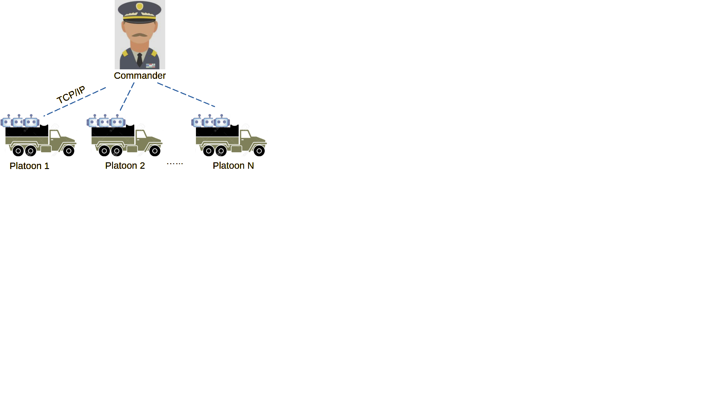

# ecbot
E-Commerce Bot is an RPA software to free e-business owners from the daily chores of running an e-business.
Even though ECBot is for e-commerce, but it is designed to be extensible be a general purpose RPA software allowing
one to automate any task. The bot software emulates human's view and move work pattern by extracting structured
screen contents and create mouse and keyboard actions according to the screen contents. ecbot is written in 
Python, and works on windows PC (it will be adapated to MAC, and linux later on)

# Features

### Networked Bots

ecbot can run many bots cross many computers on a LAN. There will always be a computer serves as a commander, and other 
computers serve as vehicles that carries a platoon of bots.

### Bots, Missions, Skills

with ecbot, one can create, edit and delete any number of:
- a **bot** - a virtual machine can execute a task automation. 
- a **mission** - a task to be completed.
- a **skill** - the instructions to completes the task.

a bot can take on multiple missions, and before executing those missions, 
the bot needs to be empowered with (or given) the associated skills.
Armed with skills, the bots can be scheduled to run the tasks.

ecbots also contains a scheduler that will assign the bots to run based 
the available resources and certain business logics.

### JOBS-DL (Json Object Based Skill Description Language)

To support the screen view, mouse and keyboard action, and to be able to describe a work flow to be automated,
we created a macro language for this purpose, called Json Object Based Skill Description Language (JOBS-DL).
For each work flow/task to be automated, it will require a "skill", which is a collection of 
step-by-step instructions to be executed to complete the task. A skill will be written with the 
JOBS-DL language.

JOBS-DL treats RPA bots as a work execution virtual machine, and at the core, it is consisted of a set
of instructions that the virtual machine can execute. The instruction set is divided into two sections,
one set is for the procedural work related, the other set is for describing structured 
contents on a screen image.

##### The Procedures Related JOBS Instruction Set
Here are the procedures related instruction sets of the ecbots RPA virtual machine:

| Name                              | Description                                             | Syntax                                                                                                                                                                                                                                                                                                                                                                                                                                                                                 |
|-----------------------------------|---------------------------------------------------------|----------------------------------------------------------------------------------------------------------------------------------------------------------------------------------------------------------------------------------------------------------------------------------------------------------------------------------------------------------------------------------------------------------------------------------------------------------------------------------------|
| Mouse  Click                   | Execute a mouse click action                            | <pre>{ &nbsp;"type" : "string", &nbsp;&nbsp;"action": "string", &nbsp;&nbsp;"action args": "string", &nbsp;&nbsp;"save_rb": True/False, &nbsp;&nbsp;"screen": "string", &nbsp;&nbsp;"target_name": "string", &nbsp;&nbsp;"target_type": "string", &nbsp;&nbsp;"text": "string", &nbsp;&nbsp;"nth": [x-int, y-int], &nbsp;&nbsp;"offset from": "string", &nbsp;&nbsp;"offset unit": "string", &nbsp;&nbsp;"offset": [x-int, y-int] }</pre>       | 
| Mouse  Scroll                  | Execute a mouse scroll action                           | <pre>{ &nbsp;"type" : "string", &nbsp;&nbsp;"action": "string", &nbsp;&nbsp;"action args": "string", &nbsp;&nbsp;"save_rb": True/False, &nbsp;&nbsp;"screen": "string", &nbsp;&nbsp;"target_name": "string", &nbsp;&nbsp;"target_type": "string", &nbsp;&nbsp;"text": "string", &nbsp;&nbsp;"nth": [x-int, y-int], &nbsp;&nbsp;"offset from": "string", &nbsp;&nbsp;"offset unit": "string", &nbsp;&nbsp;"offset": [x-int, y-int] }</pre>       | 
| Keyboard  Text  Typing      | Execute a keyboard text input action                    | <pre>{ &nbsp;"type" : "string", &nbsp;&nbsp;"action": "string", &nbsp;&nbsp;"action args": "string", &nbsp;&nbsp;"save_rb": True/False, &nbsp;&nbsp;"screen": "string", &nbsp;&nbsp;"target_name": "string", &nbsp;&nbsp;"target_type": "string", &nbsp;&nbsp;"text": "string", &nbsp;&nbsp;"nth": [x-int, y-int], &nbsp;&nbsp;"offset from": "string", &nbsp;&nbsp;"offset unit": "string", &nbsp;&nbsp;"offset": [x-int, y-int] }</pre>       | 
| Keyboard  Key  Press        | Execute a keyboard key stroke action                    | <pre>{ &nbsp;"type" : "string", &nbsp;&nbsp;"action": "string", &nbsp;&nbsp;"action args": "string", &nbsp;&nbsp;"save_rb": True/False, &nbsp;&nbsp;"screen": "string", &nbsp;&nbsp;"target_name": "string", &nbsp;&nbsp;"target_type": "string", &nbsp;&nbsp;"text": "string", &nbsp;&nbsp;"nth": [x-int, y-int], &nbsp;&nbsp;"offset from": "string", &nbsp;&nbsp;"offset unit": "string", &nbsp;&nbsp;"offset": [x-int, y-int] }</pre>       | 
| Screen  Content  Extraction | Extract text and image info from a screen capture image | <pre>{ &nbsp;"type" : "Extract Info", &nbsp;&nbsp;"root": obj, &nbsp;&nbsp;"template": "string", &nbsp;&nbsp;"option": "string", &nbsp;&nbsp;"option": "string", &nbsp;&nbsp;"data_sink": "string", &nbsp;&nbsp;"page": "string", &nbsp;&nbsp;"page_data_info": "string", &nbsp;&nbsp;"theme": "string", &nbsp;&nbsp;"section": "string" }</pre>                                                                                                      | 
| Screen  Content  Search     | Search the result of a screen image extraction          | <pre>{ &nbsp;"type" : "Search", &nbsp;&nbsp;"screen": "string", &nbsp;&nbsp;"names": ["string"...], &nbsp;&nbsp;"target_types": ["string"...], &nbsp;&nbsp;"logic": "string", &nbsp;&nbsp;"target_name": "string", &nbsp;&nbsp;"target_type": "string", &nbsp;&nbsp;"text": "string", &nbsp;&nbsp;"nth": [x-int, y-int], &nbsp;&nbsp;"offset from": "string", &nbsp;&nbsp;"offset unit": "string", &nbsp;&nbsp;"offset": [x-int, y-int] }</pre> | 
| Time  Wait                     | wait N seconds                                          | <pre>{ &nbsp;"type" : "Wait", &nbsp;&nbsp;"random_min": integer, &nbsp;&nbsp;"random_max": integer, &nbsp;&nbsp;"time": integer }</pre>                                                                                                                                                                                                                                                                                                                                 | 
| Variable  Creation             | create a variable                                       | <pre>{ &nbsp;"type" : "Create Data", &nbsp;&nbsp;"data_type": "string", &nbsp;&nbsp;"data_name": "string", &nbsp;&nbsp;"key_name": "string", &nbsp;&nbsp;"key_value": any }</pre>                                                                                                                                                                                                                                                                                    |
| Variable  Assign  Value     | assign value to a variable                              | <pre>{ &nbsp;"type" : "Fill Data", &nbsp;&nbsp;"from": "string", &nbsp;&nbsp;"to": "string", &nbsp;&nbsp;"result": True/False }</pre>                                                                                                                                                                                                                                                                                                                                   | 
| Conditional  Execution         | Execute instructions based on a condition               | <pre>{ &nbsp;"type" : "Check Condition", &nbsp;&nbsp;"condition": "string", &nbsp;&nbsp;"if_else": "string", &nbsp;&nbsp;"if_end": "string" }</pre>                                                                                                                                                                                                                                                                                                                     | 
| Loop/ Repeated  Execution   | Repeatedly execute some instructions                    | <pre>{ &nbsp;"type" : "Repeat", &nbsp;&nbsp;"lc_name": "string", &nbsp;&nbsp;"until": "string", &nbsp;&nbsp;"count": integer, &nbsp;&nbsp;"end": "string" }</pre>                                                                                                                                                                                                                                                                                                    | 
| Go to/ Jump                    | Directly Jump to an instruction's location              | <pre>{ &nbsp;"type" : "Goto", &nbsp;&nbsp;"goto": "string" }</pre>                                                                                                                                                                                                                                                                                                                                                                                                            | 
| Exception  Handle              | Handle an Exception case                                | <pre>{ &nbsp;"type" : "Exception Handler", &nbsp;&nbsp;"cause": "string", &nbsp;&nbsp;"cdata": any }</pre>                                                                                                                                                                                                                                                                                                                                                                 | 
| End  Exception                 | End of handling an Exception case                       | <pre>{ &nbsp;"type" : "End Exception", &nbsp;&nbsp;"cause": "string", &nbsp;&nbsp;"cdata": any }</pre>                                                                                                                                                                                                                                                                                                                                                                     | 
| Stub                              | Stub Instructions                                       | <pre>{ &nbsp;"type" : "Stub", &nbsp;&nbsp;"stub name": "string", &nbsp;&nbsp;"func name": "string" }</pre>                                                                                                                                                                                                                                                                                                                                                                 | 
| Call  Function                 | Call a Function                                         | <pre>{ &nbsp;"type" : "Call Function", &nbsp;&nbsp;"fname": "string", &nbsp;&nbsp;"args": "string", &nbsp;&nbsp;"return_to": "string", &nbsp;&nbsp;"output": "string" }</pre>                                                                                                                                                                                                                                                                                        | 
| Call  Extern                   | Call an extern python routine.                          | <pre>{ &nbsp;"type" : "Call Extern", &nbsp;&nbsp;"file": "string", &nbsp;&nbsp;"args": "string", &nbsp;&nbsp;"entity": "string", &nbsp;&nbsp;"output": "string" }</pre>                                                                                                                                                                                                                                                                                              | 

With the above basic instruction set, one can pretty much create a skill for any task flow.

##### The Contents Related JOBS Instruction Set
Here are the contents related instruction sets of the ecbots RPA virtual machine:

| Name                      | Description                        | Syntax                                                                                                                                                                                                                                                                                                                           | Attributes |
|---------------------------|------------------------------------|----------------------------------------------------------------------------------------------------------------------------------------------------------------------------------------------------------------------------------------------------------------------------------------------------------------------------------| ------- |
| Page Specification        | Define structureded text on a page | <pre>{ &nbsp;"page name" : &nbsp;&nbsp;"section name1": { &nbsp;&nbsp;&nbsp;&nbsp;"anchors": [...], &nbsp;&nbsp;&nbsp;&nbsp;"info": [...] &nbsp;&nbsp;}, .... }</pre>                                                                                                                                          |
| Anchor Specification      | Define anchors on on a page        | <pre>{ &nbsp;"anchor name" : "string", &nbsp;"anchor type": "string"  &nbsp;"template": "string", &nbsp;"ref_method": "string", &nbsp;"ref_location": { &nbsp;&nbsp;&nbsp;&nbsp;"dir": "string", &nbsp;&nbsp;&nbsp;&nbsp;"refs": {} &nbsp;&nbsp;} }</pre>                                             |
| Information Specification | Define informations on on a page   | <pre>{ &nbsp;"info name" : "string", &nbsp;"info type": "string"  &nbsp;"template": "string", &nbsp;"ref_method": "string", &nbsp;"ref_location": { &nbsp;&nbsp;&nbsp;&nbsp;"grouping": "string", &nbsp;&nbsp;&nbsp;&nbsp;"anchors": [], &nbsp;&nbsp;&nbsp;&nbsp;"infos": [] &nbsp;&nbsp;} }</pre> |

With the above basic instruction set, one can pretty much define any structured screen content.
The contents related instruction sets resides on the cloud side to facilitate screen extraction. 