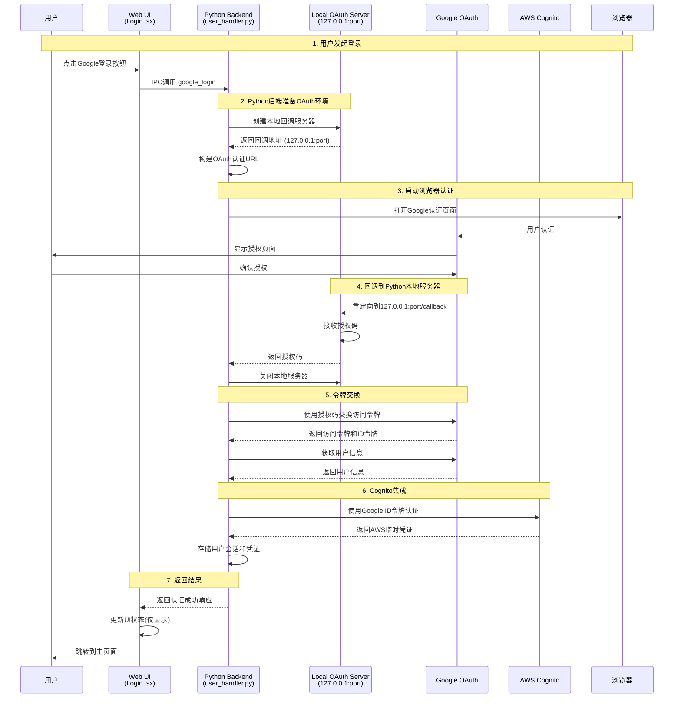

# Google OAuth 本地认证设计方案

## 概述

本文档描述了 ECBot 应用中 Google OAuth 认证的完整设计方案，采用 Python 本地 HTTP 回调服务器实现，确保认证过程的安全性和用户体验。前端为纯 UI 展示，所有数据处理和存储均在 Python 后端完成。

## 架构设计

### 1. 整体架构流程

```
Web UI (Login.tsx) 
    ↓ IPC: google_login (纯UI调用)
Python Backend (user_handler.py) 
    ↓ 启动本地服务器
Local OAuth Server (127.0.0.1:random_port)
    ↓ 浏览器重定向
Google OAuth Server 
    ↓ 授权码回调 (Python本地地址)
Local OAuth Server 
    ↓ 交换访问令牌
Google API 
    ↓ 用户信息
AWS Cognito User Pool 
    ↓ ID Token
AWS Identity Pool 
    ↓ 临时凭证 (存储在Python后端)
Web UI (认证完成，仅显示状态)
```

### 2. 泳道图



### 3. 核心组件

#### 3.1 Web UI (纯UI层)
- **职责**: 仅负责用户界面展示和交互
- **特性**: 不存储任何敏感数据，仅保存UI状态
- **数据流**: 通过IPC与Python后端通信

#### 3.2 LocalOAuthServer (本地回调服务器)
- **职责**: 处理 Google OAuth 回调，获取授权码
- **生命周期**: 认证触发时创建，认证完成后立即销毁
- **地址策略**: 强制使用 127.0.0.1 (Python本地地址)
- **端口策略**: 动态分配可用端口
- **安全特性**: 仅监听本地地址，超时自动关闭

#### 3.3 配置管理 (auth_config.yml)
- **统一配置**: 所有认证相关配置集中管理
- **环境变量**: 支持环境变量覆盖配置文件
- **安全性**: 敏感信息通过环境变量设置

#### 2.2 GoogleOAuthManager (OAuth 流程管理器)
- **职责**: 管理完整的 OAuth 认证流程
- **功能**: URL 构建、令牌交换、用户信息获取
- **集成**: 与现有 Cognito 认证体系无缝集成

#### 2.3 GoogleAuthProvider (认证提供者)
- **职责**: 统一的 Google 认证接口
- **功能**: 令牌管理、用户会话、自动刷新
- **存储**: 安全的令牌存储和管理

## 技术实现细节

### 3. 本地服务器实现

#### 3.1 服务器生命周期管理
```python
class LocalOAuthServer:
    def __init__(self):
        self.port = self._find_free_port()
        self.server = None
        self.auth_code = None
        self.auth_error = None
        self.timeout = 300  # 5分钟超时
    
    def start_and_wait(self):
        # 启动服务器并等待回调
        # 认证完成或超时后自动关闭
        pass
    
    def shutdown(self):
        # 确保服务器完全关闭
        pass
```

#### 3.2 动态端口分配
- 使用 `socket.socket()` 自动分配可用端口
- 避免端口冲突
- 支持并发认证请求

#### 3.3 安全特性
- 仅监听 `127.0.0.1` (localhost)
- 实现 CSRF 保护 (state 参数)
- 支持 PKCE (Proof Key for Code Exchange)
- 自动超时机制

### 4. OAuth 流程实现

#### 4.1 认证 URL 构建
```python
def build_auth_url(self, redirect_uri: str, state: str) -> str:
    params = {
        'client_id': self.client_id,
        'redirect_uri': redirect_uri,
        'response_type': 'code',
        'scope': 'openid email profile',
        'state': state,
        'code_challenge': self.code_challenge,
        'code_challenge_method': 'S256'
    }
    return f"https://accounts.google.com/o/oauth2/v2/auth?{urlencode(params)}"
```

#### 4.2 令牌交换
```python
def exchange_code_for_tokens(self, auth_code: str, redirect_uri: str) -> dict:
    # 使用授权码交换访问令牌和 ID 令牌
    # 验证 ID 令牌签名
    # 返回完整的令牌信息
    pass
```

#### 4.3 用户信息获取
```python
def get_user_info(self, access_token: str) -> dict:
    # 调用 Google UserInfo API
    # 返回用户基本信息 (email, name, picture)
    pass
```

### 5. Cognito 集成

#### 5.1 用户池认证
```python
def authenticate_with_cognito(self, google_id_token: str) -> dict:
    # 使用 Google ID Token 向 Cognito 用户池认证
    # 自动创建或更新用户信息
    # 返回 Cognito 访问令牌和 ID 令牌
    pass
```

#### 5.2 身份池凭证
```python
def get_aws_credentials(self, cognito_id_token: str) -> dict:
    # 使用 Cognito ID Token 获取 AWS 临时凭证
    # 返回 AccessKeyId, SecretAccessKey, SessionToken
    pass
```

## API 接口设计

### 6. IPC 接口

#### 6.1 google_login 接口
```typescript
// 前端调用
interface GoogleLoginRequest {
    language?: string;
}

interface GoogleLoginResponse {
    success: boolean;
    data?: {
        token: string;
        user_info: {
            email: string;
            name: string;
            picture: string;
        };
        aws_credentials: {
            access_key: string;
            secret_key: string;
            session_token: string;
            expiration: string;
        };
    };
    error?: {
        code: string;
        message: string;
    };
}
```

#### 6.2 错误处理
- `OAUTH_CANCELLED`: 用户取消认证
- `OAUTH_TIMEOUT`: 认证超时
- `OAUTH_ERROR`: OAuth 流程错误
- `COGNITO_ERROR`: Cognito 认证失败
- `NETWORK_ERROR`: 网络连接错误

### 7. 前端集成

#### 7.1 Login.tsx 更新
```typescript
const handleGoogleLogin = useCallback(async () => {
    setLoading(true);
    try {
        const api = get_ipc_api();
        const response = await api.googleLogin(i18n.language);
        
        if (response.success && response.data) {
            // 存储认证信息
            localStorage.setItem('token', response.data.token);
            localStorage.setItem('isAuthenticated', 'true');
            localStorage.setItem('userInfo', JSON.stringify(response.data.user_info));
            
            // 跳转到主页面
            navigate('/agents');
        } else {
            messageApi.error(response.error?.message || 'Google login failed');
        }
    } catch (error) {
        messageApi.error('Google login error: ' + error.message);
    } finally {
        setLoading(false);
    }
}, [i18n.language, navigate, messageApi]);
```

## 配置要求

### 4. 配置文件结构 (auth_config.yml)

```yaml
# Authentication Configuration
# Centralized configuration for all authentication providers

COGNITO:
  USER_POOL_ID: ""  # Set via environment variable AWS_COGNITO_USER_POOL_ID
  CLIENT_ID: ""  # Set via environment variable AWS_COGNITO_CLIENT_ID
  CLIENT_SECRET: ""
  IDENTITY_POOL_ID: ""  # Set via environment variable AWS_COGNITO_IDENTITY_POOL_ID
  REGION: "us-east-1"  # Set via environment variable AWS_REGION

# Google OAuth Configuration
GOOGLE:
  CLIENT_ID: ""  # Set via environment variable GOOGLE_CLIENT_ID
  CLIENT_SECRET: ""  # Set via environment variable GOOGLE_CLIENT_SECRET
  SCOPES: ["openid", "email", "profile"]
  REDIRECT_URIS: ["http://127.0.0.1"]  # Python local callback only
```

### 5. 环境变量配置

```bash
# Google OAuth (必需)
export GOOGLE_CLIENT_ID=your-client-id.apps.googleusercontent.com
export GOOGLE_CLIENT_SECRET=your-client-secret

# AWS Cognito (必需)
export AWS_COGNITO_USER_POOL_ID=us-east-1_xxxxxxxxx
export AWS_COGNITO_CLIENT_ID=xxxxxxxxxxxxxxxxxxxxxxxxxx
export AWS_COGNITO_IDENTITY_POOL_ID=us-east-1:xxxxxxxx-xxxx-xxxx-xxxx-xxxxxxxxxxxx
export AWS_REGION=us-east-1
```

### 6. Google Cloud Console 设置

#### 6.1 OAuth 2.0 客户端配置
- **应用类型**: 桌面应用程序
- **授权重定向 URI**: 
  - `http://127.0.0.1` (支持动态端口)
- **作用域**: `openid`, `email`, `profile`

#### 6.2 重要说明
- ✅ **桌面应用优势**: Google 允许桌面应用使用动态端口
- ✅ **简单配置**: 只需在 Google Cloud Console 配置 `http://127.0.0.1`
- ✅ **自动端口**: 系统在 8080-8090 范围内自动选择可用端口
- ✅ **本地开发友好**: 无需预配置所有可能的端口

## 安全考虑

### 10. 安全特性

#### 10.1 PKCE 流程
- 生成 `code_verifier` 和 `code_challenge`
- 防止授权码拦截攻击
- 适用于公共客户端

#### 10.2 State 参数
- 生成随机 state 值
- 防止 CSRF 攻击
- 验证回调的合法性

#### 10.3 令牌安全
- 访问令牌安全存储
- 自动令牌刷新机制
- 会话超时管理

#### 10.4 本地服务器安全
- 仅监听 localhost
- 超时自动关闭
- 单次使用后立即销毁

## 用户体验

### 7. 关键设计原则

#### 7.1 前后端分离
- **Web UI**: 纯展示层，不存储敏感数据
- **Python Backend**: 处理所有认证逻辑和数据存储
- **数据安全**: 用户信息、令牌、AWS凭证均存储在Python后端

#### 7.2 本地回调策略
- **强制127.0.0.1**: 确保回调只能到达Python本地服务器
- **动态端口**: 避免端口冲突，支持并发认证
- **服务器生命周期**: 认证时创建，完成后立即销毁

#### 7.3 配置管理
- **统一配置**: auth_config.yml集中管理所有配置
- **环境变量优先**: 生产环境通过环境变量设置敏感信息
- **配置验证**: 启动时检查必需配置项

### 8. 交互流程详解

1. **用户发起登录**
   - Web UI显示加载状态
   - 通过IPC调用Python后端

2. **Python后端处理**
   - 创建本地OAuth服务器(127.0.0.1:随机端口)
   - 构建Google认证URL
   - 启动浏览器

3. **用户浏览器认证**
   - Google显示授权页面
   - 用户确认授权

4. **回调处理**
   - Google重定向到Python本地服务器
   - 服务器接收授权码并立即关闭
   - Python后端交换令牌

5. **Cognito集成**
   - 使用Google令牌认证Cognito
   - 获取AWS临时凭证
   - 存储会话信息

6. **返回结果**
   - Web UI更新状态(仅显示)
   - 跳转到主页面

### 12. 错误处理

- **网络错误**: 显示重试选项
- **用户取消**: 恢复登录界面
- **认证失败**: 显示具体错误信息
- **超时错误**: 提示重新尝试

## 测试策略

### 13. 测试用例

#### 13.1 单元测试
- 本地服务器启动/关闭
- OAuth URL 构建
- 令牌交换和验证
- 错误处理逻辑

#### 13.2 集成测试
- 完整认证流程
- Cognito 集成
- 前后端通信
- 并发认证处理

#### 13.3 用户测试
- 不同浏览器兼容性
- 网络异常处理
- 用户取消操作
- 长时间无操作

## 部署和维护

### 14. 部署要求

- Python 3.8+
- 网络访问权限
- 浏览器环境
- AWS 访问权限

### 15. 监控和日志

- 认证成功/失败统计
- 错误日志记录
- 性能监控
- 用户行为分析

### 16. 维护计划

- 定期更新依赖包
- 监控 Google API 变更
- 更新 AWS 配置
- 安全漏洞修复

---

## 总结

本设计方案实现了安全、用户友好的 Google OAuth 认证流程，通过本地回调服务器避免了复杂的外部配置，同时确保了系统的清洁性和安全性。整个方案与现有的认证架构无缝集成，为用户提供了便捷的登录体验。
