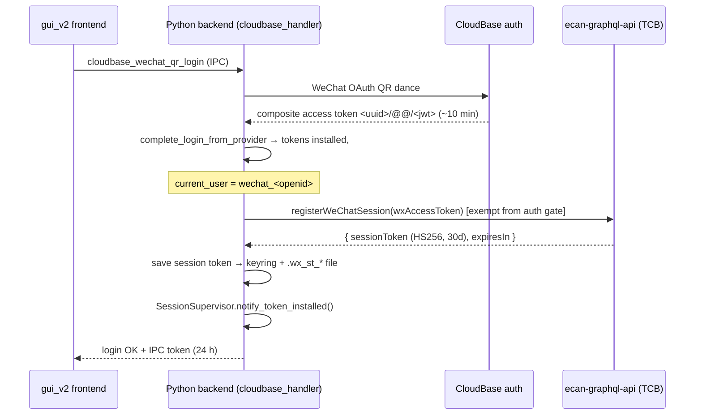

# CN Login & Token Scheme (Desktop)

How a CN (Tencent CloudBase) desktop session authenticates, from WeChat QR
scan to every API call it makes afterwards. Written 2026-08-20, reflecting the
client behavior as of commits `092696709` (survive WS-token refresh failure)
and `a2b1cac69` (persist rotated session token).

**Scope**: the desktop app. The **web** SPA uses a *different* stack (PHP
callback + HttpOnly `ecan_session` cookie + 1-hour CloudBase ticket +
`auth_refresh.php` rotation, backed by `account_sessions`). Do not blend the
two when debugging — the desktop has no cookie jar and talks GraphQL directly.
A short comparison is at the end.

---

## 1. The three credentials

| Credential | Shape | TTL | Who accepts it | Stored where |
|---|---|---|---|---|
| **WeChat access token** ("the JWT") | composite `<uuid>/@@/<jwt>`; JWT payload `{uid, iat, exp, refresh, expire}` — no `sub`, no refresh_token | **~10 min** (observed; claims say `expire: 3600`) | **WS bridge only** (`ws/index.js` reads `sub‖uid‖userId‖openid`) | `auth_manager.tokens['AccessToken']`, in-memory |
| **eCan 30-day session token** | HS256 JWT, `sub=openid`, minted by `registerWeChatSession` | **30 days** (`expiresIn=2592000`), server row in `wechat_sessions`; may be **rotated** on refresh | **HTTP GraphQL gate** (`scf/auth.js verifySessionToken`) — the ONLY bearer it can validate | keyring `ecan_wechat_session/<user>` **and** file `<appdata>/.wx_st_<b64(user)>` |
| **IPC token** | opaque hex | 24 h | local IPC/WebSocket between gui_v2 frontend and the Python backend on this machine | `gui/ipc/token_manager.py`, in-memory |

Key mental model: **the JWT is the WS credential, the session token is the
HTTP credential, and the IPC token never leaves the machine.** JWT expiry is
NOT session expiry.

---

## 2. Login flow (WeChat QR)



Source anchors: `gui/ipc/w2p_handlers/cloudbase_handler.py`
(`_build_login_response`), `auth/auth_manager.py`
(`_finalize_wechat_session_token`, `_register_wechat_session`,
`_save_wechat_session_token`).

Login also writes `uli.json` (last user identity) so short-lived CLI
subprocesses and the module-level AuthManager in `cloud_api` can re-derive the
username without a GUI.

---

## 3. How each API transport authenticates

### 3.1 HTTP GraphQL (queries/mutations to the TCB endpoint)

**Rule: every HTTP GraphQL request must build its Authorization header via
`_http_auth_header(token)`** (`agent/cloud_api/cloud_api.py`):

```python
from agent.cloud_api.cloud_api import get_appsync_endpoint, _http_auth_header
headers = {
    "Content-Type": "application/json",
    "Authorization": _http_auth_header(token),   # NEVER the raw token on CN
}
```

What it does on CN: reads the 30-day session token fresh from keyring/file
(`_get_wechat_http_session_token`) and returns `Bearer <session_token>`;
falls back to the bare JWT only if no session token exists (email/CIAM
login). On Intl it returns the Cognito token unchanged — so the helper is
safe to use unconditionally.

Why the rule exists: the SCF HTTP gate can only validate the HS256 session
token. Sending the raw composite token gets `Bearer token required` /
auth rejection **even while logged in**. Four handlers had exactly this bug
until 2026-08-20 (`prompt_cloud_sync`, `prompt_completion_handler`,
`skill_file_sync`, `chat_handler` A2A HTTP). When adding a handler, grep
yourself: `"Authorization": token` is always wrong on this path.

The `token` argument usually comes from `MainWindow.get_auth_token()`. Note
that its value (the composite/JWT) is often *stale* late in a session — that
is fine for HTTP, because `_http_auth_header` swaps in the session token
anyway. Its real job on HTTP paths is "proof we are signed in".

### 3.2 WebSocket (subscriptions, wan_chat, passive commands)

The WS bridge receives the **raw composite token verbatim**, base64-packed in
the connection URL (`wss://…/ws?header=<b64({host, Authorization})>`). It
validates the inner JWT (`uid` claim). Do **not** "unify" this with the HTTP
path — the WS bridge cannot validate the HS256 session token and the HTTP
gate cannot validate the JWT.

Consequence: WS connectivity genuinely depends on a fresh JWT. When JWT
refresh is broken server-side, WS features degrade (wan_chat 401-retries with
backoff) while HTTP keeps working.

### 3.3 Local IPC (frontend ↔ backend)

`TokenManager` (`gui/ipc/token_manager.py`) issues a 24-hour opaque token at
login; gui_v2 sends it on every IPC/WebSocket request to the local server.
It has nothing to do with cloud auth — treat `auth.getTokenInfo`'s "remaining
23.5h" as local-session info only.

### 3.4 CLI subprocesses

Handlers that shell out to `python -m cli.main` pass:
- `ECAN_CLI_USER` / `ECAN_DEPLOY_OWNER` — DB ownership scoping,
- `ECAN_LOG_USER` — the per-user data-dir name (`MainWindow.log_user`, e.g.
  `wechat_<openid>_local`) so the CLI resolves the same `my_prompts/` etc.
The CLI has no cloud session of its own; anything needing cloud auth must
run in (or relay through) the app process.

---

## 4. Staying logged in: the refresh lifecycle

`SessionSupervisor` (`auth/session_supervisor.py`) ticks every 30 s reading
the JWT's `exp`:

| JWT remaining | Action |
|---|---|
| > 300 s | nothing (nudge UI at ≤ 120 s) |
| ≤ 300 s (`REFRESH_LEAD`) | **proactive refresh**: `refreshWeChatToken(sessionToken)` → install fresh JWT, `notify_token_installed()` |
| ≤ 0 (or server rejected a call → `notify_token_rejected`) | `_drive_silent_refresh`: same refresh, with a 60 s fresh-token grace window against CloudBase cache-lag 401s |

`AuthManager.ensure_valid_tokens()` (called by `get_auth_token()`) performs
the same on-demand refresh when a caller trips over an expired JWT. A
background refresh loop (`start_refresh_task`) does it on a timer with
backoff.

### 4.1 The refresh call — and rotation

`AuthManager._refresh_wechat_token(session_token)` POSTs:

```graphql
mutation RefreshWeChatToken($input: RefreshWeChatTokenInput!) {
  refreshWeChatToken(input: $input) { accessToken expiresIn sessionToken }
}
# Authorization: Bearer <session_token>   (doubles as the gate credential)
```

Since `a2b1cac69` the client selects `sessionToken` and **persists any
rotated value** immediately (keyring + file). Rationale: refresh endpoints in
this stack rotate the durable credential (the web `auth_refresh.php`
atomically replaces its opaque token); ignoring the replacement strands the
client on a revoked token, and the *next* refresh fails `SESSION_EXPIRED` —
the leading explanation for the historical "~10-minute logout". If the
deployed payload lacks the field, the client detects the one validation
error, permanently falls back to `accessToken expiresIn`, and retries.

### 4.2 Failure semantics (post-`092696709`)

| Refresh result | Client behavior |
|---|---|
| success | new JWT installed; rotated session token persisted if returned; `on_session_refreshed` |
| `SESSION_EXPIRED` | the 30-day session itself is dead: delete local session token, `signed_in=False`, emit `on_session_expired` → GUI logout ("please re-scan QR") |
| `WX_TOKEN_EXPIRED` | **stay signed in.** Only the WS JWT is unavailable; HTTP continues on the session token. Log: `WS-token refresh unavailable (…) staying signed in` |
| network error / exception / other codes | **stay signed in** (transient); retry on later ticks |

Before these fixes the client deleted the session token and logged out on
*any* of the last three — amplifying a WS-only problem into total session
death. A network blip could log you out.

### 4.3 What still degrades when refresh fails

With a live session token but no fresh JWT:
- ✅ all HTTP GraphQL (chat relay, prompt sync, skills/tasks/agents CRUD)
- ❌ WS subscriptions / wan_chat (401 handshakes, capped retries)
- ❌ anything explicitly gated on `ensure_valid_tokens()` returning a fresh
  JWT — none of the HTTP paths do anymore

---

## 5. Storage & identity map

| Artifact | Location | Notes |
|---|---|---|
| composite access token | `auth_manager.tokens` (memory only) | rebuilt every login/refresh |
| session token | keyring service `ecan_wechat_session`, account = sanitized username; file fallback `<appdata>/.wx_st_<b64(username)>` | deleted ONLY on `SESSION_EXPIRED` or logout |
| username / identity | `uli.json` at repo/appdata root | lets GUI-less code find the user |
| per-user data dir | `<appdata>/<log_user>/` where `log_user = wechat_<openid>_local` | prompts (`my_prompts/`), DBs, etc. |
| IPC token | memory (`TokenManager`) | 24 h, local only |

---

## 6. Cookbook: adding a new cloud API call

1. **HTTP query/mutation** → copy the `_appsync_request` pattern from
   `gui/ipc/w2p_handlers/skill_editor_cloud_relay.py`: JSON content-type,
   `Authorization: _http_auth_header(token)`, token/session/endpoint from the
   MainWindow context. Never hand-roll the header.
2. **Subscription / WS** → go through the existing wan_chat / AppSyncSubClient
   plumbing; it packs the composite token correctly.
3. **Long-running / CLI** → don't call the cloud from the subprocess; relay
   through an IPC handler in the app process.
4. Treat a 401/`UNAUTHENTICATED` from HTTP as *credential-type or session*
   problem, not JWT expiry — check which bearer actually went out before
   touching refresh logic (CLAUDE.md §6: classify before fixing).

## 7. Debugging: log lines → meaning

| Log line | Meaning |
|---|---|
| `[AppSync] Using WeChat 30-day session token for CN HTTP auth` | HTTP header swap active (announced once) |
| `[AuthManager] token-ttl: remaining=…` | JWT (WS credential) countdown — NOT the session |
| `[_refresh_wechat_token] rotated session token persisted` | server rotates; rotation handled |
| `payload has no sessionToken field; using legacy selection` | server does not expose rotation |
| `proactive session-token refresh failed (<code>): <msg>` | the server's verdict on the session token — the key diagnostic |
| `WS-token refresh unavailable (…); staying signed in` | JWT refresh failed non-fatally; HTTP still up |
| `server declared the 30-day session token dead — deleting it and signing out` | genuine `SESSION_EXPIRED` |
| `Bearer token required` (from server) | wrong credential type sent on HTTP (see §3.1), not expiry |
| `[se_cloud_relay] No auth token` | client-side: signed out / tokens cleared — request never left the machine |

## 8. Desktop vs web stack (do not blend)

| | Desktop | Web SPA |
|---|---|---|
| durable credential | HS256 session token (keyring/file), `wechat_sessions` | opaque 32-byte token, SHA-256 hash in `account_sessions`, HttpOnly `ecan_session` cookie |
| short credential | composite WeChat JWT (~10 min), WS only | CloudBase ticket (1 h), `Authorization: Bearer` on APIs |
| refresh | `refreshWeChatToken` GraphQL | `POST /cn/login_callback/auth_refresh.php` (rotates cookie + new ticket) |
| known gaps | server: JWT re-mint fails after first TTL (rotation? wx-token dependency?) — see docs/OPEN_ITEMS.md | SPA reportedly never calls `auth_refresh.php` (per 2026-08-20 server-side analysis) |

## 9. Open questions (server-side)

1. Does desktop `refreshWeChatToken` **rotate** `wechat_sessions`, and does
   its payload expose the replacement `sessionToken`? (Client consumes it if
   present.)
2. When only the underlying wx/CloudBase credential is expired, does it
   return `WX_TOKEN_EXPIRED` (client survives) or `SESSION_EXPIRED` (client
   signs out)? It must not conflate the two.
3. `getSkillEditorChatSessions` still 500s — unrelated to auth but tracked in
   the same OPEN_ITEMS entry cluster.
