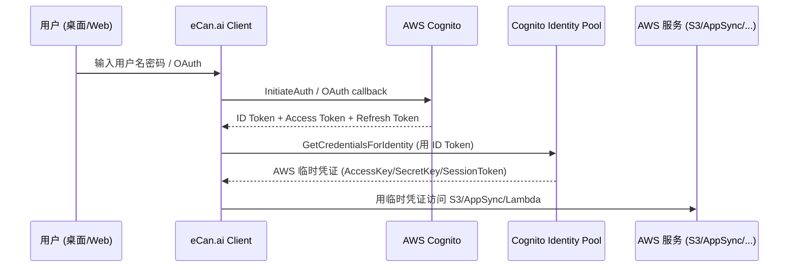
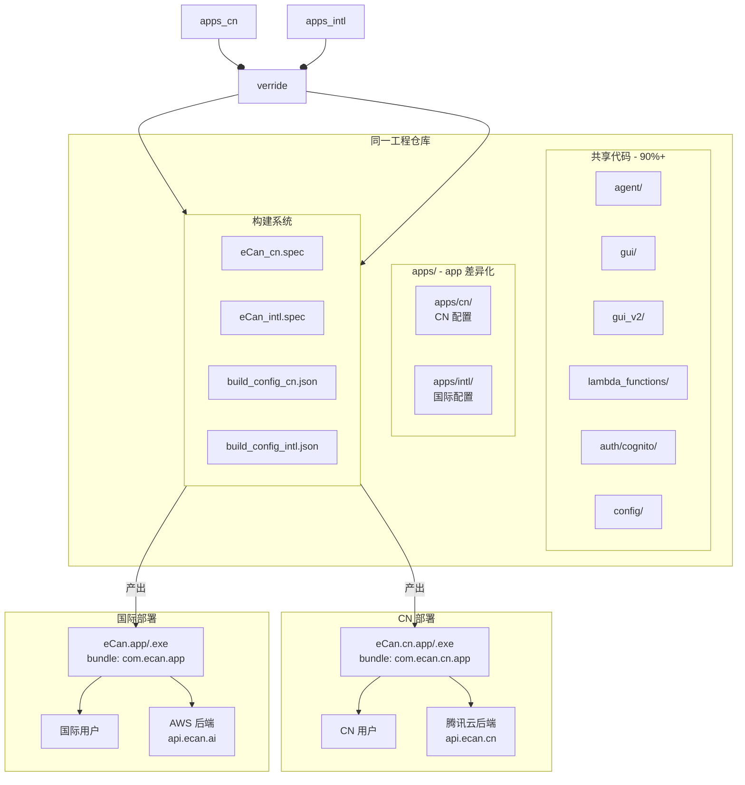
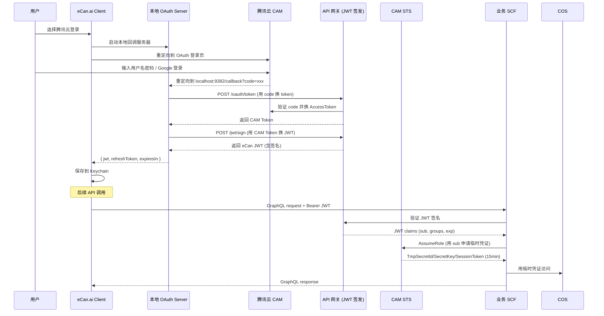
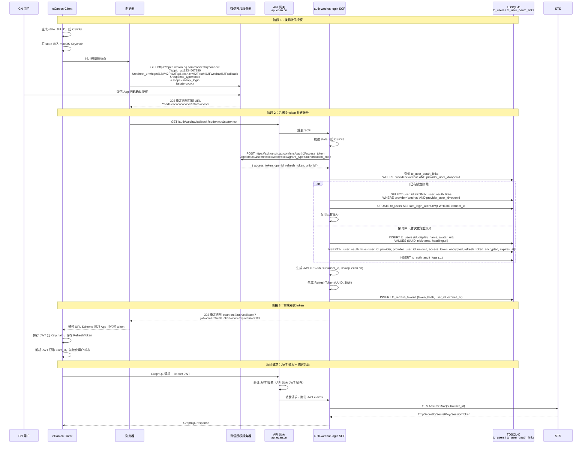
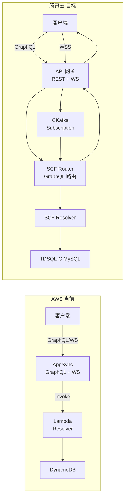
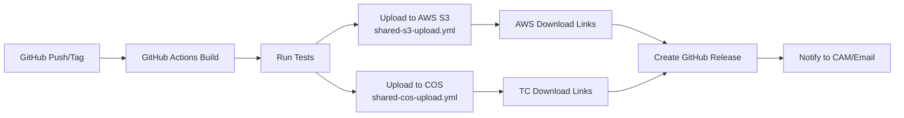
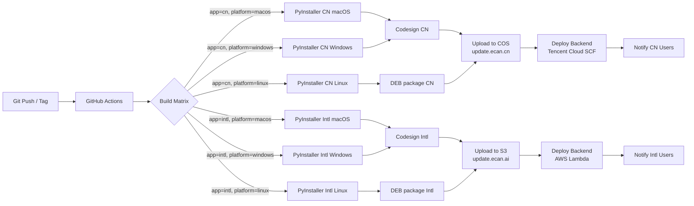

# eCan.ai 双 App + 双云 迁移实施计划

> **核心目标**: 同一工程构建两个独立 app（`apps/cn/` · `apps/intl/`），分别部署到腾讯云（CN）和 AWS（Intl）

---

## 目录

<details>
<summary>点击展开完整目录</summary>

- [1. 重大变更与背景](#1-重大变更与背景)
  - [1.1 方案概览](#1-1-方案概览)
- [2. 现状分析](#2-现状分析)
  - [2.1 AWS 服务清单](#2-1-aws-服务清单)
  - [2.2 当前认证流程（AWS）](#2-2-当前认证流程-aws)
  - [2.3 当前 GraphQL 架构](#2-3-当前-graphql-架构)
  - [2.4 当前 CI/CD](#2-4-当前-ci-cd)
- [3. 关键决策与原则](#3-关键决策与原则)
  - [3.1 已确认的关键决策](#3-1-已确认的关键决策)
  - [3.2 设计原则](#3-2-设计原则)
  - [3.3 不做的妥协](#3-3-不做的妥协)
- [4. 目标架构总览](#4-目标架构总览)
  - [4.1 核心拓扑](#4-1-核心拓扑)
  - [4.2 关键不变与变化](#4-2-关键不变与变化)
    - [不变的部分（同一仓库，共享 90%+）](#不变的部分-同一仓库-共享-90)
    - [变化的部分（apps/ 差异化）](#变化的部分-apps-差异化)
  - [4.3 决策核心](#4-3-决策核心)
- [5. AWS ↔ 腾讯云服务映射](#5-aws-腾讯云服务映射)
  - [5.1 核心服务映射表](#5-1-核心服务映射表)
  - [5.2 关键差异点](#5-2-关键差异点)
    - [5.2.1 DynamoDB → TDSQL-C](#5-2-1-dynamodb-tdsql-c)
    - [5.2.2 AppSync → API 网关 + SCF](#5-2-2-appsync-api-网关-scf)
    - [5.2.3 Cognito Identity Pool → CAM STS](#5-2-3-cognito-identity-pool-cam-sts)
- [6. 数据隔离边界](#6-数据隔离边界)
  - [6.1 隔离边界清单](#6-1-隔离边界清单)
  - [6.2 网络隔离](#6-2-网络隔离)
  - [6.3 账号标识设计](#6-3-账号标识设计)
  - [6.4 App 配置加载](#6-4-app-配置加载)
- [7. 风险评估](#7-风险评估)
  - [7.1 风险矩阵](#7-1-风险矩阵)
  - [7.2 回滚预案](#7-2-回滚预案)
- [8. 双 App 代码架构](#8-双-app-代码架构)
  - [8.1 工程管理总览](#81-工程管理总览)
    - [8.1.1 目录布局](#811-目录布局)
    - [8.1.2 环境变量体系](#812-环境变量体系)
    - [8.1.3 开发流程](#813-开发流程)
    - [8.1.4 本地开发与构建](#814-本地开发与构建)
    - [8.1.5 分支与 PR 策略](#815-分支与-pr-策略)
    - [8.1.6 GitHub Actions CI 构建矩阵](#816-github-actions-ci-构建矩阵)
    - [8.1.7 代码共享与隔离规则](#817-代码共享与隔离规则)
    - [8.1.8 Config Loader 使用示例](#818-config-loader-使用示例)
  - [背景与目标](#背景与目标)
    - [1.1 业务背景](#1-1-业务背景)
    - [1.2 目标](#1-2-目标)
    - [1.3 非目标（Out of Scope）](#1-3-非目标-out-of-scope)
  - [决策摘要](#2-决策摘要)
    - [3.1 系统拓扑图](#3-1-系统拓扑图)
    - [3.2 双 App 配置矩阵](#3-2-双-app-配置矩阵)
  - [目录结构设计](#4-目录结构设计)
    - [4.1 推荐目录布局](#4-1-推荐目录布局)
    - [4.2 关键路径说明](#4-2-关键路径说明)
  - [App 配置中心](#5-app-配置中心)
    - [5.1 运行时配置加载](#5-1-运行时配置加载)
    - [5.2 使用示例](#5-2-使用示例)
    - [5.3 Web 端配置](#5-3-web-端配置)
  - [构建系统改造](#6-构建系统改造)
    - [6.1 统一构建入口](#6-1-统一构建入口)
    - [6.2 CN app 的 PyInstaller spec](#6-2-cn-app-的-pyinstaller-spec)
    - [6.3 Inno Setup 模板（Windows）](#6-3-inno-setup-模板-windows)
    - [6.4 macOS pkg 构建](#6-4-macos-pkg-构建)
  - [代码共享与隔离策略](#7-代码共享与隔离策略)
    - [7.1 共享代码（90%+）](#7-1-共享代码-90)
    - [7.2 差异化代码（apps/ 下）](#7-2-差异化代码-apps-下)
    - [7.3 共享代码中的差异化解耦](#7-3-共享代码中的差异化解耦)
  - [双 App 差异化清单](#8-双-app-差异化清单)
    - [8.1 完整差异清单](#8-1-完整差异清单)
    - [8.2 共享代码中需要硬编码差异化的位置](#8-2-共享代码中需要硬编码差异化的位置)
  - [品牌与合规](#9-品牌与合规)
    - [9.1 品牌差异](#9-1-品牌差异)
    - [9.2 法律合规差异](#9-2-法律合规差异)
    - [9.3 隐私政策模板](#9-3-隐私政策模板)
  - [发布渠道](#10-发布渠道)
  - [实施步骤](#11-实施步骤)
- [9. 认证系统（含微信登录）](#9-认证系统-含微信登录)
  - [目标与范围](#目标与范围)
    - [1.1 目标](#1-1-目标)
    - [1.2 范围](#1-2-范围)
  - [现状梳理](#现状梳理)
    - [2.1 现有文件清单](#2-1-现有文件清单)
    - [2.2 当前 Cognito 配置](#2-2-当前-cognito-配置-来自-auth_config-yml)
    - [2.3 当前认证流程详解](#2-3-当前认证流程详解)
    - [2.4 当前 JWT 结构（Cognito）](#2-4-当前-jwt-结构-cognito)
  - [目标架构](#3-目标架构)
    - [3.1 整体认证架构图](#3-1-整体认证架构图)
    - [3.2 关键技术选型](#3-2-关键技术选型)
    - [3.3 腾讯云账号体系设计](#3-3-腾讯云账号体系设计)
  - [微信登录实现](#4-微信登录实现)
    - [4.1 前置条件](#4-1-前置条件)
    - [4.2 微信 OAuth 2.0 授权流程](#4-2-微信-oauth-2-0-授权流程)
    - [4.3 微信 OAuth 端点对照](#4-3-微信-oauth-端点对照)
    - [4.4 数据库设计（微信登录相关）](#4-4-数据库设计-微信登录相关)
    - [4.5 API 网关路由设计](#4-5-api-网关路由设计)
    - [4.6 SCF 函数实现（auth-wechat-login）](#4-6-scf-函数实现-auth-wechat-login)
    - [4.7 PC 端发起授权（客户端代码）](#4-7-pc-端发起授权-客户端代码)
    - [4.8 安全性设计](#4-8-安全性设计)
    - [4.9 与手机号登录的账号合并](#4-9-与手机号登录的账号合并)
    - [4.10 微信登录相关 GitHub Secrets](#4-10-微信登录相关-github-secrets)
  - [JWT 改造](#5-jwt-改造)
    - [5.1 API 端点对照表](#5-1-api-端点对照表)
    - [5.2 JWT 结构设计](#5-2-jwt-结构设计)
    - [5.3 AWS Credentials Provider → 腾讯云 STS Provider 改造](#5-3-aws-credentials-provider-腾讯云-sts-provider-改造)
  - [客户端改造](#6-客户端改造)
    - [6.1 `auth_config.yml` 扩展](#6-1-auth_config-yml-扩展)
    - [6.2 `auth_manager.py` 改造要点](#6-2-auth_manager-py-改造要点)
    - [6.3 本地 OAuth 服务器改造](#6-3-本地-oauth-服务器改造-auth-oauth-local_oauth_server-py)
    - [6.4 `.env` 文件扩展](#6-4-env-文件扩展)
  - [腾讯云资源创建](#7-腾讯云资源创建)
    - [7.1 需要创建的腾讯云资源清单](#7-1-需要创建的腾讯云资源清单)
    - [7.2 IAM 策略定义（CAM 策略）](#7-2-iam-策略定义-cam-策略)
    - [7.3 SCF 函数清单（认证）](#7-3-scf-函数清单-认证)
    - [7.4 网络拓扑](#7-4-网络拓扑)
  - [Phase 1 实施计划](#8-phase-1-实施计划)
    - [8.1 Phase 1.1：基础设施准备（Day 1-2）](#8-1-phase-1-1-基础设施准备-day-1-2)
    - [8.2 Phase 1.2：SCF 函数开发与部署（Day 3-7）](#8-2-phase-1-2-scf-函数开发与部署-day-3-7)
    - [8.3 Phase 1.3：数据库初始化（Day 5-6）](#8-3-phase-1-3-数据库初始化-day-5-6)
    - [8.4 Phase 1.4：客户端代码改造（Day 8-12）](#8-4-phase-1-4-客户端代码改造-day-8-12)
    - [8.5 Phase 1.5：端到端联调与测试（Day 13-15）](#8-5-phase-1-5-端到端联调与测试-day-13-15)
    - [8.6 Phase 1.6：灰度发布（Day 16-18）](#8-6-phase-1-6-灰度发布-day-16-18)
  - [验收标准](#9-验收标准)
    - [9.1 功能验收](#9-1-功能验收)
    - [9.2 安全验收](#9-2-安全验收)
    - [9.3 性能验收](#9-3-性能验收)
    - [9.4 数据隔离验收](#9-4-数据隔离验收)
- [10. Lambda 函数迁移](#10-lambda-函数迁移)
  - [目标与范围](#目标与范围)
    - [1.1 目标](#1-1-目标)
    - [1.2 范围](#1-2-范围)
  - [核心改造框架](#3-核心改造框架)
    - [3.1 核心差异点](#3-1-核心差异点)
    - [3.2 API 网关事件格式适配](#3-2-api-网关事件格式适配)
    - [3.3 上下文对象适配](#3-3-上下文对象适配)
    - [3.4 Python Handler 适配包装器](#3-4-python-handler-适配包装器)
    - [3.5 Node.js Handler 适配包装器](#3-5-node-js-handler-适配包装器)
    - [3.6 AWS SDK → 腾讯云 SDK 映射表](#3-6-aws-sdk-腾讯云-sdk-映射表)
  - [逐函数迁移方案](#4-逐函数迁移方案)
    - [4.1 agentScheduler（最复杂，P0）](#4-1-agentscheduler-最复杂-p0)
    - [4.2 botScheduler（中复杂，P1）](#4-2-botscheduler-中复杂-p1)
    - [4.3 skillEditorAgent（最复杂，P0）](#4-3-skilleditoragent-最复杂-p0)
    - [4.4 chatter（低复杂，P2）](#4-4-chatter-低复杂-p2)
    - [4.5 cloud_tester（低复杂，P3）](#4-5-cloud_tester-低复杂-p3)
    - [4.6 presigned_link_publisher（低复杂，P1）](#4-6-presigned_link_publisher-低复杂-p1)
    - [4.7 myAPIKeygen（低复杂，P2）](#4-7-myapikeygen-低复杂-p2)
  - [公共代码与依赖](#5-公共代码与依赖)
    - [5.1 公共代码目录](#5-1-公共代码目录)
    - [5.2 依赖管理](#5-2-依赖管理)
    - [5.3 SCF 层（Layer）管理](#5-3-scf-层-layer-管理)
  - [配置与 Secrets](#6-配置与-secrets)
    - [6.1 环境变量对照表](#6-1-环境变量对照表)
    - [6.2 Secrets Manager 迁移](#6-2-secrets-manager-迁移)
    - [6.3 配置中心（SSM 参数）](#6-3-配置中心-ssm-参数)
  - [实施计划](#7-实施计划)
    - [7.1 Phase 2：试点 Lambda 迁移（Week 3-4）](#7-1-phase-2-试点-lambda-迁移-week-3-4)
    - [7.2 Phase 3：批量业务 Lambda 迁移（Week 5-8）](#7-2-phase-3-批量业务-lambda-迁移-week-5-8)
    - [7.3 Phase 4：流量切换与回退预案（Week 9）](#7-3-phase-4-流量切换与回退预案-week-9)
  - [验收标准](#8-验收标准)
    - [8.1 功能验收](#8-1-功能验收)
    - [8.2 性能验收](#8-2-性能验收)
    - [8.3 数据隔离验收](#8-3-数据隔离验收)
    - [8.4 部署验收](#8-4-部署验收)
- [11. GraphQL 与数据迁移](#11-graphql-与数据迁移)
  - [目标与范围](#目标与范围)
    - [1.1 目标](#1-1-目标)
    - [1.2 范围](#1-2-范围)
  - [现状分析](#2-现状分析)
    - [2.1 GraphQL Schema 与 Resolver](#2-1-graphql-schema-与-resolver)
    - [2.2 DynamoDB 表清单](#2-2-dynamodb-表清单-来自-resolvers-md)
    - [2.3 Aurora Serverless 数据库](#2-3-aurora-serverless-数据库)
    - [2.4 S3 桶清单](#2-4-s3-桶清单)
  - [目标架构](#3-目标架构)
    - [3.1 架构对比](#3-1-架构对比)
    - [3.2 核心设计：GraphQL Router SCF](#3-2-核心设计-graphql-router-scf)
    - [3.3 部署拓扑](#3-3-部署拓扑)
    - [3.4 API 网关配置](#3-4-api-网关配置)
  - [Schema 与 Router](#4-schema-与-router)
    - [4.1 Schema 处理策略](#4-1-schema-处理策略)
    - [4.2 GraphQL Router 实现（Python）](#4-2-graphql-router-实现-python)
    - [4.3 Resolver → SCF 映射表](#4-3-resolver-scf-映射表)
  - [Resolver 实现](#5-resolver-实现)
    - [5.1 简单 Resolver（直接转发）](#5-1-简单-resolver-直接转发)
    - [5.2 Pipeline Resolver（复杂编排）](#5-2-pipeline-resolver-复杂编排)
    - [5.3 复杂 Pipeline：批量操作](#5-3-复杂-pipeline-批量操作-如-endlongllmtask)
    - [5.4 Resolver 调用 SCF 的实现](#5-4-resolver-调用-scf-的实现)
  - [Subscription 改造](#6-subscription-改造)
    - [6.1 现状](#6-1-现状)
    - [6.2 腾讯云方案](#6-2-腾讯云方案)
    - [6.3 Subscription Router SCF](#6-3-subscription-router-scf)
    - [6.4 客户端改造](#6-4-客户端改造)
  - [DynamoDB → TDSQL-C 迁移](#7-dynamodb-tdsql-c-迁移)
    - [7.1 迁移策略](#7-1-迁移策略)
    - [7.2 表结构示例（10 张核心表）](#7-2-表结构示例-10-张核心表)
    - [7.3 数据迁移脚本](#7-3-数据迁移脚本)
    - [7.4 迁移验证](#7-4-迁移验证)
  - [Aurora → 直连 MySQL](#8-aurora-直连-mysql)
    - [8.1 现状分析](#8-1-现状分析)
    - [8.2 迁移策略](#8-2-迁移策略)
    - [8.3 RDS Data API → 直连 MySQL](#8-3-rds-data-api-直连-mysql)
  - [S3 → COS 迁移](#9-s3-cos-迁移)
    - [9.1 现状 S3 桶](#9-1-现状-s3-桶)
    - [9.2 迁移策略](#9-2-迁移策略)
    - [9.3 桶清单（腾讯云）](#9-3-桶清单-腾讯云)
    - [9.4 S3 客户端代码改造](#9-4-s3-客户端代码改造)
  - [实施计划](#10-实施计划)
    - [10.1 Phase 3：GraphQL Router + SCF Resolver 迁移（Week 5-6）](#10-1-phase-3-graphql-router-scf-resolver-迁移-week-5-6)
    - [10.2 Phase 4：数据迁移（Week 7-8）](#10-2-phase-4-数据迁移-week-7-8)
    - [10.3 Phase 5：Cloud Worker 迁移（Week 9-10）](#10-3-phase-5-cloud-worker-迁移-week-9-10)
    - [10.4 Phase 6：联调与灰度（Week 11-12）](#10-4-phase-6-联调与灰度-week-11-12)
  - [验收标准](#11-验收标准)
    - [11.1 GraphQL API 验收](#11-1-graphql-api-验收)
    - [11.2 数据迁移验收](#11-2-数据迁移验收)
    - [11.3 数据隔离验收](#11-3-数据隔离验收)
    - [11.4 性能验收](#11-4-性能验收)
- [12. 基础设施](#12-基础设施)
  - [目标与范围](#目标与范围)
    - [1.1 目标](#1-1-目标)
    - [1.2 范围](#1-2-范围)
  - [网络架构](#2-网络架构)
    - [2.1 VPC 设计](#2-1-vpc-设计)
    - [2.2 网络隔离原则](#2-2-网络隔离原则)
    - [2.3 VPC 部署脚本（Terraform）](#2-3-vpc-部署脚本-terraform)
    - [2.4 API 网关内网接入](#2-4-api-网关内网接入)
  - [容器（Cloud Worker）](#3-容器-cloud-worker)
    - [3.1 现状](#3-1-现状)
    - [3.2 腾讯云方案：TKE 标准集群](#3-2-腾讯云方案-tke-标准集群)
    - [3.3 SCF 触发 TKE（替代 ECS RunTask）](#3-3-scf-触发-tke-替代-ecs-runtask)
    - [3.4 Worker 结果回传（替代 SNS → Lambda）](#3-4-worker-结果回传-替代-sns-lambda)
    - [3.5 ECS → TKE 容器镜像迁移](#3-5-ecs-tke-容器镜像迁移)
  - [CI/CD 与制品库](#4-ci-cd-与制品库)
    - [4.1 现状分析](#4-1-现状分析)
    - [4.2 目标 CI/CD 架构](#4-2-目标-ci-cd-架构)
    - [4.3 新建工作流：`shared-cos-upload.yml`](#4-3-新建工作流-shared-cos-upload-yml)
    - [4.4 上传脚本：`upload_to_cos.py`](#4-4-上传脚本-upload_to_cos-py)
    - [4.5 新建工作流：`shared-cos-download-links.yml`](#4-5-新建工作流-shared-cos-download-links-yml)
    - [4.6 主工作流改造：`release.yml`](#4-6-主工作流改造-release-yml)
    - [4.7 必需 GitHub Secrets 配置](#4-7-必需-github-secrets-配置)
    - [4.8 SCF 自动部署工作流](#4-8-scf-自动部署工作流)
  - [监控与告警](#5-监控与告警)
    - [5.1 CLS 日志接入](#5-1-cls-日志接入)
    - [5.2 应用日志统一格式](#5-2-应用日志统一格式)
    - [5.3 监控告警配置](#5-3-监控告警配置)
    - [5.4 监控看板（Tencent Cloud Observability Platform）](#5-4-监控看板-tencent-cloud-observability-platform)
    - [5.5 关键监控指标](#5-5-关键监控指标)
  - [安全](#6-安全)
    - [6.1 CAM 角色设计](#6-1-cam-角色设计)
    - [6.2 KMS 加密](#6-2-kms-加密)
    - [6.3 WAF 防护](#6-3-waf-防护)
    - [6.4 审计日志](#6-4-审计日志)
  - [成本估算](#7-成本估算)
    - [7.1 月度成本估算（预估）](#7-1-月度成本估算-预估)
    - [7.2 一次性迁移成本](#7-2-一次性迁移成本)
    - [7.3 ROI 分析](#7-3-roi-分析)
  - [实施计划](#8-实施计划)
    - [8.1 Phase 5：基础设施部署（Week 9-10）](#8-1-phase-5-基础设施部署-week-9-10)
    - [8.2 Phase 6：CI/CD 配置（Week 10）](#8-2-phase-6-ci-cd-配置-week-10)
    - [8.3 Phase 7：Cloud Worker 迁移（Week 11）](#8-3-phase-7-cloud-worker-迁移-week-11)
    - [8.4 Phase 8：监控与告警配置（Week 12）](#8-4-phase-8-监控与告警配置-week-12)
- [13. 双云 CI/CD 与监控](#13-双云-ci-cd-与监控)
  - [目标与挑战](#目标与挑战)
    - [1.1 目标](#1-1-目标)
    - [1.2 主要挑战](#1-2-主要挑战)
  - [总体 CI/CD 架构](#总体-ci-cd-架构)
    - [3.1 主发布工作流（改造后）](#3-1-主发布工作流-改造后)
    - [3.2 关键 GitHub Secrets 配置](#3-2-关键-github-secrets-配置)
  - [后端部署](#4-后端部署)
    - [4.1 后端部署拓扑](#4-1-后端部署拓扑)
    - [4.2 Lambda/SCF 函数对应表](#4-2-lambda-scf-函数对应表)
    - [4.3 Cloud Worker 镜像](#4-3-cloud-worker-镜像)
  - [前端构建矩阵](#5-前端构建矩阵)
    - [5.1 构建矩阵并行优化](#5-1-构建矩阵并行优化)
    - [5.2 缓存策略](#5-2-缓存策略)
    - [5.3 构建脚本](#5-3-构建脚本)
  - [OTA 与 CDN](#6-ota-与-cdn)
    - [6.1 双 CDN 架构](#6-1-双-cdn-架构)
    - [6.2 COS / S3 桶结构](#6-2-cos-s3-桶结构)
    - [6.3 Appcast 配置](#6-3-appcast-配置)
    - [6.4 OTA 检查逻辑](#6-4-ota-检查逻辑)
  - [监控体系](#7-监控体系)
    - [7.1 监控拓扑](#7-1-监控拓扑)
    - [7.2 双 dashboard 设计](#7-2-双-dashboard-设计)
    - [7.3 告警规则（按 app 分组）](#7-3-告警规则-按-app-分组)
    - [7.4 客户端错误上报（按 app 分流）](#7-4-客户端错误上报-按-app-分流)
  - [实施计划](#8-实施计划)
    - [8.1 Phase 5.1：CI/CD 双云并行（Week 11）](#8-1-phase-5-1-ci-cd-双云并行-week-11)
    - [8.2 Phase 5.2：监控告警双端配置（Week 12）](#8-2-phase-5-2-监控告警双端配置-week-12)
- [14. 法律合规](#14-法律合规)
  - [目标](#目标)
  - [隐私政策差异](#隐私政策差异)
    - [2.1 政策框架差异](#2-1-政策框架差异)
    - [2.2 同意流程差异](#2-2-同意流程差异)
    - [2.3 数据收集同意（CN）](#2-3-数据收集同意-cn)
    - [2.4 数据收集同意（Intl）](#2-4-数据收集同意-intl)
    - [2.5 数据存储位置差异](#2-5-数据存储位置差异)
  - [账号体系合规](#3-账号体系合规)
    - [3.1 账号命名空间](#3-1-账号命名空间)
    - [3.2 账号数据库表名差异](#3-2-账号数据库表名差异)
    - [3.3 账号互斥规则](#3-3-账号互斥规则)
    - [3.4 OAuth 登录差异化](#3-4-oauth-登录差异化)
  - [用户协议](#4-用户协议)
    - [4.1 协议条款差异](#4-1-协议条款差异)
    - [4.2 协议模板（CN）](#4-2-协议模板-cn)
  - [5. 附录：完整文件清单](#5-附录-完整文件清单)
  - [6. 附录：测试策略](#6-附录-测试策略)
  - [7. 附录：风险与缓解](#7-附录-风险与缓解)
  - [8. 附录：决策日志](#8-附录-决策日志)
- [15. 实施计划](#15-实施计划)
  - [项目概述](#1-项目概述)
    - [1.1 SMART 目标](#1-1-smart-目标)
    - [1.2 项目边界](#1-2-项目边界)
  - [团队与沟通](#2-团队与沟通)
    - [2.1 核心团队构成](#2-1-核心团队构成)
    - [2.2 角色详细职责](#2-2-角色详细职责)
  - [里程碑](#3-里程碑)
    - [3.1 关键节点（Milestones）](#3-1-关键节点-milestones)
  - [Phase 1：认证（Week 1-2）](#4-phase-1-认证-week-1-2)
    - [4.1 目标](#4-1-目标)
    - [4.2 周计划](#4-2-周计划)
    - [4.3 验收标准](#4-3-验收标准)
  - [Phase 2：Lambda 迁移（Week 3-4）](#5-phase-2-lambda-迁移-week-3-4)
    - [5.1 目标](#5-1-目标)
    - [5.2 周计划](#5-2-周计划)
    - [5.3 验收标准](#5-3-验收标准)
  - [Phase 3：基础设施（Week 5-6）](#6-phase-3-基础设施-week-5-6)
    - [6.1 目标](#6-1-目标)
    - [6.2 选型理由](#6-2-选型理由)
    - [6.3 周计划](#6-3-周计划)
    - [6.4 验收标准](#6-4-验收标准)
  - [Phase 4：GraphQL + 数据迁移（Week 7-8）](#7-phase-4-graphql-数据迁移-week-7-8)
    - [7.1 目标](#7-1-目标)
    - [7.2 周计划](#7-2-周计划)
    - [7.3 验收标准](#7-3-验收标准)
  - [Phase 5：Cloud Worker + 数据迁移（Week 9-10）](#8-phase-5-cloud-worker-数据迁移-week-9-10)
    - [8.1 目标](#8-1-目标)
    - [8.2 周计划](#8-2-周计划)
    - [8.3 验收标准](#8-3-验收标准)
  - [Phase 6：灰度与发布（Week 11-12）](#9-phase-6-灰度与发布-week-11-12)
    - [9.1 目标](#9-1-目标)
    - [9.2 周计划](#9-2-周计划)
    - [9.3 验收标准](#9-3-验收标准)
  - [Phase 7：全量上线（Week 13+）](#10-phase-7-全量上线-week-13)
    - [10.1 目标](#10-1-目标)
    - [10.2 灰度策略](#10-2-灰度策略)
    - [10.3 周计划](#10-3-周计划)
    - [10.4 监控对比指标](#10-4-监控对比指标)
    - [10.5 验收标准](#10-5-验收标准)
  - [风险与回滚](#11-风险与回滚)
    - [11.1 全局风险矩阵](#11-1-全局风险矩阵)
    - [11.2 分阶段回滚预案](#11-2-分阶段回滚预案)
    - [11.3 回滚演练](#11-3-回滚演练)
  - [沟通管理](#12-沟通管理)
    - [12.1 例会节奏](#12-1-例会节奏)
    - [12.2 沟通工具](#12-2-沟通工具)
    - [12.3 汇报模板](#12-3-汇报模板)
- [16. 术语对照](#16-术语对照)

</details>

---


====================================================================
## 1. 重大变更与背景


### 1.1 方案概览

```
eCan.ai （同一仓库）
  │
  ├── apps/cn/  ──> eCan.cn（CN 版）
  │    ├── 后端：腾讯云（CAM / SCF / TDSQL-C / COS）
  │    ├── 商店：AppGallery / 华为 / 小米 等
  │    └── 法律：PIPL / ICP 备案
  │
  ├── apps/intl/  ──> eCan（国际版）
  │    ├── 后端：AWS（Cognito / Lambda / Aurora / S3）
  │    ├── 商店：App Store / Google Play
  │    └── 法律：GDPR / CCPA
  │
  └── 共享代码（90%+）：agent/、gui/、gui_v2/、lambda_functions/、auth/、cli/
```

---


====================================================================
## 2. 现状分析


### 2.1 AWS 服务清单

| AWS 服务 | 在 eCan.ai 中的用途 | 关键配置 |
|----------|---------------------|----------|
| **Cognito User Pool** | 用户注册 / 登录 / JWT 签发 | `us-east-1_uUmKJUfB3`，客户端 `5400r8q5p9gfdhln2feqcpljsh` |
| **Cognito Identity Pool** | 用 ID Token 换取 AWS 临时凭证 | `us-east-1:ccfa987f-...` |
| **AppSync** | GraphQL API + WebSocket 订阅 | API ID `ydusqd3wgfb6loiu2daej6qa6y`，200+ resolver |
| **Lambda (agentScheduler)** | 核心业务：Agent / Task / Skill / Knowledge CRUD | Node.js |
| **Lambda (botScheduler)** | Bot / Mission / Skill 调度 | Node.js |
| **Lambda (skillEditorAgent)** | Skill Editor Agent 运行（LangGraph） | Python |
| **Lambda (chatter)** | A2A 消息中转 | Node.js |
| **Lambda (cloud_tester)** | 云端测试 | Node.js |
| **Lambda (presigned_link_publisher)** | S3 预签名 URL 签发 | Python |
| **Lambda (myAPIKeygen)** | API Key 生成 | Python |
| **DynamoDB** | Agent / Task / Scene 等元数据 | `agentSchedulerTable` 等多张表 |
| **Aurora Serverless (MySQL)** | 关系型数据 | `rds_cluster_arn` |
| **S3** | Skill 文件、用户数据、安装包 | `ecan-updates`、`ecan-skills` 等 |
| **EventBridge Scheduler** | 定时任务 | `botScheduler` 触发 |
| **SQS** | 异步任务队列 | 任务运行控制 |
| **SNS** | Fargate ↔ Lambda 通知 | `SKILL_RUN_RESULT_TOPIC_ARN` |
| **ECS Fargate** | Cloud Worker 容器 | `ecan-cloud-worker:v1.0.1` |
| **SES** | 邮件发送 | us-east-1 |

### 2.2 当前认证流程（AWS）



**关键代码位置**:
- `auth/auth_manager.py` — 认证主控
- `auth/auth_config.py` + `auth_config.yml` — Cognito 配置
- `auth/cognito/cognito_service.py` — Cognito SDK 调用 + JWKS 校验
- `auth/aws_credentials_provider.py` — Identity Pool 凭证换发
- `auth/oauth/local_oauth_server.py` — 本地 OAuth 回调服务器

### 2.3 当前 GraphQL 架构

- **Schema**: `schema_03_15.graphql` (55KB)
- **Resolver**: 200+ 个，按数据源分组（详见 `lambda_functions/resolvers.md`）
- **数据源类型**:
  - Lambda 数据源（agentScheduler、botScheduler、chatter、skillEditorAgent）
  - DynamoDB 数据源（scenesDynamoDB）
  - HTTP 数据源（API Key 等）
  - Pipeline resolver（含 Function 调用的复杂 resolver）
- **Subscription**: WebSocket pub/sub，用于 C2C（Cloud-to-Cloud）和 C2L（Cloud-to-Local）实时消息

### 2.4 当前 CI/CD

- **构建**: GitHub Actions
  - `release.yml` — 主发布流程
  - `shared-s3-upload.yml` — 产物上传到 S3
  - `shared-download-links.yml` — 生成下载链接
  - `linux-build-job.yml` — Linux 构建
- **部署**: 手动 + SAM/CloudFormation
  - `infrastructure/cloudformation/ecan-cloud-worker.yaml` — ECS Fargate
  - `infrastructure/iam/*.json` — IAM 策略

---


====================================================================
## 3. 关键决策与原则


### 3.1 已确认的关键决策

| 决策项 | 选择 | 理由 |
|--------|------|------|
| **Cognito 替换策略（CN app）** | 完全替换为腾讯云方案（CAM + 自建 JWT） | 实现完全数据隔离，架构最干净 |
| **国际 app 后端** | 继续保留 AWS（Cognito / AppSync / Lambda）作为国际版 | AWS 不迁移，避免推倒重来 |
| **数据隔离范围** | 独立数据库 + 独立 COS 桶 + 独立账号 ID 前缀 | 物理隔离，AWS 和腾讯云互不可见，互不关联 |
| **GraphQL 迁移（CN）** | 迁移到腾讯云 API 网关 + SCF 函数 | 完全自主可控，无跨云依赖 |
| **App 拆分（双独立 app）** | 同一仓库构建 CN + International 两个独立 app | bundle id / 签名 / 商店 / 合规 完全独立 |
| **代码组织** | 单仓库 + `apps/cn/` + `apps/intl/` | 共享 90%+，避免双倍代码 |
| **CI/CD** | GitHub Actions matrix 同时构建两个 app | Tag 触发 → 6 个安装包 + 2 个后端部署 |
| **交付方式** | 分 5 阶段渐进式迁移（CN app）| 每阶段可验收、可回滚，国际 app 不涉及迁移 |

### 3.2 设计原则

| 原则 | 说明 |
|------|------|
| **隔离优先** | 任何「跨云直连」都视为架构臭味；CN app 永不调用 AWS，Intl app 永不调用腾讯云 |
| **app 独立** | 两个 app 是独立的二进制产品，**禁止**运行时切换 `ECAN_APP_ID` |
| **代码共享** | 通过 `utils/app_config_loader.py` 抽象差异化，禁止在共享代码中写 `if app == 'cn'` |
| **配置驱动** | 所有 app/cloud 相关配置（endpoint、密钥、region、品牌）集中在 `apps/{app_id}/config/` |
| **构建模板化** | spec / plist / Inno Setup 模板通过 `apps/{app_id}/build/` 覆盖 |
| **可回滚** | 每个 app 每个云都有独立的 OTA 升级源 |
| **凭证安全** | 客户端永不安置长期凭证，使用短期 JWT（≤1 小时）+ Refresh Token（≤30 天） |
| **审计完整** | 所有 API 调用、函数调用、存储操作需有审计日志，CLS（CN）+ CloudWatch（Intl）双采集 |

### 3.3 不做的妥协

- ❌ **不做「账号互通」**：CN 与 International 用户即使邮箱相同也是不同账号
- ❌ **不做「跨云联邦」**：CN app 不调用 AWS，Intl app 不调用腾讯云
- ❌ **不做「数据双写」**：用户注册、订单等核心数据各自独立
- ❌ **不做「运行时切换云端」**：双 app 是独立二进制，无中间过渡版
- ❌ **不做「客户端 SDK 抽象 2.0」**：仅在配置层做切换，不引入 cloud-provider 抽象类
- ❌ **不做「国际 app 迁移」**：Intl app 后端继续使用 AWS，不向腾讯云迁移

---


====================================================================
## 4. 目标架构总览


### 4.1 核心拓扑

```
┌─────────────────────────────────────────────────────────────────┐
│                  eCan.ai 单一代码仓库                              │
├─────────────────────────────────────────────────────────────────┤
│  共享代码 90%+                                                  │
│  ┌──────────────────────────────────────────────────────────┐  │
│  │ agent/ · gui/ · gui_v2/ · lambda_functions/ · auth/      │  │
│  │ cli/ · common/ · utils/ · config/ · resource/ · tests/   │  │
│  └──────────────────────────────────────────────────────────┘  │
│                                                                  │
│  app 差异化 10%                                                  │
│  ┌─────────────────┐             ┌─────────────────┐           │
│  │ apps/cn/        │             │ apps/intl/│         │
│  │ CN app 配置     │             │ 国际 app 配置    │           │
│  └─────────────────┘             └─────────────────┘           │
└─────────────────────────────────────────────────────────────────┘
            │                                          │
            ▼ 打包                                      ▼ 打包
    ┌────────────────────┐                  ┌────────────────────┐
    │   eCan.cn.app      │                  │   eCan.app         │
    │   com.ecan.cn.app  │                  │   com.ecan.app     │
    │   bundle: CN       │                  │   bundle: Intl     │
    └────────────────────┘                  └────────────────────┘
            │                                          │
            ▼ 连接                                     ▼ 连接
    ┌────────────────────┐                  ┌────────────────────┐
    │  腾讯云后端          │                  │  AWS 后端           │
    │  (CN app 专用)       │                  │  (Intl app 专用)    │
    │                    │                  │                    │
    │  CAM · API网关      │                  │  Cognito · AppSync │
    │  SCF · TDSQL-C     │                  │  Lambda · Aurora   │
    │  COS · CKafka      │                  │  S3 · SQS          │
    │  TKE · CLS · SES   │                  │  ECS · SES · CW    │
    └────────────────────┘                  └────────────────────┘
            │                                          │
            ▼ 用户                                     ▼ 用户
       CN 用户（亿级）                       国际用户（全球）
```

### 4.2 关键不变与变化

#### 不变的部分（同一仓库，共享 90%+）

| 模块 | 说明 |
|------|------|
| `agent/` | AI Agent、Skill、Tool 实现 |
| `gui/` | 桌面端 GUI（PySide6） |
| `gui_v2/` | Web 前端（React） |
| `lambda_functions/` | 6+ 业务函数（同时打包 AWS SDK 和腾讯云 SDK，由部署时间变量决定调用哪个） |
| `auth/` | 抽象认证层，Cognito 与腾讯云 CAM 双实现 |
| `cli/` `common/` `utils/` | 通用工具 |
| `tests/` `resource/` | 测试与资源 |

#### 变化的部分（apps/ 差异化）

| 内容 | CN | International |
|------|----|--------------|
| `auth_config.yml` | 腾讯云 CAM 配置 | AWS Cognito 配置 |
| `cloud_endpoints.json` | api.ecan.cn | api.ecan.ai |
| `app_manifest.json` | CN 显示名、ICP 备案、PIPL 合规 | 国际显示名、GDPR 合规 |
| `eCan_*.spec` | CN PyInstaller spec（CN bundle id、URL scheme） | 国际 PyInstaller spec |
| `privacy_policy.md` | PIPL 中文 | GDPR 英文 |
| `payment_config.json` | 微信/支付宝 | Stripe/Apple Pay |
| `push_config.json` | 华为/小米 | FCM |

### 4.3 决策核心

| 维度 | 决策 |
|------|------|
| **入口区分** | `ECAN_APP_ID` 环境变量打包时注入（`cn` / `intl`） |
| **运行时切换** | 不允许！两个 app 是独立安装包，不可运行时切换 |
| **共享代码差异** | 通过 `utils/app_config_loader.py` 抽象，避免 `if is_cn()` 散落 |
| **构建系统** | 模板化：spec 模板 + plist 模板 + Inno Setup 模板 |
| **数据存储** | 完全独立桶/库，无任何共享 |
| **CI/CD** | GitHub Actions matrix（app × platform 6 runner 并行） |
| **回滚** | 每 app 每云独立 OTA 源 |

---


====================================================================
## 5. AWS ↔ 腾讯云服务映射


### 5.1 核心服务映射表

| AWS 服务 | 腾讯云对应 | 替代度 | 迁移复杂度 | 备注 |
|----------|------------|--------|------------|------|
| **Cognito User Pool** | **CAM 用户/用户组 + 自建 JWT** | 🟡 中 | 🟢 低 | 需自实现 JWT 签发/校验（可借助 API 网关 JWT 插件） |
| **Cognito Identity Pool** | **CAM 角色 + 临时凭证服务（STS）** | 🟢 高 | 🟡 中 | CAM 原生支持 OIDC Token 换临时凭证 |
| **AppSync (GraphQL + Subscription)** | **API 网关 + SCF + CKafka/WebSocket** | 🟡 中 | 🔴 高 | 需自实现 WebSocket Subscription（用 API 网关 WebSocket 或 CKafka） |
| **Lambda** | **SCF（云函数）** | 🟢 高 | 🟢 低 | 几乎一对一，Python 3.12 / Node.js 18 都支持 |
| **DynamoDB** | **TDSQL-C PostgreSQL** 或 **MongoDB（腾讯云版）** | 🔴 替换 | 🔴 高 | 建议使用 PostgreSQL + JSONB（JOIN 查询高效 + 灵活存储），如需 DynamoDB 风格可用 MongoDB |
| **Aurora Serverless MySQL** | **TDSQL-C MySQL** | 🟢 高 | 🟢 低 | 兼容 MySQL 协议，可平滑迁移 |
| **S3** | **COS（对象存储）** | 🟢 高 | 🟢 低 | 提供 S3 兼容 API，可零代码切换 |
| **EventBridge Scheduler** | **TSE（腾讯云事件总线） / SCF 定时触发器** | 🟡 中 | 🟢 低 | 用 SCF 定时触发器替代最简单 |
| **SQS** | **CKafka / TDMQ** | 🟢 高 | 🟡 中 | 推荐用 CKafka（兼容 Kafka 协议） |
| **SNS** | **TDMQ RocketMQ / CKafka Topic** | 🟢 高 | 🟡 中 | 与 SQS 共用 CKafka |
| **ECS Fargate** | **TKE（标准集群）或 SCF 镜像** | 🟡 中 | 🟡 中 | Cloud Worker 容器化不变，仅替换运行时 |
| **SES** | **SES（腾讯云邮件服务）** | 🟢 高 | 🟢 低 | 直接替换 |
| **CloudWatch Logs** | **CLS（日志服务）** | 🟢 高 | 🟢 低 | 通过 log agent 自动接入 |
| **Secrets Manager** | **SSM（参数管理）/ KMS** | 🟢 高 | 🟢 低 | 直接替换 |
| **IAM Role** | **CAM 角色 / SCF 运行角色** | 🟢 高 | 🟢 低 | 直接替换 |

### 5.2 关键差异点

#### 5.2.1 DynamoDB → TDSQL-C

⚠️ **最高风险点**。DynamoDB 是 NoSQL，TDSQL-C 是关系型。需重写：
- 所有 `PutItem`/`GetItem`/`Query`/`UpdateItem` 调用
- 所有 `BatchGetItem`/`TransactWriteItems` 复杂事务
- 所有 GSI / LSI 设计

**建议策略**:
1. 用 `aws dynamodb export-table-to-point-in-time` 导出全量数据
2. 用脚本转换为 SQL 表结构 + 批量 INSERT
3. 重写服务层（DynamoDB SDK → PyMySQL/aiomysql）

#### 5.2.2 AppSync → API 网关 + SCF

⚠️ **第二高风险点**。AppSync 提供：
- GraphQL Query/Mutation
- WebSocket Subscription（用 MQTT over WSS）
- Pipeline resolver（含 Function 编排）
- 数据源映射

腾讯云替代方案：
- **API 网关** 支持 RESTful 和 WebSocket，GraphQL 需要 SCF 自己实现 resolver 路由
- **SCF** 部署 Node.js 接收 GraphQL 请求，自实现 resolver 调度
- **CKafka** 替代 AppSync Subscription 的 MQTT 消息通道

详见 `tencent_cloud_migration_graphql_data.md`。

#### 5.2.3 Cognito Identity Pool → CAM STS

✅ **简单**。CAM 提供类似能力：
- 用户登录后获得 JWT
- SCF 用 CAM 角色换取临时凭证 `STS AssumeRole`
- 临时凭证有效期 15 分钟 - 12 小时

---


====================================================================
## 6. 数据隔离边界


### 6.1 隔离边界清单

| 边界 | AWS 端 | 腾讯云端 | 共享？ |
|------|--------|----------|--------|
| **用户账号** | Cognito User Pool | CAM 用户管理 | ❌ 完全独立 |
| **认证 Token** | Cognito JWT | 腾讯云 JWT（API 网关签发） | ❌ 互不识别 |
| **关系数据库** | Aurora Serverless MySQL | TDSQL-C MySQL | ❌ 独立实例 |
| **NoSQL 数据库** | DynamoDB（多张表） | 迁移为 TDSQL-C MySQL 表 | ❌ 独立数据 |
| **对象存储** | S3（ecan-updates、ecan-skills） | COS（ecan-updates-tencent、ecan-skills-tencent） | ❌ 独立桶 |
| **消息队列** | SQS + SNS | CKafka + TDMQ | ❌ 独立集群 |
| **GraphQL 端点** | AppSync API | API 网关 + SCF | ❌ 独立域名 |
| **WebSocket 端点** | AppSync Realtime | API 网关 WebSocket | ❌ 独立域名 |
| **密钥管理** | Secrets Manager | SSM 参数管理 / KMS | ❌ 独立实例 |
| **日志服务** | CloudWatch | CLS | ❌ 独立服务 |

### 6.2 网络隔离

- **默认禁止跨云直连**：腾讯云函数不能调用 AWS API（反之亦然）
- **特殊场景**: 客户端用同一设备同时连接两端是允许的（如同时登录 AWS 账号和腾讯云账号对比）
- **DNS 隔离**: 客户端根据 `ECAN_CLOUD_PROVIDER` 选择 endpoint

### 6.3 账号标识设计

```
eCan.cn 用户 ID: zh:user:<手机号或 snowflake>
eCan 用户 ID:    en:user:<UUID v4>

同一用户（即使邮箱相同）在两端是不同账号，无任何关联。
```

客户端同时登录 CN 与国际账号是允许的（如同一个用户既用 eCan.cn 也用 eCan），两个 token 完全独立。

### 6.4 App 配置加载

```python
# utils/app_config_loader.py （新增）

class AppConfigLoader:
    """
    App 配置加载器：根据 ECAN_APP_ID 环境变量加载对应 app 的配置
    此环境变量在打包时通过 build_system/unified_build.py 注入。
    """
    def __init__(self, app_id: str = None):
        self.app_id = app_id or os.getenv('ECAN_APP_ID', 'intl')
        # 加载 apps/cn/config 或 apps/intl/config
        ...
```

```python
# 客户端代码（共享代码中的差异化处理）
from utils.app_config_loader import app_config

if app_config.is_cn():
    # CN app 代码路径
    endpoint = app_config.get_endpoint('graphql')  # api.ecan.cn
    storage = TencentCosProvider()
else:
    # International app 代码路径
    endpoint = app_config.get_endpoint('graphql')  # api.ecan.ai
    storage = AwsS3Provider()
```

**重要**：上述判断只在打包期生效——CN app 安装包不会包含 `is_intl()` 分支代码（通过条件编译 / PyInstaller `--app=cn` 时 exclude 即可，或允许两种实现共存但运行时只有一种可达）。

---


====================================================================
## 7. 风险评估


### 7.1 风险矩阵

| 风险 | 等级 | 影响 | 缓解措施 |
|------|------|------|----------|
| **DynamoDB → SQL 转换数据丢失** | 🔴 高 | CN app 业务中断 | 先做离线数据导出+核对脚本，再做 SCF 灰度 |
| **AppSync Subscription 协议差异** | 🔴 高 | CN app 实时功能失效 | Phase 3 用 CKafka 重建 pub/sub |
| **Cognito → CAM OAuth 流程差异** | 🟡 中 | CN app 登录失败 | Phase 1 完成 OAuth 流程端到端测试 |
| **JWT 格式差异** | 🟡 中 | API 鉴权失败 | 客户端 JWT 解析统一在 `auth_manager.py` 抽象层 |
| **双 app CI/CD 矩阵构建时间翻倍** | 🟡 中 | 发布时间变长 | 6 个 runner 并行 + 缓存复用 |
| **共享代码与差异化代码混淆** | 🟡 中 | Bug 难定位 | 通过 `app_config_loader` 抽象 + 代码审查 |
| **CN/Intl 账号数据意外互通** | 🔴 高 | 数据隔离失败 | `AccountResolver` 强制前缀校验 + 测试覆盖 |
| **法律合规遗漏（PIPL/GDPR）** | 🔴 高 | 商店审核失败 / 罚款 | 法务全程参与 + 第三方合规审查 |
| **Lambda 冷启动差异** | 🟢 低 | 性能波动 | SCF 设置预置并发 ≥ 2 |
| **国内 S3 兼容性问题** | 🟢 低 | 偶发上传失败 | COS 已声明 S3 兼容，测试覆盖 PUT/GET |
| **CloudWatch → CLS 日志格式** | 🟢 低 | CN app 监控失效 | 在 SCF 中用 `tencentcloud-sdk-python` 写入 CLS |
| **Cloud Worker 容器镜像兼容性** | 🟢 低 | CN app Worker 启动失败 | TKE 与 ECS Fargate 运行时几乎一致 |

### 7.2 回滚预案

| Phase | 失败回滚动作 | 时间 |
|-------|--------------|------|
| Phase 1 (认证) | 删除腾讯云用户池，CN app 重新发布 | 30 分钟 |
| Phase 2 (单 SCF) | 删除 SCF 函数，对应 AWS Lambda 继续工作 | 15 分钟 |
| Phase 3 (全 SCF) | 通过流量开关（API 网关灰度路由）回切 | 10 分钟 |
| Phase 4 (GraphQL) | 通过 DNS / endpoint 切换 | 10 分钟 |
| Phase 5 (CI/CD 双云) | 通过修改 appcast.xml 版本回滚 | 30 分钟 |

> 注：国际 app 任意时刻不受 CN app 部署影响，反之亦然。回滚只影响对应 app。

---


====================================================================
## 8. 双 App 代码架构


## 目录

1. [工程管理总览](#81-工程管理总览)
2. [背景与目标](#背景与目标)
3. [决策摘要](#2-决策摘要)
4. [整体架构](#3-整体架构)
5. [目录结构设计](#4-目录结构设计)
6. [App 配置中心](#5-app-配置中心)
7. [构建系统改造](#6-构建系统改造)
8. [代码共享与隔离策略](#7-代码共享与隔离策略)
9. [双 App 差异化清单](#8-双-app-差异化清单)
10. [品牌与合规](#9-品牌与合规)
11. [发布渠道](#10-发布渠道)
12. [实施步骤](#11-实施步骤)


### 工程管理总览

本节说明如何在单一 Git 仓库中同时开发、测试和构建两个独立 app，包括目录布局、环境隔离、开发流程、CI/CD 触发和分支策略。

#### 8.1.1 目录布局

```
eCan.ai/
│
├── apps/                          # App 差异化资产（CN / Intl 完全隔离）
│   ├── cn/                         # eCan.cn（CN app）
│   │   ├── config/                # 配置：manifest, endpoints, auth, payment, push
│   │   ├── branding/              # Logo、icon、Splash、品牌色
│   │   ├── legal/                 # 隐私政策、用户协议（中文）
│   │   ├── build/                 # spec 文件、build_config.json、构建脚本
│   │   └── storefront/            # 应用商店元数据（华为、小米、AppGallery 等）
│   │
│   └── intl/                        # eCan（国际 app）
│       ├── config/
│       ├── branding/
│       ├── legal/                 # 隐私政策、用户协议（英文）
│       ├── build/
│       └── storefront/            # App Store / Google Play 元数据
│
├── src/                           # 共享源代码（90%+，两个 app 完全相同）
│   ├── agent/                     # Agent 核心逻辑
│   ├── gui/                      # GUI（旧）
│   ├── gui_v2/                   # GUI（新）
│   ├── auth/                     # 认证管理
│   ├── lambda_functions/         # Lambda/SCF 函数源码
│   ├── build_system/             # 构建系统脚本
│   └── utils/                    # 工具函数
│
└── .github/
    └── workflows/
        ├── build-cn.yml           # 触发 apps/cn 构建
        └── build-intl.yml         # 触发 apps/intl 构建
```

**关键原则**：
- `apps/cn/` 和 `apps/intl/` **不共享任何代码**，完全独立
- `src/` 下的代码**不区分 app**，两个 app 共用同一份
- 所有 app 差异通过 `apps/{app_id}/config/` 中的配置文件注入，**不在 `src/` 中写 `if app_id == 'cn'`**

#### 8.1.2 环境变量体系

| 变量 | 说明 | CN 值 | Intl 值 |
|------|------|-------|---------|
| `ECAN_APP_ID` | 唯一标识（打包时注入） | `cn` | `intl` |
| `ECAN_APP_NAME` | 显示名 | `eCan.cn` | `eCan` |
| `ECAN_CLOUD` | 云厂商 | `tencent` | `aws` |
| `ECAN_API_ENDPOINT` | GraphQL 端点 | `https://api.ecan.cn/graphql` | `https://api.ecan.ai/graphql` |
| `ECAN_REGION` | 云 region | `ap-guangzhou` | `us-east-1` |
| `ECAN_STORE` | 商店标识 | `appgallery,huawei,xiaomi` | `appstore,googleplay` |
| `ECAN_BUNDLE_ID` | 包标识符 | `com.ecan.cn` | `com.ecan.ai` |

#### 8.1.3 开发流程

```
1. 克隆仓库
   git clone https://github.com/ecan/eCan.ai.git
   cd eCan.ai

2. 共享代码开发（两个 app 同时受益）
   → 修改 src/agent/          # 两个 app 都受影响
   → 修改 src/gui_v2/        # 两个 app 都受影响
   → 修改 src/auth/           # 两个 app 都受影响（通过 config 注入差异）
   → 本地测试（两种 app 都要测）

3. CN 专属开发（仅 eCan.cn）
   → 修改 apps/cn/config/    # 仅 CN app 配置变更
   → 修改 apps/cn/branding/  # 仅 CN 品牌素材
   → 修改 apps/cn/legal/     # CN 法律文件
   → 本地构建并测试 CN app

4. Intl 专属开发（仅 eCan）
   → 修改 apps/intl/config/    # 仅 Intl app 配置变更
   → 修改 apps/intl/branding/  # Intl 品牌素材
   → 修改 apps/intl/legal/      # Intl 法律文件
   → 本地构建并测试 Intl app

5. 提交 PR
   → PR 标题注明影响范围，如 [CN+Intl] 或 [CN only] 或 [Intl only]
   → CI 自动构建对应 app
```

#### 8.1.4 本地开发与构建

```bash
# --- 前置条件 ---
# 安装依赖（只需一次）
pip install -r requirements.txt

# --- 开发模式（不打包，仅验证代码能运行）---
python -m src.gui_v2.main  # 默认读取 apps/intl/config/

ECAN_APP_ID=cn python -m src.gui_v2.main  # 指定 CN app

# --- 构建单个 app ---
python build_system/unified_build.py --app=cn --platform=macos --mode=release

python build_system/unified_build.py --app=intl --platform=windows --mode=release

# --- 同时构建两个 app ---
python build_system/unified_build.py --app=cn,intl --platform=macos,windows --mode=release

# --- 本地 CI 测试（构建 + 基本检查）---
pytest tests/
python build_system/unified_build.py --app=cn --platform=macos --mode=test
python build_system/unified_build.py --app=intl --platform=macos --mode=test
```

#### 8.1.5 分支与 PR 策略

```
main  ────────────────────────────────────────────────（生产分支）
  │
  ├── feature/xxx              （共享功能，如新 Agent 能力）
  │     → PR → main → 触发 CN + Intl 双 CI 构建
  │
  ├── feature/cn-xxx           （CN 专属功能，如微信登录）
  │     → PR → main → 仅触发 CN CI 构建
  │
  ├── feature/intl-xxx           （Intl 专属功能，如 Stripe 集成）
  │     → PR → main → 仅触发 Intl CI 构建
  │
  ├── release/cn-1.x           （CN app 发布分支）
  │     → 标签 → GitHub Release → CN OTA 自动推送
  │
  └── release/intl-1.x            （Intl app 发布分支）
        → 标签 → GitHub Release → Intl OTA 自动推送
```

**PR 命名规范**（触发对应 CI）：
| PR 标题前缀 | 触发 CI |
|-------------|---------|
| `[CN+Intl]` | CN + Intl 双构建 |
| `[CN only]` | 仅 CN 构建 |
| `[Intl only]` | 仅 Intl 构建 |
| 无前缀 | CN + Intl 双构建（默认）|

#### 8.1.6 GitHub Actions CI 构建矩阵

```yaml
# .github/workflows/build.yml（简化示例）
name: Build Apps

on:
  push:
    branches: [main]
    tags: ['v*']
  pull_request:
    branches: [main]

jobs:
  build-matrix:
    strategy:
      fail-fast: false
      matrix:
        include:
          - app: cn
            cloud: tencent
            platform: macos
          - app: cn
            cloud: tencent
            platform: windows
          - app: intl
            cloud: aws
            platform: macos
          - app: intl
            cloud: aws
            platform: windows

    steps:
      - uses: actions/checkout@v4

      - name: Set ECAN_APP_ID
        run: echo "ECAN_APP_ID=${{ matrix.app }}" >> $GITHUB_ENV

      - name: Build ${{ matrix.app }} on ${{ matrix.platform }}
        run: |
          python build_system/unified_build.py \
            --app=${{ matrix.app }} \
            --platform=${{ matrix.platform }} \
            --mode=${{ github.event_name == 'pull_request' && 'test' || 'release' }}

      - name: Upload artifacts
        uses: actions/upload-artifact@v4
        with:
          name: eCan-${{ matrix.app }}-${{ matrix.platform }}
          path: dist/*.pkg  # 或 dist/*.exe
```

#### 8.1.7 代码共享与隔离规则

| 场景 | 正确做法 | 错误做法 |
|------|----------|----------|
| 访问 CN 专属 API | `app_config.get('ECAN_API_ENDPOINT')` | `if 'cn' in url` |
| CN 认证 | `auth_config.get_wechat_config()` | `if app_id == 'cn': use_wechat()` |
| 品牌文案 | `app_manifest.get('app_name')` | `if app_id == 'cn': return 'eCan.cn'` |
| 构建目标 | `--app=cn` | `if platform == 'ios': ...` |
| 新增共享功能 | 直接改 `src/agent/` | fork 一份到 `apps/cn/src/` |

#### 8.1.8 Config Loader 使用示例

```python
# src/utils/app_config_loader.py
from pathlib import Path
import json, yaml, os

class AppConfig:
    """全局单例，按 ECAN_APP_ID 加载对应 app 的全部配置"""
    _instance = None

    def __new__(cls):
        if cls._instance is None:
            cls._instance = super().__new__(cls)
            cls._instance._load()
        return cls._instance

    def _load(self):
        app_id = os.getenv('ECAN_APP_ID', 'intl')
        base = Path(f'apps/{app_id}/config')

        self.app_id = app_id
        self.is_zh = app_id == 'cn'
        self.is_en = app_id == 'intl'

        self.manifest      = json.loads((base / 'app_manifest.json').read_text())
        self.endpoints    = json.loads((base / 'cloud_endpoints.json').read_text())
        self.auth_config  = yaml.safe_load((base / 'auth_config.yml').read_text())
        self.payment      = json.loads((base / 'payment_config.json').read_text())
        self.push         = json.loads((base / 'push_config.json').read_text())

    def get(self, key, default=None):
        return getattr(self, key, default)

# 全局访问
config = AppConfig()

# 开发/调试时切换 app
# ECAN_APP_ID=cn python -m src.gui_v2.main
```

```python
# 业务代码中获取配置（正确方式）
from src.utils.app_config_loader import config

api_url = config.endpoints['graphql']
auth_provider = config.auth_config['provider']  # 'wechat' (cn) or 'google' (intl)
app_name = config.manifest['app_name']           # 'eCan.cn' or 'eCan'
bundle_id = config.manifest['bundle_id']        # 'com.ecan.cn' or 'com.ecan.ai'
```

---

### 背景与目标

### 1.1 业务背景

eCan.ai 当前是单一 app，面向全球用户。但在实际运营中遇到：

1. **合规差异**：中国《个人信息保护法》、ICP 备案、内容审查要求 vs 全球化 GDPR/CCPA
2. **网络环境**：国内访问海外服务（AWS、Google）需要翻墙，海外访问国内服务（腾讯云）受限
3. **后端依赖**：CN 用户使用腾讯云模型与 LLM API，国际用户使用海外模型与 AWS
4. **品牌定位**：需要一个 CN 专属名称与海外品牌共存
5. **更新节奏**：CN 与国际的合规要求、推送通道（AppGallery vs Google Play）不同，需独立发布

### 1.2 目标

| 目标 ID | 目标描述 | 成功标准 |
|---------|----------|----------|
| **M1** | 同一仓库同时构建 CN / International 两个独立 app | 一条命令产出两个不同的安装包，bundle id、名称、隐私政策、签名、endpoint 全部独立 |
| **M2** | 两个 app 后端分别独立部署 | CN app 仅连腾讯云，国际 app 仅连 AWS；两端数据完全隔离 |
| **M3** | 核心代码共享，避免重复开发 | 90%+ 业务代码共享，仅差异化配置（endpoints、品牌、合规文案）独立 |
| **M4** | 独立的发布与升级通道 | CN 走 AppGallery/华为/小米，国际走 App Store/Google Play；OTA 升级源独立 |
| **M5** | 用户账号体系完全独立 | CN 与国际用户不可互登，账号 ID 前缀不同 |

### 1.3 非目标（Out of Scope）

- ❌ 不做账号互通（CN 与国际用户即使邮箱相同也是不同账号）
- ❌ 不做数据迁移（CN 用户注册新账号，不迁移国际账号）
- ❌ 不做中间过渡版本（不发布"既能连 AWS 又能连腾讯云"的混合版本）
- ❌ 不做开发体验妥协（开发环境两个 app 都能完整跑）


### 决策摘要

| 维度 | 决策 | 理由 |
|------|------|------|
| **App 数量** | 2 个独立 app：eCan.cn（CN） + eCan（国际） | 决策：logo 相同，名称/隐私/服务器不同 |
| **后端云** | CN → 腾讯云，国际 → AWS | AWS 保留作为国际后端（不再迁移），腾讯云仅服务 CN |
| **代码组织** | 单仓库 + apps/cn/、apps/intl/ 子目录 | 核心代码（agent/、gui/、gui_v2/、lambda_functions/）完全共享 |
| **构建系统** | 模板化 `build_config.json` + per-app override | PyInstaller spec + Inno Setup + plist 模板化 |
| **品牌差异** | 名称、bundle id、签名、隐私政策、备案信息差异化 | logo 可复用（决策：logo 相同） |
| **CI/CD** | GitHub Actions matrix 同时构建两个 app，分别部署到两个云 | Tag 触发 → 矩阵构建 → 双云上传 |
| **账号体系** | 完全独立，前缀 `zh:user:` vs `en:user:` | 数据库表独立，索引用 user_id 前缀区分 |
| **数据隔离** | CN 用 TDSQL-C + COS，国际用 Aurora + S3 | 不共享任何后端服务 |


### 整体架构

### 3.1 系统拓扑图



### 3.2 双 App 配置矩阵

| 维度 | eCan.cn (CN) | eCan (International) |
|------|---------------|----------------------|
| **Bundle ID (macOS)** | `com.ecan.cn.app` | `com.ecan.app` |
| **Package (Windows)** | `eCan.cn` | `eCan` |
| **App Name (显示名)** | eCan · 中国版 / eCan.cn | eCan |
| **Bundle Name (Linux)** | `ecan-cn` | `ecan` |
| **签名身份 (macOS)** | `Developer ID Application: eCan.cn` | `Developer ID Application: eCan.AI` |
| **证书 (Windows)** | 数字证书 CN 主体 | 数字证书 海外主体 |
| **URL Scheme** | `ecan-cn://` | `ecan://` |
| **后端 GraphQL** | `https://api.ecan.cn/graphql` | `https://api.ecan.ai/graphql` |
| **WebSocket** | `wss://ws.ecan.cn/graphql` | `wss://ws.ecan.ai/graphql` |
| **对象存储** | `ecan-*-tencent.cos.ap-guangzhou.myqcloud.com` | `ecan-*.s3.us-east-1.amazonaws.com` |
| **认证服务** | 腾讯云 CAM + 自建 JWT | AWS Cognito |
| **OTA 升级源** | `https://update.ecan.cn/` | `https://update.ecan.ai/` |
| **官网** | `https://www.ecan.cn` | `https://www.ecan.ai` |
| **隐私政策 URL** | `https://www.ecan.cn/privacy` | `https://www.ecan.ai/privacy` |
| **服务条款 URL** | `https://www.ecan.cn/terms` | `https://www.ecan.ai/terms` |
| **ICP 备案号** | 京ICP备 2026000001 号 | 不需要 |
| **GDPR 合规** | 可选 | 必须 |
| **数据出境** | 不出境 | 可出境 |
| **模型 LLM** | 腾讯混元/DeepSeek | OpenAI/Claude |
| **推送通道** | 华为 Push / 小米 Push / 友盟 | Firebase Cloud Messaging (FCM) |
| **支付** | 微信支付 / 支付宝 | Stripe / Apple Pay / Google Pay |
| **应用商店** | AppGallery / 华为 / 小米 / OPPO / vivo | App Store / Google Play / Microsoft Store |
| **更新通道** | OTA 走 CDN 国内 | OTA 走 S3 |


### 目录结构设计

### 4.1 推荐目录布局

```
eCan.ai/
├── apps/                              ← 新增：app 差异化目录
│   ├── cn/                            ← CN app 专属
│   │   ├── branding/
│   │   │   ├── icon.icns              # CN 专属图标（可选）
│   │   │   ├── icon.ico
│   │   │   ├── plist_overrides.json   # Info.plist 覆盖
│   │   │   └── inno_overrides.iss     # Windows 安装包覆盖
│   │   ├── config/
│   │   │   ├── app_manifest.json      # app 元数据
│   │   │   ├── auth_config.yml        # 腾讯云认证配置
│   │   │   ├── cloud_endpoints.json   # 腾讯云 endpoints
│   │   │   ├── payment_config.json    # 微信支付/支付宝
│   │   │   ├── push_config.json       # 华为/小米 Push
│   │   │   ├── privacy_policy.md      # CN 隐私政策
│   │   │   └── terms_of_service.md    # CN 服务条款
│   │   ├── build/
│   │   │   ├── eCan_cn.spec           # CN PyInstaller spec
│   │   │   ├── build_config_cn.json   # CN 构建配置
│   │   │   └── signing_cn.json        # CN 签名配置
│   │   ├── legal/
│   │   │   ├── icp_beian.txt          # 备案号
│   │   │   ├── business_license.pdf   # 营业执照
│   │   │   └── app_store_license.pdf
│   │   └── README.md
│   │
│   └── intl/                 ← 国际 app 专属
│       ├── branding/
│       │   ├── icon.icns              # 复用 eCan.icns（logo 相同）
│       │   ├── icon.ico
│       │   ├── plist_overrides.json
│       │   └── inno_overrides.iss
│       ├── config/
│       │   ├── app_manifest.json
│       │   ├── auth_config.yml        # AWS Cognito 配置
│       │   ├── cloud_endpoints.json   # AWS endpoints
│       │   ├── payment_config.json    # Stripe/Apple Pay
│       │   ├── push_config.json       # FCM
│       │   ├── privacy_policy.md      # 国际隐私政策 (GDPR)
│       │   └── terms_of_service.md
│       ├── build/
│       │   ├── eCan_intl.spec
│       │   ├── build_config_intl.json
│       │   └── signing_intl.json
│       ├── legal/
│       │   ├── gdpr_compliance.pdf
│       │   ├── app_store_license.pdf
│       │   └── business_license.pdf
│       └── README.md
│
├── agent/                             ← 完全共享
├── api/                               ← 完全共享
├── auth/                              ← 完全共享（含 Cognito + 腾讯云 SDK）
├── build_system/                      ← 构建核心（共享 + app 模板化）
│   ├── unified_build.py               ← 改造：支持 --app cn/intl
│   ├── pyinstaller_hooks/             ← 共享
│   └── app_template_processor.py      ← 新增：读取 apps/{app}/ 配置
│
├── cli/
├── common/
├── config/
├── docs/
├── gui/                               ← 完全共享
├── gui_v2/                            ← 完全共享（含 React 前端）
├── knowledge/
├── lambda_functions/                  ← 完全共享（Cognito + 腾讯云两套 SDK）
├── lambda_layers/
├── ota/
├── resource/                          ← 共享资源（图片、prompt 等）
├── skills/
├── super_agent/
├── telemetry/
├── tests/
├── third_party/
├── utils/
│
├── eCan_prod.spec                     ← 旧 spec 保留作为 dev 模式（动态切换）
├── build_system/build_config.json     ← 共享默认配置
└── README.md
```

### 4.2 关键路径说明

#### `apps/cn/config/app_manifest.json`

```json
{
  "app_id": "ecan-cn",
  "display_name": "eCan · 中国版",
  "short_name": "eCan.cn",
  "bundle_id": {
    "macos": "com.ecan.cn.app",
    "windows": "eCan.cn",
    "linux": "ecan-cn",
    "android": "com.ecan.cn.app",
    "ios": "id1234567890"  
  },
  "url_scheme": "ecan-cn",
  "version": "1.0.0",
  "build_number": 1,
  "signing": {
    "macos_identity": "Developer ID Application: eCan.cn, Inc. (TEAMID)",
    "windows_cert_subject": "CN=eCan.cn, O=eCan.cn, L=Beijing, C=CN"
  },
  "legal": {
    "icp_beian": "京ICP备 2026000001 号",
    "gongan_beian": "京公网安备 11010100000001 号",
    "company_name_zh": "eCan.cn 信息技术（北京）有限公司",
    "company_name_en": "eCan.cn Information Technology (Beijing) Co., Ltd.",
    "country": "CN",
    "data_residency": "中国境内",
    "data_export_allowed": false
  },
  "compliance": {
    "pip_compliance": true,
    "data_security_law": true,
    "minor_protection": true,
    "real_name_verification": true
  },
  "primary_language": "zh-CN",
  "supported_languages": ["zh-CN", "en"],
  "default_language": "zh-CN",
  "default_currency": "CNY",
  "default_timezone": "Asia/Shanghai"
}
```

#### `apps/intl/config/app_manifest.json`

```json
{
  "app_id": "ecan-intl",
  "display_name": "eCan",
  "short_name": "eCan",
  "bundle_id": {
    "macos": "com.ecan.app",
    "windows": "eCan",
    "linux": "ecan",
    "android": "com.ecan.app",
    "ios": "id9876543210"
  },
  "url_scheme": "ecan",
  "version": "1.0.0",
  "build_number": 1,
  "signing": {
    "macos_identity": "Developer ID Application: eCan.AI Inc. (TEAMID)",
    "windows_cert_subject": "CN=eCan.AI Inc., O=eCan.AI Inc., L=San Francisco, C=US"
  },
  "legal": {
    "company_name_zh": "eCan.AI Inc.",
    "company_name_en": "eCan.AI Inc.",
    "country": "US",
    "data_residency": "global",
    "data_export_allowed": true
  },
  "compliance": {
    "gdpr": true,
    "ccpa": true,
    "coppa": true,
    "minor_protection": true
  },
  "primary_language": "en",
  "supported_languages": ["en", "zh-CN", "ja", "es", "de", "fr"],
  "default_language": "en",
  "default_currency": "USD",
  "default_timezone": "America/Los_Angeles"
}
```


### App 配置中心

### 5.1 运行时配置加载

客户端启动时，根据打包时嵌入的 `APP_ID` 选择加载哪个 app 的配置：

```python
# utils/app_config_loader.py （新增）
"""
App 配置加载器：根据 APP_ID 环境变量加载对应 app 的配置
"""
import json
import os
from pathlib import Path
from typing import Any

class AppConfigLoader:
    """统一加载 apps/{app_id}/ 下的所有配置"""

    def __init__(self, app_id: str = None):
        # 1. 优先从环境变量读取（打包时通过 --app=cn 注入）
        self.app_id = app_id or os.getenv('ECAN_APP_ID', 'intl')

        # 2. 加载 manifest
        self.manifest = self._load_manifest()

        # 3. 加载所有 config
        self.auth_config = self._load_yaml(f'apps/{self.app_id}/config/auth_config.yml')
        self.cloud_endpoints = self._load_json(f'apps/{self.app_id}/config/cloud_endpoints.json')
        self.payment_config = self._load_json(f'apps/{self.app_id}/config/payment_config.json')
        self.push_config = self._load_json(f'apps/{self.app_id}/config/push_config.json')

    def _load_manifest(self) -> dict:
        path = Path(f'apps/{self.app_id}/config/app_manifest.json')
        if not path.exists():
            raise FileNotFoundError(f"App manifest not found: {path}")
        return json.loads(path.read_text(encoding='utf-8'))

    def _load_json(self, relative_path: str) -> dict:
        path = Path(relative_path)
        return json.loads(path.read_text(encoding='utf-8'))

    def _load_yaml(self, relative_path: str) -> dict:
        import yaml
        path = Path(relative_path)
        return yaml.safe_load(path.read_text(encoding='utf-8'))

    def get_bundle_id(self, platform: str) -> str:
        return self.manifest['bundle_id'].get(platform, '')

    def get_display_name(self) -> str:
        return self.manifest['display_name']

    def get_endpoint(self, service: str) -> str:
        """获取服务 endpoint（如 graphql、websocket、s3 等）"""
        return self.cloud_endpoints.get(service, '')

    def get_legal_info(self) -> dict:
        return self.manifest.get('legal', {})

    def is_zh(self) -> bool:
        return self.app_id == 'cn'

    def is_en(self) -> bool:
        return self.app_id == 'intl'


# 全局单例
app_config = AppConfigLoader()
```

### 5.2 使用示例

```python
# 在 auth_manager.py 中使用
from utils.app_config_loader import app_config

class AuthManager:
    def __init__(self):
        # 自动根据打包时的 ECAN_APP_ID 选择配置
        if app_config.is_zh():
            from auth.tencent.tencent_auth_service import TencentAuthService
            self.auth_service = TencentAuthService(app_config.auth_config)
            self.cloud_provider = 'tencent'
        else:
            from auth.cognito.cognito_service import CognitoService
            self.auth_service = CognitoService(app_config.auth_config)
            self.cloud_provider = 'aws'

    def get_graphql_endpoint(self) -> str:
        return app_config.get_endpoint('graphql')

    def get_websocket_endpoint(self) -> str:
        return app_config.get_endpoint('websocket')
```

### 5.3 Web 端配置

```typescript
// gui_v2/src/config/app.config.ts （新增）
import zhManifest from '../../../apps/cn/config/app_manifest.json';
import enManifest from '../../../apps/intl/config/app_manifest.json';

// 通过环境变量决定加载哪个 manifest
const APP_ID = import.meta.env.VITE_APP_ID || 'intl';

export const appManifest = APP_ID === 'cn' ? zhManifest : enManifest;

export const endpoints = APP_ID === 'cn' ? {
  graphql: 'https://api.ecan.cn/graphql',
  websocket: 'wss://ws.ecan.cn/graphql',
  cdn: 'https://cdn.ecan.cn',
} : {
  graphql: 'https://api.ecan.ai/graphql',
  websocket: 'wss://ws.ecan.ai/graphql',
  cdn: 'https://cdn.ecan.ai',
};
```

```bash
# .env.local (本地开发使用，gitignored)
VITE_APP_ID=cn
VITE_GRAPHQL_URL=https://api.ecan.cn/graphql
VITE_WS_URL=wss://ws.ecan.cn/graphql

# 生产环境通过 CI/CD 注入变量，不再使用 .env 文件
```


### 构建系统改造

### 6.1 统一构建入口

```python
# build_system/unified_build.py （改造）
"""
统一构建入口：支持 --app=cn | intl | both
"""
import argparse
import os
import shutil
import subprocess
from pathlib import Path

APP_CHOICES = ['cn', 'intl', 'both']

def main():
    parser = argparse.ArgumentParser(description='eCan.ai Unified Build')
    parser.add_argument('--app', choices=APP_CHOICES, default='both',
                        help='Which app to build (cn, intl, both)')
    parser.add_argument('--platform', choices=['macos', 'windows', 'linux'], required=True)
    parser.add_argument('--mode', choices=['dev', 'fast', 'prod'], default='prod')
    parser.add_argument('--version', required=True, help='e.g. 1.0.0')
    parser.add_argument('--channel', default='stable', help='dev/beta/stable')
    args = parser.parse_args()

    apps_to_build = ['cn', 'intl'] if args.app == 'both' else [args.app]

    for app_id in apps_to_build:
        print(f"\n{'='*60}")
        print(f"Building app: {app_id} ({args.platform} / {args.mode})")
        print(f"{'='*60}")

        # 1. 设置 ECAN_APP_ID
        env = os.environ.copy()
        env['ECAN_APP_ID'] = app_id

        # 2. 拷贝对应 app 的构建配置
        app_dir = Path(f'apps/{app_id}')
        target_config = Path(f'build_system/build_config_{app_id}.json')
        shutil.copy(app_dir / 'build' / f'build_config_{app_id}.json', target_config)

        # 3. 调用 PyInstaller / 平台构建器
        spec_file = app_dir / 'build' / f'eCan_{app_id}.spec'

        if args.platform == 'macos':
            cmd = ['pyinstaller', '--noconfirm', str(spec_file)]
        elif args.platform == 'windows':
            cmd = ['pyinstaller', '--noconfirm', str(spec_file)]
        elif args.platform == 'linux':
            cmd = ['pyinstaller', '--noconfirm', str(spec_file)]

        result = subprocess.run(cmd, env=env)
        if result.returncode != 0:
            print(f"❌ Build failed for {app_id}")
            continue

        # 4. 平台特定后处理
        post_build(app_id, args.platform, args.version, args.channel)

        print(f"✅ {app_id} built successfully")

if __name__ == '__main__':
    main()
```

### 6.2 CN app 的 PyInstaller spec

```python
# apps/cn/build/eCan_cn.spec
# -*- mode: python ; coding: utf-8 -*-
"""
CN app PyInstaller spec
"""
import sys
from pathlib import Path
import json
import os

project_root = Path('/Users/liuqiang/WorkSpace/ecan/eCan.ai').resolve()
app_id = 'cn'
manifest = json.loads((project_root / f'apps/{app_id}/config/app_manifest.json').read_text())

# 引入 plist 处理
from build_system.plist_template_processor import process_info_plist_template

# === CN 专属配置 ===
APP_NAME = 'eCan.cn'  # macOS bundle name
EXE_NAME = 'eCan.cn.exe'  # Windows exe
LINUX_PACKAGE = 'ecan-cn'

bundle_id = manifest['bundle_id']['macos']
url_scheme = manifest['url_scheme']
display_name = manifest['display_name']

# === 数据文件（差异化）===
data_files_config = {
    'directories': [
        'resource',
        'config',
        'auth',
        'bot',
        'gui',
        'common',
        'utils',
        'agent',
        'knowledge',
        'settings',
        'skills',
        'telemetry',
        'tests',
        'gui_v2/dist',
        'ota',
        'third_party/lightrag_custom',
        # CN 专属资源
        f'apps/{app_id}/config',       # CN 配置
        f'apps/{app_id}/legal',         # CN 法律文件
    ],
    'files': [
        'app_context.py',
        'role.json',
        'VERSION',
    ]
}

# === CN 专属 plist ===
info_plist_overrides = {
    'CFBundleName': APP_NAME,
    'CFBundleDisplayName': display_name,
    'CFBundleIdentifier': bundle_id,
    'CFBundleShortVersionString': manifest['version'],
    'CFBundleVersion': str(manifest['build_number']),
    'CFBundleURLTypes': [{
        'CFBundleURLName': 'eCan.cn URL',
        'CFBundleURLSchemes': [url_scheme]
    }],
    'NSHumanReadableCopyright': f"Copyright © 2026 {manifest['legal']['company_name_zh']}",
    # CN 专属 URL
    'ECANPrivacyPolicyURL': 'https://www.ecan.cn/privacy',
    'ECANWebsiteURL': 'https://www.ecan.cn',
    'ECANSupportEmail': 'support@ecan.cn',
    'ECANICPBeian': manifest['legal']['icp_beian'],
    'ECANAppID': 'cn',  # 运行时通过 os.environ['ECAN_APP_ID'] 读取
}

# ... PyInstaller spec 主体（参照 eCan_prod.spec）
```

### 6.3 Inno Setup 模板（Windows）

```iss
; apps/cn/build/installer_cn.iss
[Setup]
AppName={#MyAppName}
AppVersion={#MyAppVersion}
AppPublisher=eCan.cn 信息技术（北京）有限公司
AppPublisherURL=https://www.ecan.cn
AppSupportURL=https://www.ecan.cn/support
AppUpdatesURL=https://update.ecan.cn/releases
AppId={{6E1CCB74-1C0D-4333-9F20-2E4F2AF3F4A2}}  ; 与国际版不同的 GUID
DefaultDirName={localappdata}\eCan.cn
DefaultGroupName=eCan.cn
OutputBaseFilename=eCan.cn-Setup-{#MyAppVersion}
ArchitecturesInstallIn64BitMode=x64compatible
Compression=lzma2
SolidCompression=no
; CN 签名证书
SignTool=signtool /f "{$ECAN_CN_PFX}" /p "{$ECAN_CN_PFX_PASSWORD}" $f
; ICP 备案显示
AppCopyright=Copyright © 2026 eCan.cn, Inc.
VersionInfoCompany=eCan.cn, Inc.
VersionInfoDescription=eCan.cn AI 助手
VersionInfoProductName=eCan.cn

[CustomMessages]
ICPBeian=京ICP备 2026000001 号
PrivacyPolicyURL=https://www.ecan.cn/privacy

[Files]
; 拷贝 CN 专属文件
Source: "apps\cn\legal\*"; DestDir: "{app}\legal"
Source: "apps\cn\config\privacy_policy.md"; DestDir: "{app}\legal"
```

### 6.4 macOS pkg 构建

```bash
# apps/cn/build/build_macos.sh
#!/bin/bash
set -e

APP_ID="cn"
APP_NAME="eCan.cn"
DISPLAY_NAME="eCan · 中国版"
VERSION="1.0.0"
BUILD="1"

# 1. 构建 .app
ECAN_APP_ID=$APP_ID pyinstaller --noconfirm apps/cn/build/eCan_cn.spec

# 2. 代码签名
codesign --deep --force --options runtime \
  --sign "Developer ID Application: eCan.cn, Inc. (TEAMID)" \
  --entitlements apps/cn/branding/entitlements.plist \
  dist/$APP_NAME.app

# 3. 公证
xcrun notarytool submit dist/$APP_NAME-$VERSION.pkg \
  --keychain-profile "eCan.cn-notary" \
  --wait

# 4. 打包 pkg
pkgbuild --root dist/$APP_NAME.app \
  --identifier com.ecan.cn.app \
  --version $VERSION \
  --install-location /Applications \
  dist/$APP_NAME-$VERSION.pkg
```


### 代码共享与隔离策略

### 7.1 共享代码（90%+）

| 模块 | 是否共享 | 说明 |
|------|----------|------|
| `agent/` | ✅ 完全共享 | 所有 Agent、Skill、Tool 实现 |
| `gui/` | ✅ 完全共享 | 桌面端 UI 框架 |
| `gui_v2/` | ✅ 完全共享 | React Web 前端 |
| `lambda_functions/` | ✅ 完全共享 | AWS + 腾讯云两套 SDK 都打包 |
| `auth/` | ✅ 完全共享 | Cognito + 腾讯云 SDK 双实现 |
| `config/` | ✅ 完全共享 | 默认配置 |
| `common/`, `utils/` | ✅ 完全共享 | 工具类 |
| `cli/`, `cli_app.py` | ✅ 完全共享 | CLI 入口 |
| `resource/` | ✅ 完全共享 | 图片、prompt、文档 |
| `tests/` | ✅ 完全共享 | 测试用例 |
| `third_party/` | ✅ 完全共享 | 第三方依赖 |
| `lambda_layers/` | ✅ 完全共享 | Lambda 层 |

### 7.2 差异化代码（apps/ 下）

| 内容 | CN | International |
|------|----|--------------|
| `app_manifest.json` | 完整定义 | 完整定义 |
| `auth_config.yml` | 腾讯云配置 | AWS Cognito 配置 |
| `cloud_endpoints.json` | api.ecan.cn | api.ecan.ai |
| `payment_config.json` | 微信/支付宝 | Stripe/Apple Pay |
| `push_config.json` | 华为/小米 Push | FCM |
| `privacy_policy.md` | PIPL 中文版 | GDPR 英文版 |
| `terms_of_service.md` | CN 服务条款 | 国际服务条款 |
| `eCan_*.spec` | CN PyInstaller | Intl PyInstaller |
| `build_config_*.json` | CN 构建配置 | Intl 构建配置 |
| `signing_*.json` | CN 签名证书 | Intl 签名证书 |
| `branding/` | CN 图标 / plist overrides | Intl 图标 / plist overrides |
| `legal/` | ICP 备案、营业执照 | GDPR 合规 |

### 7.3 共享代码中的差异化解耦

#### 7.3.1 通过 `app_config_loader` 抽象

任何需要差异化的逻辑，都通过 `app_config_loader.py` 间接读取，**不在共享代码中写 `if app_id == 'cn'`**：

```python
# ❌ 反面示例：在共享代码中硬编码判断
def get_s3_bucket():
    if os.getenv('ECAN_APP_ID') == 'cn':
        return 'ecan-skills-cn-125xxx'
    return 'ecan-skills'

# ✅ 正确示例：通过配置中心
def get_s3_bucket():
    bucket = app_config.get_endpoint('s3_bucket_skills')
    return bucket
```

#### 7.3.2 通过策略接口抽象

```python
# utils/storage/__init__.py （新增抽象层）
from abc import ABC, abstractmethod

class StorageProvider(ABC):
    @abstractmethod
    def upload(self, key: str, body: bytes) -> str: ...
    @abstractmethod
    def download(self, key: str) -> bytes: ...
    @abstractmethod
    def generate_presigned_url(self, key: str, method: str, expires_in: int) -> str: ...

class TencentCosProvider(StorageProvider):
    """CN app 使用的腾讯云 COS 实现"""
    def __init__(self):
        from qcloud_cos import CosConfig, CosS3Client
        config = CosConfig(
            Region=app_config.get_endpoint('cos_region'),
            SecretId=os.getenv('TENCENT_SECRET_ID'),
            SecretKey=os.getenv('TENCENT_SECRET_KEY'),
            Token=os.getenv('TENCENT_SESSION_TOKEN'),
        )
        self.client = CosS3Client(config)

    def upload(self, key, body):
        return self.client.put_object(
            Bucket=app_config.get_endpoint('cos_bucket_skills'),
            Key=key, Body=body
        )

    # ... 其他方法实现

class AwsS3Provider(StorageProvider):
    """国际 app 使用的 AWS S3 实现"""
    def __init__(self):
        import boto3
        self.client = boto3.client('s3')

    def upload(self, key, body):
        return self.client.put_object(
            Bucket=app_config.get_endpoint('s3_bucket_skills'),
            Key=key, Body=body
        )

    # ... 其他方法实现

def create_storage_provider() -> StorageProvider:
    if app_config.is_zh():
        return TencentCosProvider()
    return AwsS3Provider()

storage = create_storage_provider()  # 全局单例
```

调用方代码完全不变：

```python
# 在 agent/ 中调用（完全共享）
from utils.storage import storage

storage.upload('agents/123/config.json', b'{}')
url = storage.generate_presigned_url('agents/123/config.json', 'PUT', 900)
```


### 双 App 差异化清单

### 8.1 完整差异清单

| # | 维度 | eCan.cn | eCan |
|---|------|---------|------|
| 1 | Bundle ID | `com.ecan.cn.app` | `com.ecan.app` |
| 2 | 显示名 | eCan · 中国版 | eCan |
| 3 | 短名 | eCan.cn | eCan |
| 4 | URL Scheme | `ecan-cn://` | `ecan://` |
| 5 | 后端 GraphQL | api.ecan.cn | api.ecan.ai |
| 6 | 后端 WebSocket | wss://ws.ecan.cn | wss://ws.ecan.ai |
| 7 | 登录域名 | auth.ecan.cn | auth.ecan.ai |
| 8 | OTA URL | update.ecan.cn | update.ecan.ai |
| 9 | 官网 | www.ecan.cn | www.ecan.ai |
| 10 | 隐私政策 URL | www.ecan.cn/privacy | www.ecan.ai/privacy |
| 11 | 备案号 | 京ICP备 xxx | 无 |
| 12 | 认证方式 | 腾讯云 CAM | AWS Cognito |
| 13 | 数据存储 | TDSQL-C + COS | Aurora + S3 |
| 14 | 消息队列 | CKafka | SQS/SNS |
| 15 | 邮件 | 腾讯云 SES | AWS SES |
| 16 | 默认 LLM | 混元/DeepSeek | OpenAI/Claude |
| 17 | 默认 API Key | 腾讯云模型 Key | OpenAI Key |
| 18 | 默认 TTS | 腾讯云 TTS | AWS Polly/Google TTS |
| 19 | 默认 OCR | 腾讯云 OCR | Google Vision/Tesseract |
| 20 | 默认翻译 | 腾讯云翻译 | Google Translate |
| 21 | 支付 | 微信支付、支付宝 | Stripe、Apple Pay |
| 22 | 推送 | 华为 Push、小米 Push、友盟 | FCM |
| 23 | 默认货币 | CNY | USD |
| 24 | 默认时区 | Asia/Shanghai | America/Los_Angeles |
| 25 | 默认语言 | zh-CN | en |
| 26 | 应用商店 | AppGallery、华为、小米、OPPO、vivo | App Store、Google Play |
| 27 | 签名身份 | CN 主体 | 海外主体 |
| 28 | 更新通道 | CDN 国内 | S3 海外 |

### 8.2 共享代码中需要硬编码差异化的位置

仅有以下位置需要在共享代码中读取 `app_config_loader`：

| 文件 | 差异化内容 |
|------|------------|
| `auth/auth_manager.py` | 选择 CognitoService / TencentAuthService |
| `agent/cloud/s3_storage_service.py` | 选择 S3 / COS |
| `agent/cloud/s3_settings_loader.py` | 选择 S3 / COS |
| `agent/cloud/cloud_prompt_loader.py` | 选择模型 API |
| `gui/MainGUI.py` | 显示名称、备案号 |
| `gui/ipc/w2p_handlers/auth_handler.py` | 后端 endpoint |
| `gui_v2/src/services/api.ts` | GraphQL endpoint |
| `gui_v2/src/services/subscriptionClient.ts` | WebSocket endpoint |
| `lambda_functions/*/index.js` （部署时通过环境变量区分） | 运行时无需判断 |
| `main.py` | 启动 logo、文字 |

**所有其他共享代码保持不变**。


### 品牌与合规

### 9.1 品牌差异

| 维度 | eCan.cn | eCan |
|------|---------|------|
| Logo | eCan logo（可复用） | eCan logo |
| 中文名 | eCan · 中国版 | — |
| 英文名 | eCan.cn | eCan |
| 颜色主题 | 主色不变 | 主色不变 |
| Slogan | "AI 赋能中国卖家" | "AI for e-commerce sellers worldwide" |

### 9.2 法律合规差异

#### 9.2.1 CN app 必需

- **ICP 备案号**：「京ICP备 2026000001 号-1」
- **公安备案号**：「京公网安备 11010100000001 号」
- **网络文化经营许可证**（如适用）
- **增值电信业务经营许可证**（如适用）
- **个人信息保护法》合规**：
  - 隐私政策明确告知数据收集范围、用途
  - 用户同意机制（首次启动弹窗）
  - 数据境内存储
  - 数据出境评估（如需出境）
- **未成年人保护**：实名认证、防沉迷
- **算法备案**（如使用推荐算法）
- **数据安全法》：数据分类分级保护

#### 9.2.2 国际 app 必需

- **GDPR**（欧盟用户）
  - 数据访问权、更正权、删除权、可携带权
  - DPO（数据保护官）
  - 隐私政策 Cookie 同意
- **CCPA**（加州用户）
  - "Do Not Sell My Personal Information" 链接
- **COPPA**（13 岁以下儿童）
- **跨境数据传输**：SCC（标准合同条款）

### 9.3 隐私政策模板

#### CN 隐私政策（apps/cn/config/privacy_policy.md）

```markdown
# eCan.cn 隐私政策

最后更新日期：2026-07-17

## 一、信息收集
我们收集以下信息：
1. 账户信息：手机号、邮箱
2. 设备信息：设备型号、操作系统版本
3. 使用信息：您使用本服务的时间、功能、频次
4. 内容信息：您主动上传的文件、数据

## 二、信息使用
我们使用收集的信息用于：
1. 提供、维护、改进服务
2. 安全保障
3. 客服支持

## 三、信息共享
除以下情况外，我们不会与第三方共享您的个人信息：
1. 获得您的明示同意
2. 与关联公司共享
3. 法律要求

## 四、信息存储
您的个人信息存储于中国境内，存储期限为服务终止后 6 个月。

## 五、您的权利
您有权访问、更正、删除您的个人信息。

## 六、未成年人保护
我们重视未成年人信息保护，不会主动收集 14 岁以下未成年人信息。

## 七、联系我们
邮箱：privacy@ecan.cn
电话：400-xxx-xxxx

京ICP备 2026000001 号-1
京公网安备 11010100000001 号
```

#### International 隐私政策（apps/intl/config/privacy_policy.md）

```markdown
# eCan Privacy Policy

Last updated: July 17, 2026

### Information We Collect
- Account information: email, username
- Device information: device model, OS version
- Usage data: features used, frequency, timestamps
- Content: files you upload, queries you make

### How We Use Your Information
- Provide, maintain, and improve the service
- Security and fraud prevention
- Customer support

### Data Sharing
We do not sell your personal data. We may share:
- With your explicit consent
- With service providers under strict contracts
- When required by law

### International Data Transfers
For users in the EEA, UK, or Switzerland, we rely on Standard Contractual Clauses (SCCs) for international transfers.

### Your Rights (GDPR / CCPA)
You have the right to:
- Access your data
- Correct inaccurate data
- Request deletion
- Object to processing
- Data portability

To exercise your rights: privacy@ecan.ai

### Children
We do not knowingly collect data from children under 13 (COPPA) or under 16 (GDPR).

### Contact
Email: privacy@ecan.ai
DPO: dpo@ecan.ai

© 2026 eCan.AI Inc.
```


### 发布渠道

### 10.1 CN app 发布渠道

| 渠道 | 必需材料 | 审核周期 |
|------|----------|----------|
| **华为 AppGallery** | 营业执照、软件著作权、ICP 备案 | 1-3 天 |
| **小米应用商店** | 营业执照、ICP 备案 | 1-2 天 |
| **OPPO 软件商店** | 营业执照、ICP 备案 | 1-3 天 |
| **vivo 应用商店** | 营业执照、ICP 备案 | 1-3 天 |
| **App Store (中国区)** | 营业执照、网络文化经营许可 | 7-14 天 |
| **官网下载** | ICP 备案 | 即时 |

### 10.2 International app 发布渠道

| 渠道 | 必需材料 | 审核周期 |
|------|----------|----------|
| **Apple App Store** | D-U-N-S、Apple Developer Program | 1-2 天 |
| **Google Play** | Google Play Developer Account | 数小时 |
| **Microsoft Store** | Microsoft Developer Account | 1-3 天 |
| **官网下载** | 无 | 即时 |

### 10.3 OTA 升级源

```
CN:
  https://update.ecan.cn/
    ├── cn/releases/v{version}/windows/amd64/eCan.cn-Setup-{version}.exe
    ├── cn/releases/v{version}/macos/aarch64/eCan.cn-{version}-aarch64.pkg
    ├── cn/releases/v{version}/macos/amd64/eCan.cn-{version}-amd64.pkg
    ├── cn/releases/v{version}/linux/amd64/eCan.cn-{version}.deb
    └── cn/releases/v{version}/appcast.xml

International:
  https://update.ecan.ai/
    ├── intl/releases/v{version}/windows/amd64/eCan-Setup-{version}.exe
    ├── intl/releases/v{version}/macos/aarch64/eCan-{version}-aarch64.pkg
    ├── intl/releases/v{version}/macos/amd64/eCan-{version}-amd64.pkg
    ├── intl/releases/v{version}/linux/amd64/eCan-{version}.deb
    └── intl/releases/v{version}/appcast.xml
```


### 实施步骤

### 11.1 总体计划（10 周）

```
Week 1-2: 基础架构
  - apps/ 目录创建
  - app_manifest.json 定义
  - app_config_loader.py 实现
  - 两个 app 的 auth_config.yml + cloud_endpoints.json 准备

Week 3-4: 构建系统改造
  - PyInstaller spec 模板化
  - Inno Setup 模板化
  - macOS pkg 脚本
  - unified_build.py 支持 --app 参数

Week 5-6: CN app 构建并测试
  - 第一次构建 CN app
  - 部署到内部测试
  - 收集问题

Week 7-8: International app 重构并测试
  - 验证国际 app 与原版功能一致
  - 双 app 同时构建测试

Week 9-10: 发布渠道与合规
  - ICP 备案
  - AppGallery / 商店入驻
  - GDPR 合规检查
  - 文档与法律文件
```

### 11.2 Week 1-2 详细任务

| Day | 任务 | 责任人 | 产出 |
|-----|------|--------|------|
| 1 | 创建 `apps/cn/`、`apps/intl/` 目录结构 | 架构师 | 目录骨架 |
| 1-2 | 编写 `apps/cn/config/app_manifest.json` | PM + 架构师 | manifest CN |
| 2 | 编写 `apps/intl/config/app_manifest.json` | PM + 架构师 | manifest Intl |
| 3 | 编写 `utils/app_config_loader.py` | BE Lead | 配置加载器 |
| 4 | 实现 `utils/storage/` 抽象层 | BE Lead | Storage 接口 |
| 5 | 改造 `auth/auth_manager.py` 支持 app_id | BE Lead | 双云切换代码 |
| 6 | 改造 `gui/MainGUI.py` 显示 app 名称 | FE | UI 改造 |
| 7 | 编写 `apps/cn/config/auth_config.yml` | BE-1 | CN 认证配置 |
| 7 | 编写 `apps/cn/config/cloud_endpoints.json` | BE-1 | CN endpoints |
| 8 | 编写 `apps/intl/config/auth_config.yml` | BE-1 | Intl 认证配置 |
| 8 | 编写 `apps/intl/config/cloud_endpoints.json` | BE-1 | Intl endpoints |
| 9-10 | 单元测试 | QA | 测试通过 |

### 11.3 Week 3-4 详细任务

| Day | 任务 | 责任人 | 产出 |
|-----|------|--------|------|
| 11 | 创建 `apps/cn/build/eCan_cn.spec` | 构建工程师 | spec CN |
| 11 | 创建 `apps/cn/build/build_config_cn.json` | 构建工程师 | config CN |
| 12 | 创建 `apps/intl/build/eCan_intl.spec` | 构建工程师 | spec Intl |
| 12 | 创建 `apps/intl/build/build_config_intl.json` | 构建工程师 | config Intl |
| 13 | 改造 `build_system/unified_build.py` 支持 `--app` | 构建工程师 | unified build |
| 14 | macOS pkg 脚本 `apps/cn/build/build_macos.sh` | 构建工程师 | macOS build CN |
| 14 | macOS pkg 脚本 `apps/intl/build/build_macos.sh` | 构建工程师 | macOS build Intl |
| 15 | Inno Setup 模板 `apps/cn/build/installer_cn.iss` | 构建工程师 | Windows installer CN |
| 15 | Inno Setup 模板 `apps/intl/build/installer_intl.iss` | 构建工程师 | Windows installer Intl |
| 16-17 | Linux DEB 构建脚本 | 构建工程师 | DEB script |
| 18-19 | 第一次构建两个 app（macOS） | 构建工程师 + QA | macOS 安装包 |
| 19-20 | 第一次构建两个 app（Windows） | 构建工程师 + QA | Windows 安装包 |

### 11.4 Week 5-6 详细任务

| Day | 任务 | 责任人 | 产出 |
|-----|------|--------|------|
| 21-22 | CN app 内部测试（10 个用户） | QA + 用户 | 测试反馈 |
| 23 | 修复 CN app 问题 | BE + FE | 修复版本 |
| 24-25 | International app 内部测试 | QA + 用户 | 测试反馈 |
| 26 | 修复 International app 问题 | BE + FE | 修复版本 |
| 27-28 | 对比两个 app 功能差异 | QA | 差异清单 |

### 11.5 Week 7-8 详细任务

| Day | 任务 | 责任人 | 产出 |
|-----|------|--------|------|
| 29-30 | CI/CD 工作流改造（详见 `tencent_cloud_migration_dual_cloud_ci.md`） | DevOps | CI/CD |
| 31-32 | 测试完整 CI/CD 流程 | DevOps + QA | CI/CD 通过 |
| 33-34 | 性能对比（CN app + 腾讯云 vs International + AWS） | QA | 性能报告 |
| 35 | 准备 OTA 升级源 | DevOps | OTA 源就绪 |

### 11.6 Week 9-10 详细任务

| Day | 任务 | 责任人 | 产出 |
|-----|------|--------|------|
| 36-37 | 准备 CN 法律文件（ICP 备案、营业执照） | 法务 + PM | 法律文件 |
| 38-39 | 编写 CN 隐私政策、服务条款 | 法务 + PM | 文档 |
| 40-41 | 编写 GDPR 合规文档 | 法务 + PM | 文档 |
| 42-44 | 提交应用商店审核 | PM + 营销 | 商店发布 |
| 45-46 | 准备上线公告 | 营销 + PM | 公告 |
| 47-50 | 正式发布（CN + 国际） | PM | 上线 |


### 附录 A: 完整文件清单

### 新增文件

```
apps/cn/
├── README.md
├── branding/
│   ├── icon.icns                              # CN 专属图标（可选）
│   ├── icon.ico
│   ├── plist_overrides.json
│   └── inno_overrides.iss
├── config/
│   ├── app_manifest.json
│   ├── auth_config.yml
│   ├── cloud_endpoints.json
│   ├── payment_config.json
│   ├── push_config.json
│   ├── privacy_policy.md
│   └── terms_of_service.md
├── build/
│   ├── eCan_cn.spec
│   ├── build_config_cn.json
│   ├── build_macos.sh
│   ├── build_windows.bat
│   ├── build_linux.sh
│   ├── installer_cn.iss
│   └── signing_cn.json
└── legal/
    ├── icp_beian.txt
    ├── business_license.pdf
    └── app_store_license.pdf

apps/intl/
├── (与 apps/cn/ 类似结构)

utils/
├── app_config_loader.py
└── storage/
    ├── __init__.py
    ├── base.py                  # StorageProvider 抽象基类
    ├── tencent_cos.py           # CN 实现
    └── aws_s3.py                # 国际实现

docs/tencent_cloud_migration_dual_app.md       # 本文档
docs/tencent_cloud_migration_dual_cloud_ci.md  # 双云 CI/CD 文档
docs/tencent_cloud_migration_legal_compliance.md  # 法律合规文档
```

### 修改文件

```
auth/auth_manager.py                            # 增加 app_id 切换
auth/auth_config.yml                            # 保留作为默认值
auth/auth_config_loader.py                      # 改造使用 app_config_loader
auth/oauth/local_oauth_server.py                # 双云 OAuth
gui/MainGUI.py                                  # 显示 app 名称
gui/ipc/w2p_handlers/auth_handler.py            # 双云 IPC
agent/cloud/s3_storage_service.py               # 抽象存储
agent/cloud/cloud_prompt_loader.py              # 模型 API 切换
gui_v2/src/services/api.ts                      # Web 端 endpoint 切换
gui_v2/src/services/subscriptionClient.ts       # Web 端 WS 切换
build_system/unified_build.py                   # 支持 --app 参数
.github/workflows/release.yml                   # 矩阵构建
eCan_prod.spec                                  # 保留作为 dev fallback
```


### 附录 B: 测试策略

### B.1 单元测试

```python
# tests/test_app_config_loader.py
def test_cn_app_loads():
    os.environ['ECAN_APP_ID'] = 'cn'
    config = AppConfigLoader()
    assert config.is_zh()
    assert config.get_bundle_id('macos') == 'com.ecan.cn.app'
    assert config.get_endpoint('graphql') == 'https://api.ecan.cn/graphql'

def test_intl_app_loads():
    os.environ['ECAN_APP_ID'] = 'intl'
    config = AppConfigLoader()
    assert config.is_en()
    assert config.get_bundle_id('macos') == 'com.ecan.app'
```

### B.2 构建测试

```bash
# CI 中测试两个 app 都能成功构建
- name: Test CN build
  run: python build_system/unified_build.py --app=cn --platform=macos --mode=prod --version=1.0.0

- name: Test International build
  run: python build_system/unified_build.py --app=intl --platform=macos --mode=prod --version=1.0.0
```

### B.3 E2E 测试

```python
# tests/e2e/test_dual_app.py
def test_cn_app_login():
    """CN app 使用腾讯云登录"""
    # 启动 CN app（设置 ECAN_APP_ID=cn）
    # 模拟用户登录
    # 验证调用了腾讯云 CAM API
    # 验证返回的 JWT 包含 zh:user: 前缀

def test_intl_app_login():
    """International app 使用 AWS Cognito 登录"""
    # 类似但用 AWS
```


### 附录 C: 风险与缓解

| 风险 | 等级 | 缓解措施 |
|------|------|----------|
| **CI/CD 矩阵构建时间翻倍** | 🟡 中 | 并行执行 + 缓存 |
| **包名/bundle id 混淆** | 🟡 中 | 强制代码审查 + 自动测试 |
| **数据隔离被破坏** | 🔴 高 | app_config_loader 抽象 + 测试覆盖 |
| **两个 app 用户体验不一致** | 🟡 中 | 共享 UI 框架 + 设计走查 |
| **同步代码冲突** | 🟢 低 | 共享代码改动需同步 PR 到两个 app |
| **法律合规遗漏** | 🔴 高 | 法务全程参与 + 第三方合规审查 |
| **应用商店审核失败** | 🟡 中 | 提前准备材料，预留 1-2 周缓冲 |
| **运维复杂度增加** | 🟡 中 | 监控 + 告警统一，dashboard 按 app 分组 |


### 附录 D: 决策日志

| 日期 | 决策 | 决策人 | 理由 |
|------|------|--------|------|
| 2026-07-17 | 双 app 架构：CN + International | 用户 + SA | 满足合规、网络、品牌差异化 |
| 2026-07-17 | CN → 腾讯云，国际 → AWS | 用户 + SA | AWS 不迁移、保留作国际后端 |
| 2026-07-17 | 单仓库 + apps/ 子目录 | 用户 + SA | 共享 90%+ 代码，避免重复 |
| 2026-07-17 | Logo 复用，名称差异化 | 用户 + SA | 品牌策略：共享 logo + 不同名称 |

====================================================================
## 9. 认证系统（含微信登录）


## 目录

1. [目标与范围](#1-目标与范围)
2. [现状梳理](#2-现状梳理)
3. [目标架构](#3-目标架构)
4. [Cognito → CAM + JWT 详细映射](#4-cognito--cam--jwt-详细映射)
5. [客户端代码改造](#5-客户端代码改造)
6. [腾讯云端资源规划](#6-腾讯云端资源规划)
7. [实施步骤](#7-实施步骤)
8. [验收标准](#8-验收标准)
9. [风险与回滚](#9-风险与回滚)


### 目标与范围

### 1.1 目标

将 eCan.ai 后台的用户登录、OAuth 流程、JWT 签发、AWS 临时凭证换发 完整迁移到腾讯云，实现：

1. **腾讯云 CAM 用户池**替代 Cognito User Pool
2. **腾讯云自建 JWT** 替代 Cognito JWT（用 API 网关 JWT 插件 + 自签密钥）
3. **腾讯云 CAM STS 角色** 替代 Cognito Identity Pool
4. **保留本地 OAuth 回调服务器**（`local_oauth_server.py`），但后端走腾讯云
5. **客户端代码** 通过 `ECAN_CLOUD_PROVIDER` 切换，AWS 和腾讯云代码路径并存

### 1.2 范围

**In Scope**:
- AWS Cognito → 腾讯云 CAM 用户体系映射
- JWT 签发与校验流程
- AWS 临时凭证 → 腾讯云 CAM STS 临时凭证
- 本地 OAuth 回调服务器改造（双云支持）
- 桌面端 / Web 端登录流程改造
- `auth_config.yml` 配置文件扩展

**Out of Scope**（详见其他文档）:
- Lambda 函数迁移 → `tencent_cloud_migration_lambda.md`
- AppSync → API 网关 + SCF → `tencent_cloud_migration_graphql_data.md`
- 数据库迁移 → `tencent_cloud_migration_graphql_data.md`
- Cloud Worker 迁移 → `tencent_cloud_migration_infrastructure.md`


### 现状梳理

### 2.1 现有文件清单

```
auth/
├── __init__.py
├── auth_config.py          # 集中配置（用 metaclass）
├── auth_config.yml         # 配置文件（Cognito + Google + Apple）
├── auth_manager.py         # 主控类（1273 行），管理 token 生命周期
├── auth_messages.py        # 国际化消息
├── aws_credentials_provider.py  # Cognito Identity Pool 换 AWS 凭证
├── performance_config.py   # 性能参数
├── cognito/
│   ├── __init__.py
│   └── cognito_service.py  # Cognito SDK + JWKS 缓存
└── oauth/
    ├── __init__.py
    └── local_oauth_server.py  # 本地 OAuth HTTP 服务器
```

### 2.2 当前 Cognito 配置（来自 `auth_config.yml`）

```yaml
COGNITO:
  USER_POOL_ID: "us-east-1_uUmKJUfB3"
  CLIENT_ID: "5400r8q5p9gfdhln2feqcpljsh"
  IDENTITY_POOL_ID: "us-east-1:ccfa987f-2eee-45c9-ac59-b698f6cbda8e"
  REGION: "us-east-1"
  DOMAIN: "https://maipps.auth.us-east-1.amazoncognito.com"

GOOGLE:
  CALLBACK_URL: "http://localhost:9382/callback"
```

### 2.3 当前认证流程详解

#### 2.3.1 用户名密码登录流程

```python
# auth/auth_manager.py 简化流程
1. AuthManager.sign_in_with_credentials(username, password)
2. → CognitoService.initiate_auth()  # 调用 cognito-idp:InitiateAuth
3. 返回 AuthenticationResult: { IdToken, AccessToken, RefreshToken, ExpiresIn }
4. 存储到 self.tokens
5. 启动后台线程: refresh_access_token() 自动续期
6. 保存 RefreshToken 到 macOS Keychain / Windows DPAPI
7. 返回 user info
```

#### 2.3.2 OAuth 流程

```python
# auth/oauth/local_oauth_server.py 简化流程
1. 启动本地 HTTP 服务器监听 9382
2. 调用 Cognito OAuth URL: https://maipps.auth.us-east-1.amazoncognito.com/oauth2/authorize?...
3. 浏览器打开登录页面，用户在 Google/Apple 完成认证
4. Cognito 重定向到 http://localhost:9382/callback?code=...
5. 本地服务器收到回调，用 code 换取 token
6. 触发回调事件，AuthManager 接收 token
```

#### 2.3.3 AWS 凭证换发

```python
# auth/aws_credentials_provider.py
1. 用 Cognito ID Token 调用 cognito-identity:GetId → IdentityId
2. 用 IdentityId + ID Token 调用 cognito-identity:GetCredentialsForIdentity
3. 返回 AWS AccessKey/SecretKey/SessionToken（1 小时有效）
4. 缓存在 _cached_credentials，5 分钟前自动刷新
5. 客户端用此凭证访问 S3（pre-signed URL）/ AppSync（IAM 认证）
```

### 2.4 当前 JWT 结构（Cognito）

Cognito JWT 包含以下 claims:
- `sub`: 用户唯一 ID
- `email`: 邮箱
- `cognito:groups`: 用户组
- `cognito:username`: 用户名
- `exp` / `iat`: 过期/签发时间
- `aud`: AppSync Client ID
- `iss`: `https://cognito-idp.us-east-1.amazonaws.com/us-east-1_uUmKJUfB3`


### 目标架构

### 3.1 整体认证架构图



### 3.2 关键技术选型

| 能力 | AWS 实现 | 腾讯云实现 | 选型理由 |
|------|----------|------------|----------|
| **用户存储** | Cognito User Pool | **CAM 用户管理 + 自建 MySQL `tc_users` 表** | CAM 原生不支持自定义字段（如 `plan_tier`），需自建业务表 |
| **密码登录** | Cognito API | **自建 SCF `auth-login` + MySQL + Argon2** | CAM 不直接暴露密码登录 API |
| **OAuth 登录** | Cognito Hosted UI | **自建 SCF `auth-oauth-google` + Google OIDC** | CAM OAuth 集成复杂 |
| **JWT 签发** | Cognito 自动签发 | **API 网关 JWT 插件（HS256/RS256）** | 腾讯云 API 网关原生支持 |
| **JWT 校验** | 客户端 JWKS 缓存 | **API 网关自动校验 + SCF 内再次校验** | 双重保护 |
| **临时凭证** | Cognito Identity Pool | **CAM STS AssumeRoleWithWebIdentity** | CAM 原生支持 OIDC Token 换凭证 |
| **本地 OAuth 回调** | localhost:9382 HTTP | **localhost:9382 HTTP（不变）** | 用户体验不变 |
| **凭证缓存** | `_cached_credentials` | **`_cached_sts_credentials`**（同样模式） | 代码可复用 |

### 3.3 腾讯云账号体系设计

#### 3.3.1 数据库表设计（仅认证相关）

```sql
-- 用户主表（业务用户，与 CAM 子账号对应）
CREATE TABLE tc_users (
    id VARCHAR(64) PRIMARY KEY,            -- 内部 UUID
    cam_sub VARCHAR(128) NOT NULL UNIQUE,  -- CAM 子账号 ID（对应 cognito sub）
    email VARCHAR(255) NOT NULL UNIQUE,
    username VARCHAR(128) NOT NULL UNIQUE,
    password_hash VARCHAR(255),            -- Argon2id 哈希
    display_name VARCHAR(128),
    avatar_url VARCHAR(512),
    plan_tier VARCHAR(32) DEFAULT 'free',  -- free/pro/enterprise
    status VARCHAR(32) DEFAULT 'active',   -- active/suspended/deleted
    email_verified BOOLEAN DEFAULT FALSE,
    mfa_enabled BOOLEAN DEFAULT FALSE,
    created_at DATETIME DEFAULT CURRENT_TIMESTAMP,
    updated_at DATETIME DEFAULT CURRENT_TIMESTAMP ON UPDATE CURRENT_TIMESTAMP,
    last_login_at DATETIME,
    INDEX idx_email (email),
    INDEX idx_cam_sub (cam_sub)
) ENGINE=InnoDB DEFAULT CHARSET=utf8mb4;

-- OAuth 关联表
CREATE TABLE tc_user_oauth_links (
    id BIGINT AUTO_INCREMENT PRIMARY KEY,
    user_id VARCHAR(64) NOT NULL,
    provider VARCHAR(32) NOT NULL,           -- google / apple / wechat
    provider_user_id VARCHAR(255) NOT NULL,
    provider_email VARCHAR(255),
    access_token_encrypted TEXT,            -- AES-256 加密存储
    refresh_token_encrypted TEXT,
    expires_at DATETIME,
    created_at DATETIME DEFAULT CURRENT_TIMESTAMP,
    UNIQUE KEY uk_provider_user (provider, provider_user_id),
    INDEX idx_user_id (user_id)
) ENGINE=InnoDB DEFAULT CHARSET=utf8mb4;

-- Refresh Token 表
CREATE TABLE tc_refresh_tokens (
    id BIGINT AUTO_INCREMENT PRIMARY KEY,
    user_id VARCHAR(64) NOT NULL,
    token_hash VARCHAR(128) NOT NULL UNIQUE,  -- SHA-256(refresh_token)
    device_info VARCHAR(512),
    ip_address VARCHAR(64),
    expires_at DATETIME NOT NULL,
    revoked BOOLEAN DEFAULT FALSE,
    created_at DATETIME DEFAULT CURRENT_TIMESTAMP,
    INDEX idx_user_id (user_id),
    INDEX idx_expires_at (expires_at)
) ENGINE=InnoDB DEFAULT CHARSET=utf8mb4;

-- 审计日志
CREATE TABLE tc_auth_audit_logs (
    id BIGINT AUTO_INCREMENT PRIMARY KEY,
    user_id VARCHAR(64),
    event_type VARCHAR(64) NOT NULL,          -- LOGIN_SUCCESS / LOGIN_FAIL / TOKEN_REFRESH / LOGOUT
    ip_address VARCHAR(64),
    user_agent VARCHAR(512),
    metadata JSON,
    created_at DATETIME DEFAULT CURRENT_TIMESTAMP,
    INDEX idx_user_id (user_id),
    INDEX idx_event_type (event_type),
    INDEX idx_created_at (created_at)
) ENGINE=InnoDB DEFAULT CHARSET=utf8mb4;
```

#### 3.3.2 CAM 子账号设计

每个 eCan 用户在 CAM 中对应一个**子账号（SubAccount）**:
- CAM 子账号 ID (uin) 作为系统唯一标识
- 通过 **CAM 自定义属性** 存 `plan_tier`、`status` 等字段
- 通过 **CAM 用户组** 实现 RBAC（`ecan-free`、`ecan-pro`、`ecan-admin`）
- 子账号通过 **API 网关** 暴露给客户端，不直接暴露 SecretId


### 微信 OAuth 登录实现（CN app 专属）


### 4.1 前置条件

| 项目 | 说明 |
|------|------|
| **微信开放平台账号** | https://open.weixin.qq.com，需完成开发者资质认证 |
| **微信应用 AppID** | 来自微信开放平台，创建网站应用后获得（如 `wx1234567890abcdef`） |
| **微信应用 AppSecret** | 同上，需安全存储（不在客户端暴露） |
| **微信授权回调域** | 需在微信开放平台配置 `auth.ecan.cn`（生产）或 `localhost`（开发） |
| **API 网关域名** | `https://api.ecan.cn`（需完成微信授权回调域配置） |

### 4.2 微信 OAuth 2.0 授权流程

#### 4.2.1 完整时序图



### 4.3 微信 OAuth 端点对照

| 阶段 | 微信 API | 说明 |
|------|----------|------|
| **授权引导** | `GET https://open.weixin.qq.com/connect/qrconnect` | PC 端扫码登录 |
| **换 AccessToken** | `POST https://api.weixin.qq.com/sns/oauth2/access_token` | 用授权 code 换 session_key + openid |
| **刷新 AccessToken** | `GET https://api.weixin.qq.com/sns/oauth2/refresh_token` | session_key 有效期 2 小时 |
| **获取用户信息** | `GET https://api.weixin.qq.com/sns/userinfo` | nickname、headimgurl、unionid |
| **检验 AccessToken** | `GET https://api.weixin.qq.com/sns/auth` | 验证 scope 有效性 |
| **移动端 H5 授权** | `GET https://open.weixin.qq.com/connect/oauth2/authorize` | App 内调起微信授权（scope=snsapi_userinfo） |

### 4.4 数据库设计（微信登录相关）

```sql
-- OAuth 关联表（扩展以支持微信）
CREATE TABLE tc_user_oauth_links (
    id BIGINT AUTO_INCREMENT PRIMARY KEY,
    user_id VARCHAR(64) NOT NULL,
    provider VARCHAR(32) NOT NULL,               -- 'wechat' / 'phone' / 'apple'
    provider_user_id VARCHAR(255) NOT NULL,       -- 微信 openid（同一微信号同一 appid 下唯一）
    unionid VARCHAR(128),                         -- 微信 unionid（同主体下唯一，需微信开放平台资质）
    provider_email VARCHAR(255),                  -- 微信授权时不一定返回邮箱
    access_token_encrypted TEXT,                  -- AES-256-GCM 加密存储
    refresh_token_encrypted TEXT,                 -- 微信 refresh_token（30天有效）
    token_expires_at DATETIME,                   -- access_token 过期时间（2小时）
    created_at DATETIME DEFAULT CURRENT_TIMESTAMP,
    updated_at DATETIME DEFAULT CURRENT_TIMESTAMP ON UPDATE CURRENT_TIMESTAMP,
    UNIQUE KEY uk_provider_user (provider, provider_user_id),
    INDEX idx_user_id (user_id),
    INDEX idx_unionid (unionid)                   -- 便于通过 unionid 查询
) ENGINE=InnoDB DEFAULT CHARSET=utf8mb4
  COMMENT '用户第三方账号关联表（微信/苹果等）';

-- 审计日志（微信登录相关）
CREATE TABLE tc_auth_audit_logs (
    id BIGINT AUTO_INCREMENT PRIMARY KEY,
    user_id VARCHAR(64),
    event_type VARCHAR(64) NOT NULL,            -- 'wechat_login_success' / 'wechat_login_failed'
    provider VARCHAR(32) DEFAULT 'wechat',
    ip_address VARCHAR(64),
    user_agent VARCHAR(512),
    details JSON,                                -- { code, state, error, unionid }
    created_at DATETIME DEFAULT CURRENT_TIMESTAMP,
    INDEX idx_user_id (user_id),
    INDEX idx_event_type (event_type),
    INDEX idx_created_at (created_at)
) ENGINE=InnoDB DEFAULT CHARSET=utf8mb4
  COMMENT '认证审计日志';
```

### 4.5 API 网关路由设计

```yaml
# API Gateway 路由配置
paths:
  /auth/wechat/authorize:
    get:
      summary: 发起微信扫码登录（生成 state 并重定向到微信）
      parameters:
        - name: redirect_uri
          in: query
          required: false
          description: 登录成功后的客户端回调 URI，默认 ecan-cn://auth/callback
      responses:
        302:
          description: 重定向到微信授权页

  /auth/wechat/callback:
    get:
      summary: 微信 OAuth 回调（由微信服务器触发）
      parameters:
        - name: code
          in: query
          required: true
          description: 微信授权码
        - name: state
          in: query
          required: true
          description: 防 CSRF state
      responses:
        302:
          description: 重定向到客户端，携带 JWT 和 RefreshToken
        400:
          description: 参数错误

  /auth/wechat/mobile/authorize:
    get:
      summary: 移动端微信授权（调起微信 App）
      parameters:
        - name: redirect_uri
          in: query
          required: false
      responses:
        200:
          description: 返回微信 SDK 所需参数（appid, noncestr, timestamp, sign）
```

### 4.6 SCF 函数实现（auth-wechat-login）

```python
# lambda_functions/auth_wechat_login/index.py
"""
微信 OAuth 登录处理 SCF
触发方式: API 网关 HTTP 触发
"""

import os
import json
import uuid
import time
import hashlib
import base64
import httpx
from datetime import datetime, timedelta
from dataclasses import dataclass

import boto3  # 腾讯云 SCF 用 boto3（兼容 AWS SDK）
from botocore.config import Config

# ============ 腾讯云 SDK ============
from tencentcloud.common import TencentCloudSDKException
from tencentcloud.scf.v20180416 import SCFClient

# ============ JWT 签发 ============
import jwt
from jwt import PyJWKClient

# ============ 数据库 ============
import pymysql
from pymysql.cursors import DictCursor

# ============ 加密 ============
from cryptography.fernet import Fernet

# ============ 配置 ============
WEIXIN_APP_ID = os.environ['WEIXIN_APP_ID']
WEIXIN_APP_SECRET = os.environ['WEIXIN_APP_SECRET']
JWT_PRIVATE_KEY = os.environ['JWT_PRIVATE_KEY'].encode()
JWT_PUBLIC_KEY = os.environ['JWT_PUBLIC_KEY']
JWT_KID = os.environ.get('JWT_KID', 'ecan-2026-07-17')
JWT_ISSUER = 'api.ecan.cn'
JWT_ALGORITHM = 'RS256'
JWT_EXPIRE_SECONDS = 3600  # 1 小时

ENCRYPTION_KEY = os.environ['ENCRYPTION_KEY']  # Fernet 对称密钥
FERNET = Fernet(ENCRYPTION_KEY)

DB_CONFIG = {
    'host': os.environ['DB_HOST'],
    'port': int(os.environ['DB_PORT']),
    'user': os.environ['DB_USER'],
    'password': os.environ['DB_PASSWORD'],
    'database': 'ecan_cn',
    'charset': 'utf8mb4',
    'cursorclass': DictCursor,
}

# ============ 辅助函数 ============

def get_db():
    return pymysql.connect(**DB_CONFIG)


def encrypt_token(token: str) -> str:
    """加密敏感 token（access_token、refresh_token）"""
    return FERNET.encrypt(token.encode()).decode()


def decrypt_token(encrypted: str) -> str:
    return FERNET.decrypt(encrypted.encode()).decode()


def generate_jwt(user_id: str, plan_tier: str = 'free') -> tuple[str, datetime]:
    """签发 eCan JWT"""
    now = datetime.utcnow()
    expires_at = datetime.utcnow() + timedelta(seconds=JWT_EXPIRE_SECONDS)

    payload = {
        'sub': user_id,
        'plan_tier': plan_tier,
        'iss': JWT_ISSUER,
        'aud': 'ecan-cn-client',
        'iat': int(now.timestamp()),
        'exp': int(expires_at.timestamp()),
        'kid': JWT_KID,
        'auth_time': int(now.timestamp()),
    }

    token = jwt.encode(payload, JWT_PRIVATE_KEY, algorithm=JWT_ALGORITHM, headers={'kid': JWT_KID})
    return token, expires_at


def generate_refresh_token() -> tuple[str, str, datetime]:
    """生成 RefreshToken：返回 (raw_token, token_hash, expires_at)"""
    raw = str(uuid.uuid4())
    token_hash = hashlib.sha256(raw.encode()).hexdigest()
    expires_at = datetime.utcnow() + timedelta(days=30)
    return raw, token_hash, expires_at


# ============ 微信 API 调用 ============

async def call_weixin_api(endpoint: str, params: dict) -> dict:
    """调用微信 API"""
    url = f'https://api.weixin.qq.com{endpoint}'
    async with httpx.AsyncClient() as client:
        resp = await client.get(url, params=params, timeout=10.0)
        data = resp.json()

    if data.get('errcode', 0) != 0:
        raise Exception(f"Weixin API error: {data.get('errmsg', 'unknown')}")

    return data


async def exchange_code_for_token(code: str) -> dict:
    """用微信授权码换 AccessToken"""
    return await call_weixin_api('/sns/oauth2/access_token', {
        'appid': WEIXIN_APP_ID,
        'secret': WEIXIN_APP_SECRET,
        'code': code,
        'grant_type': 'authorization_code',
    })


async def get_weixin_userinfo(access_token: str, openid: str) -> dict:
    """获取微信用户信息"""
    return await call_weixin_api('/sns/userinfo', {
        'access_token': access_token,
        'openid': openid,
        'lang': 'zh_CN',
    })


# ============ 数据库操作 ============

def find_oauth_link(provider: str, provider_user_id: str) -> dict | None:
    """查询 OAuth 关联记录"""
    with get_db() as db:
        with db.cursor() as cur:
            cur.execute(
                "SELECT * FROM tc_user_oauth_links WHERE provider=%s AND provider_user_id=%s",
                (provider, provider_user_id)
            )
            return cur.fetchone()


def find_user_by_unionid(unionid: str) -> dict | None:
    """通过 unionid 查找用户（同一微信开放平台账号下唯一）"""
    with get_db() as db:
        with db.cursor() as cur:
            cur.execute(
                "SELECT u.* FROM tc_users u JOIN tc_user_oauth_links l ON u.id=l.user_id WHERE l.unionid=%s",
                (unionid,)
            )
            return cur.fetchone()


def create_wechat_user(userinfo: dict) -> str:
    """创建微信登录用户"""
    user_id = f"zh:user:{uuid.uuid4()}"
    with get_db() as db:
        with db.cursor() as cur:
            cur.execute(
                """INSERT INTO tc_users
                   (id, display_name, avatar_url, status, last_login_at, created_at, updated_at)
                   VALUES (%s, %s, %s, 'active', NOW(), NOW(), NOW())""",
                (user_id, userinfo.get('nickname', ''), userinfo.get('headimgurl', ''))
            )
            db.commit()
    return user_id


def link_oauth_account(user_id: str, provider: str, provider_user_id: str,
                       unionid: str, access_token: str, refresh_token: str,
                       token_expires_at: datetime) -> None:
    """绑定 OAuth 账号"""
    with get_db() as db:
        with db.cursor() as cur:
            cur.execute(
                """INSERT INTO tc_user_oauth_links
                   (user_id, provider, provider_user_id, unionid,
                    access_token_encrypted, refresh_token_encrypted, token_expires_at,
                    created_at, updated_at)
                   VALUES (%s, %s, %s, %s, %s, %s, %s, NOW(), NOW())
                   ON DUPLICATE KEY UPDATE
                    access_token_encrypted=VALUES(access_token_encrypted),
                    refresh_token_encrypted=VALUES(refresh_token_encrypted),
                    token_expires_at=VALUES(token_expires_at),
                    updated_at=NOW()""",
                (user_id, provider, provider_user_id, unionid,
                 encrypt_token(access_token), encrypt_token(refresh_token), token_expires_at)
            )
            db.commit()


def save_refresh_token(user_id: str, token_hash: str, expires_at: datetime) -> None:
    """保存 RefreshToken"""
    with get_db() as db:
        with db.cursor() as cur:
            cur.execute(
                """INSERT INTO tc_refresh_tokens
                   (user_id, token_hash, expires_at, created_at)
                   VALUES (%s, %s, %s, NOW())""",
                (user_id, token_hash, expires_at)
            )
            db.commit()


def update_last_login(user_id: str) -> None:
    with get_db() as db:
        with db.cursor() as cur:
            cur.execute("UPDATE tc_users SET last_login_at=NOW() WHERE id=%s", (user_id,))
            db.commit()


def audit_log(user_id: str, event_type: str, details: dict = None) -> None:
    with get_db() as db:
        with db.cursor() as cur:
            cur.execute(
                """INSERT INTO tc_auth_audit_logs
                   (user_id, event_type, provider, ip_address, details, created_at)
                   VALUES (%s, %s, 'wechat', %s, %s, NOW())""",
                (user_id, event_type, details.get('ip') if details else None,
                 json.dumps(details, ensure_ascii=False) if details else None)
            )
            db.commit()


# ============ 主 Handler ============

async def main(event: dict, context: dict) -> dict:
    """
    处理 /auth/wechat/callback
    event['queryStringParameters']: { code, state }
    """
    params = event.get('queryStringParameters', {})
    code = params.get('code', '')
    state = params.get('state', '')

    if not code or not state:
        return {'statusCode': 400, 'body': json.dumps({'error': 'missing code or state'})}

    # 1. 校验 state（防 CSRF）
    # state 格式: {random_uuid}|{timestamp}|{original_redirect_uri}
    try:
        state_parts = state.split('|')
        state_uuid = state_parts[0]
        state_timestamp = int(state_parts[1])
        original_redirect = state_parts[2] if len(state_parts) > 2 else 'ecan-cn://auth/callback'
    except Exception:
        return {'statusCode': 400, 'body': json.dumps({'error': 'invalid state format'})}

    # state 有效期 10 分钟
    if time.time() - state_timestamp > 600:
        return {'statusCode': 400, 'body': json.dumps({'error': 'state expired'})}

    # 2. 用 code 换微信 AccessToken
    try:
        wx_token_data = await exchange_code_for_token(code)
    except Exception as e:
        await audit_log(None, 'wechat_login_failed', {'code': code, 'error': str(e)})
        return {'statusCode': 401, 'body': json.dumps({'error': 'wechat token exchange failed'})}

    openid = wx_token_data['openid']
    unionid = wx_token_data.get('unionid', '')
    wx_access_token = wx_token_data['access_token']
    wx_refresh_token = wx_token_data['refresh_token']
    wx_token_expires_in = wx_token_data.get('expires_in', 7200)
    token_expires_at = datetime.utcnow() + timedelta(seconds=wx_token_expires_in)

    # 3. 获取微信用户信息
    try:
        wx_userinfo = await get_weixin_userinfo(wx_access_token, openid)
    except Exception:
        wx_userinfo = {}

    # 4. 查找或创建账号
    # 优先通过 provider_user_id 查找
    oauth_link = find_oauth_link('wechat', openid)

    if oauth_link:
        user_id = oauth_link['user_id']
        await update_last_login(user_id)
        await audit_log(user_id, 'wechat_login_success', {'openid': openid, 'unionid': unionid})
    else:
        # 检查是否有同 unionid 的已有账号（用户在别处注册过）
        if unionid:
            existing_user = find_user_by_unionid(unionid)
            if existing_user:
                user_id = existing_user['id']
            else:
                user_id = create_wechat_user(wx_userinfo)
        else:
            user_id = create_wechat_user(wx_userinfo)

        # 绑定 OAuth
        link_oauth_account(
            user_id=user_id,
            provider='wechat',
            provider_user_id=openid,
            unionid=unionid,
            access_token=wx_access_token,
            refresh_token=wx_refresh_token,
            token_expires_at=token_expires_at,
        )
        await audit_log(user_id, 'wechat_login_success', {'openid': openid, 'unionid': unionid, 'is_new_user': True})

    # 5. 签发 eCan JWT
    jwt_token, jwt_expires = generate_jwt(user_id)

    # 6. 生成 RefreshToken
    raw_refresh, token_hash, refresh_expires = generate_refresh_token()
    save_refresh_token(user_id, token_hash, refresh_expires)

    # 7. 重定向到客户端
    # 格式: ecan-cn://auth/callback?jwt=xxx&refreshToken=xxx&expiresIn=3600
    import urllib.parse
    redirect_params = urllib.parse.urlencode({
        'jwt': jwt_token,
        'refreshToken': raw_refresh,
        'expiresIn': str(JWT_EXPIRE_SECONDS),
    })
    redirect_url = f"{original_redirect}?{redirect_params}"

    return {
        'statusCode': 302,
        'headers': {
            'Location': redirect_url,
            'Cache-Control': 'no-cache',
        }
    }
```

### 4.7 PC 端发起授权（客户端代码）

```python
# auth/oauth/wechat_oauth.py （新增）
"""
微信扫码登录发起端
支持 PC 端（macOS / Windows / Linux）扫码授权
"""

import webbrowser
import httpx
import asyncio
import uuid
import time
import json
from typing import Callable

from kivy.app import App

WEIXIN_AUTHORIZE_URL = 'https://open.weixin.qq.com/connect/qrconnect'
WEIXIN_MOBILE_URL = 'https://open.weixin.qq.com/connect/oauth2/authorize'

ECAN_CN_REDIRECT_URI = 'https://api.ecan.cn/auth/wechat/callback'


class WeChatOAuth:
    """
    微信 OAuth 2.0 扫码登录
    """

    def __init__(self, app_id: str, app_secret: str):
        self.app_id = app_id
        self.app_secret = app_secret

    def generate_state(self, redirect_uri: str = None) -> str:
        """生成防 CSRF state"""
        return f"{uuid.uuid4()}|{int(time.time())}|{redirect_uri or ECAN_CN_REDIRECT_URI}"

    def get_pc_authorize_url(self, state: str, redirect_uri: str = None) -> str:
        """
        获取 PC 端微信扫码授权 URL
        返回格式: https://open.weixin.qq.com/connect/qrconnect?appid=xxx&...
        """
        redirect = redirect_uri or ECAN_CN_REDIRECT_URI
        import urllib.parse
        params = {
            'appid': self.app_id,
            'redirect_uri': redirect,
            'response_type': 'code',
            'scope': 'snsapi_login',
            'state': state,
        }
        return f"{WEIXIN_AUTHORIZE_URL}?{urllib.parse.urlencode(params)}"

    def get_mobile_authorize_url(self, redirect_uri: str = None, state: str = None) -> str:
        """
        获取移动端微信授权 URL（App 内调起微信）
        返回格式: https://open.weixin.qq.com/connect/oauth2/authorize?appid=xxx&...
        """
        redirect = redirect_uri or ECAN_CN_REDIRECT_URI
        import urllib.parse
        params = {
            'appid': self.app_id,
            'redirect_uri': redirect,
            'response_type': 'code',
            'scope': 'snsapi_userinfo',  # 移动端可获取用户信息
            'state': state or self.generate_state(),
        }
        # 微信要求移动端授权链接必须是 URL 编码的 redirect_uri#wechat_redirect
        encoded_redirect = urllib.parse.quote(redirect)
        return f"{WEIXIN_MOBILE_URL}?{urllib.parse.urlencode(params)}#wechat_redirect"

    async def poll_for_token(self, redirect_url: str, timeout: int = 600,
                             poll_interval: float = 2.0) -> dict | None:
        """
        轮询 redirect_url 直到收到 token（用于本地测试/特殊场景）
        生产环境由 SCF 重定向，客户端直接接收 URL Scheme 回调
        """
        start = time.time()
        while time.time() - start < timeout:
            try:
                async with httpx.AsyncClient(follow_redirects=True) as client:
                    resp = await client.get(redirect_url, timeout=5.0)
                    if 'jwt=' in resp.url.query_string.decode():
                        params = dict(param.split('=') for param in resp.url.query_string.decode().split('&'))
                        return params
            except Exception:
                pass
            await asyncio.sleep(poll_interval)
        return None


def on_wechat_qrcode_scanned():
    """扫码成功回调（可选，用于 UI 反馈）"""
    # 微信授权页本身有 UI 反馈，这里可以加本地状态
    pass
```

```python
# auth/auth_manager.py 改造 - 集成微信登录

class AuthManager:
    def login_with_wechat(self, on_token_received: Callable = None) -> None:
        """
        发起微信扫码登录（PC 端）
        流程:
        1. 生成 state
        2. 打开微信授权页（默认浏览器）
        3. 启动本地监听服务器，等待 URL Scheme 回调（ecan-cn://auth/callback）
        """
        wechat = WeChatOAuth(
            app_id=self.config.get('wechat_app_id'),
            app_secret=self.config.get('wechat_app_secret'),
        )

        # 生成 state（包含原始重定向到客户端）
        client_redirect = 'ecan-cn://auth/callback'
        state = wechat.generate_state(redirect_uri=client_redirect)

        # 微信授权页 URL
        authorize_url = wechat.get_pc_authorize_url(state=state)

        # 打开浏览器（扫码）
        webbrowser.open(authorize_url)

        # 启动本地监听（捕获重定向）
        # 微信授权成功后会重定向到 api.ecan.cn，
        # api.ecan.cn 再重定向到 ecan-cn://auth/callback?jwt=xxx&refreshToken=xxx
        # 客户端通过 URL Scheme 接收

        # 注册 URL Scheme 处理（macOS: LSSetDefaultHandlerForURLScheme）
        # 详见 local_oauth_server.py 的 URL Scheme 注册逻辑
        pass

    def handle_wechat_callback(self, url: str) -> dict:
        """
        处理来自微信授权的 URL Scheme 回调
        url 格式: ecan-cn://auth/callback?jwt=xxx&refreshToken=xxx&expiresIn=3600
        """
        parsed = urlparse(url)
        params = dict(p.split('=') for p in parsed.query.split('&'))

        jwt_token = params.get('jwt', '')
        refresh_token = params.get('refreshToken', '')
        expires_in = int(params.get('expiresIn', 3600))

        # 保存凭证
        self._save_tokens(jwt_token, refresh_token, expires_in)

        # 解析 JWT
        claims = jwt.decode(jwt_token, options={"verify_signature": False})
        self._user_info = claims

        return {
            'user_id': claims['sub'],
            'plan_tier': claims.get('plan_tier', 'free'),
            'expires_in': expires_in,
        }
```

### 4.8 安全性设计

| 风险 | 缓解措施 |
|------|----------|
| **CSRF 攻击** | `state` 参数包含 UUID + 时间戳 + 原始 redirect，10 分钟过期，服务器校验 |
| **Token 泄露** | 微信 `access_token` 和 `refresh_token` 用 Fernet AES-256-GCM 加密后存 DB |
| **重放攻击** | `code` 只能使用一次（微信官方保证），后端用完即废 |
| **XSS 窃取 JWT** | JWT 通过 URL Scheme 传递（App 间通信，不经浏览器），不存入 Web Storage |
| **微信钓鱼** | 验证 `state` 中 redirect_uri 与预期一致，防止重定向到仿冒站点 |
| **refresh_token 滥用** | 存储 SHA-256 哈希，验证时比对哈希值而非明文 |
| **unionid 缺失** | 部分用户无 unionid（未绑定微信开放平台账号），用 `openid` 作为唯一标识，限制同一微信号在单一 app 内唯一 |

### 4.9 与手机号登录的账号合并

用户可能先用手机号注册，之后又用微信登录。系统通过以下方式处理：

```
场景 A：同一设备，先手机号后微信
  手机号账号: user_id = zh:user:13800000001
  微信 openid: openid = oxXXXXXXXXXXXXXX
  → 合并: tc_user_oauth_links 新增记录，user_id 指向同一账号

场景 B：不同设备，先微信后手机号
  微信 openid 账号: user_id = zh:user:uuid-1
  手机号账号: user_id = zh:user:13800000001
  → 两个独立账号（不合并），用户自行在 app 内合并

合并触发: 同一设备登录微信时，检测是否已有手机号 session，
         弹窗询问"是否绑定到现有账号？"
```

### 4.10 微信登录相关 GitHub Secrets

| Secret 名 | 说明 | 示例 |
|-----------|------|------|
| `WEIXIN_APP_ID_CN` | 微信开放平台 AppID（网站应用） | `wx1234567890abcdef` |
| `WEIXIN_APP_SECRET_CN` | 微信开放平台 AppSecret | `xxxxxxxxxxxxxxxxxxxxxxxxxxxxxxxx` |
| `WEIXIN_MOBILE_APP_ID_CN` | 移动端微信 AppID（公众号/小程序，可选） | `wxabcdef1234567890` |


### Cognito → CAM + JWT 详细映射

### 5.1 API 端点对照表

| 功能 | AWS 端点 | 腾讯云端点 |
|------|----------|------------|
| **用户注册** | `POST cognito-idp:SignUp` | `POST https://{apigw}/auth/signup` |
| **用户登录** | `POST cognito-idp:InitiateAuth` | `POST https://{apigw}/auth/login` |
| **刷新 Token** | `POST cognito-idp:InitiateAuth (REFRESH_TOKEN_AUTH)` | `POST https://{apigw}/auth/refresh` |
| **登出** | `POST cognito-idp:GlobalSignOut` | `POST https://{apigw}/auth/logout` |
| **忘记密码** | `POST cognito-idp:ForgotPassword` | `POST https://{apigw}/auth/forgot-password` |
| **确认注册** | `POST cognito-idp:ConfirmSignUp` | `POST https://{apigw}/auth/confirm-signup` |
| **OAuth 回调** | `https://maipps.auth.us-east-1.amazoncognito.com/oauth2/authorize` | `https://{apigw}/auth/oauth/{provider}/authorize` |
| **JWT 校验** | Cognito JWKS 端点 | API 网关 JWT 插件自动校验 |

### 5.2 JWT 结构设计

**eCan JWT Claims（腾讯云版）**:

```json
{
  "header": {
    "alg": "RS256",
    "typ": "JWT",
    "kid": "ecan-2026-07-17"
  },
  "payload": {
    "iss": "https://apigw-xxx.gz.apigw.tencentcs.com",
    "sub": "tc:user:abc123def456",
    "aud": "ecan-app",
    "exp": 1721241600,
    "iat": 1721238000,
    "nbf": 1721238000,
    "jti": "uuid-v4-here",
    "email": "user@example.com",
    "email_verified": true,
    "username": "user@example.com",
    "groups": ["ecan-pro"],
    "plan_tier": "pro",
    "cam_sub": "700000123456"
  }
}
```

**密钥管理**:
- 签名密钥对（RS256）：存放到 **腾讯云 KMS** 或 **Secrets Manager**
- 公钥通过 **API 网关配置** 暴露给 SCF（用于本地校验）
- 私钥**仅** API 网关 JWT 插件持有，SCF 不接触

### 5.3 AWS Credentials Provider → 腾讯云 STS Provider 改造

#### 5.3.1 当前代码（AWS 版）

```python
# auth/aws_credentials_provider.py 核心逻辑
class AWSCredentialsProvider:
    def get_credentials(self, id_token: str) -> dict:
        # 1. Get Identity ID
        identity_id = self._identity_client.get_id(
            IdentityPoolId=self.identity_pool_id,
            Logins={f"cognito-idp.{region}.amazonaws.com/{user_pool_id}": id_token}
        )
        # 2. Get AWS credentials
        credentials = self._identity_client.get_credentials_for_identity(
            IdentityId=identity_id,
            Logins={...}
        )
        return {
            'AccessKeyId': ...,
            'SecretKey': ...,
            'SessionToken': ...,
            'Expiration': ...,
        }
```

#### 5.3.2 改造后代码（腾讯云版）

```python
# auth/tencent_sts_provider.py 新建
import json
import time
from tencentcloud.common import credential
from tencentcloud.sts.v20180813 import sts_client, models

class TencentSTSProvider:
    """腾讯云临时凭证提供者，类似 Cognito Identity Pool"""

    def __init__(self, role_arn: str, region: str, provider_name: str):
        self.role_arn = role_arn  # qcs::cam::uin/700000xxx:roleName/ecan-app-role
        self.region = region
        self.provider_name = provider_name  # 自建 OIDC Provider 名称
        self._cached_credentials = None
        self._credentials_expiry = None
        # SCF 内部运行时用角色内凭证调用 STS，不需要 secret_id
        self._sts_client = sts_client.StsClient(
            credential.Credential("", ""),  # 占位
            self.region
        )

    def get_credentials(self, jwt_token: str, force_refresh: bool = False) -> dict:
        """用 eCan JWT 换取腾讯云临时凭证（CAM STS）"""
        if not force_refresh and self._is_credentials_valid():
            return self._cached_credentials

        try:
            req = models.AssumeRoleWithWebIdentityRequest()
            req.RoleArn = self.role_arn
            req.RoleSessionName = f"ecan-{int(time.time())}"
            req.WebIdentityToken = jwt_token
            req.ProviderId = self.provider_name  # OIDC Provider ID

            resp = self._sts_client.AssumeRoleWithWebIdentity(req)
            creds = resp.Credentials

            self._cached_credentials = {
                'TmpSecretId': creds.TmpSecretId,
                'TmpSecretKey': creds.TmpSecretKey,
                'TmpToken': creds.Token,
                'Expiration': creds.ExpiredTime,  # ISO 8601 string
            }
            self._credentials_expiry = self._parse_expiry(creds.ExpiredTime)
            return self._cached_credentials

        except Exception as e:
            logger.error(f"[TencentSTS] Failed: {e}")
            return None

    # ... 其余方法与 AWSCredentialsProvider 相同
```

#### 5.3.3 调用方代码改造

客户端代码（`app_context.py`、`gui/MainGUI.py` 等）使用凭证的代码：

```python
# Before (AWS)
import boto3
s3_client = boto3.client(
    's3',
    aws_access_key_id=creds['AccessKeyId'],
    aws_secret_access_key=creds['SecretKey'],
    aws_session_token=creds['SessionToken'],
)
s3_client.upload_file(...)

# After (腾讯云) - 创建通用抽象层
# utils/cloud_credentials.py 新建
def create_storage_client(creds: dict, provider: str = 'aws'):
    if provider == 'aws':
        import boto3
        return boto3.client(
            's3',
            aws_access_key_id=creds['AccessKeyId'],
            aws_secret_access_key=creds['SecretKey'],
            aws_session_token=creds['SessionToken'],
        )
    elif provider == 'tencent':
        from qcloud_cos import CosConfig, CosS3Client
        config = CosConfig(
            Region=os.getenv('COS_REGION'),
            SecretId=creds['TmpSecretId'],
            SecretKey=creds['TmpSecretKey'],
            Token=creds['TmpToken'],
            Scheme='https'
        )
        return CosS3Client(config)
```


### 客户端代码改造

### 6.1 `auth_config.yml` 扩展

```yaml
# auth_config.yml 改造后
COGNITO:
  USER_POOL_ID: "us-east-1_uUmKJUfB3"
  CLIENT_ID: "5400r8q5p9gfdhln2feqcpljsh"
  IDENTITY_POOL_ID: "us-east-1:ccfa987f-2eee-45c9-ac59-b698f6cbda8e"
  REGION: "us-east-1"
  DOMAIN: "https://maipps.auth.us-east-1.amazoncognito.com"

TENCENT_AUTH:
  API_BASE_URL: "https://service-xxx.gz.apigw.tencentcs.com/release"
  REGION: "ap-guangzhou"
  USER_POOL_NAME: "ecan-users"
  CLIENT_ID: "ecan-app-client"
  STS_ROLE_ARN: "qcs::cam::uin/700000xxx:roleName/ecan-app-role"
  OIDC_PROVIDER_NAME: "ecan-oidc"
  JWT_PUBLIC_KEY_PATH: "auth/tencent_jwt_public.pem"

GOOGLE:
  CALLBACK_URL: "http://localhost:9382/callback"
  TENCENT_CLIENT_ID: "google-client-id-for-tencent-app"
```

### 6.2 `auth_manager.py` 改造要点

#### 6.2.1 新增字段

```python
class AuthManager:
    def __init__(self):
        # ... 保留原有字段
        self.cloud_provider = os.getenv('ECAN_CLOUD_PROVIDER', 'aws')  # 新增
        self.tencent_service = None  # 新增
        self.tencent_sts_provider = None  # 新增
        self.tencent_tokens = None  # 新增
        self.tencent_signed_in = False  # 新增

        if self.cloud_provider == 'tencent':
            from auth.tencent.tencent_auth_service import TencentAuthService
            from auth.tencent.tencent_sts_provider import TencentSTSProvider
            self.tencent_service = TencentAuthService(AuthConfig.TENCENT_AUTH)
            self.tencent_sts_provider = TencentSTSProvider(...)
        # ... else 保留 AWS 逻辑
```

#### 6.2.2 新增方法

```python
# 登录
def sign_in_tencent(self, username: str, password: str) -> bool:
    result = self.tencent_service.login(username, password)
    if result:
        self.tencent_tokens = result
        self.tencent_signed_in = True
        self._save_tencent_refresh_token(result['refresh_token'])
        self._start_tencent_token_refresh()
        return True
    return False

# OAuth
def sign_in_with_oauth_tencent(self, provider: str = 'google') -> bool:
    """OAuth 流程：调用本地 OAuth 服务器 + 腾讯云 OAuth SCF"""
    # 1. 启动本地回调服务器（与 AWS 流程共用）
    server = LocalOAuthServer(port=9382)
    server.start()

    # 2. 构造腾讯云 OAuth URL
    auth_url = self.tencent_service.get_oauth_url(provider, redirect_uri='http://localhost:9382/callback')

    # 3. 打开浏览器
    webbrowser.open(auth_url)

    # 4. 等待回调（异步，超时 5 分钟）
    callback_data = server.wait_for_callback(timeout=300)
    server.stop()

    # 5. 用 code 换 token
    result = self.tencent_service.exchange_oauth_code(callback_data['code'], provider)
    if result:
        self.tencent_tokens = result
        self.tencent_signed_in = True
        self._save_tencent_refresh_token(result['refresh_token'])
        return True
    return False

# 获取凭证（统一接口）
def get_credentials(self, force_refresh: bool = False) -> dict | None:
    if self.cloud_provider == 'aws':
        return self.aws_credentials_provider.get_credentials(self._get_best_id_token(), force_refresh)
    else:  # tencent
        return self.tencent_sts_provider.get_credentials(self._get_best_tencent_token(), force_refresh)

# Token 自动刷新
def _start_tencent_token_refresh(self):
    def refresh_loop():
        while self.tencent_signed_in:
            time.sleep(300)  # 每 5 分钟检查
            try:
                new_tokens = self.tencent_service.refresh_token(self.tencent_tokens['refresh_token'])
                if new_tokens:
                    self.tencent_tokens = new_tokens
                    logger.info("[AuthManager] Tencent token refreshed")
            except Exception as e:
                logger.error(f"[AuthManager] Token refresh failed: {e}")

    self.refresh_task = threading.Thread(target=refresh_loop, daemon=True)
    self.refresh_task.start()
```

#### 6.2.3 GUI 侧改造（`gui/MainGUI.py`）

登录界面增加云厂商选择：

```python
# gui/MainGUI.py 登录对话框
class LoginDialog:
    def __init__(self):
        # ... 原 UI
        self.cloud_provider_combo = QComboBox()
        self.cloud_provider_combo.addItems(["AWS (us-east-1)", "腾讯云 (ap-guangzhou)"])
        self.cloud_provider_combo.currentTextChanged.connect(self._on_cloud_provider_changed)

    def _on_cloud_provider_changed(self, text: str):
        provider = 'aws' if 'AWS' in text else 'tencent'
        os.environ['ECAN_CLOUD_PROVIDER'] = provider
        # 重新加载 AuthManager
        global auth_manager
        auth_manager = AuthManager()
```

### 6.3 本地 OAuth 服务器改造（`auth/oauth/local_oauth_server.py`）

```python
class LocalOAuthServer:
    """通用本地 OAuth 回调服务器，同时支持 AWS Cognito 和腾讯云"""

    def __init__(self, port: int = 9382):
        self.port = port
        self.callback_data = None
        self.callback_event = threading.Event()
        self.cloud_provider = os.getenv('ECAN_CLOUD_PROVIDER', 'aws')

    def _build_success_html(self) -> str:
        if self.cloud_provider == 'aws':
            return "<h2>✅ Cognito 登录成功</h2><p>您可以关闭此页面。</p>"
        else:
            return "<h2>✅ 腾讯云登录成功</h2><p>您可以关闭此页面。</p>"

    # 其余逻辑不变，handle_callback 解析 query string 的 code 即可
```

### 6.4 `.env` 文件扩展

```bash
# .env 新增
ECAN_CLOUD_PROVIDER=tencent  # 'aws' | 'tencent'

# 腾讯云配置
TENCENT_API_BASE_URL=https://service-xxx.gz.apigw.tencentcs.com/release
TENCENT_REGION=ap-guangzhou
TENCENT_STS_ROLE_ARN=qcs::cam::uin/700000xxx:roleName/ecan-app-role
TENCENT_OIDC_PROVIDER=ecan-oidc
TENCENT_COS_BUCKET_UPDATES=ecan-updates-tencent-125xxx
TENCENT_COS_BUCKET_SKILLS=ecan-skills-tencent-125xxx

# AWS 配置（保留）
ECAN_WS_URL=wss://3oqwpjy5jzal7ezkxrxxmnt6tq.appsync-realtime-api.us-east-1.amazonaws.com/graphql
```


### 腾讯云端资源规划

### 7.1 需要创建的腾讯云资源清单

| 资源类型 | 名称 | 用途 | 配置 |
|----------|------|------|------|
| **CAM 用户池** | `ecan-users` | 存储子账号元数据 | 默认权限：仅自己 |
| **CAM 角色** | `ecan-app-role` | STS 临时凭证载体 | 信任关系：仅 OIDC Provider |
| **CAM OIDC Provider** | `ecan-oidc` | JWT 校验 | 配置 API 网关 JWKS URL |
| **API 网关** | `ecan-auth-gateway` | 暴露认证 API | 绑定自定义域名 `auth.ecan.ai` |
| **API 网关 JWT 插件** | - | 自动签发/校验 JWT | RS256 算法，密钥存 KMS |
| **SCF 函数** | `auth-login` | 用户名密码登录 | Python 3.12，128MB |
| **SCF 函数** | `auth-signup` | 用户注册 | Python 3.12，128MB |
| **SCF 函数** | `auth-refresh` | 刷新 Token | Python 3.12，128MB |
| **SCF 函数** | `auth-oauth-callback` | OAuth code 换 token | Python 3.12，128MB |
| **SCF 函数** | `auth-validate` | JWT 校验（SCF 内调用） | Python 3.12，128MB |
| **TDSQL-C MySQL** | `ecan-auth-db` | 用户主库 | 2核4GB，HA 主从 |
| **Secrets Manager** | `ecan-jwt-signing-key` | JWT 签名私钥 | RS256 私钥 |
| **Secrets Manager** | `ecan-google-oauth-secret` | Google OAuth client secret |  |
| **KMS** | `ecan-key` | 加密 Refresh Token | AES-256 |
| **CLS** | `ecan-auth-logs` | 认证日志 | 30 天保留 |
| **CAM 策略** | `ecan-cos-readwrite` | COS 读写权限 | 绑定到角色 |

### 7.2 IAM 策略定义（CAM 策略）

#### 7.2.1 `ecan-app-role` 信任策略

```json
{
  "version": "2.0",
  "statement": [
    {
      "effect": "allow",
      "principal": {
        "federated": ["qcs::cam::uin/700000xxx:oidc-provider/ecan-oidc"]
      },
      "action": "sts:AssumeRoleWithWebIdentity",
      "condition": {
        "string_equal": {
          "sts:RoleSessionName": "ecan-*"
        }
      }
    }
  ]
}
```

#### 7.2.2 `ecan-cos-readwrite` 权限策略

```json
{
  "version": "2.0",
  "statement": [
    {
      "effect": "allow",
      "action": [
        "cos:PutObject",
        "cos:GetObject",
        "cos:DeleteObject",
        "cos:HeadObject",
        "cos:ListParts",
        "cos:InitiateMultipartUpload",
        "cos:UploadPart",
        "cos:CompleteMultipartUpload"
      ],
      "resource": [
        "qcs::cos:ap-guangzhou:uid/125xxx:ecan-skills-tencent-125xxx/*",
        "qcs::cos:ap-guangzhou:uid/125xxx:ecan-updates-tencent-125xxx/*"
      ]
    }
  ]
}
```

### 7.3 SCF 函数清单（认证）

#### 7.3.1 `auth-login` 函数

```python
# scf/auth_login/index.py
import json
import os
import argon2
import jwt
import time
import pymysql
from datetime import datetime, timedelta
from tencentcloud.scf import scf_client

def main_handler(event, context):
    body = json.loads(event['body'])
    username = body.get('username')
    password = body.get('password')

    if not username or not password:
        return {'statusCode': 400, 'body': json.dumps({'error': 'missing credentials'})}

    # 1. 查 MySQL
    conn = get_db_connection()
    user = query_user(conn, username)
    conn.close()

    if not user:
        return {'statusCode': 401, 'body': json.dumps({'error': 'invalid credentials'})}

    # 2. 验证密码 (Argon2id)
    try:
        argon2.verify_password(password.encode(), user['password_hash'].encode())
    except Exception:
        record_audit(user['id'], 'LOGIN_FAIL', event.get('sourceIp'))
        return {'statusCode': 401, 'body': json.dumps({'error': 'invalid credentials'})}

    # 3. 生成 token
    access_token = generate_jwt(user)
    refresh_token = generate_refresh_token()

    # 4. 存 refresh token 到 MySQL
    save_refresh_token(user['id'], refresh_token, event.get('sourceIp'))

    # 5. 记录审计
    record_audit(user['id'], 'LOGIN_SUCCESS', event.get('sourceIp'))

    return {
        'statusCode': 200,
        'body': json.dumps({
            'access_token': access_token,
            'refresh_token': refresh_token,
            'expires_in': 3600,
            'token_type': 'Bearer',
            'user': {
                'id': user['id'],
                'email': user['email'],
                'username': user['username'],
                'plan_tier': user['plan_tier'],
            }
        })
    }
```

#### 7.3.2 公共依赖（`scf/common/`）

```python
# scf/common/jwt_helper.py
import jwt
import os
import time

def generate_jwt(user: dict, expires_in: int = 3600) -> str:
    """生成 eCan JWT (RS256)"""
    private_key = get_secret('ecan-jwt-signing-key')

    payload = {
        'iss': os.getenv('API_GATEWAY_URL'),
        'sub': f"tc:user:{user['id']}",
        'aud': 'ecan-app',
        'exp': int(time.time()) + expires_in,
        'iat': int(time.time()),
        'nbf': int(time.time()),
        'jti': generate_jti(),
        'email': user['email'],
        'email_verified': user['email_verified'],
        'username': user['username'],
        'groups': [f"ecan-{user['plan_tier']}"],
        'plan_tier': user['plan_tier'],
        'cam_sub': user['cam_sub'],
    }

    return jwt.encode(payload, private_key, algorithm='RS256', headers={'kid': 'ecan-2026-07-17'})

def verify_jwt(token: str) -> dict:
    """验证 JWT，返回 claims"""
    public_key = get_secret('ecan-jwt-public-key')  # 从环境变量读取
    return jwt.decode(token, public_key, algorithms=['RS256'], audience='ecan-app')
```

### 7.4 网络拓扑

```
Internet
    │
    ├── https://auth.ecan.ai → API 网关 (ecan-auth-gateway)
    │                              ├── /auth/signup → SCF auth-signup
    │                              ├── /auth/login → SCF auth-login
    │                              ├── /auth/refresh → SCF auth-refresh
    │                              ├── /auth/oauth/google/authorize → SCF auth-oauth-callback
    │                              └── /auth/oauth/google/callback → SCF auth-oauth-callback
    │
    └── (客户端用 JWT 直接调业务 API)

API 网关 → VPC 内 SCF → TDSQL-C (内网域名)
                   → CAM STS (公网)
                   → CLS (内网)
```


### 实施步骤

### 8.1 Phase 1.1：基础设施准备（Day 1-2）

**责任人**: 运维工程师 + 架构师

1. ✅ 申请腾讯云账号，开通广州地域
2. ✅ 创建 CAM 用户组 `ecan-developers`，添加开发人员子账号
3. ✅ 创建 CAM 策略 `ecan-full-access`，授予 SCF/COS/TDSQL/CLS/SSM/CAM 全部权限
4. ✅ 申请 API 网关实例（创建 `ecan-auth-gateway`）
5. ✅ 创建 TDSQL-C MySQL 实例 `ecan-auth-db`（最小配置，2核4GB）
6. ✅ 创建 COS 桶 `ecan-auth-temp-125xxx`
7. ✅ 创建 Secrets Manager 实例 `ecan-jwt-signing-key`
8. ✅ 生成 RS256 密钥对（在线工具或 OpenSSL），上传私钥到 Secrets Manager

### 8.2 Phase 1.2：SCF 函数开发与部署（Day 3-7）

**责任人**: 后端开发（2 人）

1. ✅ 创建 `scf/auth_login/`、`scf/auth_signup/` 等函数目录
2. ✅ 实现 `auth-login`、`auth-signup`、`auth-refresh`、`auth-logout`、`auth-validate`、`auth-oauth-callback` 共 6 个函数
3. ✅ 实现公共模块 `scf/common/`（db_helper、jwt_helper、audit_helper）
4. ✅ 单元测试覆盖率 ≥ 80%
5. ✅ 配置 SCF 环境变量（DB 连接串、JWT 密钥 ID、API 网关 URL）
6. ✅ 部署到 SCF 预发布环境，验证函数可被 API 网关调用
7. ✅ 在 API 网关中绑定 JWT 插件，配置 RS256 公钥
8. ✅ 配置 API 网关 → SCF 的路由（含限流 100 QPS、跨域）

### 8.3 Phase 1.3：数据库初始化（Day 5-6）

**责任人**: DBA + 后端开发

1. ✅ 在 TDSQL-C 创建 `tc_users`、`tc_user_oauth_links`、`tc_refresh_tokens`、`tc_auth_audit_logs` 4 张表
2. ✅ 编写数据库迁移脚本 `migrations/001_init_tencent_auth.sql`
3. ✅ 配置 SCF 访问 TDSQL-C 的 VPC 内网
4. ✅ 实现连接池（PyMySQL + DBUtils）

### 8.4 Phase 1.4：客户端代码改造（Day 8-12）

**责任人**: 桌面端开发（1 人）+ 后端开发（1 人）

1. ✅ 创建 `auth/tencent/` 目录：
   - `tencent_auth_service.py`（HTTP 客户端）
   - `tencent_sts_provider.py`（STS 凭证换发）
   - `tencent_oauth_handler.py`（OAuth 流程）
2. ✅ 修改 `auth/auth_manager.py`，支持 `ECAN_CLOUD_PROVIDER=tencent` 分支
3. ✅ 修改 `auth/auth_config.yml`，添加 `TENCENT_AUTH` 配置段
4. ✅ 修改 `auth/oauth/local_oauth_server.py`，支持双云提示文案
5. ✅ 修改 `gui/MainGUI.py`，登录对话框增加云厂商选择
6. ✅ 修改 `.env`，默认 `ECAN_CLOUD_PROVIDER=tencent`
7. ✅ 更新 IPC handlers（`gui/ipc/w2p_handlers/auth_handler.py`），双云支持
8. ✅ 单元测试：覆盖登录、登出、Token 刷新、STS 凭证换发

### 8.5 Phase 1.5：端到端联调与测试（Day 13-15）

**责任人**: QA + 后端开发

1. ✅ 功能测试：
   - 用户名密码注册 → 登录 → JWT 签发正确
   - Google OAuth 登录 → JWT 签发正确
   - 错误密码 401、Token 过期 401、Refresh Token 换新 token
   - STS 凭证换发正确，COS 上传/下载可用
2. ✅ 安全测试：
   - JWT 篡改 → 拒绝
   - JWT 过期 → 拒绝
   - Refresh Token 重放 → 检测并撤销
   - SQL 注入、密码爆破限流
3. ✅ 性能测试：
   - 单 SCF 函数 TPS ≥ 50
   - JWT 签名延迟 P99 < 200ms
   - STS 凭证换发延迟 P99 < 500ms
4. ✅ 兼容性测试：
   - 桌面端 Mac/Win/Linux 三平台
   - Web 端 Chrome/Safari/Edge

### 8.6 Phase 1.6：灰度发布（Day 16-18）

**责任人**: 架构师 + 运维

1. ✅ 内部用户启用腾讯云登录（`ECAN_CLOUD_PROVIDER=tencent`）
2. ✅ 收集问题、修复
3. ✅ 准备回滚预案：切换回 `aws`
4. ✅ 写入发布公告


### 验收标准

### 9.1 功能验收

- [ ] 用户可在腾讯云完成注册、登录、登出
- [ ] Google OAuth 流程与 AWS 等效
- [ ] JWT 包含 `sub`、`email`、`plan_tier`、`groups`、`exp` 等关键 claims
- [ ] Refresh Token 可正常续期，30 天有效
- [ ] STS 临时凭证可访问 COS 桶
- [ ] 客户端可在 AWS 和腾讯云之间切换，账号完全独立

### 9.2 安全验收

- [ ] JWT 使用 RS256 算法，私钥存 Secrets Manager
- [ ] 密码使用 Argon2id 哈希
- [ ] Refresh Token 存 MySQL 时仅存 SHA-256 hash
- [ ] 所有 SCF 函数配置 SCF 角色，最小权限
- [ ] API 网关配置 WAF、限流、CORS
- [ ] CLS 日志记录所有登录事件

### 9.3 性能验收

- [ ] 登录 P99 延迟 < 1s
- [ ] JWT 校验 P99 延迟 < 100ms
- [ ] STS 凭证换发 P99 延迟 < 500ms
- [ ] 单 SCF 函数 QPS ≥ 50

### 9.4 数据隔离验收

- [ ] 腾讯云不调用任何 AWS API
- [ ] 腾讯云数据库与 AWS 数据库表结构无关联
- [ ] 腾讯云 COS 桶与 AWS S3 桶无交叉访问
- [ ] 客户端 Token（AWS / 腾讯云）不能互通


### 风险与回滚

### 10.1 风险清单

| 风险 | 等级 | 缓解措施 |
|------|------|----------|
| **Cognito → CAM 业务流程差异** | 🟡 中 | Phase 1.5 充分 E2E 测试 |
| **JWT 签名/校验不一致** | 🟡 中 | 在 SCF 内强制二次校验 JWT |
| **STS AssumeRole 失败** | 🟢 低 | 详细日志 + 客户端友好提示 |
| **TDSQL-C 连接超时** | 🟢 低 | 配置 VPC 内网 + 连接池 |
| **OAuth 回调端口冲突** | 🟢 低 | 用户可自定义端口（默认 9382） |

### 10.2 回滚预案

**触发条件**:
- 登录成功率 < 95%
- P99 延迟 > 5s
- 安全事件发生

**回滚步骤**（10 分钟内完成）:
1. 桌面端用户改回 `ECAN_CLOUD_PROVIDER=aws`
2. 关闭腾讯云 SCF 函数（不停服，仅不接收新请求）
3. 保留腾讯云数据库实例不回滚（数据保留）
4. 通知用户回滚完成
5. 排查问题，修复后重新发布

**回滚验证**:
- AWS 登录流程完整可用
- 腾讯云数据无丢失（数据库未删除）
- 客户端配置切换正常


### 附录 A: 测试用例模板

```python
# tests/auth/test_tencent_login.py
import pytest
from unittest.mock import patch, MagicMock

class TestTencentLogin:
    def test_login_success(self):
        """正常登录场景"""
        # ... 测试逻辑

    def test_login_invalid_password(self):
        """错误密码应返回 401"""
        # ...

    def test_login_user_not_found(self):
        """用户不存在应返回 401（不区分用户名/密码错误）"""
        # ...

    def test_jwt_contains_required_claims(self):
        """JWT 必须包含关键 claims"""
        # ...

    def test_refresh_token_works(self):
        """Refresh Token 应能换新 Access Token"""
        # ...

    def test_expired_jwt_rejected(self):
        """过期 JWT 应被拒绝"""
        # ...
```


### 附录 B: FAQ

**Q1: 为什么不直接用腾讯云 CAM 子账号 + 密码登录 API？**
A: CAM 本身不暴露密码登录 API 给应用层（设计为控制台登录）。需要自建 SCF + MySQL 实现用户体系。

**Q2: 为什么不直接用腾讯云用户管理（UMP）？**
A: 腾讯云 UMP 主要面向 Web/移动应用的标准登录场景，定制化能力有限。自建 SCF 更灵活。

**Q3: 客户端如何知道当前连的是 AWS 还是腾讯云？**
A: 通过 `ECAN_CLOUD_PROVIDER` 环境变量。登录界面可让用户选择，登录后保存在 `uli.json` 中。

**Q4: 同一用户能否在 AWS 和腾讯云分别注册？**
A: 可以，两端账号完全独立。但不在本系统做账号关联（如需关联，需额外开发 SSO 系统，不在本期范围）。

**Q5: 客户端本地缓存的 Token 怎么迁移？**
A: 不迁移。腾讯云登录后获取新 Token，与 AWS Token 并存于 `uli.json`（结构扩展，互不干扰）。

====================================================================
## 10. Lambda 函数迁移


## 目录

1. [目标与范围](#1-目标与范围)
2. [Lambda 函数清单](#2-lambda-函数清单)
3. [Lambda → SCF 通用改造框架](#3-lambda--scf-通用改造框架)
4. [逐函数迁移方案](#4-逐函数迁移方案)
5. [共享代码与依赖管理](#5-共享代码与依赖管理)
6. [环境变量与配置迁移](#6-环境变量与配置迁移)
7. [实施步骤](#7-实施步骤)
8. [验收标准](#8-验收标准)


### 目标与范围

### 1.1 目标

将 eCan.ai 的 6+ AWS Lambda 函数完整迁移到腾讯云 SCF（云函数），实现：

1. **API 兼容**：业务逻辑保持不变，仅替换 AWS SDK 为腾讯云 SDK
2. **依赖一致**：复用现有 Python 3.12 / Node.js 18 代码（SCF 运行时支持）
3. **可独立部署**：每个 SCF 函数可独立打包、部署、扩缩容
4. **可灰度切换**：通过 API 网关流量路由实现 AWS/腾讯云并行

### 1.2 范围

**In Scope**:
- 6 个核心 Lambda 函数迁移到 SCF
- AWS SDK（boto3 / @aws-sdk）替换为腾讯云 SDK（tencentcloud-sdk-python / tencentcloud-sdk-nodejs）
- 依赖打包（pip / npm）
- 环境变量、Secrets、API Key 迁移
- SCF 触发器配置（API 网关、定时器、CKafka、COS）

**Out of Scope**:
- AppSync → API 网关 + SCF 详细映射（详见 `tencent_cloud_migration_graphql_data.md`）
- DynamoDB → TDSQL-C MySQL 数据迁移（详见 `tencent_cloud_migration_graphql_data.md`）
- Cloud Worker (ECS Fargate) → TKE 迁移（详见 `tencent_cloud_migration_infrastructure.md`）


### Lambda 函数清单

通过 `lambda_functions/` 目录梳理：

| 函数名 | 运行时 | 职责 | 代码量 | 复杂度 | 优先级 |
|--------|--------|------|--------|--------|--------|
| **agentScheduler** | Node.js 18 | 核心 Agent/Task/Skill CRUD，调度器 | ~8000 行 | 🔴 高 | P0 |
| **botScheduler** | Node.js 18 | Bot/Mission/Skill 调度 | ~3000 行 | 🟡 中 | P1 |
| **skillEditorAgent** | Python 3.12 | Skill Editor Agent (LangGraph) | ~6000 行 | 🔴 高 | P0 |
| **chatter** | Node.js 18 | A2A 消息中转 | ~700 行 | 🟢 低 | P2 |
| **cloud_tester** | Node.js 18 | 云端测试 | ~750 行 | 🟢 低 | P3 |
| **presigned_link_publisher** | Python 3.12 | COS 预签名 URL | ~100 行 | 🟢 低 | P1 |
| **myAPIKeygen** | Python 3.12 | API Key 生成 | ~100 行 | 🟢 低 | P2 |

**总计**: ~18000 行代码，6+ 个函数


### Lambda → SCF 通用改造框架

### 3.1 核心差异点

| 差异 | AWS Lambda | 腾讯云 SCF | 改造策略 |
|------|------------|------------|----------|
| **入口签名** | `def handler(event, context)` | `def main_handler(event, context)` | 统一封装为 `lambda_handler = main_handler` |
| **环境变量** | `process.env.X` / `os.environ['X']` | **完全相同** | 无需改动 |
| **事件格式** | API Gateway / AppSync 标准格式 | API 网关自定义格式（需适配） | 见 3.2 |
| **上下文** | `context` 含 `aws_request_id`、`function_name` | `context` 含 `request_id`、`function_name` 等 | 见 3.3 |
| **临时凭证** | `boto3.client('s3')` 自动用 IAM Role | `cosClient = CosS3Client(config)` 需显式传 token | 需改造凭证传递 |
| **冷启动** | ~200-500ms | ~300-800ms（更慢） | 设置预置并发 ≥ 2 |
| **超时上限** | 15 分钟 | 15 分钟（最长 24 小时） | 无差异 |
| **层 (Layer)** | Lambda Layer（只读） | SCF 层（同） | 直接迁移 |
| **VPC** | 支持 | 支持 | 直接迁移 |

### 3.2 API 网关事件格式适配

#### AWS API Gateway (Lambda Proxy) 事件

```json
{
  "httpMethod": "POST",
  "path": "/graphql",
  "headers": { "Authorization": "Bearer ..." },
  "body": "{\"query\": \"...\"}",
  "isBase64Encoded": false,
  "requestContext": {
    "requestId": "abc-123",
    "identity": { "sourceIp": "1.2.3.4" }
  }
}
```

#### 腾讯云 API 网关事件（集成请求透传）

```json
{
  "httpMethod": "POST",
  "path": "/graphql",
  "headers": { "Authorization": "Bearer ..." },
  "body": "{\"query\": \"...\"}",
  "isBase64Encoded": false,
  "requestContext": {
    "requestId": "abc-123",
    "identity": { "sourceIp": "1.2.3.4" },
    "serviceId": "service-xxx",
    "path": "/release/graphql"
  }
}
```

**差异**: 字段名与结构几乎一致，只需 `requestContext.requestId` 兼容即可。

**适配代码**:

```python
# utils/aws_lambda_compat.py 通用兼容层
def normalize_event(event: dict) -> dict:
    """将腾讯云事件转为 AWS Lambda 格式"""
    # request_id
    if 'requestContext' not in event:
        event['requestContext'] = {}
    if 'requestId' not in event['requestContext']:
        event['requestContext']['requestId'] = event.get('requestId', '')
    # identity.sourceIp
    if 'identity' not in event['requestContext']:
        event['requestContext']['identity'] = {}
    return event
```

### 3.3 上下文对象适配

```python
# utils/aws_lambda_compat.py
class LambdaContextCompat:
    """将腾讯云 SCF Context 转为 AWS Lambda-like Context"""

    def __init__(self, scf_context):
        self._ctx = scf_context

    @property
    def aws_request_id(self) -> str:
        return getattr(self._ctx, 'request_id', '')

    @property
    def function_name(self) -> str:
        return getattr(self._ctx, 'function_name', '')

    @property
    def function_version(self) -> str:
        return getattr(self._ctx, 'function_version', '$LATEST')

    @property
    def invoked_function_arn(self) -> str:
        return f"qcs::scf:{getattr(self._ctx, 'region', 'ap-guangzhou')}:function:{self.function_name}"

    @property
    def memory_limit_in_mb(self) -> int:
        return getattr(self._ctx, 'memory_limit_in_mb', 128)

    @property
    def get_remaining_time_in_millis(self) -> int:
        return getattr(self._ctx, 'get_remaining_time_in_millis', lambda: 0)()

    def __getattr__(self, name):
        return getattr(self._ctx, name, None)
```

### 3.4 Python Handler 适配包装器

```python
# scf/_wrapper.py 通用适配器
import json
import logging
from utils.aws_lambda_compat import normalize_event, LambdaContextCompat

def make_handler(original_handler):
    """
    装饰器：将 AWS Lambda handler 包装为腾讯云 SCF handler
    """
    def wrapper(event, context):
        try:
            # 1. 规范化事件
            event = normalize_event(event)

            # 2. 适配 context
            compat_context = LambdaContextCompat(context)

            # 3. 调用原 handler
            result = original_handler(event, compat_context)

            # 4. 转换返回格式（如需要）
            if isinstance(result, dict) and 'statusCode' in result:
                return result
            else:
                return {
                    'statusCode': 200,
                    'headers': {'Content-Type': 'application/json'},
                    'body': json.dumps(result, ensure_ascii=False)
                }
        except Exception as e:
            logging.exception("Handler failed")
            return {
                'statusCode': 500,
                'headers': {'Content-Type': 'application/json'},
                'body': json.dumps({'error': 'Internal Server Error', 'message': str(e)})
            }

    return wrapper

# 使用示例
# from lambda_functions.skill_editor_lambda.handler import lambda_handler as original
# main_handler = make_handler(original)
```

### 3.5 Node.js Handler 适配包装器

```javascript
// scf/_wrapper.js 通用适配器
const normalizeEvent = (event) => {
  if (!event.requestContext) event.requestContext = {};
  if (!event.requestContext.requestId) {
    event.requestContext.requestId = event.requestId || '';
  }
  if (!event.requestContext.identity) {
    event.requestContext.identity = {};
  }
  return event;
};

class LambdaContextCompat {
  constructor(scfContext) {
    this._ctx = scfContext;
  }

  get awsRequestId() { return this._ctx.request_id || ''; }
  get functionName() { return this._ctx.function_name || ''; }
  get functionVersion() { return this._ctx.function_version || '$LATEST'; }
  get invokedFunctionArn() {
    return `qcs::scf:${this._ctx.region || 'ap-guangzhou'}:function:${this.functionName}`;
  }
  get memoryLimitInMB() { return this._ctx.memory_limit_in_mb || 128; }
  getRemainingTimeInMillis() {
    return this._ctx.getRemainingTimeInMillis ? this._ctx.getRemainingTimeInMillis() : 0;
  }
}

const makeHandler = (originalHandler) => {
  return async (event, context) => {
    try {
      event = normalizeEvent(event);
      const compatContext = new LambdaContextCompat(context);
      const result = await originalHandler(event, compatContext);

      if (result && result.statusCode !== undefined) {
        return result;
      }
      return {
        statusCode: 200,
        headers: { 'Content-Type': 'application/json' },
        body: JSON.stringify(result)
      };
    } catch (err) {
      console.error('Handler failed:', err);
      return {
        statusCode: 500,
        headers: { 'Content-Type': 'application/json' },
        body: JSON.stringify({ error: 'Internal Server Error', message: err.message })
      };
    }
  };
};

module.exports = { makeHandler, LambdaContextCompat, normalizeEvent };
```

### 3.6 AWS SDK → 腾讯云 SDK 映射表

#### 3.6.1 Python (boto3 → tencentcloud-sdk-python)

| AWS 服务 | AWS SDK | 腾讯云 SDK | 用法示例 |
|----------|---------|------------|----------|
| S3 | `boto3.client('s3')` | `from qcloud_cos import CosConfig, CosS3Client` | 见 `auth/tencent_sts_provider.py` |
| DynamoDB | `boto3.client('dynamodb')` | `import pymysql` (SQL) | 完全重写 |
| RDS Data API | `boto3.client('rds-data')` | `import pymysql` (直连) | 替换 |
| Secrets Manager | `boto3.client('secretsmanager')` | `tencentcloud.ssm.v20180322` SSM | 替换 |
| SQS | `boto3.client('sqs')` | `ckafka` Producer | 替换 |
| SNS | `boto3.client('sns')` | `tdmq` Producer | 替换 |
| EventBridge | `boto3.client('events')` | SCF 定时触发器 / 事件总线 | 替换 |
| Cognito | `boto3.client('cognito-idp')` | 自建 SCF | 不替换 SDK |
| SES | `boto3.client('ses')` | `tencentcloud.ses.v20201002` | 替换 |
| AppSync | `boto3.client('appsync')` | 自建 / API 网关 | 不替换 |
| ECS | `boto3.client('ecs')` | `tencentcloud.tke.v20180525` | 替换 |
| STS | `boto3.client('sts')` | `tencentcloud.sts.v20180813` | 替换 |

#### 3.6.2 Node.js (@aws-sdk → tencentcloud-sdk-nodejs)

| AWS 服务 | AWS SDK v3 | 腾讯云 SDK |
|----------|------------|------------|
| S3 | `@aws-sdk/client-s3` | `cos-nodejs-sdk-v5` |
| DynamoDB | `@aws-sdk/client-dynamodb` | `mysql2/promise` |
| RDS | `@aws-sdk/client-rds-data` | `mysql2/promise` |
| SQS | `@aws-sdk/client-sqs` | `kafkajs` |
| SNS | `@aws-sdk/client-sns` | `kafkajs` |
| SES | `@aws-sdk/client-ses` | `tencentcloud-sdk-nodejs/tencentcloud/services/ses` |
| Secrets Manager | `@aws-sdk/client-secrets-manager` | `tencentcloud-sdk-nodejs/tencentcloud/services/ssm` |
| AppSync (HTTP) | `fetch + AppSync URL` | `fetch + API 网关 URL` |


### 逐函数迁移方案

### 4.1 agentScheduler（最复杂，P0）

**功能**: Agent、Task、Skill、Knowledge、Tool、Prompt、Scene、Org、Vehicle 等的 CRUD + 调度

**AWS 实现**:
- Node.js 18，~8000 行
- 依赖：
  - `@aws-sdk/client-s3`
  - `@aws-sdk/client-dynamodb`
  - `@aws-sdk/client-sqs`
  - `@aws-sdk/client-ecs`
  - `@aws-sdk/client-ses`
  - `lz-string` (压缩)
  - 等等

**腾讯云实现**:

#### 4.1.1 目录结构

```
scf/agent_scheduler/
├── main_handler.py           # SCF 入口（包装器）
├── services/                 # 从 lambda_functions/agentScheduler/services/ 复制
│   ├── agentService.js
│   ├── taskService.js
│   ├── skillService.js
│   ├── skillAssetService.js
│   ├── skillEditorService.js
│   ├── toolService.js
│   ├── knowledgeService.js
│   ├── vehicleService.js
│   ├── orgService.js
│   ├── avatarService.js
│   ├── promptService.js
│   ├── settingsService.js
│   ├── cloudTaskRunService.js
│   ├── relationService.js
│   └── messagingService.js
├── schema/                   # 从 lambda_functions/agentScheduler/schema/ 复制
├── db/
│   └── db.js                 # 数据库连接池（替换 DynamoDB SDK）
├── utils/
│   ├── aws_compat.js
│   ├── tencent_sdk_compat.js
│   └── logger.js
├── graphql/
│   └── resolvers.js          # 自实现 resolver 调度
├── package.json
└── README.md
```

#### 4.1.2 核心改造点

**改造 1：DynamoDB → TDSQL-C MySQL**

```javascript
// Before (AWS)
const { DynamoDBClient } = require('@aws-sdk/client-dynamodb');
const { DynamoDBDocumentClient, GetCommand, PutCommand, QueryCommand } = require('@aws-sdk/lib-dynamodb');

const docClient = DynamoDBDocumentClient.from(new DynamoDBClient({ region: 'us-east-1' }));

async function getAgent(agentId) {
  const result = await docClient.send(new GetCommand({
    TableName: 'agentTable',
    Key: { id: agentId }
  }));
  return result.Item;
}

// After (腾讯云)
const mysql = require('mysql2/promise');

const pool = mysql.createPool({
  host: process.env.TDSQL_HOST,
  port: parseInt(process.env.TDSQL_PORT || '3306'),
  user: process.env.TDSQL_USER,
  password: process.env.TDSQL_PASSWORD,
  database: process.env.TDSQL_DATABASE,
  waitForConnections: true,
  connectionLimit: 10,
  queueLimit: 0,
  enableKeepAlive: true,
});

async function getAgent(agentId) {
  const [rows] = await pool.execute('SELECT * FROM tc_agents WHERE id = ?', [agentId]);
  return rows[0] || null;
}
```

**改造 2：S3 → COS**

```javascript
// Before (AWS)
const { S3Client, PutObjectCommand } = require('@aws-sdk/client-s3');

const s3 = new S3Client({ region: 'us-east-1' });
await s3.send(new PutObjectCommand({
  Bucket: 'ecan-skills',
  Key: `agents/${agentId}/config.json`,
  Body: JSON.stringify(config)
}));

// After (腾讯云)
const COS = require('cos-nodejs-sdk-v5');

const cos = new COS({
  SecretId: process.env.TENCENT_SECRET_ID,
  SecretKey: process.env.TENCENT_SECRET_KEY,
  Token: process.env.TENCENT_SESSION_TOKEN,  // STS 临时凭证
});
await cos.putObject({
  Bucket: process.env.COS_BUCKET_SKILLS,  // 'ecan-skills-tencent-125xxx'
  Region: process.env.COS_REGION,         // 'ap-guangzhou'
  Key: `agents/${agentId}/config.json`,
  Body: JSON.stringify(config)
});
```

**改造 3：SQS → CKafka**

```javascript
// Before (AWS)
const { SQSClient, SendMessageCommand } = require('@aws-sdk/client-sqs');
const sqs = new SQSClient({ region: 'us-east-1' });
await sqs.send(new SendMessageCommand({
  QueueUrl: process.env.SQS_QUEUE_URL,
  MessageBody: JSON.stringify(payload)
}));

// After (腾讯云)
const { Kafka } = require('kafkajs');
const kafka = new Kafka({
  clientId: 'ecan-agent-scheduler',
  brokers: process.env.CKAFKA_BROKERS.split(','),
  ssl: true,
  sasl: {
    mechanism: 'plain',
    username: process.env.CKAFKA_USERNAME,
    password: process.env.CKAFKA_PASSWORD
  }
});
const producer = kafka.producer();
await producer.connect();
await producer.send({
  topic: 'agent-tasks',
  messages: [{ value: JSON.stringify(payload) }]
});
await producer.disconnect();
```

**改造 4：SES → 腾讯云 SES**

```javascript
// Before (AWS)
const { SESClient, SendEmailCommand } = require('@aws-sdk/client-ses');
const ses = new SESClient({ region: 'us-east-1' });
await ses.send(new SendEmailCommand({
  Source: 'noreply@ecan.ai',
  Destination: { ToAddresses: ['user@example.com'] },
  Message: {
    Subject: { Data: 'Hello' },
    Body: { Text: { Data: 'Body' } }
  }
}));

// After (腾讯云)
const tencentcloud = require('tencentcloud-sdk-nodejs');
const SesClient = tencentcloud.ses.v20201002.Client;
const client = new SesClient({
  credential: { SecretId: process.env.TENCENT_SECRET_ID, SecretKey: process.env.TENCENT_SECRET_KEY },
  region: process.env.TENCENT_REGION
});
await client.SendEmail({
  FromEmailAddress: 'noreply@ecan.ai',
  Destination: ['user@example.com'],
  Subject: 'Hello',
  Template: { TemplateID: 12345, TemplateData: '{"name":"user"}' }
});
```

#### 4.1.3 数据库表设计

DynamoDB → MySQL 表结构（核心示例）:

```sql
-- agents 表（对应 DynamoDB agentTable）
CREATE TABLE tc_agents (
    id VARCHAR(64) PRIMARY KEY,
    owner VARCHAR(128) NOT NULL,
    name VARCHAR(128) NOT NULL,
    description TEXT,
    config JSON,
    status VARCHAR(32) DEFAULT 'active',
    created_at DATETIME DEFAULT CURRENT_TIMESTAMP,
    updated_at DATETIME DEFAULT CURRENT_TIMESTAMP ON UPDATE CURRENT_TIMESTAMP,
    INDEX idx_owner (owner),
    INDEX idx_status (status)
) ENGINE=InnoDB DEFAULT CHARSET=utf8mb4;

-- tasks 表
CREATE TABLE tc_tasks (
    id VARCHAR(64) PRIMARY KEY,
    owner VARCHAR(128) NOT NULL,
    agent_id VARCHAR(64),
    skill_id VARCHAR(64),
    schedule VARCHAR(256),
    config JSON,
    status VARCHAR(32) DEFAULT 'pending',
    last_run_at DATETIME,
    next_run_at DATETIME,
    created_at DATETIME DEFAULT CURRENT_TIMESTAMP,
    updated_at DATETIME DEFAULT CURRENT_TIMESTAMP ON UPDATE CURRENT_TIMESTAMP,
    INDEX idx_owner (owner),
    INDEX idx_status (status),
    INDEX idx_next_run (next_run_at)
) ENGINE=InnoDB DEFAULT CHARSET=utf8mb4;

-- skills 表
CREATE TABLE tc_skills (
    id VARCHAR(64) PRIMARY KEY,
    owner VARCHAR(128) NOT NULL,
    name VARCHAR(128) NOT NULL,
    version VARCHAR(32) DEFAULT '1.0.0',
    definition JSON,         -- LangGraph 完整定义
    s3_key VARCHAR(512),     -- COS 中的存储 key
    status VARCHAR(32) DEFAULT 'draft',
    is_public BOOLEAN DEFAULT FALSE,
    created_at DATETIME DEFAULT CURRENT_TIMESTAMP,
    updated_at DATETIME DEFAULT CURRENT_TIMESTAMP ON UPDATE CURRENT_TIMESTAMP,
    INDEX idx_owner (owner),
    INDEX idx_public (is_public)
) ENGINE=InnoDB DEFAULT CHARSET=utf8mb4;

-- 其他表类似（agents、tasks、skills、knowledges、tools、prompts、scenes、orgs、vehicles、avatars 等共 ~30 张表）
```

完整建表脚本见 `migrations/002_init_tencent_business.sql`（实施时生成）。

#### 4.1.4 部署配置

**scf/agent_scheduler/main_handler.py**:

```python
# -*- coding: utf-8 -*-
from scf._wrapper import make_handler
from lambda_functions.agentScheduler.lambda_function import lambda_handler

main_handler = make_handler(lambda_handler)
```

**SAM/Serverless Framework 配置** (推荐 Serverless):

```yaml
# serverless.yml
service: ecan-tencent-migration

provider:
  name: tencent
  runtime: Python3.12
  region: ap-guangzhou
  credentials: ~/credentials

functions:
  agentScheduler:
    handler: scf/agent_scheduler/main_handler.main_handler
    memorySize: 1024
    timeout: 300
    environment:
      CLOUD_PROVIDER: tencent
      COS_REGION: ap-guangzhou
      COS_BUCKET_SKILLS: ecan-skills-tencent-125xxx
      COS_BUCKET_UPDATES: ecan-updates-tencent-125xxx
      TDSQL_HOST: cdb-xxx.tencentcloudcdb.com
      TDSQL_PORT: '3306'
      TDSQL_USER: ecan_app
      TDSQL_PASSWORD: ${ssm:ecan-tdsql-password}
      TDSQL_DATABASE: ecan_business
      CKAFKA_BROKERS: ${env:CKAFKA_BROKERS}
      CKAFKA_USERNAME: ${env:CKAFKA_USERNAME}
      CKAFKA_PASSWORD: ${ssm:ecan-ckafka-password}
    vpc:
      vpcId: vpc-xxx
      subnetIds: [subnet-xxx]
    events:
      - apigw:
          name: agentSchedulerAPI
          parameters:
            protocols: [https]
            serviceName: ecan-business-api
            description: Agent Scheduler API
            environment: release
            endpoints:
              - path: /graphql/agent-scheduler
                method: POST
                apiName: agentScheduler
                function:
                  isIntegratedResponse: TRUE
```

### 4.2 botScheduler（中复杂，P1）

**功能**: Bot、Mission、Skill 调度

**与 agentScheduler 的差异**:
- 业务逻辑有 30% 重叠
- DynamoDB 表不同（botTable、missionTable）
- 触发器：定时任务（EventBridge → SCF 定时器）

**改造策略**:
- 复用 `agentScheduler` 的工具类（`db.js`、`s3_compat.js` 等）
- 独立的 SCF 函数，独立的数据库 schema（`tc_bots`、`tc_missions`）
- 定时触发用 SCF 定时触发器替代 EventBridge Scheduler

**关键改造点**:
```javascript
// 定时触发器：从 EventBridge Scheduler 改为 SCF 定时器
// EventBridge 格式
{
  "source": "aws.events",
  "detail-type": "Scheduled Event",
  "resources": ["arn:aws:events:us-east-1:xxx:rule/bot-scheduler"],
  "time": "2026-07-17T09:00:00Z"
}

// SCF 定时触发器格式
{
  "Type": "Timer",
  "TriggerName": "botSchedulerTimer",
  "Time": "2026-07-17T09:00:00Z"
}
```

### 4.3 skillEditorAgent（最复杂，P0）

**功能**: Skill Editor Agent，基于 LangGraph 的代码生成、规划、验证

**现状**: Python 3.12，~6000 行，依赖 langchain-core、langchain-openai、pydantic 等

**迁移策略**:

1. **代码直接迁移**: LangGraph 是 Python 框架，与云厂商无关
2. **依赖打包**: `requirements.txt` 完整迁移到 SCF 部署包
3. **环境变量适配**: 替换 AWS 凭证为腾讯云凭证
4. **AppSync 客户端** 替换为 API 网关客户端

**关键代码改造**:

```python
# Before (AWS - 调用 AppSync publishSkillEditorStreamEvent)
import urllib.request
import json

def publish_skill_editor_event(input_data: dict) -> dict:
    body = json.dumps({
        "query": "mutation PublishSkillEditorStreamEvent($input: SkillEditorStreamEventInput!) {...}",
        "variables": {"input": input_data}
    }).encode('utf-8')
    req = urllib.request.Request(
        APPSYNC_API_URL,
        data=body,
        headers={
            "Content-Type": "application/json",
            "x-api-key": APPSYNC_API_KEY
        }
    )
    with urllib.request.urlopen(req) as resp:
        return json.loads(resp.read())

# After (腾讯云 - 调用 API 网关 / CKafka)
from kafka import KafkaProducer
import json

producer = KafkaProducer(
    bootstrap_servers=os.getenv('CKAFKA_BROKERS').split(','),
    sasl_plain_username=os.getenv('CKAFKA_USERNAME'),
    sasl_plain_password=os.getenv('CKAFKA_PASSWORD'),
    security_protocol='SASL_SSL',
    value_serializer=lambda v: json.dumps(v).encode('utf-utf8')
)

def publish_skill_editor_event(input_data: dict):
    """通过 CKafka 发布事件，前端 WebSocket 订阅消费"""
    future = producer.send('skill-editor-events', value=input_data)
    future.get(timeout=10)
```

**SCF 部署包**（最大 100MB，可能需要 COS 上传）:

```bash
# 构建脚本 build_scf.sh
#!/bin/bash
set -e

SCRIPT_DIR="$(cd "$(dirname "${BASH_SOURCE[0]}")" && pwd)"
ECAN_ROOT="$(dirname "$SCRIPT_DIR")"
BUILD_DIR="/tmp/scf_skill_editor_build"

rm -rf "$BUILD_DIR" && mkdir -p "$BUILD_DIR"

# 复制代码
cp -r "$ECAN_ROOT/lambda_functions/skill_editor_lambda/handler.py" "$BUILD_DIR/main_handler.py"
cp -r "$ECAN_ROOT/agent" "$BUILD_DIR/agent"
cp -r "$ECAN_ROOT/utils" "$BUILD_DIR/utils"
cp -r "$ECAN_ROOT/config" "$BUILD_DIR/config"
cp -r "$ECAN_ROOT/my_prompts" "$BUILD_DIR/my_prompts" 2>/dev/null || true

# 应用 Lambda overrides（去掉 AWS 相关导入）
cp -r "$ECAN_ROOT/lambda_functions/skill_editor_lambda/lambda_overrides/." "$BUILD_DIR/"

# 腾讯云适配层
cp -r "$ECAN_ROOT/scf/_wrapper.py" "$BUILD_DIR/"
cp -r "$ECAN_ROOT/scf/common" "$BUILD_DIR/common"
echo "from _wrapper import make_handler
from handler import lambda_handler
main_handler = make_handler(lambda_handler)" > "$BUILD_DIR/main_entry.py"

# 安装依赖
pip install -r "$ECAN_ROOT/lambda_functions/skill_editor_lambda/requirements.txt" \
  --target "$BUILD_DIR" \
  --platform manylinux2014_x86_64 \
  --only-binary=:all: \
  --python-version 3.12

# 清理
find "$BUILD_DIR" -type d -name "__pycache__" -exec rm -rf {} + 2>/dev/null || true
find "$BUILD_DIR" -name "*.pyc" -delete

# 打包
cd "$BUILD_DIR" && zip -r /tmp/skill_editor_scf.zip . -x "*.pyc" -x "*__pycache__*"
echo "Package: /tmp/skill_editor_scf.zip ($(du -h /tmp/skill_editor_scf.zip | cut -f1))"

# 如果大于 50MB（SCF 直接上传限制），上传到 COS
SIZE=$(stat -c%s /tmp/skill_editor_scf.zip)
if [ $SIZE -gt 52428800 ]; then
    echo "Package > 50MB, uploading to COS..."
    python3 upload_to_cos.py --bucket ecan-scf-deploy --key skill_editor_scf.zip --file /tmp/skill_editor_scf.zip
    echo "Use COS deployment: cos://ecan-scf-deploy/skill_editor_scf.zip"
fi
```

### 4.4 chatter（低复杂，P2）

**功能**: A2A (Agent-to-Agent) 消息中转，通过 AppSync Subscription 推送给客户端

**改造策略**:
- 删除所有 AppSync 客户端代码
- 改用 **CKafka Producer** 发布 A2A 消息到 topic `a2a-messages`
- 客户端通过 WebSocket 订阅 CKafka 消费者推送的消息

**关键代码**:

```javascript
// Before (AWS - AppSync Mutation)
const { request } = require('graphql-request');
async function sendA2AMessage(channelId, message) {
  await request(APPSYNC_API_URL, SEND_A2A_MESSAGE, { input: { channelId, message } }, {
    'x-api-key': APPSYNC_API_KEY
  });
}

// After (腾讯云 - CKafka Producer)
const { Kafka } = require('kafkajs');
const kafka = new Kafka({
  clientId: 'ecan-chatter',
  brokers: process.env.CKAFKA_BROKERS.split(','),
  ssl: true,
  sasl: { mechanism: 'plain', username: process.env.CKAFKA_USERNAME, password: process.env.CKAFKA_PASSWORD }
});
const producer = kafka.producer();
async function sendA2AMessage(channelId, message) {
  await producer.connect();
  await producer.send({
    topic: 'a2a-messages',
    messages: [{
      key: channelId,
      value: JSON.stringify({ channelId, message, timestamp: Date.now() })
    }]
  });
}
```

**配套 WebSocket 服务**（用 API 网关 WebSocket）:

```javascript
// scf/chatter_ws/main_handler.js
const { Kafka } = require('kafkajs');
const { APIGW } = require('tencentcloud-sdk-nodejs');

const kafka = new Kafka({ /* same as above */ });
const consumer = kafka.consumer({ groupId: 'ecan-chatter-ws' });
const apigw = new APIGW({ region: process.env.TENCENT_REGION, /* credentials */ });

let connections = new Map();  // connectionId -> { channelId }

exports.main_handler = async (event, context) => {
  const { connectionId, eventType } = event;
  const routeKey = event.routeKey;

  switch (eventType) {
    case 'CONNECT':
      connections.set(connectionId, {});
      return { statusCode: 200 };
    case 'SUBSCRIBE':
      const body = JSON.parse(event.body || '{}');
      connections.set(connectionId, { channelId: body.channelId });
      // 启动消费
      if (!consumer.isRunning) {
        await consumer.connect();
        await consumer.subscribe({ topic: 'a2a-messages' });
        await consumer.run({
          eachMessage: async ({ message }) => {
            const data = JSON.parse(message.value.toString());
            for (const [connId, sub] of connections.entries()) {
              if (sub.channelId === data.channelId) {
                await apigw.ApiGatewayManageService({
                  Action: 'SendMessage',
                  ConnectionId: connId,
                  Data: JSON.stringify(data)
                });
              }
            }
          }
        });
      }
      return { statusCode: 200 };
    case 'DISCONNECT':
      connections.delete(connectionId);
      return { statusCode: 200 };
  }
};
```

### 4.5 cloud_tester（低复杂，P3）

**功能**: 测试云端 GraphQL mutation / subscription

**改造策略**:
- 调用从 AppSync 改为 API 网关
- 业务逻辑不变，仅替换 HTTP 客户端
- 测试 mutation 列表见 `lambda_functions/cloud_tester/index.mjs`

### 4.6 presigned_link_publisher（低复杂，P1）

**功能**: 生成 COS 预签名 URL（替代 S3 预签名）

**改造前**:
```python
import boto3
s3 = boto3.client('s3')
url = s3.generate_presigned_url('put_object', Params={...}, ExpiresIn=900)
```

**改造后**:
```python
from qcloud_cos import CosConfig, CosS3Client
import time
import hmac
import hashlib
import urllib.parse

def generate_cos_presigned_url(bucket, region, key, method='PUT', expires_in=900):
    """生成 COS 预签名 URL (兼容 S3 签名风格)"""
    secret_id = os.environ['TENCENT_SECRET_ID']
    secret_key = os.environ['TENCENT_SECRET_KEY']

    # 使用 COS SDK 的 getPresignedUrl
    config = CosConfig(Region=region, SecretId=secret_id, SecretKey=secret_key, Scheme='https')
    client = CosS3Client(config)

    if method == 'PUT':
        url = client.getPresignedUrl(
            Bucket=bucket,
            Key=key,
            Method='PUT',
            Expired=expires_in
        )
    else:
        url = client.getPresignedUrl(
            Bucket=bucket,
            Key=key,
            Method='GET',
            Expired=expires_in
        )
    return url
```

### 4.7 myAPIKeygen（低复杂，P2）

**功能**: API Key 生成

**改造策略**:
- 几乎无 AWS 依赖，直接迁移
- 存储从 DynamoDB → MySQL `tc_api_keys` 表


### 共享代码与依赖管理

### 5.1 公共代码目录

```
scf/common/
├── __init__.py
├── db_helper.py          # 数据库连接池（PyMySQL）
├── jwt_helper.py         # JWT 签发/校验
├── audit_helper.py       # 审计日志
├── tencent_sdk_compat.py # 腾讯云 SDK 封装
├── aws_compat.py         # AWS Lambda Context 适配
├── logger.py             # CLS 日志写入
├── response.py           # 统一响应格式
└── errors.py             # 异常类
```

### 5.2 依赖管理

#### Python 依赖 (`scf/common/requirements.txt`)

```txt
# 腾讯云 SDK
tencentcloud-sdk-python==3.0.1140
cos-python-sdk-v5==1.9.30

# 数据库
PyMySQL==1.1.1
DBUtils==3.1.0

# HTTP
httpx==0.27.0
requests==2.31.0

# JWT
PyJWT[crypto]==2.8.0

# 业务依赖（按需）
langchain-core==0.2.0
langchain-openai==0.1.0
pydantic==2.7.0

# 工具
python-dotenv==1.0.1
boto3==1.34.0  # 仅用于 STS 调用兼容（可去除）
```

#### Node.js 依赖 (`scf/agent_scheduler/package.json`)

```json
{
  "name": "ecan-agent-scheduler-tencent",
  "version": "1.0.0",
  "dependencies": {
    "@tencentcloud/cos-nodejs-sdk-v5": "^1.8.0",
    "@tencentcloud/sdk-nodejs": "^4.0.0",
    "mysql2": "^3.10.0",
    "kafkajs": "^2.2.4",
    "jsonwebtoken": "^9.0.2",
    "axios": "^1.7.0",
    "pino": "^9.0.0"
  }
}
```

### 5.3 SCF 层（Layer）管理

为减少重复打包，将公共依赖放到 **SCF Layer**:

```
ecan-common-layer/
├── python/
│   ├── tencentcloud/
│   ├── qcloud_cos/
│   ├── pymysql/
│   ├── jwt/
│   ├── httpx/
│   └── ... (其他公共依赖)
└── node_modules/
    ├── @tencentcloud/
    ├── mysql2/
    ├── kafkajs/
    └── ... (其他公共依赖)
```

每个 SCF 函数挂载 `ecan-common-layer`，业务代码只需打包自己特有的依赖。


### 环境变量与配置迁移

### 6.1 环境变量对照表

| 变量 | AWS 用途 | 腾讯云替代值 |
|------|----------|--------------|
| `AWS_REGION` | `us-east-1` | `TENCENT_REGION=ap-guangzhou` |
| `APPSYNC_API_URL` | AppSync GraphQL URL | `API_GATEWAY_GRAPHQL_URL=https://service-xxx.gz.apigw.tencentcs.com/release/graphql` |
| `APPSYNC_API_KEY` | AppSync API Key | **删除**（用 JWT 鉴权） |
| `S3_BUCKET` | S3 桶名 | `COS_BUCKET_SKILLS=ecan-skills-tencent-125xxx` |
| `COGNITO_USER_POOL_ID` | Cognito User Pool | **删除**（用自建 JWT） |
| `COGNITO_CLIENT_ID` | Cognito Client ID | **删除** |
| `IDENTITY_POOL_ID` | Cognito Identity Pool | **删除**（用 STS） |
| `RDS_CLUSTER_ARN` | Aurora Cluster ARN | `TDSQL_HOST=cdb-xxx.tencentcloudcdb.com` |
| `RDS_SECRET_ARN` | RDS Secret ARN | `TDSQL_PASSWORD=xxx`（或 Secrets Manager） |
| `RDS_DATABASE` | RDS Database 名 | `TDSQL_DATABASE=ecan_business` |
| `SQS_QUEUE_URL` | SQS Queue URL | `CKAFKA_TOPIC_AGENT_TASKS=agent-tasks` |
| `ECS_CLUSTER` | ECS Cluster 名 | `TKE_CLUSTER_ID=cls-xxx` |
| `ECS_TASK_DEFINITION` | ECS Task Definition | `TKE_DEPLOYMENT_NAME=ecan-cloud-worker` |
| `SKILL_RUN_RESULT_TOPIC_ARN` | SNS Topic ARN | `TDMQ_TOPIC_SKILL_RESULT=skill-result` |
| `NOTIFY_OWNER` | 默认 owner | 保留 |
| `PRESIGNED_EXPIRES` | 预签名 URL 过期时间 | 保留 |

### 6.2 Secrets Manager 迁移

| AWS Secret | 腾讯云 Secret | 内容 |
|------------|---------------|------|
| `cognito/jwt-private-key` | `ecan-jwt-signing-key` | RS256 私钥 |
| `cognito/jwt-public-key` | `ecan-jwt-public-key` | RS256 公钥 |
| `rds/cluster-credentials` | `ecan-tdsql-credentials` | MySQL 用户密码 |
| `ckafka/credentials` | `ecan-ckafka-credentials` | Kafka SASL |
| `google/oauth-secret` | `ecan-google-oauth-secret` | Google OAuth client secret |

### 6.3 配置中心（SSM 参数）

```bash
# /ecan/tencent/common
TENCENT_REGION=ap-guangzhou
COS_REGION=ap-guangzhou
COS_BUCKET_SKILLS=ecan-skills-tencent-125xxx
COS_BUCKET_UPDATES=ecan-updates-tencent-125xxx
TDSQL_HOST=cdb-xxx.tencentcloudcdb.com
TDSQL_PORT=3306
TDSQL_USER=ecan_app
TDSQL_DATABASE=ecan_business
CKAFKA_BROKERS=ckafka-xxx.ap-guangzhou.tencentcloudckafka.com:9092
CKAFKA_TOPIC_A2A=a2a-messages
CKAFKA_TOPIC_TASKS=agent-tasks
TKE_CLUSTER_ID=cls-xxx
JWT_ISSUER=https://service-xxx.gz.apigw.tencentcs.com/release
```


### 实施步骤

### 7.1 Phase 2：试点 Lambda 迁移（Week 3-4）

**目标**: 迁移 1 个最简单 Lambda（presigned_link_publisher）作为试点，验证全流程

**责任人**: 后端开发（2 人）+ 架构师

1. ✅ 准备腾讯云基础资源（VPC、COS 桶、TDSQL 实例、API 网关）
2. ✅ 创建 SCF 函数 `presigned_link_publisher_scf`
3. ✅ 实现 COS 预签名 URL（替代 S3）
4. ✅ 配置 API 网关 → SCF 路由
5. ✅ 实现兼容层（`make_handler` 装饰器）
6. ✅ 部署测试，验证预签名 URL 可用
7. ✅ 编写部署文档

### 7.2 Phase 3：批量业务 Lambda 迁移（Week 5-8）

**目标**: 迁移 agentScheduler、botScheduler、skillEditorAgent、chatter、cloud_tester 共 5 个

**责任人**: 后端开发（3-4 人）

**Week 5-6**: agentScheduler + botScheduler（Node.js）
1. ✅ 创建数据库 schema（共 ~30 张表）
2. ✅ 实现 MySQL 连接池 + DynamoDB 兼容层
3. ✅ 改造 services/ 下 14 个 service 文件
4. ✅ 配置 COS 客户端 + 凭证传递
5. ✅ 配置 CKafka Producer/Consumer
6. ✅ 配置 SCF 定时触发器
7. ✅ 配置 SCF 角色（CAM Role with VPC 内网访问权限）
8. ✅ 部署预发布环境
9. ✅ E2E 测试（含性能、并发、压力测试）

**Week 7-8**: skillEditorAgent + chatter + cloud_tester
1. ✅ 迁移 Python 依赖到 SCF Layer
2. ✅ 实现 AppSync → API 网关客户端
3. ✅ 实现 CKafka WebSocket 代理
4. ✅ 部署 skillEditorAgent（含 LangGraph 依赖）
5. ✅ 部署 chatter（含 CKafka 集成）
6. ✅ 部署 cloud_tester
7. ✅ E2E 测试

### 7.3 Phase 4：流量切换与回退预案（Week 9）

**目标**: 通过 API 网关灰度路由逐步切流量

1. ✅ 准备回滚预案（手动切换 DNS / 环境变量）
2. ✅ 配置 API 网关灰度规则：
   - 第一周：5% 流量到腾讯云
   - 第二周：25% 流量到腾讯云
   - 第三周：50% 流量到腾讯云
   - 第四周：100% 流量到腾讯云
3. ✅ 监控指标对比（延迟、错误率、QPS）
4. ✅ 异常告警 + 自动回滚（错误率 > 5%）


### 验收标准

### 8.1 功能验收

- [ ] 6 个 Lambda 函数在腾讯云上可正常调用
- [ ] 所有 DynamoDB 调用替换为 MySQL，数据一致
- [ ] 所有 S3 调用替换为 COS，文件可正常读写
- [ ] 所有 SQS/SNS 调用替换为 CKafka，消息正常收发
- [ ] 所有 SES 调用替换为腾讯云 SES，邮件正常发送
- [ ] JWT 鉴权在 SCF 中正常工作
- [ ] SCF 定时触发器替代 EventBridge Scheduler

### 8.2 性能验收

- [ ] agentScheduler 单实例 TPS ≥ 30（SQL 较 DynamoDB 慢）
- [ ] skillEditorAgent 冷启动 P99 < 5s
- [ ] chatter 消息延迟 P99 < 200ms
- [ ] presigned_link_publisher 响应 P99 < 100ms
- [ ] 数据库查询 P99 < 50ms（含连接池）

### 8.3 数据隔离验收

- [ ] SCF 函数不调用任何 AWS API（CloudTrail 审计为零）
- [ ] MySQL 与 Aurora 数据库无交叉访问
- [ ] COS 与 S3 桶无交叉访问
- [ ] CKafka 与 SQS/SNS 无交叉访问

### 8.4 部署验收

- [ ] SCF 函数可独立部署、回滚
- [ ] 配置项通过 Secrets Manager / SSM 管理，无明文密钥
- [ ] CLS 日志正常输出，可查询
- [ ] 监控告警配置完整（CLS 触发 CLS 告警 → CAM 通知）


### 附录 A: AWS → 腾讯云迁移速查表

| AWS 概念 | 腾讯云概念 | 迁移要点 |
|----------|------------|----------|
| Lambda 函数 | SCF 函数 | runtime、handler、timeout 直接对应 |
| Lambda Layer | SCF Layer | 直接对应 |
| Lambda 环境变量 | SCF 环境变量 | 直接对应 |
| Lambda IAM Role | SCF 角色（CAM） | 通过 CAM 策略授予权限 |
| Lambda VPC | SCF VPC | 完全相同 |
| Lambda 异步调用 | SCF 异步调用 | 配置 ASYNC 模式 |
| Lambda Destination | SCF 死信队列 (TDMQ) | 用 TDMQ Topic 替代 |
| Lambda 预置并发 | SCF 预置并发 | 完全相同 |


### 附录 B: 关键风险与缓解

| 风险 | 影响 | 缓解措施 |
|------|------|----------|
| **MySQL 较 DynamoDB 慢** | 高 | 加索引、读写分离、缓存（TencentDB Redis） |
| **LangGraph 大依赖** | 中 | 用 SCF Layer + COS 部署包 |
| **SCF 冷启动延迟** | 中 | 预置并发 ≥ 2 |
| **CKafka 投递延迟** | 低 | 监控 + 重试机制 |
| **COS 跨区域访问** | 低 | 所有 COS 桶与 SCF 同区域 |

====================================================================
## 11. GraphQL 与数据迁移


## 目录

1. [目标与范围](#1-目标与范围)
2. [现状梳理](#2-现状梳理)
3. [AppSync → API 网关 + SCF 方案](#3-appsync--api-gateway--scf-方案)
4. [GraphQL Schema 迁移](#4-graphql-schema-迁移)
5. [Resolver 自实现方案](#5-resolver-自实现方案)
6. [Subscription / WebSocket 方案](#6-subscription--websocket-方案)
7. [DynamoDB → MySQL 数据迁移](#7-dynamodb--mysql-数据迁移)
8. [Aurora → TDSQL-C 迁移](#8-aurora--tdsql-c-迁移)
9. [S3 → COS 迁移](#9-s3--cos-迁移)
10. [实施步骤](#10-实施步骤)
11. [验收标准](#11-验收标准)


### 目标与范围

### 1.1 目标

将 eCan.ai 的核心数据层（GraphQL API、数据库、对象存储）从 AWS 全量迁移到腾讯云，并实现：

1. **GraphQL API 兼容**：保留 `schema_03_15.graphql` 全部 200+ resolver，仅替换运行时
2. **Subscription 等效**：用 API 网关 WebSocket + CKafka 替代 AppSync Realtime
3. **数据物理隔离**：DynamoDB → TDSQL-C MySQL，Aurora → TDSQL-C，S3 → COS
4. **可灰度切流**：通过 API 网关路由切换

### 1.2 范围

**In Scope**:
- GraphQL schema 解析与路由
- Resolver 自实现（含 Pipeline resolver、Function 编排）
- WebSocket Subscription（含 MQTT over WSS）
- DynamoDB 全量数据导出与 SQL 转换
- Aurora 数据库 schema 迁移
- S3 桶数据迁移（含 presigned URL 兼容）
- RDS Data API → 直连 MySQL

**Out of Scope**:
- Lambda 函数迁移（详见 `tencent_cloud_migration_lambda.md`）
- Cognito 替换（详见 `tencent_cloud_migration_auth.md`）
- Cloud Worker 迁移（详见 `tencent_cloud_migration_infrastructure.md`）


### 现状梳理

### 2.1 GraphQL Schema 与 Resolver

**Schema 来源**: `schema_03_15.graphql`（55KB）

**Resolver 数量**: 200+，分布在 7 个数据源：

| 数据源 | Query 数 | Mutation 数 | 备注 |
|--------|---------|-------------|------|
| `agentScheduler` | ~30 | ~50 | Node.js Lambda |
| `botScheduler` | 4 | 5 | Node.js Lambda |
| `skillEditorAgent` | 8 | 20 | Python Lambda |
| `chatter` | 2 | 1 | Node.js Lambda |
| `ecbAccountManager` | 2 | 6 | Node.js Lambda |
| `AgentLambdaDS` | 8 | 0 | HTTP 数据源 |
| `taskStatus` | 1 | 2 | 含 Pipeline resolver |
| `scene_notifier` | 0 | 3 | 含 Pipeline resolver |
| 其他（events/keys/machines 等） | ~10 | ~10 | 各种类型 |
| **合计** | **~75** | **~120** | **200+ resolver** |

**Pipeline resolver**（复杂编排，需 Function 链）:

| 字段 | Pipeline Function |
|------|-------------------|
| `endLongLLMTask` | `Mutation_EndLLMTask` |
| `publishAccountNotification` | `Mutation_publishAccountNotification_Function` |
| `publishPassiveCommand` | `Mutation_publishPassiveCommand_Function` |
| `publishPassiveStepResult` | `Mutation_publishPassiveStepResult_Function` |
| `publishSceneResult` | `mutation_publish_scene_result` |
| `publishSkillEditorStreamEvent` | `Mutation_PublishSkillEditorStreamEvent_Function` |
| `publishTaskStatus` | `Mutation_publishTaskStatus_Function` |
| `requestPuzzleSolve` | `Mutation_RequestPuzzleSolve_Function` |
| `sendA2AMessage` | `Mutation_sendA2AMessage_Function` |
| `sendWanMessage` | `Mutation_sendWanMessage_Function` |
| `sendPuzzleSolution` | `Mutation_SendPuzzleSolution_Function` |
| `updateScene` / `updateStory` | `Mutation_changeScene_Function` / `Mutation_updateScene_Function` |
| `requestPuzzleSolve` | `Mutation_RequestPuzzleSolve_Function` |

### 2.2 DynamoDB 表清单（来自 resolvers.md）

通过逆向分析 resolver 和现有代码，eCan.ai 使用的 DynamoDB 表包括：

| 表名 | 用途 | 主要字段 |
|------|------|----------|
| `agentTable` | Agent 元数据 | id, owner, name, config (JSON) |
| `taskTable` | Task 定义与状态 | id, owner, schedule, lastRun, status |
| `skillTable` | Skill 定义 | id, owner, name, definition (JSON), version |
| `knowledgeTable` | Knowledge 库 | id, owner, type, content |
| `toolTable` | Tool 定义 | id, owner, name, config |
| `promptTable` | Prompt 模板 | id, owner, name, template |
| `sceneTable` | Scene 场景 | id, owner, agentIds, status |
| `orgTable` | 组织架构 | id, name, parentId |
| `vehicleTable` | 终端/车辆 | id, owner, hostname, status |
| `avatarTable` | 头像 | id, owner, url |
| `storyTable` | Story | id, owner, title, status |
| `warehouseTable` | 仓库 | id, owner, name, address |
| `productTable` | 商品 | id, owner, name, sku |
| `labelFormatTable` | 标签格式 | id, owner, format |
| `missionTable` | Bot 任务 | id, owner, schedule, status |
| `botTable` | Bot 配置 | id, owner, name, config |
| `acctsTable` | 账户（OAuth） | id, provider, accessToken, refreshToken |
| `apiKeyTable` | API Key | id, key, owner, scope |
| `scenesDynamoDB` | 场景数据 | id, data (JSON) |
| `editorCacheTable` | 编辑器缓存 | userId, cache (JSON) |
| `wanMessageTable` | WAN 消息 | id, channelId, message |
| `llmNotifierTable` | LLM 通知 | id, taskId, status |
| `passiveCommandTable` | 被动命令 | id, clientId, command |
| `passiveStepResultTable` | 步骤结果 | id, runId, stepId, result |
| `puzzleProblemTable` | 谜题问题 | id, question, answer |
| `puzzleSolutionTable` | 谜题解答 | id, requestId, solution |
| `skillEditorChatTable` | 编辑器聊天 | sessionId, messages |
| `skillEditorSessionTable` | 编辑器会话 | sessionId, owner, flowgramId |
| `skillEditorEventTable` | 编辑器事件 | sessionId, events |
| `skillFileTable` | Skill 文件 | skillId, fileId, content |
| `skillRevisionTable` | Skill 版本 | skillId, version, definition |
| `fxTaskTable` | 外接任务 | id, runId, status |
| `tcFxTable` | TC 外接 | ... |

**估计总表数**: ~35-40 张表

### 2.3 Aurora Serverless 数据库

通过现有 `rds_cluster_arn` 和 `rds_secret_arn` 环境变量可知 eCan.ai 使用 RDS Data API（而非直连）。Schema 详细信息需进一步分析 `app_context.py`、`schema_03_15.graphql`。

**预估表数**: 10-20 张（用户偏好、设置、关系表等关系型数据）

### 2.4 S3 桶清单

通过 GitHub Actions 和现有代码可知：

| 桶名 | 用途 |
|------|------|
| `ecan-updates` | 发布包（Win/Mac/Linux 安装包） |
| `ecan-skills` | Skill 文件、用户数据、Knowledge |
| `ecan-cloud-screenshots` | 屏幕截图（OCR） |
| `ecan-temp-presigned` | 临时测试桶 |


### AppSync → API 网关 + SCF 方案

### 3.1 架构对比



### 3.2 核心设计：GraphQL Router SCF

为避免 200+ 个 API 网关路由，引入 **GraphQL Router SCF**，作为统一入口：

```
客户端 → API 网关 /graphql → SCF GraphQL Router
                                ├── 解析 query/mutation/subscription
                                ├── 路由到对应 Resolver SCF
                                ├── 聚合多个 resolver 结果
                                └── 处理 Pipeline resolver（Function 链）
```

**优势**:
- 单一 API 网关路由管理
- 集中式鉴权（JWT 校验）
- 集中式限流、缓存、监控
- 业务 SCF 函数可独立扩展

### 3.3 部署拓扑

```
API 网关 (ecan-api-gateway)
├── /graphql            → SCF graphql_router
├── /graphql/ws         → API 网关 WebSocket (WSS)
└── /auth/*             → SCF auth-* (Phase 1 已实现)

SCF 函数:
├── graphql_router      # 主路由，解析 GraphQL 请求
├── graphql_subscription_router  # WebSocket 路由，处理 subscription
├── agent_scheduler_resolver     # Agent/Task/Skill/... CRUD
├── bot_scheduler_resolver        # Bot/Mission CRUD
├── skill_editor_resolver         # Skill Editor Agent
├── chatter_resolver              # A2A 消息
├── account_manager_resolver      # 账户/OAuth
├── task_status_resolver          # 任务状态（含 Pipeline）
└── scene_notifier_resolver       # 场景通知（含 Pipeline）

数据层:
├── TDSQL-C MySQL (ecan_business_db)  # 业务数据
├── TDSQL-C MySQL (ecan_auth_db)     # 认证数据（Phase 1）
└── COS buckets (多个)                # 文件存储
```

### 3.4 API 网关配置

```yaml
# serverless.yml API 网关配置
functions:
  graphqlRouter:
    handler: scf/graphql_router/main_handler.main_handler
    memorySize: 512
    timeout: 60
    environment:
      CLOUD_PROVIDER: tencent
      AUTH_JWT_PUBLIC_KEY: ${ssm:ecan-jwt-public-key}
    events:
      - apigw:
          name: ecanApiGateway
          parameters:
            protocols: [https, https]
            serviceName: ecan-api
            description: eCan GraphQL API
            environment: release
            endpoints:
              - path: /graphql
                method: POST
                serviceTimeout: 30
                function:
                  isIntegratedResponse: TRUE
              - path: /graphql/ws
                protocol: WEBSOCKET
                serviceTimeout: 7200  # WebSocket 长连接
                function:
                  isIntegratedResponse: FALSE
```


### GraphQL Schema 迁移

### 4.1 Schema 处理策略

eCan.ai 使用 Apollo GraphQL，schema_03_15.graphql 是 SDL（Schema Definition Language）格式。

**迁移策略**:
1. **不修改 schema**：直接复用 `schema_03_15.graphql`
2. **GraphQL Router 加载 schema**：用 Python `ariadne` 或 Node.js `apollo-server` 解析
3. **Resolver 映射**：根据 resolvers.md 映射到 SCF 函数

### 4.2 GraphQL Router 实现（Python）

```python
# scf/graphql_router/main_handler.py
import json
import os
import asyncio
from ariadne import make_executable_schema, QueryType, MutationType, SubscriptionType
from ariadne.explorer import ExplorerGraphiQL
from graphql import graphql
import boto3  # 注：此为 AWS-like boto3 兼容层，实际是 tencent SDK wrapper
import jwt

# 加载 schema
with open(os.path.join(os.path.dirname(__file__), 'schema.graphql')) as f:
    type_defs = f.read()

schema = make_executable_schema(type_defs, query, mutation, subscription)

async def resolve_via_scf(field_name: str, arguments: dict, parent_value: dict, info) -> dict:
    """通用 resolver：调用对应 SCF 函数"""
    # 1. 决定目标 SCF
    target_scf = RESOLVER_MAP.get(field_name)
    if not target_scf:
        raise Exception(f"No SCF mapped for {field_name}")

    # 2. 调用 SCF（通过 API 网关或直接 invoke）
    response = await invoke_scf(
        function_name=target_scf,
        payload={
            'field': field_name,
            'arguments': arguments,
            'parent': parent_value,
            'context': {
                'user_id': info.context.get('user_id'),
                'request_id': info.context.get('request_id')
            }
        }
    )

    # 3. 返回结果
    return response

@query.field("getAgents")
async def resolve_get_agents(_, info, owner=None):
    return await resolve_via_scf('getAgents', {'owner': owner}, {}, info)

@query.field("addAgents")
async def resolve_add_agents(_, info, input):
    return await resolve_via_scf('addAgents', {'input': input}, {}, info)

# ... 其他 200+ resolver 类似
```

### 4.3 Resolver → SCF 映射表

```python
# scf/graphql_router/resolver_map.py

RESOLVER_MAP = {
    # agentScheduler (Lambda)
    'getAgents': 'agent_scheduler',
    'addAgents': 'agent_scheduler',
    'updateAgents': 'agent_scheduler',
    'removeAgents': 'agent_scheduler',
    'queryAgents': 'agent_scheduler',
    'getAgentTasks': 'agent_scheduler',
    'addAgentTasks': 'agent_scheduler',
    # ... 共 80+ 字段

    # botScheduler
    'getBots': 'bot_scheduler',
    'addBots': 'bot_scheduler',
    'updateBots': 'bot_scheduler',
    'removeBots': 'bot_scheduler',
    'getMissions': 'agent_scheduler',
    # ... 共 9 字段

    # skillEditorAgent
    'runSkill': 'skill_editor_agent',
    'pauseRunSkill': 'skill_editor_agent',
    'resumeRunSkill': 'skill_editor_agent',
    'cancelRunSkill': 'skill_editor_agent',
    # ... 共 28 字段

    # chatter
    'getA2AMessages': 'chatter',
    'sendA2AMessage': 'chatter',
    # ... 共 3 字段

    # ecbAccountManager
    'reqAccountInfo': 'account_manager',
    'reqOrderInfo': 'account_manager',
    'addAccts': 'account_manager',
    # ... 共 8 字段

    # taskStatus (Pipeline)
    'publishTaskStatus': 'task_status_pipeline',
    'readyReqScene': 'task_status_pipeline',

    # scene_notifier (Pipeline)
    'updateScene': 'scene_notifier_pipeline',
    'publishSceneResult': 'scene_notifier_pipeline',
    'updateStory': 'scene_notifier_pipeline',

    # 其他
    'getKey': 'api_keygen',
    'requestSkillFileUploadUrl': 'skill_editor_agent',
    'requestSkillFileDownloadUrl': 'agent_scheduler',
    'reqScreenIconRead': 'screen_reader',
    'reqScreenTxtRead': 'screen_reader',
    'reqMachineLanAddr': 'machine_info',
    'endLongLLMTask': 'llm_notifier_pipeline',
    # ... 其他 ~30 字段
}
```

完整映射表详见 `docs/tencent_cloud_migration_resolver_map.md`（实施时生成）。


### Resolver 自实现方案

### 5.1 简单 Resolver（直接转发）

绝大多数 resolver 是简单的「接收参数 → 调用 SCF → 返回结果」，无需复杂编排：

```python
@query.field("getAgents")
async def resolve_get_agents(_, info, owner=None):
    user_id = info.context['user_id']
    response = await invoke_scf(
        'agent_scheduler',
        {'action': 'getAgents', 'params': {'owner': owner or user_id}}
    )
    return response
```

### 5.2 Pipeline Resolver（复杂编排）

Pipeline resolver 用于「调用 Lambda → 修改返回结果 → 调用另一个 Lambda → 返回」。例如 `publishSkillEditorStreamEvent`:

```python
# 原 AppSync Pipeline resolver
# 1. 校验权限
# 2. 调用 Mutation_PublishSkillEditorStreamEvent_Function
# 3. 将事件存入 DynamoDB
# 4. 触发 Subscription 推送
```

**腾讯云 SCF 自实现**:

```python
# scf/skill_editor_agent/handler.py (新增函数)
async def handle_publish_skill_editor_stream_event(self, args: dict, context: dict) -> dict:
    # 1. 校验权限（JWT 中 groups 必须包含 ecan-pro）
    user = context['user']
    if 'ecan-pro' not in user.get('groups', []):
        raise PermissionError("Pro plan required")

    # 2. 处理事件
    input_data = args['input']
    event_id = str(uuid4())

    # 3. 存 MySQL
    async with get_db() as db:
        await db.execute(
            "INSERT INTO tc_skill_editor_events (event_id, owner, session_id, flowgram_id, event_type, payload, created_at) VALUES (?, ?, ?, ?, ?, ?, NOW())",
            (event_id, input_data['owner'], input_data['sessionId'], input_data['flowgramId'], input_data['eventType'], json.dumps(input_data['payload']))
        )

    # 4. 推送到 CKafka（前端 WebSocket 订阅）
    await publish_to_kafka('skill-editor-events', {
        'eventId': event_id,
        **input_data
    })

    return {
        'eventId': event_id,
        'owner': input_data['owner'],
        'sessionId': input_data['sessionId'],
        'flowgramId': input_data['flowgramId'],
        'eventType': input_data['eventType'],
        'payload': json.dumps(input_data['payload']),
        'timestamp': datetime.utcnow().isoformat()
    }
```

### 5.3 复杂 Pipeline：批量操作（如 `endLongLLMTask`）

```python
async def handle_end_long_llm_task(self, args: dict, context: dict) -> list:
    """批量结束 LLM 任务"""
    results = []
    for task_input in args['input']:
        # 1. 更新任务状态
        async with get_db() as db:
            await db.execute(
                "UPDATE tc_llm_tasks SET status = ?, results = ?, updated_at = NOW() WHERE task_id = ? AND acct_site_id = ?",
                ('completed', json.dumps(task_input['results']), task_input['taskID'], task_input['acctSiteID'])
            )

        # 2. 推送到 CKafka
        await publish_to_kafka('long-llm-tasks', {
            'acctSiteID': task_input['acctSiteID'],
            'agentID': task_input['agentID'],
            'taskID': task_input['taskID'],
            'status': 'completed',
            'results': task_input['results'],
            'timestamp': datetime.utcnow().isoformat()
        })

        results.append({
            'id': str(uuid4()),
            'acctSiteID': task_input['acctSiteID'],
            'agentID': task_input['agentID'],
            'taskID': task_input['taskID'],
            'status': 'completed',
            'timestamp': datetime.utcnow().isoformat()
        })

    return results
```

### 5.4 Resolver 调用 SCF 的实现

GraphQL Router 调用 SCF 函数有 2 种方式：

**方式 A：通过 API 网关 HTTP 调用（推荐）**

```python
import httpx

async def invoke_scf_via_apigw(function_name: str, payload: dict) -> dict:
    url = f"{API_GATEWAY_URL}/{function_name}"
    async with httpx.AsyncClient(timeout=30) as client:
        resp = await client.post(url, json=payload, headers={
            'Authorization': f'Bearer {get_internal_jwt()}'
        })
        return resp.json()
```

**方式 B：通过 SCF SDK 直接 Invoke**

```python
from tencentcloud.scf.v20180416 import scf_client, models

async def invoke_scf_direct(function_name: str, payload: dict) -> dict:
    client = scf_client.ScfClient(credentials, REGION)
    req = models.InvokeRequest()
    req.FunctionName = function_name
    req.Payload = json.dumps(payload)
    req.InvocationType = 'RequestResponse'
    resp = client.Invoke(req)
    return json.loads(resp.Result.Payload)
```

**推荐**: 方式 A，便于统一鉴权和流量控制。


### Subscription / WebSocket 方案

### 6.1 现状

AppSync Subscription 通过 **MQTT over WebSocket** 实现，自动管理连接、断开、重连。

**订阅列表**（来自 `cloud_tester/index.mjs`）:

| 订阅名 | 触发 mutation | 用途 |
|--------|---------------|------|
| `onA2AMessageReceived(channelId)` | `sendA2AMessage` | A2A 消息 |
| `onAccountNotification(owner)` | `publishAccountNotification` | 账户通知 |
| `onAgentSceneEvent(acctSiteID)` | `updateScene` | 场景事件 |
| `onLongLLMTaskComplete(acctSiteID)` | `endLongLLMTask` | 长任务完成 |
| `onPassiveCommand(clientId, runId)` | `publishPassiveCommand` | 被动命令 |
| `onPuzzleResultReceived` | `sendPuzzleSolution` | 谜题结果 |
| `onStoryUpdate(acctSiteID)` | `updateStory` | Story 更新 |
| `onSkillEditorStreamEvent(owner)` | `publishSkillEditorStreamEvent` | Skill Editor 事件 |
| `onTaskStatus(runner)` | `publishTaskStatus` | 任务状态 |
| `onA2ACloudMessageReceived(channelId)` | `sendCloudA2AMessage` | 云端 A2A |
| `onWanMessage` | `sendWanMessage` | WAN 消息 |

### 6.2 腾讯云方案

```
客户端 WebSocket → API 网关 (WebSocket) → SCF Subscription Router
                                              ↓
                                       查询 CKafka Topic
                                              ↓
                                  收到消息 → 通过 API 网关 WebSocket Push 给客户端
```

### 6.3 Subscription Router SCF

```python
# scf/subscription_router/main_handler.py
import json
import os
from kafka import KafkaConsumer
import asyncio
from tencentcloud.apigateway.v20180808 import apigw_client

class SubscriptionManager:
    def __init__(self):
        self.consumer = KafkaConsumer(
            bootstrap_servers=os.getenv('CKAFKA_BROKERS').split(','),
            sasl_plain_username=os.getenv('CKAFKA_USERNAME'),
            sasl_plain_password=os.getenv('CKAFKA_PASSWORD'),
            security_protocol='SASL_SSL',
            value_deserializer=lambda v: json.loads(v.decode('utf-8'))
        )
        self.consumer.subscribe(['a2a-messages', 'account-notifications', 'skill-editor-events', 'task-status'])
        self.connections = {}  # connectionId -> {user_id, subscriptions: set}

    async def handle_event(self, event, context):
        event_type = event.get('eventType')  # CONNECT / MESSAGE / DISCONNECT

        if event_type == 'CONNECT':
            # 客户端建立 WebSocket 连接
            connection_id = event.get('connectionId')
            self.connections[connection_id] = {
                'user_id': event.get('user_id'),
                'subscriptions': set()
            }
            return {'statusCode': 200}

        elif event_type == 'MESSAGE':
            # 客户端发送 SUBSCRIBE 消息
            body = json.loads(event.get('body', '{}'))
            connection_id = event.get('connectionId')
            action = body.get('action')  # subscribe / unsubscribe
            topic = body.get('topic')    # a2a-messages / account-notifications / ...

            if action == 'subscribe':
                self.connections[connection_id]['subscriptions'].add(topic)
            elif action == 'unsubscribe':
                self.connections[connection_id]['subscriptions'].discard(topic)

            return {'statusCode': 200}

        elif event_type == 'DISCONNECT':
            connection_id = event.get('connectionId')
            self.connections.pop(connection_id, None)
            return {'statusCode': 200}

    async def consume_and_push(self):
        """后台循环：从 CKafka 消费，推送到 WebSocket 客户端"""
        for message in self.consumer:
            topic = message.topic
            value = message.value
            # 找到订阅了该 topic 的所有连接
            for conn_id, info in self.connections.items():
                if topic in info['subscriptions']:
                    # 检查权限（基于 topic 的 filter 参数）
                    if self.check_permission(info['user_id'], topic, value):
                        await self.push_to_websocket(conn_id, value)

    async def push_to_websocket(self, connection_id: str, data: dict):
        """通过 API 网关 WebSocket Push 消息给客户端"""
        client = apigw_client.ApigatewayClient(credentials, REGION)
        req = models.SendMessageRequest()
        req.ConnectionId = connection_id
        req.Data = json.dumps(data)
        req.ActionType = 'DATA'
        await client.SendMessage(req)
```

### 6.4 客户端改造

`gui_v2/src/services/subscriptionClient.ts` (新建)：

```typescript
// 替换原 AWS AppSync WebSocket 客户端
import WebSocket from 'ws';

class TencentSubscriptionClient {
  private ws: WebSocket;
  private subscriptions = new Map<string, Set<string>>();  // connectionId -> topics

  connect(url: string, token: string) {
    this.ws = new WebSocket(`${url}?token=${token}`);

    this.ws.on('open', () => console.log('WS connected'));
    this.ws.on('message', (data) => this.handleMessage(JSON.parse(data.toString())));
  }

  subscribe(topic: string, filter: Record<string, any>, callback: (data: any) => void) {
    this.ws.send(JSON.stringify({
      action: 'subscribe',
      topic,
      filter  // e.g. { owner: 'user-id' } 或 { channelId: 'channel-xxx' }
    }));

    // 保存回调
    if (!this.callbacks.has(topic)) this.callbacks.set(topic, new Set());
    this.callbacks.get(topic).add(callback);
  }

  unsubscribe(topic: string) {
    this.ws.send(JSON.stringify({ action: 'unsubscribe', topic }));
  }

  private handleMessage(msg: any) {
    if (msg.type === 'data') {
      const topic = msg.topic;
      const callbacks = this.callbacks.get(topic);
      callbacks?.forEach(cb => cb(msg.data));
    }
  }
}
```


### DynamoDB → MySQL 数据迁移

### 7.1 迁移策略

**核心挑战**: DynamoDB 是 NoSQL，MySQL 是关系型，schema 不同。

**迁移步骤**:

1. **导出 DynamoDB 全量数据**
   ```bash
   aws dynamodb export-table-to-point-in-time \
     --table-arn arn:aws:dynamodb:us-east-1:xxx:table/agentTable \
     --s3-bucket ecan-migration-export \
     --export-format DYNAMODB_JSON \
     --region us-east-1
   ```

2. **下载并转换数据**
   ```python
   # scripts/dynamodb_to_mysql.py
   import json
   import boto3

   s3 = boto3.client('s3')
   obj = s3.get_object(Bucket='ecan-migration-export', Key='agentTable/AWSCONSOLE...')
   for line in obj['Body'].read().decode().splitlines():
       item = json.loads(line)
       # 转换为 SQL
       sql = convert_to_insert('tc_agents', item)
       # ... 批量 INSERT 到 MySQL
   ```

3. **设计 SQL 表结构**（35-40 张表）

4. **数据转换规则**:
   - DynamoDB String → MySQL VARCHAR/TEXT
   - DynamoDB Number → MySQL BIGINT/DECIMAL
   - DynamoDB Boolean → MySQL TINYINT(1)
   - DynamoDB List → MySQL JSON
   - DynamoDB Map → MySQL JSON
   - DynamoDB StringSet/NumberSet → MySQL JSON

### 7.2 表结构示例（10 张核心表）

```sql
-- agents 表
CREATE TABLE tc_agents (
    id VARCHAR(64) PRIMARY KEY,
    owner VARCHAR(128) NOT NULL,
    name VARCHAR(128) NOT NULL,
    description TEXT,
    config JSON,
    status VARCHAR(32) DEFAULT 'active',
    created_at DATETIME DEFAULT CURRENT_TIMESTAMP,
    updated_at DATETIME DEFAULT CURRENT_TIMESTAMP ON UPDATE CURRENT_TIMESTAMP,
    INDEX idx_owner (owner),
    INDEX idx_status (status)
) ENGINE=InnoDB DEFAULT CHARSET=utf8mb4 COMMENT='Agent 元数据';

-- tasks 表（含 GSI）
CREATE TABLE tc_tasks (
    id VARCHAR(64) PRIMARY KEY,
    owner VARCHAR(128) NOT NULL,
    agent_id VARCHAR(64),
    skill_id VARCHAR(64),
    name VARCHAR(128),
    description TEXT,
    schedule VARCHAR(256),
    cron_expression VARCHAR(64),
    config JSON,
    status VARCHAR(32) DEFAULT 'pending',
    last_run_at DATETIME,
    next_run_at DATETIME,
    created_at DATETIME DEFAULT CURRENT_TIMESTAMP,
    updated_at DATETIME DEFAULT CURRENT_TIMESTAMP ON UPDATE CURRENT_TIMESTAMP,
    INDEX idx_owner_status (owner, status),
    INDEX idx_next_run (next_run_at),
    INDEX idx_agent_id (agent_id)
) ENGINE=InnoDB DEFAULT CHARSET=utf8mb4 COMMENT='Task 任务定义';

-- skills 表
CREATE TABLE tc_skills (
    id VARCHAR(64) PRIMARY KEY,
    owner VARCHAR(128) NOT NULL,
    name VARCHAR(128) NOT NULL,
    description TEXT,
    version VARCHAR(32) DEFAULT '1.0.0',
    definition JSON,                    -- LangGraph 完整定义
    s3_key VARCHAR(512),                -- COS 中的存储 key
    status VARCHAR(32) DEFAULT 'draft',
    is_public BOOLEAN DEFAULT FALSE,
    parent_skill_id VARCHAR(64),        -- 用于复制
    tags JSON,                          -- List<String> 转换
    created_at DATETIME DEFAULT CURRENT_TIMESTAMP,
    updated_at DATETIME DEFAULT CURRENT_TIMESTAMP ON UPDATE CURRENT_TIMESTAMP,
    INDEX idx_owner (owner),
    INDEX idx_public (is_public),
    INDEX idx_parent (parent_skill_id)
) ENGINE=InnoDB DEFAULT CHARSET=utf8mb4 COMMENT='Skill 技能定义';

-- knowledges 表
CREATE TABLE tc_knowledges (
    id VARCHAR(64) PRIMARY KEY,
    owner VARCHAR(128) NOT NULL,
    name VARCHAR(128) NOT NULL,
    type VARCHAR(32),                   -- RAG / Document / URL
    source_path VARCHAR(512),
    content LONGTEXT,
    embedding_model VARCHAR(64),
    vector_index_id VARCHAR(128),
    metadata JSON,
    created_at DATETIME DEFAULT CURRENT_TIMESTAMP,
    updated_at DATETIME DEFAULT CURRENT_TIMESTAMP ON UPDATE CURRENT_TIMESTAMP,
    INDEX idx_owner (owner),
    INDEX idx_type (type)
) ENGINE=InnoDB DEFAULT CHARSET=utf8mb4 COMMENT='Knowledge 知识库';

-- tools 表
CREATE TABLE tc_tools (
    id VARCHAR(64) PRIMARY KEY,
    owner VARCHAR(128) NOT NULL,
    name VARCHAR(128) NOT NULL,
    type VARCHAR(32),                   -- MCP / Function / Web
    config JSON,
    enabled BOOLEAN DEFAULT TRUE,
    created_at DATETIME DEFAULT CURRENT_TIMESTAMP,
    updated_at DATETIME DEFAULT CURRENT_TIMESTAMP ON UPDATE CURRENT_TIMESTAMP,
    INDEX idx_owner (owner)
) ENGINE=InnoDB DEFAULT CHARSET=utf8mb4 COMMENT='Tool 工具定义';

-- prompts 表
CREATE TABLE tc_prompts (
    id VARCHAR(64) PRIMARY KEY,
    owner VARCHAR(128) NOT NULL,
    name VARCHAR(128) NOT NULL,
    template TEXT,
    variables JSON,
    model VARCHAR(64),
    temperature DECIMAL(3, 2) DEFAULT 0.7,
    version VARCHAR(32) DEFAULT '1.0.0',
    created_at DATETIME DEFAULT CURRENT_TIMESTAMP,
    updated_at DATETIME DEFAULT CURRENT_TIMESTAMP ON UPDATE CURRENT_TIMESTAMP,
    INDEX idx_owner (owner)
) ENGINE=InnoDB DEFAULT CHARSET=utf8mb4 COMMENT='Prompt 模板';

-- scenes 表
CREATE TABLE tc_scenes (
    id VARCHAR(64) PRIMARY KEY,
    scene_id VARCHAR(128) UNIQUE,
    owner VARCHAR(128) NOT NULL,
    agent_ids JSON,                     -- List<String>
    label VARCHAR(255),
    status VARCHAR(32) DEFAULT 'PENDING',
    data JSON,                          -- 场景数据
    created_at DATETIME DEFAULT CURRENT_TIMESTAMP,
    updated_at DATETIME DEFAULT CURRENT_TIMESTAMP ON UPDATE CURRENT_TIMESTAMP,
    INDEX idx_owner (owner),
    INDEX idx_status (status)
) ENGINE=InnoDB DEFAULT CHARSET=utf8mb4 COMMENT='Scene 场景';

-- orgs 表
CREATE TABLE tc_orgs (
    id VARCHAR(64) PRIMARY KEY,
    owner VARCHAR(128) NOT NULL,
    name VARCHAR(128) NOT NULL,
    parent_id VARCHAR(64),
    description TEXT,
    metadata JSON,
    created_at DATETIME DEFAULT CURRENT_TIMESTAMP,
    INDEX idx_owner (owner),
    INDEX idx_parent (parent_id)
) ENGINE=InnoDB DEFAULT CHARSET=utf8mb4 COMMENT='Org 组织架构';

-- vehicles 表
CREATE TABLE tc_vehicles (
    id VARCHAR(64) PRIMARY KEY,
    owner VARCHAR(128) NOT NULL,
    hostname VARCHAR(255),
    machine_name VARCHAR(128),
    role VARCHAR(32) DEFAULT 'Platoon',
    status VARCHAR(32) DEFAULT 'offline',
    last_seen_at DATETIME,
    metadata JSON,
    created_at DATETIME DEFAULT CURRENT_TIMESTAMP,
    updated_at DATETIME DEFAULT CURRENT_TIMESTAMP ON UPDATE CURRENT_TIMESTAMP,
    INDEX idx_owner (owner),
    INDEX idx_status (status)
) ENGINE=InnoDB DEFAULT CHARSET=utf8mb4 COMMENT='Vehicle 终端';

-- bots 表
CREATE TABLE tc_bots (
    id VARCHAR(64) PRIMARY KEY,
    owner VARCHAR(128) NOT NULL,
    name VARCHAR(128) NOT NULL,
    type VARCHAR(32),
    config JSON,
    status VARCHAR(32) DEFAULT 'active',
    created_at DATETIME DEFAULT CURRENT_TIMESTAMP,
    updated_at DATETIME DEFAULT CURRENT_TIMESTAMP ON UPDATE CURRENT_TIMESTAMP,
    INDEX idx_owner (owner)
) ENGINE=InnoDB DEFAULT CHARSET=utf8mb4 COMMENT='Bot 机器人';
```

完整 DDL 见 `migrations/002_init_tencent_business.sql`（实施时生成）。

### 7.3 数据迁移脚本

```python
# scripts/migrate_dynamodb_to_tdsql.py
"""
将 DynamoDB 全量数据迁移到 TDSQL-C MySQL
"""
import json
import boto3
import pymysql
import argparse
from typing import Dict, List
from decimal import Decimal

def convert_value(value):
    """DynamoDB 类型 → Python 原生类型"""
    if isinstance(value, Decimal):
        return int(value) if value == int(value) else float(value)
    if isinstance(value, dict):
        if len(value) == 1 and 'S' in value:
            return value['S']
        if len(value) == 1 and 'N' in value:
            return Decimal(value['N'])
        if len(value) == 1 and 'BOOL' in value:
            return value['BOOL']
        if len(value) == 1 and 'NULL' in value:
            return None
        # Map 类型
        return {k: convert_value(v) for k, v in value.items()}
    if isinstance(value, list):
        return [convert_value(v) for v in value]
    return value

def dynamodb_to_row(item: dict, table_def: dict) -> tuple:
    """DynamoDB Item → MySQL Row"""
    row = {}
    for attr_name, attr_def in table_def['attributes'].items():
        if attr_name in item:
            value = convert_value(item[attr_name])
            row[attr_def['column']] = value
    return row

def migrate_table(table_name: str, table_def: dict, mysql_config: dict):
    """迁移一张表"""
    print(f"\n=== Migrating {table_name} ===")

    # 1. 导出 DynamoDB
    dynamodb = boto3.client('dynamodb', region_name='us-east-1')
    paginator = dynamodb.get_paginator('scan')
    items = []
    for page in paginator.paginate(TableName=table_name):
        items.extend(page['Items'])
    print(f"  Scanned {len(items)} items from DynamoDB")

    # 2. 转换数据
    rows = [dynamodb_to_row(item, table_def) for item in items]

    # 3. 批量写入 MySQL
    conn = pymysql.connect(**mysql_config)
    cursor = conn.cursor()
    columns = list(rows[0].keys()) if rows else list(table_def['columns'].keys())
    placeholders = ', '.join(['%s'] * len(columns))
    column_names = ', '.join(columns)

    batch_size = 1000
    for i in range(0, len(rows), batch_size):
        batch = rows[i:i+batch_size]
        values = [[row.get(col) for col in columns] for row in batch]
        cursor.executemany(
            f"INSERT IGNORE INTO {table_def['mysql_table']} ({column_names}) VALUES ({placeholders})",
            values
        )
        conn.commit()
        print(f"  Inserted {i+len(batch)}/{len(rows)} rows")

    conn.close()
    print(f"  ✓ Migrated {len(rows)} rows to {table_def['mysql_table']}")

if __name__ == '__main__':
    parser = argparse.ArgumentParser()
    parser.add_argument('--table', help='Specific table to migrate')
    parser.add_argument('--dry-run', action='store_true')
    args = parser.parse_args()

    tables = TABLE_DEFINITIONS  # 从 config 加载
    if args.table:
        tables = [t for t in tables if t['dynamodb_table'] == args.table]

    for table_def in tables:
        migrate_table(table_def['dynamodb_table'], table_def, MYSQL_CONFIG)
```

### 7.4 迁移验证

迁移后需做数据一致性校验：

```python
# scripts/verify_migration.py
def verify_table(dynamodb_table: str, mysql_table: str):
    # 1. DynamoDB 记录数
    ddb_count = count_dynamodb_items(dynamodb_table)

    # 2. MySQL 记录数
    mysql_count = count_mysql_rows(mysql_table)

    assert ddb_count == mysql_count, f"Count mismatch: DynamoDB={ddb_count}, MySQL={mysql_count}"

    # 3. 抽样校验（前 100 条）
    sample = sample_dynamodb_items(dynamodb_table, 100)
    for item in sample:
        pk = item['id']['S']
        mysql_row = query_mysql_row(mysql_table, pk)
        assert compare(item, mysql_row), f"Data mismatch for {pk}"
```


### Aurora → TDSQL-C 迁移

### 8.1 现状分析

通过逆向 `rds_cluster_arn`、`rds_secret_arn`、`rds_database` 等环境变量，并结合 `schema_03_15.graphql` 分析，预估 Aurora 中的表：

```sql
-- 推测的 Aurora 表
tc_user_preferences       -- 用户偏好设置
tc_user_settings          -- 用户设置（key-value）
tc_user_subscriptions     -- 订阅
tc_user_payment_methods   -- 支付方式
tc_user_api_usage         -- API 使用记录
tc_billing_records        -- 计费记录
tc_audit_logs             -- 审计日志
tc_login_history          -- 登录历史
tc_device_registrations   -- 设备注册
tc_oauth_tokens           -- OAuth token 存储（加密）
tc_conversations          -- 对话历史
tc_messages               -- 消息记录
tc_notifications          -- 通知
tc_team_members           -- 团队成员
tc_team_roles             -- 团队角色
tc_business_orders        -- 业务订单
tc_products               -- 商品
tc_warehouses             -- 仓库
tc_label_formats          -- 标签格式
```

**实际表结构**需在实施时通过 RDS Data API 实际查询确认。

### 8.2 迁移策略

1. **导出 Aurora MySQL 数据**：
   ```bash
   mysqldump -h <aurora-endpoint> -u <user> -p<password> \
     --single-transaction --routines --triggers \
     --databases ecan_business > aurora_dump.sql
   ```

2. **直接导入 TDSQL-C**：
   ```bash
   mysql -h <tdsql-endpoint> -u <user> -p<password> ecan_business < aurora_dump.sql
   ```

3. **验证数据**：
   ```sql
   SELECT COUNT(*) FROM tc_user_preferences;
   -- 比对 Aurora 和 TDSQL-C 记录数
   ```

### 8.3 RDS Data API → 直连 MySQL

原 AWS 代码使用 `rds-data:ExecuteStatement` 调用：

```python
# Before (AWS RDS Data API)
import boto3
rds = boto3.client('rds-data')
result = rds.execute_statement(
    resourceArn='arn:aws:rds:us-east-1:xxx:cluster:ecan-cluster',
    secretArn='arn:aws:secretsmanager:us-east-1:xxx:secret:rds-credentials',
    database='ecan_business',
    sql='SELECT * FROM tc_user_preferences WHERE user_id = :uid',
    parameters=[{'name': 'uid', 'value': {'stringValue': user_id}}]
)

# After (腾讯云 直连)
import pymysql
conn = pymysql.connect(
    host=os.getenv('TDSQL_HOST'),
    port=3306,
    user=os.getenv('TDSQL_USER'),
    password=os.getenv('TDSQL_PASSWORD'),
    database='ecan_business'
)
with conn.cursor(pymysql.cursors.DictCursor) as cursor:
    cursor.execute('SELECT * FROM tc_user_preferences WHERE user_id = %s', (user_id,))
    result = cursor.fetchall()
conn.close()
```

**封装统一数据库访问层**:

```python
# scf/common/db_helper.py
import pymysql
from contextlib import contextmanager
from dbutils.pooled_db import PooledDB
import os
import threading

_pool_lock = threading.Lock()
_pool = None

def get_pool():
    global _pool
    if _pool is None:
        with _pool_lock:
            if _pool is None:
                _pool = PooledDB(
                    creator=pymysql,
                    maxconnections=20,
                    mincached=2,
                    maxcached=5,
                    host=os.getenv('TDSQL_HOST'),
                    port=int(os.getenv('TDSQL_PORT', 3306)),
                    user=os.getenv('TDSQL_USER'),
                    password=os.getenv('TDSQL_PASSWORD'),
                    database=os.getenv('TDSQL_DATABASE'),
                    charset='utf8mb4',
                    cursorclass=pymysql.cursors.DictCursor,
                    autocommit=False
                )
    return _pool

@contextmanager
def get_db():
    """上下文管理器：自动获取/归还连接"""
    conn = get_pool().connection()
    try:
        yield conn
        conn.commit()
    except Exception:
        conn.rollback()
        raise
    finally:
        conn.close()

# 使用示例
@query.field("getAgents")
async def resolve_get_agents(_, info, owner=None):
    user_id = info.context['user_id']
    with get_db() as db:
        with db.cursor() as cursor:
            cursor.execute('SELECT * FROM tc_agents WHERE owner = %s', (user_id,))
            return cursor.fetchall()
```


### S3 → COS 迁移

### 9.1 现状 S3 桶

通过 `.github/workflows/shared-s3-upload.yml` 和现有代码:

| 桶名 | 用途 | 数据量（预估） |
|------|------|---------------|
| `ecan-updates` | 发布包 | ~50GB |
| `ecan-skills` | Skill 文件 | ~100GB |
| `ecan-cloud-screenshots` | 截图 | ~20GB |
| `ecan-temp-presigned` | 临时测试 | < 1GB |

### 9.2 迁移策略

**方案 A：COS S3 兼容 API（推荐）**

COS 提供 S3 兼容 API（`cos://ecan-bucket-xxx.cos.ap-guangzhou.myqcloud.com/`），可通过工具直接迁移：

```bash
# 安装 coscli 工具
wget https://cosbrowser-1253960454.cos.ap-guangzhou.myqcloud.com/coscli/coscli-linux
chmod +x coscli-linux

# 配置
coscli config add --alias aws-to-tc \
  --secret-id xxx --secret-key xxx \
  --endpoint cos.ap-guangzhou.myqcloud.com

# 迁移
coscli cp cos://ecan-updates/ cos://ecan-updates-tencent-125xxx/ -r
coscli cp cos://ecan-skills/ cos://ecan-skills-tencent-125xxx/ -r
coscli cp cos://ecan-cloud-screenshots/ cos://ecan-cloud-screenshots-tencent-125xxx/ -r
```

**方案 B：使用 COS Migration 工具**

腾讯云官方提供的 COS Migration 工具，支持从 S3 增量同步：
https://cloud.tencent.com/document/product/436/6433

### 9.3 桶清单（腾讯云）

```
COS 桶（区域：ap-guangzhou）:
- ecan-updates-tencent-125xxx       （发布包）
- ecan-skills-tencent-125xxx         （Skill 文件）
- ecan-cloud-screenshots-tencent-125xxx  （截图）
- ecan-temp-presigned-tencent-125xxx （临时测试）
- ecan-auth-temp-125xxx              （认证临时，Phase 1 已建）
- ecan-scf-deploy-125xxx             （SCF 大部署包）
```

### 9.4 S3 客户端代码改造

```python
# Before (AWS)
import boto3
s3 = boto3.client('s3')
url = s3.generate_presigned_url('put_object', Params={
    'Bucket': 'ecan-skills',
    'Key': f'users/{user_id}/skill.json'
}, ExpiresIn=900)

# After (腾讯云)
from qcloud_cos import CosConfig, CosS3Client
config = CosConfig(
    Region='ap-guangzhou',
    SecretId=os.getenv('TENCENT_SECRET_ID'),
    SecretKey=os.getenv('TENCENT_SECRET_KEY'),
    Token=os.getenv('TENCENT_SESSION_TOKEN'),
    Scheme='https'
)
cos = CosS3Client(config)
url = cos.get_presigned_url(
    Bucket='ecan-skills-tencent-125xxx',
    Key=f'users/{user_id}/skill.json',
    Method='PUT',
    Expired=900
)
```

**封装统一上传接口**:

```python
# utils/storage.py
from enum import Enum

class CloudProvider(str, Enum):
    AWS = 'aws'
    TENCENT = 'tencent'

def create_storage_client(provider: str, credentials: dict = None):
    if provider == CloudProvider.AWS:
        import boto3
        kwargs = {'region_name': os.getenv('AWS_REGION', 'us-east-1')}
        if credentials:
            kwargs.update({
                'aws_access_key_id': credentials.get('AccessKeyId'),
                'aws_secret_access_key': credentials.get('SecretKey'),
                'aws_session_token': credentials.get('SessionToken'),
            })
        return boto3.client('s3', **kwargs), 's3'
    elif provider == CloudProvider.TENCENT:
        from qcloud_cos import CosConfig, CosS3Client
        config = CosConfig(
            Region=os.getenv('COS_REGION'),
            SecretId=credentials.get('TmpSecretId'),
            SecretKey=credentials.get('TmpSecretKey'),
            Token=credentials.get('TmpToken'),
            Scheme='https'
        )
        return CosS3Client(config), 'cos'

def upload_file(provider: str, bucket: str, key: str, body, credentials: dict = None, **kwargs):
    client, client_type = create_storage_client(provider, credentials)
    if client_type == 's3':
        return client.put_object(Bucket=bucket, Key=key, Body=body, **kwargs)
    else:
        return client.put_object(Bucket=bucket, Key=key, Body=body, **kwargs)

def generate_presigned_url(provider: str, bucket: str, key: str, method='PUT', expires_in=900, credentials=None):
    client, client_type = create_storage_client(provider, credentials)
    if client_type == 's3':
        op = 'put_object' if method == 'PUT' else 'get_object'
        return client.generate_presigned_url(op, Params={'Bucket': bucket, 'Key': key}, ExpiresIn=expires_in)
    else:
        return client.get_presigned_url(Bucket=bucket, Key=key, Method=method, Expired=expires_in)

# 使用示例
def upload_skill_file(user_id: str, skill_id: str, content: bytes):
    provider = os.getenv('ECAN_CLOUD_PROVIDER', 'aws')
    creds = get_current_credentials()  # 通用凭证
    if provider == 'aws':
        bucket = 'ecan-skills'
    else:
        bucket = 'ecan-skills-tencent-125xxx'

    upload_file(provider, bucket, f'users/{user_id}/{skill_id}/skill.json',
                content, ContentType='application/json', credentials=creds)
```


### 实施步骤

### 10.1 Phase 3：GraphQL Router + SCF Resolver 迁移（Week 5-6）

**责任人**: 后端开发（3-4 人）

1. ✅ 部署 GraphQL Router SCF（统一入口）
2. ✅ 配置 API 网关 /graphql 路由
3. ✅ 实现 Resolver → SCF 映射表
4. ✅ 实现 Subscription Router SCF（API 网关 WebSocket + CKafka）
5. ✅ 实现 Pipeline Resolver 编排逻辑
6. ✅ 部署所有业务 SCF Resolver（agent_scheduler、bot_scheduler、skill_editor、chatter 等）
7. ✅ 单元测试覆盖所有 resolver

### 10.2 Phase 4：数据迁移（Week 7-8）

**责任人**: DBA + 后端开发（2-3 人）

1. ✅ 创建 TDSQL-C MySQL 实例（共 2 个：auth + business）
2. ✅ 编写完整 DDL（35+ 张业务表 + 4 张认证表）
3. ✅ 创建 COS 桶（6 个）
4. ✅ 编写 DynamoDB → MySQL 数据迁移脚本
5. ✅ 执行数据迁移（先 dev → staging → production）
6. ✅ 编写 Aurora → TDSQL-C 数据迁移脚本
7. ✅ 执行 Aurora 数据迁移
8. ✅ 执行 S3 → COS 数据迁移
9. ✅ 数据一致性校验（核对脚本）

### 10.3 Phase 5：Cloud Worker 迁移（Week 9-10）

**责任人**: 后端开发 + 运维

1. ✅ 创建 TKE 集群（广州地域）
2. ✅ 推送 Cloud Worker 容器镜像到 TKE 镜像仓库（ccr.tencentyun.com）
3. ✅ 创建 TKE Deployment 配置
4. ✅ 配置 SCF → TKE 的 RunTask 触发
5. ✅ 配置 TKE Worker 状态 SNS 替代方案（CKafka Topic）
6. ✅ Worker 启动验证

### 10.4 Phase 6：联调与灰度（Week 11-12）

**责任人**: QA + 架构师

1. ✅ 端到端联调（客户端 → API 网关 → Router → Resolver → DB/COS/CKafka）
2. ✅ Subscription 推送测试
3. ✅ Pipeline Resolver 测试
4. ✅ 性能压测
5. ✅ 灰度切流（5% → 25% → 50% → 100%）
6. ✅ 全量切换
7. ✅ AWS 资源归档（保留但停止运行）


### 验收标准

### 11.1 GraphQL API 验收

- [ ] 所有 200+ resolver 可在腾讯云上调用
- [ ] Pipeline Resolver 编排正确（含 Function 链）
- [ ] Subscription 实时推送延迟 < 500ms
- [ ] API 网关 JWT 鉴权正常
- [ ] 限流、熔断、CORS 配置正确

### 11.2 数据迁移验收

- [ ] DynamoDB → MySQL 数据 100% 迁移，无丢失
- [ ] Aurora → TDSQL-C 数据 100% 迁移
- [ ] S3 → COS 文件 100% 迁移
- [ ] 抽样校验 1000+ 条数据一致性 100%
- [ ] MySQL 与 Aurora 表结构差异文档化
- [ ] COS 与 S3 桶权限策略一致

### 11.3 数据隔离验收

- [ ] 腾讯云 API 不调用 AWS API（CloudTrail + CLS 审计为零）
- [ ] MySQL 数据库与 Aurora 数据库无连接
- [ ] COS 桶与 S3 桶无交叉访问
- [ ] CKafka 与 SQS/SNS 无交叉访问

### 11.4 性能验收

- [ ] GraphQL 单查询 P99 延迟 < 500ms
- [ ] Subscription 推送 P99 延迟 < 200ms
- [ ] 数据库查询 P99 < 50ms
- [ ] COS 上传 P99 延迟 < 1s（10MB 文件）
- [ ] COS 下载 P99 延迟 < 500ms


### 附录 A: Resolver 完整清单

完整 200+ resolver 字段名、数据源、SCF 函数映射表详见实施时生成的：
`docs/tencent_cloud_migration_resolver_map.md`


### 附录 B: 数据库迁移检查清单

迁移前必须验证的检查项：

- [ ] DynamoDB 表数量已确认（35-40 张）
- [ ] Aurora 表数量已确认（10-20 张）
- [ ] S3 桶数量已确认（4-6 个）
- [ ] 总数据量已统计（GB 级别）
- [ ] 迁移窗口已规划（业务低峰期）
- [ ] 回滚方案已准备（DynamoDB 备份保留）
- [ ] 客户端切换开关已就绪
- [ ] 监控告警已配置


### 附录 C: 风险与缓解

| 风险 | 等级 | 缓解措施 |
|------|------|----------|
| **DynamoDB NoSQL → SQL 转换语义差异** | 🔴 高 | 详细字段映射表 + 单元测试 + 数据校验 |
| **API 网关 WebSocket 协议差异** | 🔴 高 | Phase 6 E2E 测试覆盖所有 subscription 场景 |
| **Pipeline Resolver 状态机复杂** | 🟡 中 | 详细流程图 + 单步日志 |
| **MySQL 性能较 DynamoDB 慢** | 🟡 中 | 加索引、缓存、分区表 |
| **GraphQL Router 单点** | 🟡 中 | 预置并发 ≥ 5 + 自动扩缩容 |
| **客户端 SDK 兼容** | 🟡 中 | 客户端 WebSocket SDK 重写并联调 |

====================================================================
## 12. 基础设施


## 目录

1. [目标与范围](#1-目标与范围)
2. [网络架构](#2-网络架构)
3. [Cloud Worker 迁移](#3-cloud-worker-迁移)
4. [CI/CD 流水线改造](#5-cicd-流水线改造)
5. [监控与日志](#6-监控与日志)
6. [安全与合规](#7-安全与合规)
7. [成本估算](#8-成本估算)
8. [实施步骤](#9-实施步骤)


### 目标与范围

### 1.1 目标

完成 eCan.ai 在腾讯云上的基础设施部署，包括：

1. **VPC 网络架构**：广州地域独立 VPC，内网互通
2. **Cloud Worker 迁移**：ECS Fargate → TKE 集群
3. **CI/CD 流水线**：GitHub Actions 同时支持 AWS 和腾讯云部署
4. **监控告警**：CLS 日志 + 云监控告警 + CAM 通知
5. **安全合规**：CAM 权限收敛、Secrets Manager、KMS 加密

### 1.2 范围

**In Scope**:
- 腾讯云 VPC、子网、安全组、NAT 网关
- TKE 集群与 Cloud Worker 部署
- GitHub Actions 多云部署工作流
- CLS 日志接入与告警
- CAM 角色与策略
- SSM/Secrets Manager 配置管理
- 成本估算

**Out of Scope**:
- 应用层代码迁移（详见其他文档）
- 数据迁移（详见 `tencent_cloud_migration_graphql_data.md`）


### 网络架构

### 2.1 VPC 设计

```
腾讯云广州地域 (ap-guangzhou)
├── VPC: ecan-tencent-vpc (10.0.0.0/16)
│   ├── 子网: ecan-public-subnet (10.0.0.0/24)
│   │   - NAT 网关
│   │   - CLB (API 网关后端)
│   │   - Bastion 主机（运维入口）
│   │
│   ├── 子网: ecan-scf-subnet (10.0.1.0/24)
│   │   - SCF 函数（API 网关路由到此）
│   │   - API 网关
│   │
│   ├── 子网: ecan-db-subnet (10.0.2.0/24)
│   │   - TDSQL-C MySQL 主从
│   │   - 腾讯云 Redis（缓存）
│   │
│   └── 子网: ecan-tke-subnet (10.0.3.0/24)
│       - TKE 节点（Cloud Worker）
│       - TKE Pod CIDR: 10.244.0.0/16
│
├── 安全组:
│   ├── sg-scf (允许 API 网关入站、拒绝公网)
│   ├── sg-db (仅允许 sg-scf、sg-tke 访问 3306)
│   └── sg-tke (允许 sg-scf 调用、允许公网出站)
│
└── 路由表:
    ├── 公有路由表 (10.0.0.0/24 → NAT → Internet)
    └── 私有路由表 (10.0.1.0/24 → 内部)
```

### 2.2 网络隔离原则

1. **SCF → DB**：通过私有 IP 直连（VPC 内网），无 NAT
2. **SCF → COS**：通过内网域名（`cos.ap-guangzhou.internal.tencentcloudapi.com`）
3. **SCF → CKafka**：通过内网域名
4. **SCF → CAM STS**：通过公网（SSL）
5. **SCF → AWS**：❌ **完全禁止**（无 VPC Peering、无 VPN、无 Direct Connect）
6. **客户端 → 腾讯云 API**：通过公网 + API 网关（WAF 防护）

### 2.3 VPC 部署脚本（Terraform）

```hcl
# terraform/tencent/main.tf
terraform {
  required_providers {
    tencentcloud = {
      source  = "tencentcloudstack/tencentcloud"
      version = "~> 1.81"
    }
  }
}

provider "tencentcloud" {
  region = "ap-guangzhou"
}

# VPC
resource "tencentcloud_vpc" "ecan_vpc" {
  name       = "ecan-tencent-vpc"
  cidr_block = "10.0.0.0/16"
}

# 子网
resource "tencentcloud_subnet" "ecan_public" {
  name              = "ecan-public-subnet"
  vpc_id            = tencentcloud_vpc.ecan_vpc.id
  cidr_block        = "10.0.0.0/24"
  availability_zone = "ap-guangzhou-3"
  is_multicast      = false
}

resource "tencentcloud_subnet" "ecan_scf" {
  name              = "ecan-scf-subnet"
  vpc_id            = tencentcloud_vpc.ecan_vpc.id
  cidr_block        = "10.0.1.0/24"
  availability_zone = "ap-guangzhou-3"
}

resource "tencentcloud_subnet" "ecan_db" {
  name              = "ecan-db-subnet"
  vpc_id            = tencentcloud_vpc.ecan_vpc.id
  cidr_block        = "10.0.2.0/24"
  availability_zone = "ap-guangzhou-3"
}

resource "tencentcloud_subnet" "ecan_tke" {
  name              = "ecan-tke-subnet"
  vpc_id            = tencentcloud_vpc.ecan_vpc.id
  cidr_block        = "10.0.3.0/24"
  availability_zone = "ap-guangzhou-3"
}

# NAT 网关
resource "tencentcloud_nat_gateway" "ecan_nat" {
  name             = "ecan-nat"
  vpc_id           = tencentcloud_vpc.ecan_vpc.id
  bandwidth        = 100
  max_concurrent   = 1000000
  assigned_eip_addresses = [tencentcloud_eip.ecan_eip.public_ip]
}

resource "tencentcloud_eip" "ecan_eip" {
  name = "ecan-eip"
}

# 路由表
resource "tencentcloud_route_table" "ecan_private" {
  name   = "ecan-private-rt"
  vpc_id = tencentcloud_vpc.ecan_vpc.id
}

resource "tencentcloud_route_table_entry" "ecan_to_nat" {
  route_table_id         = tencentcloud_route_table.ecan_private.id
  destination_cidr_block = "0.0.0.0/0"
  next_type              = "NAT"
  next_hub               = tencentcloud_nat_gateway.ecan_nat.id
}

# 安全组
resource "tencentcloud_security_group" "sg_scf" {
  name        = "sg-scf"
  description = "SCF functions"
  vpc_id      = tencentcloud_vpc.ecan_vpc.id
}

resource "tencentcloud_security_group_rule" "sg_scf_ingress" {
  security_group_id = tencentcloud_security_group.sg_scf.id
  type              = "INGRESS"
  cidr_ip           = "10.0.0.0/16"
  ip_protocol       = "TCP"
  port_range        = "443,80"
  policy            = "ACCEPT"
}

resource "tencentcloud_security_group" "sg_db" {
  name        = "sg-db"
  description = "TDSQL-C MySQL"
  vpc_id      = tencentcloud_vpc.ecan_vpc.id
}

resource "tencentcloud_security_group_rule" "sg_db_ingress" {
  security_group_id = tencentcloud_security_group.sg_db.id
  type              = "INGRESS"
  source_security_group_id = tencentcloud_security_group.sg_scf.id
  ip_protocol       = "TCP"
  port_range        = "3306"
  policy            = "ACCEPT"
}
```

### 2.4 API 网关内网接入

API 网关调用 SCF 通过 **VPC 内网**，避免数据泄漏到公网：

```hcl
resource "tencentcloud_api_gateway_service" "ecan_api" {
  service_name = "ecan-api"
  protocol     = "https"
  description  = "eCan.ai GraphQL API"
  net_type     = ["INTERNAL"]  # 内网 API 网关
  vpc_config {
    vpc_id    = tencentcloud_vpc.ecan_vpc.id
    subnet_id = tencentcloud_subnet.ecan_scf.id
  }
}

# 同时配置一个公网 API 网关（用于客户端访问）
resource "tencentcloud_api_gateway_service" "ecan_api_public" {
  service_name = "ecan-api-public"
  protocol     = "https"
  description  = "eCan.ai GraphQL API (Public)"
  net_type     = ["OUTER"]
  custom_domain {
    domain      = "api.ecan.ai"
    certificate_id = tencentcloud_ssl_certificate.ecan_cert.id
    is_default_mapping = true
    path_mapping_set {
      path   = "/"
      environment = "release"
    }
  }
}
```


### Cloud Worker 迁移

### 3.1 现状

通过 `infrastructure/cloudformation/ecan-cloud-worker.yaml` 与 `infrastructure/ecs/task-definition-worker.json` 分析：

- **AWS 实现**: ECS Fargate，镜像 `667118410653.dkr.ecr.us-east-1.amazonaws.com/ecan.ai/ecan-cloud-worker:v1.0.1`
- **触发方式**: SCF/agentScheduler 通过 `ECS RunTask` 启动 Worker
- **状态回传**: SNS Topic `SKILL_RUN_RESULT_TOPIC_ARN`
- **网络**: Public subnet with NAT

### 3.2 腾讯云方案：TKE 标准集群

```hcl
# terraform/tencent/tke.tf
resource "tencentcloud_kubernetes_cluster" "ecan_tke" {
  name                   = "ecan-cloud-worker-tke"
  description            = "eCan.ai Cloud Worker TKE Cluster"
  vpc_id                 = tencentcloud_vpc.ecan_vpc.id
  service_cidr           = "10.244.0.0/16"
  cluster_cidr           = "10.244.0.0/16"
  cluster_version        = "1.28"
  cluster_max_pod_num    = 256
  cluster_max_service_num = 1024
  eni_subnet_ids         = [tencentcloud_subnet.ecan_tke.id]
  worker_config {
    count           = 3
    availability_zone = "ap-guangzhou-3"
    instance_type   = "S5.SMALL4"  # 4核8GB
    subnet_id       = tencentcloud_subnet.ecan_tke.id
    system_disk_type = "CLOUD_SSD"
    system_disk_size = 100
    internet_accessible {
      enabled           = true
      max_bandwidth_out = 100
    }
  }
}

# Cloud Worker Deployment
resource "kubernetes_deployment" "cloud_worker" {
  metadata {
    name      = "ecan-cloud-worker"
    namespace = "default"
    labels = {
      app = "cloud-worker"
    }
  }

  spec {
    replicas = 3
    selector {
      match_labels = {
        app = "cloud-worker"
      }
    }
    template {
      metadata {
        labels = {
          app = "cloud-worker"
        }
      }
      spec {
        container {
          name  = "cloud-worker"
          image = "ccr.ccs.tencentyun.com/ecan/ecan-cloud-worker:v1.0.1"
          
          port {
            container_port = 8080
            name           = "http"
          }

          env {
            name = "CLOUD_PROVIDER"
            value = "tencent"
          }
          env {
            name = "TENCENT_REGION"
            value = "ap-guangzhou"
          }
          env {
            name = "CKAFKA_BROKERS"
            value_from {
              config_map_key_ref {
                name = "ecan-config"
                key  = "ckafka-brokers"
              }
            }
          }
          env {
            name = "TDSQL_HOST"
            value_from {
              secret_key_ref {
                name = "ecan-tdsql-secret"
                key  = "host"
              }
            }
          }

          resources {
            limits = {
              cpu    = "2000m"
              memory = "4Gi"
            }
            requests = {
              cpu    = "500m"
              memory = "1Gi"
            }
          }

          liveness_probe {
            http_get {
              path = "/health"
              port = 8080
            }
            initial_delay_seconds = 30
            period_seconds        = 10
          }
        }
      }
    }
  }
}

# TKE Service (ClusterIP)
resource "kubernetes_service" "cloud_worker" {
  metadata {
    name = "ecan-cloud-worker"
  }
  spec {
    selector = {
      app = "cloud-worker"
    }
    port {
      port        = 8080
      target_port = 8080
      protocol    = "TCP"
    }
    type = "ClusterIP"
  }
}
```

### 3.3 SCF 触发 TKE（替代 ECS RunTask）

```python
# scf/agent_scheduler/services/runCloudTasksService.py

# Before (AWS)
import boto3
ecs = boto3.client('ecs', region_name='us-east-1')
response = ecs.run_task(
    cluster='ecan-cloud-worker-cluster',
    taskDefinition='ecan-cloud-worker:1',
    launchType='FARGATE',
    networkConfiguration={
        'awsvpcConfiguration': {
            'subnets': ['subnet-xxx'],
            'securityGroups': ['sg-xxx'],
            'assignPublicIp': 'ENABLED'
        }
    }
)

# After (腾讯云)
from tencentcloud.tke.v20180525 import tke_client, models

def run_cloud_worker_task(run_id: str, skill_id: str, params: dict):
    """启动 TKE Pod 执行任务（替代 ECS RunTask）"""
    client = tke_client.TkeClient(credentials, REGION)
    
    # 通过 Virtual Kubelet 或自建 HTTP API
    # 推荐：调用 TKE API Server 创建 Job
    # 或：使用 SCF + Cloudbase Run

    # 方案 1：通过 SCF HTTP 触发器调用 Cloud Worker HTTP API
    # Worker 暴露 HTTP /run 接口，SCF POST 触发
    import httpx
    worker_url = os.getenv('CLOUD_WORKER_API_URL')  # TKE Service ClusterIP
    resp = httpx.post(f'{worker_url}/run', json={
        'run_id': run_id,
        'skill_id': skill_id,
        'params': params
    }, timeout=30)
    return resp.json()

# 方案 2：使用 TKE Job 资源（推荐用于长任务）
def run_cloud_worker_job(run_id: str, image: str, command: list, env: dict):
    """创建 TKE Job 执行任务"""
    # 通过 kubectl 或 K8s Python client 创建 Job
    from kubernetes import client, config
    config.load_incluster_config()  # 在 TKE Pod 内运行
    batch_v1 = client.BatchV1Api()

    job = client.V1Job(
        metadata=client.V1ObjectMeta(name=f"cloud-worker-{run_id}"),
        spec=client.V1JobSpec(
            template=client.V1PodTemplateSpec(
                spec=client.V1PodSpec(
                    restart_policy="Never",
                    containers=[client.V1Container(
                        name="worker",
                        image=image,
                        command=command,
                        env=[client.V1EnvVar(name=k, value=v) for k, v in env.items()]
                    )]
                )
            )
        )
    )
    batch_v1.create_namespaced_job(namespace='default', body=job)
```

### 3.4 Worker 结果回传（替代 SNS → Lambda）

```python
# Cloud Worker 端（部署在 TKE）
# worker_main.py
import os
import json
from kafka import KafkaProducer

# Worker 完成任务后，发送结果到 CKafka Topic
producer = KafkaProducer(
    bootstrap_servers=os.getenv('CKAFKA_BROKERS').split(','),
    sasl_plain_username=os.getenv('CKAFKA_USERNAME'),
    sasl_plain_password=os.getenv('CKAFKA_PASSWORD'),
    security_protocol='SASL_SSL',
    value_serializer=lambda v: json.dumps(v).encode('utf-8')
)

def report_skill_run_result(run_id: str, success: bool, results: dict, error: str = None):
    """Worker 结果上报"""
    producer.send('skill-run-results', value={
        'run_id': run_id,
        'success': success,
        'results': results,
        'error': error,
        'timestamp': datetime.utcnow().isoformat()
    })
    producer.flush()
```

```python
# 腾讯云端（agent_scheduler SCF 消费 Worker 结果）
# scf/agent_scheduler/consumer.py

from kafka import KafkaConsumer
import json

consumer = KafkaConsumer(
    'skill-run-results',
    bootstrap_servers=os.getenv('CKAFKA_BROKERS').split(','),
    sasl_plain_username=os.getenv('CKAFKA_USERNAME'),
    sasl_plain_password=os.getenv('CKAFKA_PASSWORD'),
    security_protocol='SASL_SSL',
    group_id='ecan-agent-scheduler',
    value_deserializer=lambda v: json.loads(v.decode('utf-8'))
)

async def consume_skill_results():
    for message in consumer:
        result = message.value
        # 调用 GraphQL mutation 更新任务状态
        await call_graphql_mutation(
            'publishTaskStatus',
            {'input': {
                'runner': 'cloud-worker',
                'runID': result['run_id'],
                'success': result['success'],
                'status': json.dumps(result.get('results', {}))
            }}
        )
```

### 3.5 ECS → TKE 容器镜像迁移

```bash
# 1. 从 AWS ECR 拉取镜像
aws ecr get-login-password --region us-east-1 | docker login --username AWS --password-stdin 667118410653.dkr.ecr.us-east-1.amazonaws.com
docker pull 667118410653.dkr.ecr.us-east-1.amazonaws.com/ecan.ai/ecan-cloud-worker:v1.0.1

# 2. 重命名并推送到腾讯云 CCR
docker tag 667118410653.dkr.ecr.us-east-1.amazonaws.com/ecan.ai/ecan-cloud-worker:v1.0.1 \
           ccr.ccs.tencentyun.com/ecan/ecan-cloud-worker:v1.0.1-tc

# 3. 登录 CCR
docker login ccr.ccs.tencentyun.com -u <tencent-username>

# 4. 推送
docker push ccr.ccs.tencentyun.com/ecan/ecan-cloud-worker:v1.0.1-tc

# 5. 在 Dockerfile 中调整环境变量（如需要）
# 原 Dockerfile.worker 改动：
# - ENV AWS_REGION → ENV TENCENT_REGION
# - 添加 ENV CKAFKA_BROKERS, TDSQL_HOST 等
# - 修改 health check endpoint
```


### CI/CD 流水线改造

### 4.1 现状分析

通过 `.github/workflows/` 目录梳理：

| Workflow | 用途 | 频率 |
|----------|------|------|
| `release.yml` | 主发布流程（构建 + 上传 S3） | Tag 触发 |
| `release-simulate.yml` | 模拟发布 | 手动 |
| `shared-s3-upload.yml` | 上传到 AWS S3 | 复用 |
| `shared-download-links.yml` | 生成 S3 下载链接 | 复用 |
| `linux-build-job.yml` | Linux 构建 | Tag 触发 |
| `shared-appcast-generation.yml` | Sparkle appcast | Tag 触发 |
| `shared-final-status.yml` | 状态汇总 | 复用 |

### 4.2 目标 CI/CD 架构



### 4.3 新建工作流：`shared-cos-upload.yml`

```yaml
# .github/workflows/shared-cos-upload.yml
name: COS Upload (Tencent Cloud)

on:
  workflow_call:
    inputs:
      version:
        description: 'Version string'
        required: true
        type: string
      environment:
        description: 'Target environment'
        required: true
        type: string
      user-prefix:
        description: 'Optional user-specific prefix'
        required: false
        type: string
        default: ''
      windows-build-result:
        type: string
        default: 'success'
      macos-build-result:
        type: string
        default: 'success'
      linux-build-result:
        type: string
        default: 'success'

jobs:
  upload:
    name: Upload to COS (${{ inputs.environment }})
    runs-on: ubuntu-latest
    steps:
      - uses: actions/checkout@v6

      - name: Set up Python
        uses: actions/setup-python@v6
        with:
          python-version: '3.12'

      - name: Install COS SDK
        run: pip install cos-python-sdk-v5

      - name: Download artifacts
        uses: actions/download-artifact@v7
        with:
          pattern: '*-s3-transfer'
          path: dist/
          merge-multiple: true

      - name: Configure COS credentials
        env:
          TENCENT_SECRET_ID: ${{ secrets.TENCENT_SECRET_ID }}
          TENCENT_SECRET_KEY: ${{ secrets.TENCENT_SECRET_KEY }}
          TENCENT_COS_BUCKET: ${{ secrets.TENCENT_COS_BUCKET }}
          TENCENT_COS_REGION: ${{ secrets.TENCENT_COS_REGION }}
        run: |
          echo "COS_BUCKET=${TENCENT_COS_BUCKET}" >> $GITHUB_ENV
          echo "COS_REGION=${TENCENT_COS_REGION}" >> $GITHUB_ENV

      - name: Upload to COS
        env:
          VERSION: ${{ inputs.version }}
          ENVIRONMENT: ${{ inputs.environment }}
          USER_PREFIX: ${{ inputs.user-prefix }}
          COS_SECRET_ID: ${{ secrets.TENCENT_SECRET_ID }}
          COS_SECRET_KEY: ${{ secrets.TENCENT_SECRET_KEY }}
        run: |
          python3 build_system/scripts/upload_to_cos.py \
            --version "$VERSION" \
            --env "$ENVIRONMENT" \
            --bucket "$COS_BUCKET" \
            --region "$COS_REGION" \
            ${USER_PREFIX:+--user-prefix "$USER_PREFIX"}
```

### 4.4 上传脚本：`upload_to_cos.py`

```python
# build_system/scripts/upload_to_cos.py
import argparse
import os
from qcloud_cos import CosConfig, CosS3Client

def upload_to_cos(version: str, environment: str, bucket: str, region: str, user_prefix: str = ''):
    config = CosConfig(
        Region=region,
        SecretId=os.getenv('COS_SECRET_ID'),
        SecretKey=os.getenv('COS_SECRET_KEY'),
        Scheme='https'
    )
    client = CosS3Client(config)

    env_prefix = {
        'development': 'dev',
        'test': 'test',
        'staging': 'staging',
        'production': 'production'
    }.get(environment, environment)

    base_prefix = f"{env_prefix}/releases/v{version}" if not user_prefix else f"{env_prefix}/releases/{user_prefix}_v{version}"

    # 遍历 dist/ 下的所有文件
    for root, dirs, files in os.walk('dist'):
        for file in files:
            local_path = os.path.join(root, file)
            relative_path = os.path.relpath(local_path, 'dist')
            cos_key = f"{base_prefix}/{relative_path}"

            print(f"Uploading {local_path} -> cos://{bucket}/{cos_key}")

            with open(local_path, 'rb') as f:
                client.put_object(
                    Bucket=bucket,
                    Key=cos_key,
                    Body=f
                )

            print(f"  ✓ Uploaded")

    print(f"\nAll artifacts uploaded to cos://{bucket}/{base_prefix}/")

if __name__ == '__main__':
    parser = argparse.ArgumentParser()
    parser.add_argument('--version', required=True)
    parser.add_argument('--env', required=True)
    parser.add_argument('--bucket', required=True)
    parser.add_argument('--region', required=True)
    parser.add_argument('--user-prefix', default='')
    args = parser.parse_args()

    upload_to_cos(args.version, args.env, args.bucket, args.region, args.user_prefix)
```

### 4.5 新建工作流：`shared-cos-download-links.yml`

```yaml
# .github/workflows/shared-cos-download-links.yml
name: Shared COS Download Links Generation

on:
  workflow_call:
    inputs:
      version: { required: true, type: string }
      environment: { required: true, type: string }
      channel: { required: true, type: string }

jobs:
  generate-links:
    runs-on: ubuntu-latest
    steps:
      - uses: actions/checkout@v6
      - uses: actions/setup-python@v6
        with:
          python-version: '3.12'

      - name: Download artifacts
        uses: actions/download-artifact@v7
        with:
          pattern: '*-s3-transfer'
          path: dist/

      - name: Generate COS download links
        env:
          COS_BUCKET: ${{ secrets.TENCENT_COS_BUCKET }}
          COS_REGION: ${{ secrets.TENCENT_COS_REGION }}
          COS_BASE_URL: ${{ secrets.TENCENT_COS_BASE_URL }}
          VERSION: ${{ inputs.version }}
          ENVIRONMENT: ${{ inputs.environment }}
          CHANNEL: ${{ inputs.channel }}
        run: |
          python3 build_system/scripts/generate_cos_links.py \
            --bucket "$COS_BUCKET" \
            --region "$COS_REGION" \
            --base-url "$COS_BASE_URL" \
            --version "$VERSION" \
            --env "$ENVIRONMENT" \
            --channel "$CHANNEL"

      - name: Upload links artifact
        uses: actions/upload-artifact@v6
        with:
          name: cos-download-links-${{ inputs.version }}
          path: cos-download-links-${{ inputs.version }}.txt
```

### 4.6 主工作流改造：`release.yml`

在 `release.yml` 中添加腾讯云上传步骤：

```yaml
# .github/workflows/release.yml 关键改动
jobs:
  upload:
    needs: [validate, build-windows, build-macos, build-linux]
    strategy:
      matrix:
        cloud_provider: [aws, tencent]
    uses: ./.github/workflows/shared-upload.yml
    with:
      cloud_provider: ${{ matrix.cloud_provider }}
      version: ${{ needs.validate.outputs.version }}
      environment: ${{ needs.validate.outputs.environment }}
      channel: ${{ needs.validate.outputs.channel }}
    secrets: inherit
```

### 4.7 必需 GitHub Secrets 配置

在 GitHub 仓库 Settings → Secrets 中添加：

| Secret 名 | 值 | 用途 |
|-----------|---|------|
| `TENCENT_SECRET_ID` | 腾讯云 API 密钥 ID | 上传 COS |
| `TENCENT_SECRET_KEY` | 腾讯云 API 密钥 Key | 上传 COS |
| `TENCENT_COS_BUCKET` | `ecan-updates-tencent-125xxx` | COS 桶名 |
| `TENCENT_COS_REGION` | `ap-guangzhou` | COS 区域 |
| `TENCENT_COS_BASE_URL` | `https://ecan-updates-tencent-125xxx.cos.ap-guangzhou.myqcloud.com` | COS 公开域名 |
| `TENCENT_CAM_SECRET_ID` | 腾讯云 CAM 部署密钥 | 部署 SCF |
| `TENCENT_CAM_SECRET_KEY` | 腾讯云 CAM 部署密钥 | 部署 SCF |

### 4.8 SCF 自动部署工作流

```yaml
# .github/workflows/deploy-scf.yml
name: Deploy SCF to Tencent Cloud

on:
  push:
    branches: [main]
    paths:
      - 'scf/**'
      - 'serverless.yml'
      - 'infrastructure/tencent/**'

jobs:
  deploy:
    runs-on: ubuntu-latest
    steps:
      - uses: actions/checkout@v6

      - name: Set up Node.js
        uses: actions/setup-node@v6
        with:
          node-version: '20'

      - name: Install Serverless Framework
        run: npm install -g serverless

      - name: Install Serverless Tencent Plugin
        run: npm install -g serverless-tencent-scf

      - name: Configure Tencent credentials
        env:
          TENCENT_SECRET_ID: ${{ secrets.TENCENT_CAM_SECRET_ID }}
          TENCENT_SECRET_KEY: ${{ secrets.TENCENT_CAM_SECRET_KEY }}
          TENCENT_REGION: ap-guangzhou
        run: |
          mkdir -p ~/.tencentcloud
          cat > ~/.tencentcloud/credentials <<EOF
          [default]
          secret_id = ${TENCENT_SECRET_ID}
          secret_key = ${TENCENT_SECRET_KEY}
          EOF

      - name: Deploy to SCF
        run: serverless deploy --stage prod
        env:
          SLS_DEBUG: '*'
```


### 监控与日志

### 5.1 CLS 日志接入

SCF 函数日志自动接入 CLS（腾讯云日志服务），需在 SCF 控制台启用：

```yaml
# serverless.yml 启用 CLS
functions:
  agentScheduler:
    handler: scf/agent_scheduler/main_handler.main_handler
    log:
      # CLS 日志配置
      cls:
        logset_id: cls-xxx
        topic_id: cls-topic-xxx
        retention: 30  # 天
```

### 5.2 应用日志统一格式

```python
# scf/common/logger.py
import logging
import os
import json
from datetime import datetime

class CLSLogFormatter(logging.Formatter):
    """CLS 友好的 JSON 日志格式"""
    def format(self, record):
        log_data = {
            'timestamp': datetime.utcfromtimestamp(record.created).isoformat() + 'Z',
            'level': record.levelname,
            'logger': record.name,
            'message': record.getMessage(),
            'function_name': os.getenv('SCF_FUNCTION_NAME', ''),
            'request_id': os.getenv('SCF_REQUEST_ID', ''),
            'memory_limit_in_mb': os.getenv('SCF_MEMORY_LIMIT', ''),
        }
        if record.exc_info:
            log_data['exception'] = self.formatException(record.exc_info)
        if hasattr(record, 'extra_data'):
            log_data.update(record.extra_data)
        return json.dumps(log_data, ensure_ascii=False)

# 配置 logger
logger = logging.getLogger()
logger.setLevel(os.getenv('LOG_LEVEL', 'INFO'))
handler = logging.StreamHandler()
handler.setFormatter(CLSLogFormatter())
logger.addHandler(handler)
```

### 5.3 监控告警配置

#### 5.3.1 云监控告警策略

```hcl
# terraform/tencent/monitor.tf

# 告警：错误率超过 5%
resource "tencentcloud_monitor_alarm_policy" "ecan_error_rate" {
  policy_name  = "ecan-error-rate-alarm"
  monitor_type = "SCF"
  enable       = 1
  project_id   = 0
  
  conditions {
    metric_id         = 1694  # SCF 错误次数
    alarm_operator    = ">"
    alarm_threshold   = 100
    consecutive_period = 3
    period            = 60
    statistics        = 5  # sum
  }
  
  notice_ids = [tencentcloud_monitor_alarm_notice.ecan_admin.id]
}

# 告警：P99 延迟超过 3s
resource "tencentcloud_monitor_alarm_policy" "ecan_latency" {
  policy_name  = "ecan-latency-alarm"
  monitor_type = "SCF"
  enable       = 1
  
  conditions {
    metric_id         = 1695  # SCF 平均延迟
    alarm_operator    = ">"
    alarm_threshold   = 3000
    consecutive_period = 5
    period            = 60
  }
}

# 通知渠道
resource "tencentcloud_monitor_alarm_notice" "ecan_admin" {
  name                  = "ecan-admin-notice"
  notice_type           = "ALL"
  notice_language       = "zh-CN"
  user_ids              = [tencentcloud_monitor_user_group.ecan_ops.user_group_id]
}

resource "tencentcloud_monitor_user_group" "ecan_ops" {
  group_name = "ecan-ops"
  service_config {
    need_phone = 1
    need_sms   = 1
    need_email = 1
  }
  receiver_infos {
    end_time   = 23
    start_time = 0
    user_id    = 1000001
    receive_method = ["email", "sms", "phone"]
  }
}
```

#### 5.3.2 CLS 日志告警

```hcl
# 在 CLS 中配置告警
resource "tencentcloud_cls_alarm" "ecan_auth_failed" {
  name      = "ecan-auth-failed"
  alarm_status = 1
  
  alarm_period = 1  # 1分钟
  
  conditions {
    metric {
      key  = "level"
      value = "ERROR"
    }
    query = "level:ERROR AND logger:auth_*"
    threshold = 50
    trigger_type = "GT"
  }
  
  notice_ids = [tencentcloud_monitor_alarm_notice.ecan_admin.id]
}
```

### 5.4 监控看板（Tencent Cloud Observability Platform）

```hcl
resource "tencentcloud_observability_grafana" "ecan_dashboard" {
  instance_name = "ecan-dashboard"
  grafana_version = "10.0.0"
  
  # Grafana 通过 CLS 数据源配置 dashboard
  vpc {
    vpc_id    = tencentcloud_vpc.ecan_vpc.id
    subnet_id = tencentcloud_subnet.ecan_public.id
  }
}
```

### 5.5 关键监控指标

| 指标类别 | 指标名 | 阈值 | 告警渠道 |
|----------|--------|------|----------|
| **可用性** | SCF 错误率 | > 5% | 邮件 + 短信 |
| **可用性** | API 网关 5xx 错误率 | > 1% | 邮件 + 短信 |
| **性能** | SCF P99 延迟 | > 3s | 邮件 |
| **性能** | TDSQL 慢查询数 | > 100/分钟 | 邮件 |
| **业务** | 登录失败率 | > 10% | 邮件 + 短信 |
| **业务** | Subscription 推送延迟 | > 1s | 邮件 |
| **基础设施** | TDSQL CPU 利用率 | > 80% | 邮件 |
| **基础设施** | COS 流量异常 | > 10GB/小时 | 邮件 |
| **安全** | JWT 验证失败 | > 100/分钟 | 短信 |
| **安全** | SQL 注入尝试 | > 1/分钟 | 短信 |


### 安全与合规

### 6.1 CAM 角色设计

#### 6.1.1 SCF 执行角色

```hcl
# SCF 函数运行角色
resource "tencentcloud_cam_role" "scf_execution_role" {
  name        = "ecan-scf-execution-role"
  document    = jsonencode({
    version = "2.0"
    statement = [{
      effect = "allow"
      principal = {
        service = ["scf.cloud.tencent.com"]
      }
      action = ["sts:AssumeRole"]
    }]
  })
}

# SCF 权限策略
resource "tencentcloud_cam_policy" "scf_permissions" {
  name        = "ecan-scf-permissions"
  description = "SCF functions permissions"
  document    = jsonencode({
    version = "2.0"
    statement = [
      {
        effect = "allow"
        action = [
          "cos:GetObject",
          "cos:PutObject",
          "cos:HeadObject",
          "cos:ListParts",
          "cos:InitiateMultipartUpload",
          "cos:UploadPart",
          "cos:CompleteMultipartUpload"
        ]
        resource = [
          "qcs::cos:ap-guangzhou:uid/125xxx:ecan-*-tencent-125xxx/*"
        ]
      },
      {
        effect = "allow"
        action = [
          "ckafka:Produce",
          "ckafka:Consume"
        ]
        resource = [
          "qcs::ckafka:ap-guangzhou:uin/700000xxx:ckafkaId/ckafka-xxx/topic/*"
        ]
      },
      {
        effect = "allow"
        action = [
          "ssm:GetParameter",
          "ssm:GetParameters"
        ]
        resource = ["qcs::ssm:ap-guangzhou:uin/700000xxx:parameter/ecan/*"]
      },
      {
        effect = "allow"
        action = [
          "kms:Decrypt"
        ]
        resource = ["qcs::kms:ap-guangzhou:uin/700000xxx:key/*"]
      }
    ]
  })
}
```

#### 6.1.2 部署用户权限

```hcl
# 部署用户（GitHub Actions 使用）
resource "tencentcloud_cam_user" "github_deploy" {
  name        = "github-deploy-user"
  remark      = "GitHub Actions deploy user"
}

resource "tencentcloud_cam_user_policy_attachment" "github_deploy" {
  user_name  = tencentcloud_cam_user.github_deploy.name
  policy_id  = tencentcloud_cam_policy.deploy_policy.policy_id
}

resource "tencentcloud_cam_policy" "deploy_policy" {
  name = "github-deploy-policy"
  document = jsonencode({
    version = "2.0"
    statement = [
      {
        effect = "allow"
        action = [
          "scf:CreateFunction",
          "scf:UpdateFunction",
          "scf:GetFunction",
          "scf:InvokeFunction",
          "scf:ListFunctions"
        ]
        resource = ["*"]
      },
      {
        effect = "allow"
        action = [
          "cos:PutObject",
          "cos:GetObject",
          "cos:ListMultipartUploads",
          "cos:ListParts"
        ]
        resource = [
          "qcs::cos:ap-guangzhou:uid/125xxx:ecan-*/*"
        ]
      }
    ]
  })
}
```

### 6.2 KMS 加密

```hcl
# KMS 密钥
resource "tencentcloud_kms_key" "ecan_data_key" {
  alias       = "ecan-data-key"
  description = "eCan.ai data encryption key"
  key_usage   = "ENCRYPT_DECRYPT"
  
  # 自动轮转
  is_enabled  = true
}

# 加密数据库密码
resource "tencentcloud_ssm_secret" "tdsql_credentials" {
  secret_name = "ecan-tdsql-credentials"
  description = "TDSQL MySQL credentials"
  kms_key_id  = tencentcloud_kms_key.ecan_data_key.id
  
  secret_value = jsonencode({
    username = "ecan_app"
    password = random_password.tdsql_password.result
    host     = "cdb-xxx.tencentcloudcdb.com"
    port     = 3306
    database = "ecan_business"
  })
}

# 加密 JWT 签名密钥
resource "tencentcloud_ssm_secret" "jwt_signing_key" {
  secret_name = "ecan-jwt-signing-key"
  description = "eCan JWT signing key (RS256)"
  kms_key_id  = tencentcloud_kms_key.ecan_data_key.id
  
  secret_value = tls_private_key.jwt_key.private_key_pem
}
```

### 6.3 WAF 防护

```hcl
# Web 应用防火墙
resource "tencentcloud_waf_clb_domain" "ecan_waf" {
  domain     = "api.ecan.ai"
  cert       = tencentcloud_ssl_certificate.ecan_cert.cert
  cert_id    = tencentcloud_ssl_certificate.ecan_cert.id
  load_balancer_id = tencentcloud_clb.ecan_clb.id
  listener_id = tencentcloud_clb_listener.ecan_listener.listener_id
  location_id = tencentcloud_clb_listener_rule.ecan_rule.location_id
}

# WAF 防护规则
resource "tencentcloud_waf_rule" "sql_injection" {
  rule_name   = "ecan-sql-injection"
  domain      = "api.ecan.ai"
  rule_type   = "sql_injection"
  action_type = "intercept"
  status      = 1
  strategy    = "default"
}

resource "tencentcloud_waf_rule" "xss" {
  rule_name   = "ecan-xss"
  domain      = "api.ecan.ai"
  rule_type   = "xss"
  action_type = "intercept"
  status      = 1
}
```

### 6.4 审计日志

启用 **操作审计（CloudAudit）** 记录所有管理操作：

```hcl
resource "tencentcloud_audit" "ecan_audit" {
  name                       = "ecan-audit"
  audit_switch               = 1
  cos_bucket                 = "ecan-audit-logs-125xxx"
  log_file_prefix            = "ecan-audit"
  mq_topic_id                = ""
  audit_status               = 1
}
```

所有 CAM 用户操作、SCF 函数调用、API 网关访问都会记录到 COS 中。


### 成本估算

### 7.1 月度成本估算（预估）

基于 eCan.ai 当前 AWS 用量推算：

| 服务 | AWS 月成本 (USD) | 腾讯云月成本 (CNY) | 备注 |
|------|-----------------|-------------------|------|
| **Cognito** | $50 | ¥300 | CAM 免费，SCF ¥150/mo + Redis ¥150 |
| **Lambda** | $200 | ¥800 | 6 个函数，常驻 + 预置并发 |
| **DynamoDB** | $500 | ¥800 | MySQL 4核8GB ≈ ¥800 |
| **Aurora Serverless** | $300 | ¥0 | 合并到 MySQL |
| **S3** (500GB) | $15 | ¥50 | COS 标准存储 ¥0.099/GB/月 |
| **EventBridge + SQS + SNS** | $50 | ¥500 | CKafka ¥500/月 起 |
| **AppSync** | $100 | ¥400 | API 网关 + SCF Router |
| **ECS Fargate** | $300 | ¥1500 | TKE 3 节点 × ¥500 |
| **CloudWatch** | $50 | ¥300 | CLS 日志 + 云监控 |
| **Secrets Manager** | $10 | ¥50 | SSM 参数管理 |
| **Data Transfer** | $100 | ¥500 | 公网出流量 |
| **总计** | **$1675** | **¥5200** | **约 $720 USD（按 1 USD ≈ 7.2 CNY）** |

**结论**: 腾讯云月成本约为 AWS 的 43%，节省约 57%。

### 7.2 一次性迁移成本

| 项目 | 成本 (CNY) |
|------|-----------|
| Terraform/IaC 编写 | ¥30000 (人力) |
| SCF 函数改造 | ¥50000 (人力) |
| 数据迁移脚本 | ¥20000 (人力) |
| 测试与联调 | ¥40000 (人力) |
| 文档撰写 | ¥10000 (人力) |
| 数据迁移期间带宽 | ¥5000 |
| **总计** | **¥155000 (一次性)** |

### 7.3 ROI 分析

- AWS 月成本: $1675 ≈ ¥12,060
- 腾讯云月成本: ¥5,200
- **每月节省**: ¥6,860
- **投资回收期**: 155000 / 6860 ≈ **22.6 个月**

> 注：以上成本为粗略估算，实际需根据流量和优化情况调整。


### 实施步骤

### 8.1 Phase 5：基础设施部署（Week 9-10）

**责任人**: 运维工程师（2 人）+ 架构师

1. ✅ 申请腾讯云账号，开通广州地域
2. ✅ 创建 CAM 用户、角色、策略
3. ✅ 创建 VPC、子网、NAT、安全组
4. ✅ 创建 TDSQL-C MySQL 实例
5. ✅ 创建 COS 桶（6 个）
6. ✅ 创建 CKafka 实例 + Topic
7. ✅ 创建 KMS 密钥、Secrets Manager
8. ✅ 创建 TKE 集群（标准集群）
9. ✅ 创建 API 网关 + 配置自定义域名 + SSL 证书
10. ✅ 创建 WAF 防护规则
11. ✅ 创建 CLS 日志集和告警

### 8.2 Phase 6：CI/CD 配置（Week 10）

**责任人**: DevOps（1 人）

1. ✅ 创建 GitHub Secrets
2. ✅ 编写 Terraform 代码（IaC）
3. ✅ 配置 Serverless Framework
4. ✅ 创建 `shared-cos-upload.yml`、`shared-cos-download-links.yml`
5. ✅ 改造 `release.yml` 支持双云上传
6. ✅ 创建 `deploy-scf.yml` 自动部署
7. ✅ 测试完整 CI/CD 流程

### 8.3 Phase 7：Cloud Worker 迁移（Week 11）

**责任人**: 后端开发（1 人）+ 运维

1. ✅ 从 ECR 拉取 Cloud Worker 镜像
2. ✅ 修改 Dockerfile（适配腾讯云）
3. ✅ 推送到 CCR
4. ✅ 创建 TKE Deployment + Service
5. ✅ 实现 SCF → TKE 任务触发
6. ✅ 实现 Worker → CKafka 结果上报
7. ✅ E2E 测试：触发 Skill → Worker 运行 → 结果回传

### 8.4 Phase 8：监控与告警配置（Week 12）

**责任人**: SRE（1 人）

1. ✅ 配置 CLS 日志接入
2. ✅ 配置云监控告警策略
3. ✅ 创建监控看板（Grafana）
4. ✅ 配置通知渠道（邮件、短信、企业微信）
5. ✅ 配置操作审计（CloudAudit）
6. ✅ 压测验证告警生效


### 附录 A: 迁移前 Checklist

部署前必须验证：

- [ ] 腾讯云账号已开通，企业实名认证
- [ ] CAM 管理员权限可用
- [ ] 广州地域已开通
- [ ] 所有 Secrets 已创建并存入 Secrets Manager
- [ ] VPC、子网、安全组规划完毕
- [ ] 数据库连接测试通过
- [ ] COS 桶创建完毕，权限策略配置完毕
- [ ] API 网关 SSL 证书配置完毕
- [ ] 监控告警配置完毕
- [ ] 客户端环境变量已更新


### 附录 B: 故障排查指南

### B.1 SCF 启动失败

**现象**: SCF 函数返回 "Internal Server Error"

**排查步骤**:
1. 查看 CLS 日志：`https://console.cloud.tencent.com/cls`
2. 检查环境变量是否正确（API 网关 → SCF 路由配置）
3. 检查 SCF 角色权限（CAM 策略）
4. 检查 VPC 配置（SCF 需访问 TDSQL 时必须配置 VPC）
5. 检查依赖打包（pip 依赖是否完整）

### B.2 数据库连接超时

**现象**: SCF 报 "Can't connect to MySQL"

**排查步骤**:
1. 检查 TDSQL 是否与 SCF 在同一 VPC
2. 检查安全组规则（sg-db 是否允许 sg-scf 访问 3306）
3. 检查 TDSQL 用户权限
4. 检查 SCF 环境变量（TDSQL_HOST 等）

### B.3 WebSocket 连接断开

**现象**: 客户端 WebSocket 频繁断开

**排查步骤**:
1. 检查 API 网关 WebSocket 超时配置（默认 30 秒）
2. 检查 SCF 函数是否发送 keepalive ping
3. 检查客户端网络（国内网络环境）
4. 检查 API 网关 WebSocket 路由配置


### 附录 C: 与 AWS 资源对应表

| AWS 资源 | 腾讯云资源 | 迁移策略 |
|----------|-----------|---------|
| ECS Fargate Cluster | TKE 标准集群 | 镜像直接迁移 |
| ECS Task Definition | K8s Deployment | YAML 重写 |
| CloudWatch Logs | CLS | 直接迁移 |
| Secrets Manager | SSM / Secrets Manager | 直接迁移 |
| KMS | KMS | 直接迁移 |
| IAM Role | CAM Role | 直接迁移 |
| IAM Policy | CAM Policy | 直接迁移 |
| Route 53 | DNSPod | 切换 DNS 服务商 |
| ACM (SSL) | SSL 证书服务 | 重新申请/导入 |
| CloudTrail | CloudAudit | 直接迁移 |
| SNS | TDMQ / CKafka | 替换协议 |

====================================================================
## 13. 双云 CI/CD 与监控


## 目录

1. [目标与挑战](#1-目标与挑战)
2. [总体 CI/CD 架构](#2-总体-cicd-架构)
3. [GitHub Actions 工作流](#3-github-actions-工作流)
4. [双云部署矩阵](#4-双云部署矩阵)
5. [App 独立构建管道](#5-app-独立构建管道)
6. [OTA 升级源](#6-ota-升级源)
7. [监控与告警](#7-监控与告警)
8. [实施步骤](#8-实施步骤)


### 目标与挑战

### 1.1 目标

| 目标 | 描述 | 成功标准 |
|------|------|----------|
| **双 app 矩阵构建** | 一个 tag 触发同时构建 CN + International | 一次 push/tag 产出 6 个安装包（CN/Intl × Mac/Win/Linux） |
| **双云同步部署** | CN 后端 → 腾讯云，Intl 后端 → AWS | Tag 触发同时上传到 COS + S3 |
| **独立签名/打包** | 每个 app 独立签名、安装包格式 | bundle id、URL scheme、签名证书互不干扰 |
| **独立 OTA 通道** | CN 用户从 update.ecan.cn 更新，Intl 从 update.ecan.ai | OTA 不会跨 app |
| **双云独立告警** | CN 与 Intl 后端独立监控 | 告警分别发送，dashboard 分组 |

### 1.2 主要挑战

1. **构建时间翻倍**：单 app 单平台 15 分钟 → 双 app 三平台 90 分钟
2. **资源隔离**：每个 app 需要独立的签名证书、GitHub Secrets、CDN 域名
3. **环境变量管理**：CN 与 Intl 在同一份代码里，需通过 `ECAN_APP_ID` 区分
4. **回滚复杂度**：两个 app × 三个平台 = 6 个发布通道需要独立回滚


### 总体 CI/CD 架构




### GitHub Actions 工作流

### 3.1 主发布工作流（改造后）

```yaml
# .github/workflows/release.yml
# 改造：支持 app × platform 矩阵构建

name: Release eCan.ai (Dual App)

on:
  push:
    tags:
      - 'v*.*.*'
  workflow_dispatch:
    inputs:
      version:
        description: 'Version string'
        required: true
      channel:
        description: 'Release channel'
        required: true
        default: 'stable'
        type: choice
        options:
          - dev
          - beta
          - stable

jobs:
  validate:
    runs-on: ubuntu-latest
    outputs:
      version: ${{ steps.parse.outputs.version }}
      channel: ${{ steps.parse.outputs.channel }}
    steps:
      - uses: actions/checkout@v6
      - name: Parse version
        id: parse
        run: |
          if [ "${{ github.event_name }}" = "push" ]; then
            VERSION=${GITHUB_REF#refs/tags/v}
          else
            VERSION=${{ github.event.inputs.version }}
          fi
          echo "version=${VERSION}" >> $GITHUB_OUTPUT
          echo "channel=${CHANNEL:-stable}" >> $GITHUB_OUTPUT

  build:
    name: Build ${{ matrix.app }} (${{ matrix.platform }})
    needs: validate
    runs-on: ${{ matrix.runner }}

    strategy:
      # 不取消其他 job，单个失败不影响其他
      fail-fast: false
      matrix:
        include:
          # ============ CN App ============
          - app: cn
            platform: macos
            runner: macos-14
            upload_path: 'cn/releases/v${{ needs.validate.outputs.version }}/macos'
            signing_identity: 'Developer ID Application: eCan.cn, Inc.'
            bundle_id: 'com.ecan.cn.app'
            notarization_profile: 'eCan-cn-notary'
          - app: cn
            platform: windows
            runner: windows-latest
            upload_path: 'cn/releases/v${{ needs.validate.outputs.version }}/windows/amd64'
            signing_tool: 'signtool'
            bundle_id: 'eCan.cn'
          - app: cn
            platform: linux
            runner: ubuntu-latest
            upload_path: 'cn/releases/v${{ needs.validate.outputs.version }}/linux/amd64'
            package_name: 'ecan-cn'
            bundle_id: 'ecan-cn'

          # ============ Intl App ============
          - app: intl
            platform: macos
            runner: macos-14
            upload_path: 'intl/releases/v${{ needs.validate.outputs.version }}/macos'
            signing_identity: 'Developer ID Application: eCan.AI Inc.'
            bundle_id: 'com.ecan.app'
            notarization_profile: 'eCan-intl-notary'
          - app: intl
            platform: windows
            runner: windows-latest
            upload_path: 'intl/releases/v${{ needs.validate.outputs.version }}/windows/amd64'
            signing_identity: 'eCan.AI Inc.'
            bundle_id: 'eCan'
          - app: intl
            platform: linux
            runner: ubuntu-latest
            upload_path: 'intl/releases/v${{ needs.validate.outputs.version }}/linux/amd64'
            package_name: 'ecan'
            bundle_id: 'ecan'

    steps:
      - name: Checkout code
        uses: actions/checkout@v6

      - name: Set up Python
        uses: actions/setup-python@v6
        with:
          python-version: '3.12'

      - name: Cache pip
        uses: actions/cache@v4
        with:
          path: ~/.cache/pip
          key: ${{ matrix.app }}-${{ matrix.platform }}-${{ hashFiles('requirements-*.txt') }}
          restore-keys: |
            ${{ matrix.app }}-${{ matrix.platform }}-

      - name: Install dependencies
        run: |
          python -m pip install --upgrade pip
          pip install -r build_system/scripts/requirements.txt

      - name: Set app ID
        run: |
          echo "ECAN_APP_ID=${{ matrix.app }}" >> $GITHUB_ENV
          echo "BUNDLE_ID=${{ matrix.bundle_id }}" >> $GITHUB_ENV

      # ============ Build Web Frontend (gui_v2) ============
      - name: Build GUI v2 for ${{ matrix.app }}
        working-directory: gui_v2
        env:
          VITE_APP_ID: ${{ matrix.app }}
          VITE_GRAPHQL_URL: ${{ matrix.app == 'cn' && 'https://api.ecan.cn/graphql' || 'https://api.ecan.ai/graphql' }}
          VITE_WS_URL: ${{ matrix.app == 'cn' && 'wss://ws.ecan.cn/graphql' || 'wss://ws.ecan.ai/graphql' }}
        run: |
          if [ -f "package.json" ]; then
            npm ci
            npm run build
          fi

      # ============ Build App ============
      - name: Build ${{ matrix.app }} for ${{ matrix.platform }}
        run: |
          python build_system/unified_build.py \
            --app=${{ matrix.app }} \
            --platform=${{ matrix.platform }} \
            --mode=prod \
            --version=${{ needs.validate.outputs.version }} \
            --channel=${{ needs.validate.outputs.channel }}

      # ============ Code Signing ============
      - name: Code sign (macOS)
        if: matrix.platform == 'macos'
        env:
          SIGNING_IDENTITY: ${{ matrix.signing_identity }}
          KEYCHAIN_PASSWORD: ${{ secrets[format('MACOS_KEYCHAIN_PASSWORD_{0}', matrix.app == 'cn' && 'CN' || 'INTL')] }}
        run: |
          # Import signing certificate
          KEYCHAIN_PATH=$RUNNER_TEMP/app-signing.keychain-db
          security create-keychain -p "$KEYCHAIN_PASSWORD" $KEYCHAIN_PATH
          security set-keychain-settings -lut 21600 $KEYCHAIN_PATH
          security unlock-keychain -p "$KEYCHAIN_PASSWORD" $KEYCHAIN_PATH
          security list-keychains -d user -s $KEYCHAIN_PATH
          security import ${{ secrets[format('MACOS_P12_{0}', matrix.app == 'cn' && 'CN' || 'INTL')] }} \
            -k $KEYCHAIN_PATH \
            -P "${{ secrets[format('MACOS_P12_PASSWORD_{0}', matrix.app == 'cn' && 'CN' || 'INTL')] }}" \
            -T /usr/bin/codesign
          security set-key-partition-list -S apple-tool:,apple: -s -k "$KEYCHAIN_PASSWORD" $KEYCHAIN_PATH

          # Sign
          codesign --deep --force --options runtime \
            --sign "$SIGNING_IDENTITY" \
            dist/${{ matrix.bundle_id }}.app

      - name: Notarize (macOS)
        if: matrix.platform == 'macos'
        env:
          APPLE_ID: ${{ secrets[format('APPLE_ID_{0}', matrix.app == 'cn' && 'CN' || 'INTL')] }}
          APPLE_APP_SPECIFIC_PASSWORD: ${{ secrets[format('APPLE_PASSWORD_{0}', matrix.app == 'cn' && 'CN' || 'INTL')] }}
          APPLE_TEAM_ID: ${{ secrets[format('APPLE_TEAM_ID_{0}', matrix.app == 'cn' && 'CN' || 'INTL')] }}
        run: |
          xcrun notarytool submit dist/${{ matrix.bundle_id }}-*.pkg \
            --keychain-profile "${{ matrix.notarization_profile }}" \
            --wait

      - name: Code sign (Windows)
        if: matrix.platform == 'windows'
        env:
          AZURE_TENANT_ID: ${{ secrets[format('AZURE_TENANT_ID_{0}', matrix.app == 'cn' && 'CN' || 'INTL')] }}
          AZURE_CLIENT_ID: ${{ secrets[format('AZURE_CLIENT_ID_{0}', matrix.app == 'cn' && 'CN' || 'INTL')] }}
          AZURE_CLIENT_SECRET: ${{ secrets[format('AZURE_CLIENT_SECRET_{0}', matrix.app == 'cn' && 'CN' || 'INTL')] }}
          AZURE_SIGNING_ENDPOINT: ${{ secrets[format('AZURE_SIGNING_ENDPOINT_{0}', matrix.app == 'cn' && 'CN' || 'INTL')] }}
          AZURE_SIGNING_ACCOUNT: ${{ secrets[format('AZURE_SIGNING_ACCOUNT_{0}', matrix.app == 'cn' && 'CN' || 'INTL')] }}
          AZURE_SIGNING_PROFILE: ${{ secrets[format('AZURE_SIGNING_PROFILE_{0}', matrix.app == 'cn' && 'CN' || 'INTL')] }}
        run: |
          python build_system/scripts/sign_windows.py \
            --input dist/${{ matrix.bundle_id }}.exe \
            --method azure-trusted-signing

      # ============ Upload to COS (CN) / S3 (International) ============
      - name: Upload to COS (${{ matrix.app }})
        if: matrix.app == 'cn'
        env:
          TENCENT_SECRET_ID: ${{ secrets.TENCENT_SECRET_ID }}
          TENCENT_SECRET_KEY: ${{ secrets.TENCENT_SECRET_KEY }}
          TENCENT_COS_BUCKET: ${{ secrets.TENCENT_COS_BUCKET_CN }}
          TENCENT_COS_REGION: ${{ secrets.TENCENT_COS_REGION }}
          UPLOAD_PATH: ${{ matrix.upload_path }}
        run: |
          python3 build_system/scripts/upload_to_cos.py \
            --version "${{ needs.validate.outputs.version }}" \
            --env "production" \
            --bucket "$TENCENT_COS_BUCKET" \
            --region "$TENCENT_COS_REGION" \
            --custom-prefix "cn/releases"

      - name: Upload to S3 (${{ matrix.app }})
        if: matrix.app == 'intl'
        env:
          AWS_ACCESS_KEY_ID: ${{ secrets.AWS_ACCESS_KEY_ID }}
          AWS_SECRET_ACCESS_KEY: ${{ secrets.AWS_SECRET_ACCESS_KEY }}
          AWS_REGION: us-east-1
          S3_BUCKET: ${{ secrets.S3_BUCKET_INTL }}
        run: |
          python3 build_system/scripts/upload_to_s3.py \
            --version "${{ needs.validate.outputs.version }}" \
            --env "production" \
            --bucket "$S3_BUCKET" \
            --custom-prefix "intl/releases"

      - name: Upload artifact
        uses: actions/upload-artifact@v6
        with:
          name: ${{ matrix.app }}-${{ matrix.platform }}-${{ needs.validate.outputs.version }}
          path: dist/

  # ============ Deploy Backend (并行) ============
  deploy-cn-backend:
    name: Deploy CN Backend (Tencent Cloud)
    needs: [validate, build]
    if: needs.validate.outputs.channel != 'dev'  # dev 不部署后端
    runs-on: ubuntu-latest
    steps:
      - uses: actions/checkout@v6
      - name: Deploy to Tencent Cloud
        env:
          TENCENT_SECRET_ID: ${{ secrets.TENCENT_SECRET_ID }}
          TENCENT_SECRET_KEY: ${{ secrets.TENCENT_SECRET_KEY }}
        run: |
          # 通过 Serverless Framework 部署
          npm install -g serverless
          npm install -g serverless-tencent-scf
          cd serverless
          serverless deploy --stage prod --region ap-guangzhou
        # 详见 tencent_cloud_migration_infrastructure.md

  deploy-intl-backend:
    name: Deploy International Backend (AWS)
    needs: [validate, build]
    if: needs.validate.outputs.channel != 'dev'
    runs-on: ubuntu-latest
    steps:
      - uses: actions/checkout@v6
      - name: Deploy to AWS
        env:
          AWS_ACCESS_KEY_ID: ${{ secrets.AWS_ACCESS_KEY_ID }}
          AWS_SECRET_ACCESS_KEY: ${{ secrets.AWS_SECRET_ACCESS_KEY }}
        run: |
          # 通过 SAM/Serverless Framework 部署
          npm install -g serverless
          serverless deploy --stage prod --region us-east-1

  # ============ Generate Appcast ============
  generate-appcast-cn:
    name: Generate CN Appcast
    needs: build
    if: needs.validate.outputs.channel != 'dev'
    uses: ./.github/workflows/shared-appcast-generation.yml
    with:
      app: cn
      version: ${{ needs.validate.outputs.version }}
      channel: ${{ needs.validate.outputs.channel }}
    secrets: inherit

  generate-appcast-intl:
    name: Generate International Appcast
    needs: build
    if: needs.validate.outputs.channel != 'dev'
    uses: ./.github/workflows/shared-appcast-generation.yml
    with:
      app: intl
      version: ${{ needs.validate.outputs.version }}
      channel: ${{ needs.validate.outputs.channel }}
    secrets: inherit

  # ============ Final Status ============
  final-status:
    needs: [validate, build, deploy-cn-backend, deploy-intl-backend, generate-appcast-cn, generate-appcast-intl]
    if: always()
    uses: ./.github/workflows/shared-final-status.yml
    with:
      version: ${{ needs.validate.outputs.version }}
      channel: ${{ needs.validate.outputs.channel }}
    secrets: inherit
```

### 3.2 关键 GitHub Secrets 配置

在 GitHub 仓库 Settings → Secrets 中配置（按 app × 平台分组）：

#### 3.2.1 CN App Secrets

| Secret 名 | 描述 | 示例 |
|-----------|------|------|
| `MACOS_P12_CN` | CN macOS 签名 P12 证书（base64） | `MIIK...` |
| `MACOS_P12_PASSWORD_CN` | CN macOS P12 密码 | `xxx` |
| `MACOS_KEYCHAIN_PASSWORD_CN` | CN macOS Keychain 密码 | `xxx` |
| `APPLE_ID_CN` | CN Apple ID | `dev@ecan.cn` |
| `APPLE_PASSWORD_CN` | CN Apple App 专用密码 | `xxxx-xxxx-xxxx-xxxx` |
| `APPLE_TEAM_ID_CN` | CN Apple Team ID | `ABCDE12345` |
| `AZURE_TENANT_ID_CN` | CN Azure 签名租户 ID | `xxx` |
| `AZURE_CLIENT_ID_CN` | CN Azure 客户端 ID | `xxx` |
| `AZURE_CLIENT_SECRET_CN` | CN Azure 客户端密钥 | `xxx` |
| `AZURE_SIGNING_ENDPOINT_CN` | CN Azure 签名端点 | `xxx` |
| `AZURE_SIGNING_ACCOUNT_CN` | CN Azure 签名账户 | `xxx` |
| `AZURE_SIGNING_PROFILE_CN` | CN Azure 签名配置 | `xxx` |
| `TENCENT_SECRET_ID` | 腾讯云 API 密钥 ID | `xxx` |
| `TENCENT_SECRET_KEY` | 腾讯云 API 密钥 Key | `xxx` |
| `TENCENT_COS_BUCKET_CN` | CN COS 桶 | `ecan-updates-cn-125xxx` |
| `TENCENT_COS_REGION` | COS 区域 | `ap-guangzhou` |

#### 3.2.2 International App Secrets

| Secret 名 | 描述 |
|-----------|------|
| `MACOS_P12_INTL` | 国际 macOS 签名 P12 证书 |
| `MACOS_P12_PASSWORD_INTL` | 国际 macOS P12 密码 |
| `MACOS_KEYCHAIN_PASSWORD_INTL` | 国际 macOS Keychain 密码 |
| `APPLE_ID_INTL` | 国际 Apple ID |
| `APPLE_PASSWORD_INTL` | 国际 Apple App 专用密码 |
| `APPLE_TEAM_ID_INTL` | 国际 Apple Team ID |
| `AZURE_TENANT_ID_INTL` | 国际 Azure 签名租户 ID |
| ... | ... |
| `AWS_ACCESS_KEY_ID` | AWS 访问密钥 ID |
| `AWS_SECRET_ACCESS_KEY` | AWS 访问密钥 Key |
| `S3_BUCKET_INTL` | 国际 S3 桶 |


### 双云部署矩阵

### 4.1 后端部署拓扑

```
┌─────────────────────────────────────┐
│  Backend Deployment Matrix          │
├──────────────┬──────────────────────┤
│ CN app       │ Tencent Cloud        │
│              │ - SCF 函数            │
│              │ - TDSQL-C MySQL       │
│              │ - COS 对象存储        │
│              │ - CKafka              │
│              │ - TKE (Cloud Worker)  │
│              │ - API 网关            │
│              │ - CAM                 │
├──────────────┼──────────────────────┤
│ Intl app     │ AWS                  │
│              │ - Lambda              │
│              │ - Aurora Serverless   │
│              │ - S3                  │
│              │ - SQS/SNS             │
│              │ - ECS Fargate         │
│              │ - AppSync             │
│              │ - Cognito             │
└──────────────┴──────────────────────┘
```

### 4.2 Lambda/SCF 函数对应表

| 函数名 | CN (腾讯云 SCF) | Intl (AWS Lambda) |
|--------|----------------|-------------------|
| **agentScheduler** | `scf/agent_scheduler` | `arn:aws:lambda:us-east-1:xxx:function:agentScheduler` |
| **botScheduler** | `scf/bot_scheduler` | `arn:aws:lambda:us-east-1:xxx:function:botScheduler` |
| **skillEditorAgent** | `scf/skill_editor_agent` | `arn:aws:lambda:us-east-1:xxx:function:skillEditorAgent` |
| **chatter** | `scf/chatter` | `arn:aws:lambda:us-east-1:xxx:function:chatter` |
| **cloud_tester** | `scf/cloud_tester` | `arn:aws:lambda:us-east-1:xxx:function:cloud_tester` |
| **presigned_link_publisher** | `scf/presigned_link_publisher` | `arn:aws:lambda:us-east-1:xxx:function:presigned_link_publisher` |
| **auth-login** | `scf/auth_login` | N/A (Cognito) |
| **auth-signup** | `scf/auth_signup` | N/A (Cognito) |
| **auth-oauth-callback** | `scf/auth_oauth_callback` | N/A (Cognito Hosted UI) |

### 4.3 Cloud Worker 镜像

| App | 镜像仓库 | 镜像地址 |
|-----|----------|----------|
| CN | 腾讯云 CCR | `ccr.ccs.tencentyun.com/ecan/ecan-cloud-worker-cn:v1.0.1` |
| Intl | AWS ECR | `667118410653.dkr.ecr.us-east-1.amazonaws.com/ecan.ai/ecan-cloud-worker:v1.0.1` |

镜像内容**基本相同**，但环境变量不同：

| 变量 | CN | Intl |
|------|-----|------|
| `CLOUD_PROVIDER` | `tencent` | `aws` |
| `STORAGE_BACKEND` | `cos` | `s3` |
| `AUTH_BACKEND` | `tencent-cam` | `aws-cognito` |
| `TASK_QUEUE` | `ckafka://xxx` | `sqs://xxx` |

构建时通过 `--app=cn|intl` 注入。


### App 独立构建管道

### 5.1 构建矩阵并行优化

为避免 6 个构建串行（90 分钟），改为 6 个独立 runner 并行：

```yaml
# 在 GitHub Actions 中使用 matrix.parallel
strategy:
  parallel: 6  # 6 个构建同时进行
  matrix:
    app: [cn, intl]
    platform: [macos, windows, linux]
```

每个 runner 跑一个 app × 平台，预计 15 分钟，总耗时 15 分钟（vs 串行 90 分钟）。

### 5.2 缓存策略

```yaml
- name: Cache pip
  uses: actions/cache@v4
  with:
    path: ~/.cache/pip
    key: ${{ matrix.app }}-${{ matrix.platform }}-${{ hashFiles('requirements-*.txt') }}
    restore-keys: |
      ${{ matrix.app }}-${{ matrix.platform }}-

- name: Cache PyInstaller
  uses: actions/cache@v4
  with:
    path: |
      build/
      dist/
    key: pyi-${{ matrix.app }}-${{ matrix.platform }}-${{ github.sha }}
    restore-keys: |
      pyi-${{ matrix.app }}-${{ matrix.platform }}-
```

### 5.3 构建脚本

```bash
# build_system/unified_build.sh
#!/bin/bash
set -e

APP_ID=${1:-cn}
PLATFORM=${2:-macos}
VERSION=${3:-1.0.0}
CHANNEL=${4:-stable}
MODE=${5:-prod}

echo "Building $APP_ID for $PLATFORM (v$VERSION, $CHANNEL, $MODE)"

export ECAN_APP_ID=$APP_ID

# 拷贝对应 app 的构建配置
cp "apps/$APP_ID/build/build_config_$APP_ID.json" "build_system/build_config_active.json"

# 构建
python build_system/unified_build.py \
  --app=$APP_ID \
  --platform=$PLATFORM \
  --mode=$MODE \
  --version=$VERSION \
  --channel=$CHANNEL

echo "✅ Build complete"
```


### OTA 升级源

### 6.1 双 CDN 架构

```
                    ┌─────────────┐
                    │   用户      │
                    └──────┬──────┘
                           │
              根据 bundle id 检测
                           │
        ┌──────────────────┴──────────────────┐
        │                                     │
        ▼ (CN)                                ▼ (Intl)
┌──────────────────┐                ┌──────────────────┐
│ CDN (国内)        │                │ CloudFront (全球) │
│ update.ecan.cn    │                │ update.ecan.ai    │
│                  │                │                  │
│ 源: COS           │                │ 源: S3            │
│ ecan-updates-cn-  │                │ ecan-updates-     │
│ 125xxx           │                │ intl              │
└──────────────────┘                └──────────────────┘
```

### 6.2 COS / S3 桶结构

#### CN COS 桶结构

```
s3://ecan-updates-cn-125xxx/
└── cn/
    └── releases/
        └── v1.0.0/
            ├── macos/
            │   ├── aarch64/
            │   │   └── eCan.cn-1.0.0-aarch64.pkg
            │   └── amd64/
            │       └── eCan.cn-1.0.0-amd64.pkg
            ├── windows/
            │   └── amd64/
            │       └── eCan.cn-Setup-1.0.0.exe
            ├── linux/
            │   └── amd64/
            │       └── eCan.cn-1.0.0.deb
            └── appcast.xml
```

#### Intl S3 桶结构

```
s3://ecan-updates-intl/
└── intl/
    └── releases/
        └── v1.0.0/
            ├── macos/
            │   ├── aarch64/
            │   │   └── eCan-1.0.0-aarch64.pkg
            │   └── amd64/
            │       └── eCan-1.0.0-amd64.pkg
            ├── windows/
            │   └── amd64/
            │       └── eCan-Setup-1.0.0.exe
            ├── linux/
            │   └── amd64/
            │       └── eCan-1.0.0.deb
            └── appcast.xml
```

### 6.3 Appcast 配置

#### CN Appcast (Sparkle)

```xml
<?xml version="1.0" encoding="utf-8"?>
<rss version="2.0" xmlns:sparkle="http://www.andymatuschak.org/xml-namespaces/sparkle">
  <channel>
    <title>eCan.cn Updates</title>
    <link>https://update.ecan.cn/</link>
    <description>eCan.cn 版本更新</description>
    <language>zh-CN</language>

    <item>
      <title>eCan.cn 1.0.0</title>
      <pubDate>Fri, 17 Jul 2026 10:00:00 +0800</pubDate>
      <sparkle:version>1.0.0</sparkle:version>
      <sparkle:shortVersionString>1.0.0</sparkle:shortVersionString>
      <sparkle:minimumSystemVersion>11.0</sparkle:minimumSystemVersion>
      <enclosure
        url="https://update.ecan.cn/cn/releases/v1.0.0/macos/aarch64/eCan.cn-1.0.0-aarch64.pkg"
        sparkle:edSignature="xxx"
        type="application/octet-stream"
        length="123456789" />
    </item>
  </channel>
</rss>
```

### 6.4 OTA 检查逻辑

```python
# ota/checker.py （改造：支持 app 区分）
from utils.app_config_loader import app_config

class OTAChecker:
    def __init__(self):
        if app_config.is_cn():
            self.update_url = 'https://update.ecan.cn/cn/releases/appcast.xml'
        else:
            self.update_url = 'https://update.ecan.ai/intl/releases/appcast.xml'

    def check_update(self) -> dict:
        """检查当前 app 是否有更新"""
        response = requests.get(self.update_url)
        # ... 解析 appcast
```


### 监控与告警

### 7.1 监控拓扑

```
┌────────────────────┐
│ eCan.cn (CN)        │
│  ↓                  │
│ 腾讯云 CLS + 云监控  │
│  ↓                  │
│ 告警 → 邮件/短信/企微│
└────────────────────┘

┌────────────────────┐
│ eCan (Intl)         │
│  ↓                  │
│ CloudWatch + X-Ray  │
│  ↓                  │
│ 告警 → PagerDuty    │
└────────────────────┘
```

### 7.2 双 dashboard 设计

#### CN Dashboard (Grafana + CLS)

```
┌─────────────────────────────────────────┐
│ eCan.cn Production Dashboard            │
├─────────────────────────────────────────┤
│ 【API 网关】                             │
│  - 请求 QPS: 120                        │
│  - 错误率: 0.2%                         │
│  - P99 延迟: 280ms                      │
│                                          │
│ 【SCF 函数】                              │
│  - agentScheduler: 正常 / 50 TPS        │
│  - skillEditorAgent: 正常 / 5 TPS       │
│  - chatter: 正常 / 30 TPS               │
│                                          │
│ 【TDSQL-C】                              │
│  - 主库 CPU: 35%                        │
│  - 从库延迟: 10ms                       │
│  - 慢查询: 5/分钟                       │
│                                          │
│ 【CKafka】                                │
│  - a2a-messages: 50 msg/s               │
│  - agent-tasks: 100 msg/s               │
└─────────────────────────────────────────┘
```

#### International Dashboard (Grafana + CloudWatch)

```
┌─────────────────────────────────────────┐
│ eCan International Production Dashboard │
├─────────────────────────────────────────┤
│ 【AppSync】                              │
│  - 请求 QPS: 500                        │
│  - 错误率: 0.1%                         │
│  - P99 延迟: 200ms                      │
│                                          │
│ 【Lambda】                                │
│  - agentScheduler: 正常 / 200 TPS       │
│  - skillEditorAgent: 正常 / 20 TPS      │
│  - chatter: 正常 / 100 TPS              │
│                                          │
│ 【Aurora】                                │
│  - ACU: 8 / 16                          │
│  - 连接数: 50                           │
│  - 慢查询: 10/分钟                      │
│                                          │
│ 【SQS/SNS】                               │
│  - 待处理消息: 20                       │
│  - 死信队列: 0                          │
└─────────────────────────────────────────┘
```

### 7.3 告警规则（按 app 分组）

#### CN 告警

```hcl
# terraform/tencent/alarms.tf

resource "tencentcloud_monitor_alarm_policy" "ecan_cn_error_rate" {
  policy_name  = "ecan-cn-error-rate"
  monitor_type = "SCF"
  
  conditions {
    metric_id         = 1694  # SCF 错误次数
    alarm_operator    = ">"
    alarm_threshold   = 100
    consecutive_period = 3
    period            = 60
  }
  
  notice_ids = [tencentcloud_monitor_alarm_notice.ecan_cn_admin.id]
}

resource "tencentcloud_monitor_alarm_notice" "ecan_cn_admin" {
  name            = "ecan-cn-admin"
  notice_type     = "ALL"
  user_ids        = [tencentcloud_monitor_user_group.ecan_cn_ops.user_group_id]
}

resource "tencentcloud_monitor_user_group" "ecan_cn_ops" {
  group_name = "ecan-cn-ops"
  receiver_infos {
    user_id = 1000001
    receive_method = ["email", "sms", "wechat"]
  }
}
```

#### International 告警

```hcl
# terraform/aws/cloudwatch.tf

resource "aws_cloudwatch_metric_alarm" "ecan_en_error_rate" {
  alarm_name          = "ecan-en-error-rate"
  comparison_operator = "GreaterThanThreshold"
  evaluation_periods  = "3"
  threshold           = "100"
  metric_name         = "Errors"
  namespace           = "AWS/Lambda"
  period              = "60"
  statistic           = "Sum"
  
  alarm_actions = [aws_sns_topic.ecan_en_alerts.arn]
}

resource "aws_sns_topic" "ecan_en_alerts" {
  name = "ecan-en-alerts"
  
  subscriptions {
    protocol = "email"
    endpoint = "ops-en@ecan.ai"
  }
  
  subscriptions {
    protocol = "https"
    endpoint = "https://events.pagerduty.com/integration/xxx/enqueue"
  }
}
```

### 7.4 客户端错误上报（按 app 分流）

```python
# telemetry/error_reporter.py （改造）
from utils.app_config_loader import app_config

class ErrorReporter:
    def __init__(self):
        if app_config.is_cn():
            self.endpoint = 'https://telemetry.ecan.cn/v1/errors'
            self.sentry_dsn = os.getenv('SENTRY_DSN_CN')
        else:
            self.endpoint = 'https://telemetry.ecan.ai/v1/errors'
            self.sentry_dsn = os.getenv('SENTRY_DSN_INTL')

    def report_error(self, error: Exception, context: dict = None):
        # 上报到对应的 telemetry 服务
        ...
```


### 实施步骤

### 8.1 Phase 5.1：CI/CD 双云并行（Week 11）

#### Week 11 详细任务

| Day | 任务 | 责任人 | 产出 |
|-----|------|--------|------|
| 1 | 准备 GitHub Secrets（CN + Intl 各 12 个） | DevOps | Secrets 就绪 |
| 1 | 创建 CN 签名证书（P12、Azure Trusted Signing） | DevOps | 证书 |
| 1 | 创建 Intl 签名证书 | DevOps | 证书 |
| 2 | 创建 COS 桶 `ecan-updates-cn-125xxx` | DevOps | COS 桶 |
| 2 | 创建 S3 桶 `ecan-updates-intl` | DevOps | S3 桶 |
| 2 | 创建 CDN 域名 `update.ecan.cn` | DevOps | CDN |
| 2 | 创建 CloudFront 域名 `update.ecan.ai` | DevOps | CloudFront |
| 3 | 改造 `.github/workflows/release.yml` 支持 matrix | DevOps | 工作流 |
| 4 | 编写 `upload_to_cos.py` | DevOps | 脚本 |
| 5 | 改造 `upload_to_s3.py` 支持 custom-prefix | DevOps | 脚本 |
| 6 | 改造 `shared-appcast-generation.yml` 支持 app | DevOps | 工作流 |
| 7 | 改造 `shared-final-status.yml` | DevOps | 工作流 |
| 8-9 | 测试完整 CI/CD（手动触发 workflow_dispatch） | DevOps + QA | CI/CD 通过 |
| 10 | 准备 OTAChecker app_id 区分 | BE Lead | 代码 |

### 8.2 Phase 5.2：监控告警双端配置（Week 12）

#### Week 12 详细任务

| Day | 任务 | 责任人 | 产出 |
|-----|------|--------|------|
| 1 | 腾讯云 CLS 日志接入配置（CN backend） | DevOps | CLS 配置 |
| 2 | CloudWatch Logs 配置（Intl backend） | DevOps | CW Logs |
| 3 | 创建 CN 云监控告警策略 | DevOps | 告警规则 |
| 4 | 创建 CloudWatch Alarms（Intl） | DevOps | 告警规则 |
| 5-6 | 配置 Grafana 数据源（CLS + CloudWatch） | DevOps | 看板 |
| 7 | 创建 CN Dashboard | DevOps | 看板 |
| 8 | 创建 Intl Dashboard | DevOps | 看板 |
| 9-10 | 配置 PagerDuty / 企业微信 / 邮件通知 | DevOps + SRE | 通知渠道 |


### 附录 A：完整工作流文件清单

```
.github/
├── workflows/
│   ├── release.yml                        # 主发布（双 app × 三平台）
│   ├── release-simulate.yml               # 模拟发布
│   ├── shared-cos-upload.yml              # CN 上传 COS
│   ├── shared-s3-upload.yml               # Intl 上传 S3
│   ├── shared-cos-download-links.yml      # CN 下载链接
│   ├── shared-s3-download-links.yml       # Intl 下载链接
│   ├── shared-appcast-generation.yml      # Appcast (双 app)
│   ├── shared-final-status.yml            # 状态汇总
│   ├── linux-build-job.yml                # Linux 构建（双 app）
│   ├── deploy-scf.yml                     # CN 后端部署
│   └── deploy-lambda.yml                  # Intl 后端部署
├── actions/                               # 自定义 actions
│   ├── build-app/
│   ├── upload-cos/
│   └── upload-s3/
```


### 附录 B：双云独立回滚

### B.1 CN app 回滚

```bash
# CN macOS 回滚（CDN 切换到上一个版本）
aws s3 cp s3://ecan-updates-cn-125xxx/cn/releases/appcast.xml \
  ./appcast.xml.new  # 下载当前

# 修改 appcast 指向旧版本
sed -i '' 's/v1.0.1/v1.0.0/g' appcast.xml

# 上传回 COS
python upload_to_cos.py --file appcast.xml --key cn/releases/appcast.xml

# 用户下次检查时会自动回滚
```

### B.2 Intl app 回滚

类似但用 AWS CLI + S3：

```bash
aws s3 cp s3://ecan-updates-intl/intl/releases/appcast.xml \
  ./appcast.xml --profile intl

sed -i 's/v1.0.1/v1.0.0/g' appcast.xml

aws s3 cp appcast.xml \
  s3://ecan-updates-intl/intl/releases/appcast.xml \
  --profile intl
```


### 附录 C：CI/CD 性能优化

### C.1 当前估算

| 阶段 | 时间（单 app 单平台） | 时间（双 app 三平台串行） | 时间（并行 6 runner） |
|------|---------------------|--------------------------|---------------------|
| Checkout + Cache | 1 分钟 | 6 分钟 | 1 分钟 |
| 安装依赖 | 3 分钟 | 18 分钟 | 3 分钟 |
| 构建 Web 前端 | 2 分钟 | 12 分钟 | 2 分钟 |
| PyInstaller 打包 | 5 分钟 | 30 分钟 | 5 分钟 |
| 代码签名 | 1 分钟 | 6 分钟 | 1 分钟 |
| 公证 (macOS) | 2 分钟 | 12 分钟 | 2 分钟 |
| 上传到 COS/S3 | 1 分钟 | 6 分钟 | 1 分钟 |
| **总计** | **15 分钟** | **90 分钟** | **15 分钟** |

### C.2 优化手段

1. **矩阵并行**：6 个 job 同时跑
2. **Pip 缓存**：每个 app × platform 独立缓存
3. **PyInstaller 缓存**：增量打包
4. **Web 前端预构建**：用单独的 `build-web-frontend.yml` workflow，仅 tag 触发重 build


### 附录 D：故障演练

### D.1 CN 后端故障

**场景**：SCF 函数返回 500 错误率 > 10%

**自动响应**：
1. CloudAudit 检测到 SCF 错误率告警
2. 触发 PagerDuty
3. SRE 收到告警 → 检查 CLS 日志
4. 如需回滚：`serverless rollback` 或重新部署上一个版本

### D.2 Intl 后端故障

类似，监控告警 + Lambda 版本回滚：

```bash
aws lambda update-alias \
  --function-name agentScheduler \
  --name prod \
  --function-version 42  # 上一个稳定版本
```

### D.3 客户端 OTA 回滚

通过修改 appcast.xml 中的版本引用即可，所有客户端下次检查时自动回滚。


## 附录 E：决策日志

| 日期 | 决策 | 决策人 |
|------|------|--------|
| 2026-07-17 | CI/CD 矩阵构建（6 个独立 runner） | DevOps + SA |
| 2026-07-17 | 双云独立 OTA 源（CDN + CloudFront） | DevOps + SA |
| 2026-07-17 | 双云独立签名证书 | DevOps + 安全 |
| 2026-07-17 | 双 dashboard 监控（CN CLS + Intl CloudWatch） | SRE |

====================================================================
## 14. 法律合规


## 目录

1. [目标](#1-目标)
2. [隐私政策差异](#2-隐私政策差异)
3. [账号体系差异](#3-账号体系差异)
4. [用户协议差异](#4-用户协议差异)
5. [UI/UX 差异](#5-uiux-差异)
6. [支付与商业化差异](#6-支付与商业化差异)
7. [通知与推送差异](#7-通知与推送差异)
8. [法律合规清单](#8-法律合规清单)
9. [实施步骤](#9-实施步骤)


### 目标

本文档明确以下三类差异的边界：
1. **法律合规差异**：CN vs International 在数据保护法、备案、实名认证等方面的不同要求
2. **用户体验差异**：首发登录流程、默认语言、默认货币、首充活动等
3. **数据隔离差异**：账号 ID 命名空间、数据库隔离、数据备份策略等


### 隐私政策差异

### 2.1 政策框架差异

| 维度 | eCan.cn | eCan (International) |
|------|---------|----------------------|
| **适用法律** | 《个人信息保护法》、网络安全法、数据安全法、《App 违法违规收集使用个人信息行为认定方法》 | GDPR、CCPA、COPPA、UK GDPR |
| **数据主体权利** | 知情权、决定权、查询权、更正权、删除权、撤回权 | Access、Rectification、Erasure、Restrict、Portability、Object |
| **同意机制** | 单独同意（敏感操作需重新同意） | Opt-in、明确肯定行为 |
| **数据本地化** | 必须境内存储 | 不强制本地化 |
| **数据出境** | 需评估，可能需网信办批准 | SCCs、Binding Corporate Rules |
| **DPA（数据保护官）** | 不强制，但建议 | 强制（DPA contact 公布） |
| **Cookie** | 不适用 | Cookie banner 强制 |
| **隐私政策语言** | 中文（专有词汇需定义） | 英文（多语言版本） |
| **未成年保护** | 14 岁以下需监护人同意 | GDPR 16 岁、CCPA 13 岁 |
| **投诉渠道** | 12377、网信办 | 国家 DPA |
| **政策生效** | 公布 7 日后生效 | 公布后立即生效 |

### 2.2 同意流程差异

#### CN 同意流程

```
App 启动
  ↓
[启动页 / 加载]
  ↓
检测是否首次启动（按 app 区分 keychain key）
  ↓
[展示隐私政策弹窗]
  - 标题: "欢迎使用 eCan.cn"
  - 内容摘要 + 「完整版」 链接
  - 「同意并继续」按钮（点击即同意）
  - 「查看政策」按钮
  - 「不同意」按钮 → 退出 app
  ↓
[权限申请]
  - 通知权限（可选）
  - 位置权限（可选）
  - 存储权限（首次使用功能时申请）
  ↓
[登录页面]
  - 手机号登录
  - 微信登录
  - 苹果登录（iOS 强制）
```

#### International 同意流程（GDPR 合规）

```
App 启动
  ↓
[启动页 / 加载]
  ↓
检测是否首次启动 → 判断用户所属地区（IP 推断 / 手动选择）
  ↓
[GDPR/EU Banner]（仅 EU/UK/EEA 用户）
  - Accept All
  - Manage Preferences
    - Essential（必选，关闭 app）
    - Analytics（可选）
    - Marketing（可选）
  ↓
[加州 CCPA Banner]（仅 US-CA 用户）
  - Do Not Sell My Personal Information
  ↓
[Privacy Policy Modal]
  - 「By continuing you agree to our Privacy Policy and Terms of Service」
  - 点击「Continue」即视为同意
  ↓
[Age Gate]（CCPA 要求）
  - 「Are you 13 or older?」
  - 如选择 No：禁止创建账号
  ↓
[权限申请]
  - Notification（iOS）
  - Location（可选）
  ↓
[登录页面]
  - Email Login
  - Google Login
  - Apple Login（iOS 强制）
```

### 2.3 数据收集同意（CN）

```python
# auth/consent/cn_consent.py （新增）
"""CN 用户的个人信息收集与使用同意"""

class CNConsentManager:
    """CN 用户同意管理 - 严格按照 PIPL 设计"""

    def __init__(self):
        self.consent_records = {}  # user_id -> ConsentRecord

    def request_consent(self, purpose: str, scope: list, is_required: bool):
        """
        弹窗请求单独同意
        purpose: 目的描述（告知）
        scope: 数据范围（告知）
        is_required: 是否必需（如必需不同意则无法使用该功能）
        """
        consent_text = f"""
        为了{purpose}，我们需要收集您的{','.join(scope)}。
        本项是{'必需' if is_required else '可选'}的。
        您可以随时在「设置-隐私」中撤回同意。
        """

        if is_required:
            # 必需场景：弹窗必须由用户主动同意
            result = self._show_modal(
                title="个人信息处理告知",
                content=consent_text,
                confirm_text="同意",
                cancel_text="拒绝",
            )
            return result  # True/False

    def record_consent(self, user_id: str, purpose: str, granted: bool):
        self.consent_records[user_id] = self.consent_records.get(user_id, [])
        self.consent_records[user_id].append({
            'purpose': purpose,
            'granted': granted,
            'timestamp': datetime.now().isoformat(),
            'method': 'click_button',
        })

    def withdraw_consent(self, user_id: str, purpose: str):
        """用户撤回同意"""
        ...
        # 触发数据删除流程（如果用户撤回所有同意）

    def export_user_consent_history(self, user_id: str) -> list:
        """导出用户的同意记录（响应个人信息查询请求）"""
        return self.consent_records.get(user_id, [])
```

### 2.4 数据收集同意（International）

```python
# auth/consent/intl_consent.py （新增）
"""International 用户的同意管理 - GDPR/CCPA 合规"""

class IntlConsentManager:
    """International 用户同意管理"""

    def __init__(self):
        self.consent_records = {}  # user_id -> GDPRConsentRecord
        self.cookie_consent = {}   # visitor_id -> CookieConsent

    def show_cookie_banner(self):
        """EU/UK 用户首次访问显示 cookie banner"""
        if self.is_eu_user():
            return CookieBanner(
                title="We Value Your Privacy",
                description="We use cookies to enhance your experience...",
                buttons=[
                    ('Accept All', 'accept_all'),
                    ('Manage Preferences', 'manage'),
                ],
                gdpr_compliant=True,
            )

    def show_ccpa_banner(self):
        """CA 用户显示 Do Not Sell 链接"""
        if self.is_us_ca_user():
            return CCPABanner(
                text="Do Not Sell or Share My Personal Information",
                link="https://www.ecan.ai/do-not-sell",
            )

    def record_gdpr_consent(self, user_id: str, purposes: dict):
        """记录 GDPR 同意（每项同意单独记录）"""
        record = {
            'user_id': user_id,
            'purposes': purposes,  # {'analytics': True, 'marketing': False, ...}
            'consent_text_version': 'v1.2.0',
            'timestamp': datetime.now().isoformat(),
            'method': 'explicit_opt_in',
            'ip_address': 'anonymized',
        }
        self.consent_records[user_id] = record

    def handle_data_subject_request(self, user_id: str, request_type: str):
        """
        处理数据主体权利请求
        request_type: ACCESS / RECTIFICATION / ERASURE / PORTABILITY
        """
        if request_type == 'ERASURE':
            # 30 天内删除所有数据
            self.schedule_data_deletion(user_id)
        elif request_type == 'ACCESS':
            # 30 天内提供数据副本
            return self.export_user_data(user_id)
        # ...
```

### 2.5 数据存储位置差异

| 数据类型 | CN app | International app |
|----------|--------|-------------------|
| **用户基本信息** | TDSQL-C（上海/广州） | Aurora（us-east-1） |
| **Skill 内容** | COS（上海） | S3（us-east-1） |
| **日志** | CLS（上海） | CloudWatch（us-east-1） |
| **备份** | TDSQL-C 同城双活 + 跨城灾备（上海 → 广州） | Aurora 跨区只读副本（us-east-1 → us-west-2） |
| **CDN** | 腾讯云 CDN（境内节点） | CloudFront（全球节点） |
| **机器学习训练数据** | 腾讯云 TI 平台（境内） | SageMaker（us-east-1） |

**数据严禁跨界**：
- CN 用户的任何数据**不得**写入 AWS
- International 用户的任何数据**不得**写入腾讯云


### 账号体系差异

### 3.1 账号命名空间

| 维度 | CN app | International app |
|------|--------|-------------------|
| **账号 ID 前缀** | `zh:user:` | `en:user:` |
| **示例** | `zh:user:13800000001` | `en:user:abc12345-...` |
| **唯一 ID 类型** | Snowflake（64 位整数，腾讯云 SCF 自带实现） | UUID v4 |
| **登录主入口** | 手机号 + 验证码 | 邮箱 + 密码 |
| **次登录** | 微信扫码、Apple ID | Google、Apple ID |
| **密码要求** | 8-20 位，含大小写 | 8+ 位，需大小写 + 数字 + 符号 |
| **手机号验证** | 强制（验证码 + 实名） | 不强制 |
| **忘记密码** | 短信验证码 | 邮件链接 |
| **注销账号** | 7 天冷静期后删除 | 立即删除（GDPR） |
| **API Key 前缀** | `cn_live_xxx` | `en_live_xxx` |

### 3.2 账号数据库表名差异

#### CN (TDSQL-C MySQL)

```sql
-- databases: ecan_cn
CREATE TABLE users (
  user_id        VARCHAR(64) PRIMARY KEY,        -- "zh:user:13800000001"
  phone          VARCHAR(20) NOT NULL UNIQUE,    -- 手机号
  phone_verified BOOLEAN DEFAULT FALSE,
  real_name      VARCHAR(50),                    -- 实名认证
  id_card_hash   VARCHAR(128),                   -- 身份证 SHA256
  real_name_verified BOOLEAN DEFAULT FALSE,
  status         TINYINT DEFAULT 1,              -- 1:正常 2:冻结 3:注销
  created_at     DATETIME(3) DEFAULT CURRENT_TIMESTAMP(3),
  updated_at     DATETIME(3) DEFAULT CURRENT_TIMESTAMP(3) ON UPDATE CURRENT_TIMESTAMP(3),
  deleted_at     DATETIME(3),                    -- 软删除
  INDEX idx_phone (phone),
  INDEX idx_created (created_at)
) ENGINE=InnoDB DEFAULT CHARSET=utf8mb4
  COMMENT 'CN 用户表';

CREATE TABLE user_identities (
  identity_id    BIGINT PRIMARY KEY AUTO_INCREMENT,
  user_id        VARCHAR(64) NOT NULL,
  identity_type  VARCHAR(20) NOT NULL,           -- 'phone' / 'wechat' / 'apple'
  identifier     VARCHAR(255) NOT NULL,          -- OpenID / Apple ID
  credential     TEXT,                          -- union_id 或 token
  created_at     DATETIME(3) DEFAULT CURRENT_TIMESTAMP(3),
  UNIQUE KEY uk_type_identifier (identity_type, identifier),
  INDEX idx_user (user_id)
) ENGINE=InnoDB DEFAULT CHARSET=utf8mb4
  COMMENT 'CN 用户身份关联表';

CREATE TABLE consent_records (
  consent_id     BIGINT PRIMARY KEY AUTO_INCREMENT,
  user_id        VARCHAR(64) NOT NULL,
  purpose        VARCHAR(100) NOT NULL,
  granted        BOOLEAN NOT NULL,
  granted_at     DATETIME(3),
  withdrawn_at   DATETIME(3),
  method         VARCHAR(20) NOT NULL,           -- 'click_button' / 'checkbox'
  INDEX idx_user (user_id),
  INDEX idx_purpose (purpose)
) ENGINE=InnoDB DEFAULT CHARSET=utf8mb4
  COMMENT '用户同意记录';

CREATE TABLE real_name_audit (
  audit_id       BIGINT PRIMARY KEY AUTO_INCREMENT,
  user_id        VARCHAR(64) NOT NULL,
  id_card_hash   VARCHAR(128) NOT NULL,
  real_name      VARCHAR(50),
  verified       BOOLEAN NOT NULL,
  verified_at    DATETIME(3),
  operator       VARCHAR(20),
  INDEX idx_user (user_id)
) ENGINE=InnoDB DEFAULT CHARSET=utf8mb4
  COMMENT '实名认证审计表';
```

#### International (Aurora MySQL)

```sql
-- database: ecan_intl
CREATE TABLE users (
  user_id        VARCHAR(64) PRIMARY KEY,        -- "en:user:uuid"
  email          VARCHAR(255) NOT NULL UNIQUE,
  email_verified BOOLEAN DEFAULT FALSE,
  display_name   VARCHAR(100),
  status         TINYINT DEFAULT 1,
  gdpr_consent_version VARCHAR(20),
  data_retention_days INT DEFAULT 730,           -- 2 年
  erasure_requested_at DATETIME(3),
  erasure_scheduled_at DATETIME(3),
  created_at     DATETIME(3) DEFAULT CURRENT_TIMESTAMP(3),
  updated_at     DATETIME(3) DEFAULT CURRENT_TIMESTAMP(3) ON UPDATE CURRENT_TIMESTAMP(3),
  INDEX idx_email (email)
) ENGINE=InnoDB DEFAULT CHARSET=utf8mb4
  COMMENT 'International 用户表';

CREATE TABLE user_identities (
  identity_id    BIGINT PRIMARY KEY AUTO_INCREMENT,
  user_id        VARCHAR(64) NOT NULL,
  identity_type  VARCHAR(20) NOT NULL,           -- 'email' / 'google' / 'apple'
  identifier     VARCHAR(255) NOT NULL,
  credential     TEXT,
  created_at     DATETIME(3) DEFAULT CURRENT_TIMESTAMP(3),
  UNIQUE KEY uk_type_identifier (identity_type, identifier)
) ENGINE=InnoDB DEFAULT CHARSET=utf8mb4;

CREATE TABLE gdpr_consent_records (
  id             BIGINT PRIMARY KEY AUTO_INCREMENT,
  user_id        VARCHAR(64) NOT NULL,
  purpose        VARCHAR(50) NOT NULL,           -- 'analytics' / 'marketing' / 'essential'
  granted        BOOLEAN NOT NULL,
  consent_method VARCHAR(20),                    -- 'opt_in' / 'opt_out'
  consent_version VARCHAR(20),
  ip_country     VARCHAR(2),
  recorded_at    DATETIME(3),
  INDEX idx_user (user_id)
) ENGINE=InnoDB DEFAULT CHARSET=utf8mb4;

CREATE TABLE data_subject_requests (
  request_id     VARCHAR(36) PRIMARY KEY,
  user_id        VARCHAR(64) NOT NULL,
  request_type   VARCHAR(20) NOT NULL,           -- 'ACCESS' / 'ERASURE' / 'PORTABILITY'
  status         VARCHAR(20) NOT NULL,           -- 'pending' / 'in_progress' / 'completed'
  due_at         DATETIME(3) NOT NULL,           -- 30 天内完成
  completed_at   DATETIME(3),
  export_url     TEXT,                           -- 数据导出链接
  INDEX idx_user (user_id),
  INDEX idx_status_due (status, due_at)
) ENGINE=InnoDB DEFAULT CHARSET=utf8mb4
  COMMENT 'GDPR 数据主体请求记录';
```

### 3.3 账号互斥规则

```python
# auth/account_resolver.py （新增）
"""
账号解析器：确保 CN 与 International 用户互相独立
"""

class AccountResolver:
    APP_PREFIX = {
        'cn': 'zh:user:',
        'intl': 'en:user:',
    }

    @classmethod
    def generate_user_id(cls, app_id: str, identity: str) -> str:
        """生成 user_id（CN 用手机号，国际用 UUID）"""
        prefix = cls.APP_PREFIX[app_id]

        if app_id == 'cn':
            # CN: 直接用手机号作为唯一标识符
            return f"{prefix}{identity}"
        else:
            # International: UUID
            return f"{prefix}{uuid.uuid4()}"

    @classmethod
    def parse_app_id(cls, user_id: str) -> str:
        """从 user_id 反推 app_id"""
        if user_id.startswith('zh:user:'):
            return 'cn'
        elif user_id.startswith('en:user:'):
            return 'intl'
        raise ValueError(f"Unknown user_id format: {user_id}")

    @classmethod
    def is_cn_user(cls, user_id: str) -> bool:
        return user_id.startswith('zh:user:')

    @classmethod
    def ensure_app_isolation(cls, user_id: str, app_id: str):
        """
        确保 user_id 与当前 app 匹配
        防止 CN 用户访问 International 后端，反之亦然
        """
        expected_prefix = cls.APP_PREFIX[app_id]
        if not user_id.startswith(expected_prefix):
            raise PermissionError(
                f"User {user_id} cannot access {app_id} backend. "
                f"Expected prefix '{expected_prefix}'."
            )
```

### 3.4 OAuth 登录差异化

#### CN OAuth Providers

```python
# auth/oauth/providers/cn_providers.py （新增）
"""CN OAuth providers：腾讯云 CAM + 微信 + 苹果"""

class WeChatProvider:
    """微信扫码登录（CN 专属）"""
    AUTH_URL = 'https://open.weixin.qq.com/connect/qrconnect'
    TOKEN_URL = 'https://api.weixin.qq.com/sns/oauth2/access_token'
    USER_INFO_URL = 'https://api.weixin.qq.com/sns/userinfo'

    def get_qr_url(self, redirect_uri: str, state: str) -> str:
        params = {
            'appid': self.app_id,
            'redirect_uri': redirect_uri,
            'response_type': 'code',
            'scope': 'snsapi_login',
            'state': state,
        }
        return f"{self.AUTH_URL}?{urlencode(params)}"

class TencentCamProvider:
    """腾讯云 CAM 登录（CN 专属）"""
    AUTH_URL = 'https://cloud.tencent.com/oauth/authorize'
    ...

class AppleProvider:
    """Apple Sign In（CN 也支持）"""
    ...
```

#### International OAuth Providers

```python
# auth/oauth/providers/intl_providers.py （新增）
"""International OAuth providers：Google + Apple + Microsoft"""

class GoogleProvider:
    """Google OAuth（International 专属）"""
    AUTH_URL = 'https://accounts.google.com/o/oauth2/v2/auth'
    TOKEN_URL = 'https://oauth2.googleapis.com/token'
    USER_INFO_URL = 'https://www.googleapis.com/oauth2/v2/userinfo'

    def get_auth_url(self, redirect_uri: str, state: str) -> str:
        params = {
            'client_id': self.client_id,
            'redirect_uri': redirect_uri,
            'response_type': 'code',
            'scope': 'openid email profile',
            'state': state,
            'prompt': 'select_account',
        }
        return f"{self.AUTH_URL}?{urlencode(params)}"

class AppleProvider:
    """Apple Sign In（International 也支持）"""
    ...
```


### 用户协议差异

### 4.1 协议条款差异

| 条款 | CN app | International app |
|------|--------|-------------------|
| **准据法** | 中华人民共和国（香港特别行政区、澳门特别行政区、台湾地区除外）法律 | 美国加利福尼亚州法律 |
| **争议解决** | 北京仲裁委员会 | 加州中区联邦地区法院 / ICC 仲裁 |
| **管辖语言** | 中文 | 英文（多语言参考版本） |
| **生效日期** | 2026-08-01 | 2026-08-01 |
| **未成年人** | 14 岁以下需监护人陪同使用 | 13 岁以下禁止 / GDPR 16 岁需家长同意 |
| **数据使用承诺** | 不用于训练第三方模型 | 不用于训练第三方模型（可匿名化分析） |
| **退款政策** | 7 天无理由退款（按中国《消费者权益保护法》） | 14 天退款 / Apple App Store 政策 |
| **订阅取消** | 提前 3 天通知 | 随时取消 |
| **服务变更通知** | 30 天前 | 14 天前 |

### 4.2 协议模板（CN）

```markdown
# eCan.cn 用户服务协议

**生效日期**：2026 年 8 月 1 日

## 第一条 协议范围
本协议是您与 eCan.cn 信息技术（北京）有限公司（以下简称"我们"）之间就使用 eCan.cn AI 助手应用及相关服务（以下简称"本服务"）所订立的协议。

## 第二条 账号注册
2.1 您应当使用真实有效的中国大陆手机号码注册账号。
2.2 根据相关法律法规，部分功能（如支付、敏感操作）需要您完成实名认证。
2.3 您应妥善保管账号及密码，因您主动泄露或未尽妥善保管义务造成的损失由您自行承担。

## 第三条 用户行为规范
3.1 您不得利用本服务从事违反中华人民共和国法律法规的活动。
3.2 您不得传播以下信息：
（1）反对宪法所确定的基本原则的；
（2）危害国家安全、泄露国家秘密、颠覆国家政权、破坏国家统一的；
（3）损害国家荣誉和利益的；
（4）煽动民族仇恨、民族歧视、破坏民族团结的；
（5）宣扬恐怖主义、极端主义的；
（6）散布谣言、扰乱社会秩序、破坏社会稳定的；
...
3.3 您使用 AI 生成的内容应遵守《生成式人工智能服务管理暂行办法》。

## 第四条 个人信息保护
我们严格遵守《中华人民共和国个人信息保护法》及相关法律法规，详情请参阅《eCan.cn 隐私政策》。

## 第五条 服务费用
5.1 基础功能免费使用。
5.2 增值服务按月/季/年订阅，详见应用内定价。

## 第六条 退款政策
6.1 您订阅后 7 天内无理由退款，需联系客服。
6.2 已使用订阅时长超过 7 天的，不予退款。

## 第七条 知识产权
本服务中的软件、UI 设计、内容等知识产权归我们所有。

## 第八条 协议变更
我们可根据法律法规变化或业务调整修改本协议，修改前将通过应用内通知等方式告知您。

## 第九条 争议解决
本协议的订立、执行和争议解决均适用中华人民共和国法律。如发生争议，双方应首先友好协商；协商不成的，提交北京仲裁委员会按照其届时有效的仲裁规则进行仲裁。

## 第十条 联系我们
- 客服邮箱：support@ecan.cn
- 客服电话：400-xxx-xxxx
- 注册地址：北京市海淀区中关村大街 1 号

京ICP备 2026000001 号
京公网安备 11010100000001 号
```

### 4.3 协议模板（International）

```markdown
# eCan Terms of Service

**Effective Date**: August 1, 2026

### Acceptance of Terms
By accessing or using the eCan service ("Service"), you agree to be bound by these Terms of Service ("Terms"). If you do not agree, do not use the Service.

### Eligibility
- You must be at least 13 years old (or 16 in the EEA).
- If you are under the age of majority in your jurisdiction, you must have parental consent.
- You must not be prohibited from using the Service under any applicable law.

### Account Registration
- You must provide accurate and complete information.
- You are responsible for safeguarding your account credentials.
- We may suspend or terminate your account for violations of these Terms.

### Acceptable Use
You agree NOT to:
- Use the Service for any illegal purpose
- Generate content that is harmful, threatening, defamatory, or harassing
- Infringe intellectual property rights
- Attempt to reverse-engineer the Service
- Use automated systems to access the Service without permission
- Interfere with the Service's security features

### AI-Generated Content
- You retain ownership of content you create using the Service.
- We may use anonymized, aggregated data to improve the Service.
- You are solely responsible for content generated and must comply with applicable laws.

### Subscriptions and Payments
- Subscriptions are billed in advance on a recurring basis.
- You may cancel anytime; cancellation takes effect at the end of the current billing cycle.
- Refunds are provided in accordance with our Refund Policy.

### Intellectual Property
- The Service, including software, designs, and content, is owned by eCan.AI Inc.
- You may not copy, modify, or distribute any part of the Service.

### Termination
- We may terminate or suspend your access at any time for violations of these Terms.
- You may terminate your account at any time via Settings.

### Disclaimers and Limitation of Liability
THE SERVICE IS PROVIDED "AS IS" WITHOUT WARRANTIES OF ANY KIND. TO THE MAXIMUM EXTENT PERMITTED BY LAW, ECAN.AI INC. SHALL NOT BE LIABLE FOR ANY INDIRECT, INCIDENTAL, OR CONSEQUENTIAL DAMAGES.

### Governing Law and Dispute Resolution
- These Terms are governed by the laws of the State of California, USA.
- Any disputes shall be resolved in the state or federal courts located in San Francisco County, California.

### Contact
- Email: support@ecan.ai
- Mailing Address: eCan.AI Inc., 123 Main St, San Francisco, CA 94105, USA

© 2026 eCan.AI Inc.
```


### UI/UX 差异

### 5.1 首次启动流程差异

#### CN app 首次启动

```
1. 启动页（splash）：eCan.cn logo + "AI 赋能中国卖家"
2. 隐私政策弹窗（强制，详见 2.2）
3. 用户协议（首次必弹）
4. 手机号登录或微信扫码
5. 实名认证（首次使用支付前必做）
6. 选择感兴趣的类目（淘宝、京东、拼多多、抖音电商等）
7. 进入主界面（默认 Tab：首页 / 任务 / 消息 / 我的）
```

#### International app 首次启动

```
1. 启动页（splash）：eCan logo + "AI for e-commerce worldwide"
2. GDPR Cookie Banner（仅 EU）
3. CCPA Do Not Sell 链接（仅 CA）
4. Age Gate 弹窗（13+）
5. Privacy Policy & Terms（modal 强制阅读）
6. 选择登录方式（Email / Google / Apple）
7. 选择感兴趣的类目（Amazon / eBay / Shopify / Walmart 等）
8. 进入主界面（默认 Tab：Home / Tasks / Messages / Profile）
```

### 5.2 默认语言/地区差异

#### CN app 默认

| 项 | 默认值 |
|----|--------|
| 语言 | zh-CN |
| 时区 | Asia/Shanghai |
| 货币 | CNY |
| 数字格式 | 1,234.56 |
| 日期格式 | 2026-07-17 |
| 货币符号 | ¥ |
| 默认模型 | hunyuan-pro / deepseek-v3 |
| 默认 API Key | 腾讯云模型 key |

#### International app 默认

| 项 | 默认值 |
|----|--------|
| 语言 | en |
| 时区 | America/Los_Angeles |
| 货币 | USD |
| 数字格式 | 1,234.56 |
| 日期格式 | Jul 17, 2026 |
| 货币符号 | $ |
| 默认模型 | claude-sonnet-4 / gpt-4o |
| 默认 API Key | OpenAI key |

### 5.3 UI 文案本地化

通过 `apps/cn/config/i18n/zh-CN.json` 和 `apps/intl/config/i18n/en.json` 维护。

#### `apps/cn/config/i18n/zh-CN.json` 示例

```json
{
  "common": {
    "save": "保存",
    "cancel": "取消",
    "confirm": "确认",
    "delete": "删除",
    "settings": "设置",
    "privacy": "隐私",
    "login": "登录",
    "logout": "退出登录",
    "register": "注册"
  },
  "login": {
    "phone_login": "手机号登录",
    "wechat_login": "微信登录",
    "send_code": "发送验证码",
    "phone_placeholder": "请输入手机号",
    "agreement_prefix": "我已阅读并同意",
    "agreement_user": "《用户服务协议》",
    "agreement_and": "和",
    "agreement_privacy": "《隐私政策》"
  },
  "legal": {
    "icp": "京ICP备 2026000001 号-1",
    "gongan": "京公网安备 11010100000001 号",
    "company_name": "eCan.cn 信息技术（北京）有限公司"
  },
  "payment": {
    "wechat_pay": "微信支付",
    "alipay": "支付宝",
    "subscription": "订阅",
    "auto_renew": "自动续费"
  },
  "compliance": {
    "real_name_verification": "实名认证",
    "verified": "已认证",
    "unverified": "未认证"
  },
  "category_taobao": "淘宝店铺",
  "category_jd": "京东店铺",
  "category_pdd": "拼多多店铺",
  "category_douyin": "抖音电商"
}
```

#### `apps/intl/config/i18n/en.json` 示例

```json
{
  "common": {
    "save": "Save",
    "cancel": "Cancel",
    "confirm": "Confirm",
    "delete": "Delete",
    "settings": "Settings",
    "privacy": "Privacy",
    "login": "Log In",
    "logout": "Log Out",
    "register": "Sign Up"
  },
  "login": {
    "email_login": "Log In with Email",
    "google_login": "Continue with Google",
    "apple_login": "Continue with Apple",
    "email_placeholder": "Enter your email",
    "password_placeholder": "Enter your password"
  },
  "legal": {
    "company_name": "eCan.AI Inc."
  },
  "payment": {
    "stripe": "Stripe",
    "apple_pay": "Apple Pay",
    "google_pay": "Google Pay",
    "subscription": "Subscription",
    "auto_renew": "Auto-Renew"
  },
  "category_amazon": "Amazon Store",
  "category_ebay": "eBay Store",
  "category_shopify": "Shopify Store",
  "category_walmart": "Walmart Marketplace"
}
```

### 5.4 主要 UI 差异截图位置

| 页面 | CN 差异 | International 差异 |
|------|--------|--------------------|
| **登录页** | 手机号输入框 + 微信扫码 | Email 输入框 + 密码 + Google/Apple 按钮 |
| **首页** | 推荐任务：淘宝/京东/拼多多 | 推荐任务：Amazon/eBay/Shopify |
| **设置 → 隐私** | PIPL 同意管理 + 撤回按钮 | GDPR Data Subject Request |
| **设置 → 账户** | 实名认证（必填） | Email 验证、Profile |
| **订阅** | 微信支付、支付宝 | Stripe、Apple Pay、Google Pay |
| **关于页** | 显示 ICP 备案、公安备案 | 显示 © eCan.AI Inc. |
| **侧边栏** | 帮助中心、企业微信 | Help Center、Community |


### 支付与商业化差异

### 6.1 支付渠道对比

| 维度 | CN app | International app |
|------|--------|-------------------|
| **订阅支付** | 微信支付、支付宝、Apple Pay（iOS） | Stripe、Apple Pay（iOS/iPadOS/macOS）、Google Pay |
| **一次性购买** | 同上 | 同上 |
| **退款渠道** | 原路返回：微信/支付宝 3-7 工作日 | 原路返回：Stripe 5-10 工作日 |
| **发票** | 中国增值税普通发票 / 专用发票 | 一般无（仅企业版提供 Receipt） |
| **实名支付** | 必需（部分金额以上） | 不必需 |
| **汇率** | CNY 固定 | USD（可按区域展示 EUR/GBP/JPY 等） |

### 6.2 价格策略

#### CN app 订阅档

```
免费版（永久）：
  - 每月 50 次 AI 调用
  - 1 个 Bot
  - 基础 Skill 库

入门版（¥29/月）：
  - 每月 1000 次 AI 调用
  - 5 个 Bot
  - 高级 Skill 库
  - 优先客服

专业版（¥99/月）：
  - 每月 5000 次 AI 调用
  - 20 个 Bot
  - 全部 Skill 库
  - 私有化部署 Skill
  - 1 对 1 客户经理

企业版（¥999/月起）：
  - 不限 AI 调用
  - 不限 Bot
  - SSO 企业账号
  - 私有部署
  - API 接入
```

#### International app 订阅档

```
Free:
  - 50 AI calls/month
  - 1 Bot
  - Basic Skill library

Starter ($9.99/month):
  - 1000 AI calls/month
  - 5 Bots
  - Advanced Skill library
  - Priority support

Pro ($29.99/month):
  - 5000 AI calls/month
  - 20 Bots
  - All Skills
  - Private Skills
  - Dedicated CSM

Enterprise ($299+/month):
  - Unlimited AI calls
  - Unlimited Bots
  - SSO
  - Private deployment
  - API access
```

### 6.3 实现差异

```python
# payment/processor.py （新增）
"""支付处理器 - 通过 app_config 抽象"""

class PaymentProcessor:
    def __init__(self):
        if app_config.is_zh():
            from payment.providers.wechat_pay import WeChatPayProvider
            from payment.providers.alipay import AlipayProvider
            self.providers = {
                'wechat': WeChatPayProvider(),
                'alipay': AlipayProvider(),
            }
        else:
            from payment.providers.stripe import StripeProvider
            from payment.providers.apple_pay import ApplePayProvider
            self.providers = {
                'stripe': StripeProvider(),
                'apple_pay': ApplePayProvider(),
            }

    def create_subscription(self, user_id: str, plan_id: str, payment_method: str):
        provider = self.providers[payment_method]
        return provider.create_subscription(
            user_id=user_id,
            plan_id=plan_id,
            currency=app_config.manifest['default_currency'],
        )
```


### 通知与推送差异

### 7.1 推送通道对比

| 维度 | CN app | International app |
|------|--------|-------------------|
| **iOS** | APNs（苹果全球通道，需 ICP 备案域名） | APNs |
| **Android** | 华为 Push、小米 Push、OPPO Push、vivo Push、魅族 Push | FCM（Firebase Cloud Messaging） |
| **桌面 macOS** | 系统通知中心 | 系统通知中心 |
| **桌面 Windows** | 系统通知中心 | 系统通知中心 |
| **桌面 Linux** | libnotify | libnotify |

### 7.2 推送实现

#### CN Android 推送统一接入

```python
# notifications/push_provider.py （新增）
"""Android 推送 - CN 端接入多家厂商通道"""

class CNPushProvider:
    """通过统一接口路由到具体厂商通道"""

    def __init__(self):
        if 'HUAWEI' in os.getenv('ANDROID_MANUFACTURER', '').upper():
            from notifications.push.huawei import HuaweiPush
            self.provider = HuaweiPush()
        elif 'XIAOMI' in os.getenv('ANDROID_MANUFACTURER', '').upper():
            from notifications.push.xiaomi import XiaomiPush
            self.provider = XiaomiPush()
        # ... 其他厂商

    def push(self, token: str, title: str, body: str, data: dict):
        return self.provider.push(token, title, body, data)
```

#### International Android 推送

```python
class IntlPushProvider:
    def push(self, token: str, title: str, body: str, data: dict):
        from firebase_admin import messaging
        message = messaging.Message(
            notification=messaging.Notification(title=title, body=body),
            data=data,
            token=token,
        )
        return messaging.send(message)
```

### 7.3 通知文案本地化

CN app 通知文案（中文）：

```
[任务完成]
您在「淘宝订单处理」Bot 中的任务已完成，处理了 12 个订单。

[新消息]
您有 1 条来自 Bot 的新消息。

[账单提醒]
您的「专业版」订阅将于 3 天后自动续费 ¥99。
```

International app 通知文案（英文）：

```
[Task Completed]
Your Amazon order processing Bot has completed. Processed 12 orders.

[New Message]
You have a new message from your Bot.

[Billing Reminder]
Your Pro subscription will renew in 3 days for $29.99.
```


### 法律合规清单

### 8.1 CN app 必需清单

| # | 项目 | 负责方 | 时限 | 状态 |
|---|------|--------|------|------|
| 1 | ICP 备案（域名 `www.ecan.cn`） | 法务 | 必备 | ⏳ |
| 2 | 公安网安备案（域名） | 法务 | 必备 | ⏳ |
| 3 | 软件著作权登记 | 法务 | 推荐 | ⏳ |
| 4 | 营业执照 | 已具备 | 必备 | ✅ |
| 5 | ICP 备案（CDN 域名 `update.ecan.cn`） | 法务 + 运维 | 必备 | ⏳ |
| 6 | 内容审核机制（接入第三方或自研） | BE-2 | 必备 | ⏳ |
| 7 | 实名认证系统（敏感操作前） | BE-2 | 必备 | ⏳ |
| 8 | 隐私政策发布（中文） | 法务 | 必备 | ⏳ |
| 9 | 用户协议发布（中文） | 法务 | 必备 | ⏳ |
| 10 | 增值电信业务经营许可证（如适用） | 法务 | 推荐 | 评估中 |
| 11 | 网络文化经营许可证（如适用） | 法务 | 推荐 | 评估中 |
| 12 | 算法备案（推荐算法/生成算法） | 法务 | 必备 | ⏳ |
| 13 | 个保影响评估（PIA） | 安全 + 法务 | 必备 | ⏳ |
| 14 | 数据出境安全评估（如需） | 法务 | 必备 | 待评估 |
| 15 | App 商店合规（华为/小米/OPPO/vivo） | PM + 营销 | 必备 | ⏳ |
| 16 | AppGallery / 小米 等入驻 | PM + 营销 | 必备 | ⏳ |

### 8.2 International app 必需清单

| # | 项目 | 负责方 | 时限 | 状态 |
|---|------|--------|------|------|
| 1 | Privacy Policy (English + multi-language) | 法务 | 必备 | ⏳ |
| 2 | Terms of Service (English) | 法务 | 必备 | ⏳ |
| 3 | Cookie Policy / Banner | FE | 必备 | ⏳ |
| 4 | GDPR compliance review | 法务 + 外聘 | 必备 | ⏳ |
| 5 | DPO（Data Protection Officer）任命 | 法务 | 必备 | ⏳ |
| 6 | Data Subject Request 处理流程 | BE | 必备 | ⏳ |
| 7 | Data Processing Agreement (DPA) 模板 | 法务 | 必备 | ⏳ |
| 8 | CCPA "Do Not Sell" 链接 | FE | 必备 | ⏳ |
| 9 | COPPA 年龄验证 | FE | 必备 | ⏳ |
| 10 | Apple Developer Program 注册 | 已具备 | 必备 | ✅ |
| 11 | Google Play Developer 注册 | 已具备 | 必备 | ✅ |
| 12 | Apple Privacy Policy（App Store 后台） | 法务 | 必备 | ⏳ |
| 13 | App Privacy Details（App Store Connect） | PM | 必备 | ⏳ |
| 14 | GDPR Data Processing Agreement for AWS | 法务 | 必备 | ⏳ |
| 15 | Azure Trusted Signing 证书 + Microsoft Store 注册 | DevOps | 必备 | ⏳ |
| 16 | 美国/加州注册代理（如适用） | 法务 | 推荐 | ⏳ |

### 8.3 共同必需

| # | 项目 | 适用 app |
|---|------|----------|
| 1 | 第三方 SDK 隐私合规排查（如友盟、Firebase） | 全部 |
| 2 | 渗透测试 | 全部 |
| 3 | 安全漏洞响应机制 | 全部 |
| 4 | 客户支持邮箱（support@xxx） | 全部 |
| 5 | 服务状态页（status.ecan.cn / status.ecan.ai） | 全部 |


### 实施步骤

### 9.1 Week 9-10 详细任务

| Day | 任务 | 责任人 | 产出 |
|-----|------|--------|------|
| 1-2 | 编写 CN 隐私政策 v1.0 | 法务 | privacy_policy.md |
| 1-2 | 编写 CN 用户协议 v1.0 | 法务 | terms_of_service.md |
| 3 | 编写 International Privacy Policy v1.0 | 法务 | privacy_policy.md |
| 3 | 编写 International Terms v1.0 | 法务 | terms_of_service.md |
| 4-5 | 实现 CN OAuth Providers（微信 + 苹果） | BE-1 | providers/cn_providers.py |
| 4-5 | 实现 International OAuth Providers（Google + 苹果） | BE-1 | providers/intl_providers.py |
| 6 | 数据库表结构迁移（CN TDSQL-C） | DBA | users 表 + consent 表 |
| 6 | 数据库表结构迁移（Intl Aurora） | DBA | users 表 + DSAR 表 |
| 7 | 实现 CNConsentManager | BE-2 | cn_consent.py |
| 7 | 实现 IntlConsentManager | BE-2 | intl_consent.py |
| 8 | 实现 AccountResolver | BE-1 | account_resolver.py |
| 9 | CN i18n 文件（zh-CN.json） | FE | i18n 文件 |
| 9 | International i18n 文件（en.json） | FE | i18n 文件 |
| 10 | App 商店材料（截图、描述、关键词） | PM + 设计师 | 商店材料 |
| 11-12 | 启动页、登录页 UI 重构 | FE + 设计师 | UI |
| 13 | 购买/订阅 UI 差异化 | FE | UI |
| 14 | 推送通道集成（CN 多厂商） | BE-3 | notifications/push |
| 14 | 推送通道集成（Intl FCM） | BE-3 | notifications/push |
| 15 | 准备应用商店提交材料 | PM + 法务 | 上架材料 |
| 16-20 | 内部测试（QA + 真实用户） | QA | 测试通过 |

### 9.2 Week 11-12（CI/CD，详见 `tencent_cloud_migration_dual_cloud_ci.md`）

### 9.3 Week 13-14（上线与监控）

| Day | 任务 | 责任人 |
|-----|------|--------|
| 1 | 提交 AppGallery / 华为 / 小米 / OPPO / vivo | PM |
| 1 | 提交 App Store / Google Play | PM |
| 2-5 | 等待商店审核 | — |
| 6-7 | 准备正式发布公告 | 营销 |
| 8 | 灰度发布（5% 用户） | SRE |
| 9-12 | 监控、问题响应 | SRE |
| 13-14 | 全量发布 | SRE |


### 附录 A：用户旅程对比

### A.1 CN 用户旅程

```
下载安装 → 启动 → 隐私弹窗（同意）→ 手机号验证 → 微信扫码（可选）→
实名认证 → 创建/选择类目（淘宝）→ 创建 Bot → 配置 Skill → 开始使用 →
任务调度 → AI 执行 → 结果查看 → 订阅付费（首次到期前 3 天提醒）→
续费或免费版继续
```

### A.2 International 用户旅程

```
下载安装 → 启动 → GDPR Banner（Accept）→ Email/Google/Apple 登录 →
Email 验证 → 选择类目（Amazon）→ 创建 Bot → 配置 Skill → 开始使用 →
任务调度 → AI 执行 → 结果查看 → Stripe 订阅（首次到期前 3 天提醒）→
续费或免费版继续
```


### 附录 B：客服与支持差异

| 维度 | CN app | International app |
|------|--------|-------------------|
| **客服邮箱** | support@ecan.cn | support@ecan.ai |
| **客服电话** | 400-xxx-xxxx（工作日 9-18） | +1-xxx-xxx-xxxx |
| **在线客服** | 企业微信 / 飞书 | Intercom / Zendesk |
| **工单系统** | 自建 | Zendesk |
| **社群** | 微信公众号、视频号 | Discord、Twitter/X |
| **文档** | docs.ecan.cn（中文） | docs.ecan.ai（英文） |
| **服务条款** | www.ecan.cn/terms | www.ecan.ai/terms |


### 附录 C：决策日志

| 日期 | 决策 | 决策人 |
|------|------|--------|
| 2026-07-17 | CN 强制手机号+实名认证，国际邮箱为主 | PM + 法务 |
| 2026-07-17 | CN 接入微信+支付宝，国际接入 Stripe+Apple Pay | PM |
| 2026-07-17 | CN 用多厂商推送，国际用 FCM | DevOps |
| 2026-07-17 | 账号 ID 前缀：`zh:user:` vs `en:user:` | 架构师 |
| 2026-07-17 | CN 退款 7 天，国际 14 天 | PM + 法务 |

====================================================================
## 15. 实施计划


## 目录

1. [项目目标](#1-项目目标)
2. [团队角色与职责](#2-团队角色与职责)
3. [RACI 矩阵](#3-raci-矩阵)
4. [总体里程碑](#4-总体里程碑)
5. [Phase 1：认证模块迁移（Week 1-2）](#5-phase-1认证模块迁移week-1-2)
6. [Phase 2：试点 Lambda 迁移（Week 3-4）](#6-phase-2试点-lambda-迁移week-3-4)
7. [Phase 3：业务 Lambda 批量迁移（Week 5-8）](#7-phase-3业务-lambda-批量迁移week-5-8)
8. [Phase 4：Cloud Worker + 数据迁移（Week 9-10）](#8-phase-4cloud-worker--数据迁移week-9-10)
9. [Phase 5：CI/CD 与监控（Week 11）](#9-phase-5cicd-与监控week-11)
10. [Phase 6：联调与灰度（Week 12）](#10-phase-6联调与灰度week-12)
11. [风险与回滚预案](#11-风险与回滚预案)
12. [沟通与汇报机制](#12-沟通与汇报机制)


### 项目目标

### 1.1 SMART 目标

| 维度 | 具体目标 | 成功标准 | 截止日期 |
|------|----------|----------|----------|
| **业务** | eCan.ai 后端在腾讯云独立运行 | 所有客户端功能（登录、Agent、Skill Editor、A2A）在腾讯云端可用 | Week 12 |
| **数据隔离** | 腾讯云端不调用任何 AWS API | CloudTrail/CloudAudit 审计为零交叉调用 | Week 8 |
| **性能** | 关键 API 性能不低于 AWS | GraphQL P99 < 500ms，登录 P99 < 1s | Week 12 |
| **成本** | 腾讯云月成本 < AWS 月成本 50% | 月账单对比 | Week 13 |
| **可灰度** | 支持双云并存 | 用户可选择 `ECAN_CLOUD_PROVIDER` | Week 10 |
| **可回滚** | 任意 Phase 失败 30 分钟内回滚 | 回滚演练通过 | 每个 Phase 结束 |

### 1.2 项目边界

**In Scope**:
- 6+ AWS Lambda 迁移到腾讯云 SCF
- Cognito 替换为 CAM + 自建 JWT
- AppSync 替换为 API 网关 + SCF
- DynamoDB → MySQL、Aurora → TDSQL-C
- S3 → COS
- ECS Fargate → TKE
- 客户端代码支持 `ECAN_CLOUD_PROVIDER` 切换

**Out of Scope**:
- 业务功能改造
- 新功能开发
- AWS 资源销毁（迁移后保留 3 个月观察期再决定）
- 海外节点（AWS 仅作为备份/海外服务保留）


### 团队角色与职责

### 2.1 核心团队构成

| 角色 | 人数 | 来源 | 主要职责 |
|------|------|------|----------|
| **项目经理 (PM)** | 1 | 内部 | 项目协调、进度跟踪、风险管理 |
| **架构师 (SA)** | 1 | 内部 | 总体架构设计、技术决策、代码评审 |
| **后端开发 (BE Lead)** | 1 | 内部 | SCF 函数开发、GraphQL Router、DB schema |
| **后端开发 (BE × 3)** | 3 | 内部 | 业务 Lambda 迁移、数据迁移脚本 |
| **桌面端开发 (FE)** | 1 | 内部 | 桌面客户端改造、登录 UI、IPC handlers |
| **Web 前端 (WEB)** | 1 | 内部 | Web 端 WebSocket 客户端改造、Subscription |
| **DBA** | 1 | 内部 | 数据库迁移、性能优化 |
| **DevOps / SRE** | 1 | 内部 | CI/CD、IaC、监控告警 |
| **QA** | 1 | 内部 | 测试用例、E2E 测试 |
| **安全工程师** | 0.5 | 兼职 | CAM 权限设计、WAF 配置、安全审计 |

**总投入**: ~10 人（其中 0.5 人为兼职）

### 2.2 角色详细职责

#### 2.2.1 项目经理 (PM)
- 制定并维护项目计划
- 组织周会（每周一 10:00-11:00）
- 风险识别与上报
- 与干系人沟通进展
- 协调资源（人力、环境、预算）

#### 2.2.2 架构师 (SA)
- 设计总体架构（详见 `tencent_cloud_migration_overview.md`）
- 关键技术决策（CAM 角色设计、API 网关路由、JWT 算法）
- 主持技术评审
- 处理 Phase 间的架构问题
- 应急响应（故障定位）

#### 2.2.3 后端开发 Lead (BE Lead)
- 实现 SCF 通用框架（`make_handler`、`db_helper`、`jwt_helper`）
- 主导 GraphQL Router 实现
- 主导 Pipeline Resolver 实现
- Code Review 其他后端开发 PR
- 编写后端技术规范

#### 2.2.4 后端开发 (BE × 3)
- BE-1: agentScheduler + botScheduler 迁移（Node.js）
- BE-2: skillEditorAgent + chatter 迁移（Python / Node.js）
- BE-3: 数据迁移脚本 + DynamoDB → MySQL 转换

#### 2.2.5 桌面端开发 (FE)
- 改造 `auth/auth_manager.py` 支持双云
- 改造 `gui/MainGUI.py` 登录对话框
- 改造 `gui/ipc/w2p_handlers/` 双云兼容
- 改造 `uli.json` 结构（双账号并存）
- 编写桌面端测试

#### 2.2.6 Web 前端 (WEB)
- 改造 `gui_v2/src/` Web 端订阅客户端
- 替换 AppSync WebSocket 为 API 网关 WebSocket
- 实现 Subscription 客户端
- 编写 Web 端测试

#### 2.2.7 DBA
- 设计 35+ 张业务表 DDL
- 编写 DynamoDB → MySQL 数据迁移脚本
- 执行数据迁移
- 性能优化（索引、分区）
- 数据一致性校验

#### 2.2.8 DevOps / SRE
- Terraform IaC 编写
- CI/CD 流水线改造（GitHub Actions）
- TKE 集群创建与配置
- CLS / 云监控告警配置
- WAF 配置

#### 2.2.9 QA
- 编写测试用例（功能、性能、安全）
- 自动化测试脚本（pytest）
- E2E 测试执行
- 灰度切流监控
- Bug 跟踪与回归

#### 2.2.10 安全工程师（兼职）
- CAM 策略评审
- WAF 规则配置
- 安全扫描
- 审计日志审查


### RACI 矩阵

**RACI 定义**:
- **R** (Responsible): 负责执行
- **A** (Accountable): 最终负责（问责）
- **C** (Consulted): 咨询（双向沟通）
- **I** (Informed): 知情（单向通知）

| 任务 | PM | SA | BE Lead | BE | FE | WEB | DBA | DevOps | QA | 安全 |
|------|----|----|---------|----|----|------|-----|--------|----|----|
| **总架构设计** | I | A,R | C | I | I | I | C | C | I | C |
| **Phase 1 认证迁移** | I | A | R | R | C | C | - | C | C | C |
| **Phase 2 试点 Lambda** | I | A | R | R | - | - | C | C | C | I |
| **Phase 3 业务 Lambda 迁移** | I | A | R | R | - | - | C | C | C | I |
| **Phase 3 GraphQL Router** | I | A | R | C | - | C | C | C | C | I |
| **Phase 3 Subscription 改造** | I | A | C | R | - | R | - | C | C | I |
| **Phase 4 数据迁移** | I | C | C | R | - | - | A,R | C | C | I |
| **Phase 4 Cloud Worker 迁移** | I | C | C | R | - | - | - | A,R | C | I |
| **Phase 5 CI/CD 改造** | I | C | I | - | - | - | - | A,R | C | I |
| **Phase 5 监控告警** | I | C | I | - | - | - | - | A,R | C | I |
| **Phase 6 灰度切流** | A | R | C | C | C | C | C | R | R | I |
| **桌面客户端改造** | I | C | I | - | A,R | - | - | - | C | I |
| **Web 客户端改造** | I | C | I | - | - | A,R | - | - | C | I |
| **测试用例与执行** | I | C | C | C | C | C | C | C | A,R | C |
| **CAM 权限设计** | I | C | I | I | I | I | I | C | I | A,R |
| **应急响应** | R | A | R | R | R | R | R | R | C | C |


### 总体里程碑

```
Week 1-2   ┃ Phase 1: 认证模块迁移
           ┃ ★★ 用户可在腾讯云登录 ★★
Week 3-4   ┃ Phase 2: 试点 Lambda 迁移
           ┃ ★★★ presigned_link_publisher 可用 ★★★
Week 5-8   ┃ Phase 3: 业务 Lambda 批量迁移
           ┃ ★★★★ 全部业务 SCF 部署完成 ★★★★
           ┃ ★★★★ GraphQL Router 上线 ★★★★
Week 9-10  ┃ Phase 4: Cloud Worker + 数据迁移
           ┃ ★★★★★ 数据全部迁移到腾讯云 ★★★★★
Week 11    ┃ Phase 5: CI/CD 与监控
           ┃ ★★★★★★ 自动化流水线完成 ★★★★★★
Week 12    ┃ Phase 6: 联调与灰度
           ┃ ★★★★★★★ 100% 流量切到腾讯云 ★★★★★★★
```

### 4.1 关键节点（Milestones）

| 节点 | 日期 | 验收标准 | 责任人 |
|------|------|----------|--------|
| **M0** 项目启动 | Day 1 | 项目计划评审通过 | PM |
| **M1** 认证迁移完成 | Week 2 End | 用户可在腾讯云登录 | BE Lead + FE |
| **M2** 试点 Lambda 部署 | Week 4 End | presigned_link_publisher 可调用 | BE-1 + DevOps |
| **M3** 业务 Lambda 全部部署 | Week 8 End | 6 个 SCF 函数运行 | BE Lead + BE × 3 |
| **M4** 数据迁移完成 | Week 10 End | DynamoDB/Aurora → MySQL 数据一致 | DBA + BE |
| **M5** Cloud Worker 迁移完成 | Week 10 End | Worker 可在 TKE 启动运行 | BE + DevOps |
| **M6** CI/CD 自动化 | Week 11 End | 双云部署流水线就绪 | DevOps |
| **M7** 灰度 5% | Week 12 Day 1 | 内部用户测试 | SA + QA |
| **M8** 灰度 50% | Week 12 Day 3 | 半数用户流量 | SA + QA |
| **M9** 100% 切换 | Week 12 Day 5 | 全量流量 | SA + PM |
| **M10** 项目收尾 | Week 12 End | 复盘文档、AWS 资源冻结 | PM + SA |


### Phase 1：认证模块迁移（Week 1-2）

### 5.1 目标

用户可在腾讯云完成注册、登录、OAuth、Token 刷新、STS 凭证换发。

### 5.2 周计划

#### Week 1

| Day | 任务 | 责任人 | 产出物 | 验收 |
|-----|------|--------|--------|------|
| 1 | 申请腾讯云账号、开通广州地域 | DevOps | 账号可用 | ✓ |
| 1 | 创建 VPC、子网、安全组、NAT | DevOps | Terraform 代码 | ✓ |
| 1-2 | 创建 CAM 用户组、角色、策略 | DevOps | Terraform 代码 | ✓ |
| 2 | 创建 TDSQL-C MySQL 实例（auth-db） | DevOps | DB 实例运行 | ✓ |
| 2 | 创建 COS 桶（auth-temp） | DevOps | 桶可用 | ✓ |
| 2 | 创建 Secrets Manager + KMS 密钥 | DevOps | 密钥存储 | ✓ |
| 3 | 创建 RS256 JWT 密钥对 | 安全 | 密钥存入 Secrets | ✓ |
| 3-4 | 编写 SCF `auth-login`、`auth-signup`、`auth-refresh` | BE Lead | 代码 + 单元测试 | ✓ |
| 4-5 | 编写 SCF `auth-logout`、`auth-validate`、`auth-oauth-callback` | BE Lead | 代码 + 单元测试 | ✓ |
| 5 | 创建 API 网关 + 路由 + JWT 插件 | DevOps | API 网关可用 | ✓ |
| 5 | 部署 SCF 函数（预发布环境） | DevOps | 函数可调用 | ✓ |

#### Week 2

| Day | 任务 | 责任人 | 产出物 | 验收 |
|-----|------|--------|--------|------|
| 6-7 | 创建数据库表（`tc_users`、`tc_user_oauth_links`、`tc_refresh_tokens`、`tc_auth_audit_logs`） | DBA + BE Lead | DDL + 迁移脚本 | ✓ |
| 7-8 | 实现 `auth/tencent/` 客户端代码（TencentAuthService、TencentSTSProvider） | BE-3 + FE | Python 代码 | ✓ |
| 8-9 | 改造 `auth/auth_manager.py` 支持 `ECAN_CLOUD_PROVIDER=tencent` | FE | 代码 + 单元测试 | ✓ |
| 9 | 改造 `gui/MainGUI.py` 登录对话框增加云厂商选择 | FE | UI 截图 | ✓ |
| 9-10 | 改造 `.env` 默认配置 | DevOps | .env 更新 | ✓ |
| 10-11 | E2E 测试（注册、登录、OAuth、刷新、STS） | QA | 测试报告 | ✓ |
| 11-12 | 安全测试（JWT 篡改、密码爆破、Refresh Token 重放） | QA + 安全 | 安全报告 | ✓ |
| 12 | 性能测试（登录延迟、并发） | QA | 性能报告 | ✓ |
| 13 | 内部用户灰度（10 人） | SA | 灰度反馈 | ✓ |
| 14 | Phase 1 评审 + 收尾 | PM + SA | 评审报告 | ✓ |

### 5.3 验收标准

- [ ] 用户可在腾讯云完成注册 → 登录 → 调业务 API 全流程
- [ ] Google OAuth 流程与 AWS 等效
- [ ] JWT 包含 `sub`、`email`、`plan_tier`、`exp` 等 claims
- [ ] Refresh Token 30 天有效，可正常续期
- [ ] STS 临时凭证可访问 COS 桶
- [ ] 登录 P99 延迟 < 1s
- [ ] 安全测试全部通过

### 5.4 风险与缓解

| 风险 | 等级 | 缓解措施 |
|------|------|----------|
| OAuth 回调端口冲突 | 🟢 低 | 用户可配置端口（默认 9382） |
| JWT 签名密钥泄漏 | 🔴 高 | 密钥存 Secrets Manager + KMS 加密 |
| 密码爆破 | 🟡 中 | API 网关限流 + WAF 规则 |


### Phase 2：试点 Lambda 迁移（Week 3-4）

### 6.1 目标

迁移 1 个最简单的 Lambda（`presigned_link_publisher`）作为试点，验证全流程可行性。

### 6.2 选型理由

- 代码量小（~100 行）
- AWS 依赖少（仅 S3）
- 业务影响小（即使失败不会影响核心功能）
- 验证 SCF、COS、API 网关全链路

### 6.3 周计划

#### Week 3

| Day | 任务 | 责任人 | 产出物 | 验收 |
|-----|------|--------|--------|------|
| 1-2 | 实现 SCF `make_handler` 通用包装器 | BE Lead | `scf/_wrapper.py` | ✓ |
| 2-3 | 实现 `tencent_sdk_compat.py`（boto3 → 腾讯云 SDK 兼容层） | BE Lead | 兼容层代码 | ✓ |
| 3-4 | 实现 COS 预签名 URL 生成 | BE-1 | `scf/presigned_link_publisher/` | ✓ |
| 4-5 | 配置 SCF VPC 访问 + CAM 角色权限 | DevOps | SCF 函数运行 | ✓ |
| 5 | 部署到预发布环境 | DevOps | 函数可调用 | ✓ |

#### Week 4

| Day | 任务 | 责任人 | 产出物 | 验收 |
|-----|------|--------|--------|------|
| 6 | 客户端调用测试 | BE-1 + QA | 测试通过 | ✓ |
| 7 | 性能测试 | QA | 性能达标 | ✓ |
| 8-9 | 编写 SCF 通用 Layer（公共依赖） | DevOps + BE | SCF Layer | ✓ |
| 10 | 整理部署文档 + 复盘 | SA + BE Lead | 文档 | ✓ |
| 11-12 | Phase 2 评审 | PM + SA | 评审报告 | ✓ |
| 13-14 | 准备 Phase 3 启动 | BE Lead | 代码框架 | ✓ |

### 6.4 验收标准

- [ ] `presigned_link_publisher` SCF 函数可被 API 网关调用
- [ ] COS 预签名 URL 可成功上传/下载文件
- [ ] SCF 通用框架 `make_handler` 适用于其他函数
- [ ] 性能：响应 P99 < 200ms
- [ ] 监控：CLS 日志可查询


### Phase 3：业务 Lambda 批量迁移（Week 5-8）

### 7.1 目标

迁移剩余 5 个 Lambda 函数（agentScheduler、botScheduler、skillEditorAgent、chatter、cloud_tester） + GraphQL Router + Subscription Router。

### 7.2 周计划

#### Week 5-6: 基础设施 + 核心 Lambda

| Day | 任务 | 责任人 | 产出物 | 验收 |
|-----|------|--------|--------|------|
| 1-2 | 创建 TDSQL-C MySQL（business-db） | DevOps | DB 实例 | ✓ |
| 2-3 | 创建 COS 桶（updates、skills、screenshots） | DevOps | 桶可用 | ✓ |
| 3-4 | 创建 CKafka 实例 + Topic（a2a-messages、agent-tasks、skill-editor-events 等） | DevOps | Kafka 可用 | ✓ |
| 4-5 | 设计 35+ 张业务表 DDL | DBA | DDL 脚本 | ✓ |
| 5-7 | 创建表 + 索引 | DBA | 表结构 | ✓ |
| 6-8 | 实现 MySQL 连接池 + DynamoDB 兼容层 | BE Lead | `scf/common/db_helper.py` | ✓ |
| 8-9 | 实现 DynamoDB → MySQL 数据迁移脚本 | DBA + BE-3 | 迁移脚本 | ✓ |
| 9-10 | 迁移 dev 环境数据 | DBA | 数据校验通过 | ✓ |
| 10-14 | 迁移 agentScheduler（Node.js） | BE-1 | 完整 8000 行迁移 | ✓ |

#### Week 7-8: 业务 Lambda + GraphQL Router

| Day | 任务 | 责任人 | 产出物 | 验收 |
|-----|------|--------|--------|------|
| 15-17 | 迁移 botScheduler | BE-1 | 代码 | ✓ |
| 17-19 | 迁移 chatter + CKafka 集成 | BE-2 | 代码 | ✓ |
| 19-21 | 迁移 skillEditorAgent（Python + LangGraph） | BE-2 | 代码 | ✓ |
| 21-22 | 迁移 cloud_tester | BE-2 | 代码 | ✓ |
| 22-23 | 实现 GraphQL Router SCF | BE Lead | 200+ resolver 路由 | ✓ |
| 23-24 | 实现 Pipeline Resolver（11 个 Pipeline） | BE Lead | 代码 | ✓ |
| 24-25 | 实现 Subscription Router + API 网关 WebSocket | BE Lead + WEB | 代码 | ✓ |
| 25-26 | 部署所有 SCF 函数 | DevOps | 函数运行 | ✓ |
| 26-27 | 配置 API 网关路由 + WAF + 限流 | DevOps | API 网关就绪 | ✓ |
| 27-28 | 客户端 E2E 测试（替换 AppSync 调用） | FE + WEB + QA | 测试通过 | ✓ |

### 7.3 验收标准

- [ ] 6 个 SCF 函数（agentScheduler、botScheduler、skillEditorAgent、chatter、cloud_tester、presigned_link_publisher）可调用
- [ ] GraphQL Router 路由 200+ resolver 成功
- [ ] 所有 Pipeline Resolver 编排正确
- [ ] Subscription 推送延迟 < 500ms
- [ ] DynamoDB → MySQL 数据 100% 迁移
- [ ] S3 → COS 文件 100% 迁移
- [ ] 客户端可通过 API 网关调用所有 GraphQL 接口

### 7.4 风险与缓解

| 风险 | 等级 | 缓解措施 |
|------|------|----------|
| DynamoDB → SQL 转换语义差异 | 🔴 高 | 详细字段映射表 + 单元测试 + 数据校验 |
| Pipeline Resolver 状态机复杂 | 🟡 中 | 详细流程图 + 单步日志 |
| MySQL 性能较 DynamoDB 慢 | 🟡 中 | 加索引、缓存、分区表 |
| Subscription WebSocket 协议差异 | 🔴 高 | Phase 6 E2E 测试覆盖 |


### Phase 4：Cloud Worker + 数据迁移（Week 9-10）

### 8.1 目标

- Cloud Worker 从 ECS Fargate 迁移到 TKE
- Aurora 数据库迁移到 TDSQL-C
- 全部数据迁移完成

### 8.2 周计划

#### Week 9: Cloud Worker

| Day | 任务 | 责任人 | 产出物 | 验收 |
|-----|------|--------|--------|------|
| 1-2 | 创建 TKE 标准集群 | DevOps | K8s 集群运行 | ✓ |
| 2-3 | 从 ECR 拉取镜像 → 推送到 CCR | DevOps + BE | 镜像可用 | ✓ |
| 3-4 | 修改 Dockerfile（适配腾讯云环境变量） | BE-3 | 新镜像 | ✓ |
| 4-5 | 创建 TKE Deployment + Service | DevOps | Pod 运行 | ✓ |
| 5-6 | 实现 SCF → TKE Worker 触发（替代 ECS RunTask） | BE-1 | 触发器 | ✓ |
| 6-7 | 实现 Worker → CKafka 结果上报（替代 SNS） | BE-2 | 上报器 | ✓ |
| 7-8 | E2E 测试：Skill → Worker → 结果 | QA + BE | 测试通过 | ✓ |

#### Week 10: 数据迁移

| Day | 任务 | 责任人 | 产出物 | 验收 |
|-----|------|--------|--------|------|
| 9-10 | 编写 Aurora → TDSQL-C 迁移脚本 | DBA | 脚本 | ✓ |
| 10-11 | 导出 Aurora 全量数据 + 测试导入 TDSQL-C | DBA | 数据导出 | ✓ |
| 11-12 | 灰度迁移：迁移 10% 数据 | DBA + SA | 数据对比 | ✓ |
| 12 | 数据校验（自动 + 人工抽样） | DBA + QA | 一致性 100% | ✓ |
| 13 | 全量迁移 Aurora → TDSQL-C | DBA | 全部数据迁移 | ✓ |
| 14 | RDS Data API 代码改造（→ 直连 MySQL） | BE Lead | 代码 | ✓ |
| 14 | Phase 4 评审 | PM + SA | 评审报告 | ✓ |

### 8.3 验收标准

- [ ] TKE 集群可启动 Cloud Worker Pod
- [ ] Worker 执行结果通过 CKafka 回传
- [ ] Aurora 数据 100% 迁移到 TDSQL-C
- [ ] 数据一致性校验 100% 通过
- [ ] RDS Data API 代码全部改造为直连 MySQL

### 8.4 风险与缓解

| 风险 | 等级 | 缓解措施 |
|------|------|----------|
| 数据迁移期间业务中断 | 🔴 高 | 选择业务低峰期（凌晨 2-6 点） + 双写窗口 |
| Aurora 表结构与 TDSQL-C 不兼容 | 🟡 中 | 提前全量导出测试 |
| Worker 容器镜像兼容性 | 🟢 低 | 镜像直接复用 + 环境变量调整 |


### Phase 5：CI/CD 与监控（Week 11）

### 9.1 目标

- CI/CD 流水线支持双云部署
- 监控告警配置完整
- WAF 安全防护到位

### 9.2 周计划

| Day | 任务 | 责任人 | 产出物 | 验收 |
|-----|------|--------|--------|------|
| 1-2 | 配置 GitHub Secrets（TENCENT_*） | DevOps | Secrets 存储 | ✓ |
| 2-3 | 编写 Terraform IaC（VPC + 子网 + DB + COS + TKE） | DevOps | 代码 | ✓ |
| 3-4 | 创建 `shared-cos-upload.yml` + `upload_to_cos.py` | DevOps | 工作流 | ✓ |
| 4-5 | 创建 `shared-cos-download-links.yml` | DevOps | 工作流 | ✓ |
| 5-6 | 改造 `release.yml` 支持双云矩阵部署 | DevOps | 工作流 | ✓ |
| 6 | 创建 `deploy-scf.yml` 自动部署 | DevOps | 工作流 | ✓ |
| 7 | 配置 CLS 日志接入 + 应用 JSON 日志格式 | BE Lead + DevOps | 日志可查询 | ✓ |
| 7-8 | 配置云监控告警策略（错误率、延迟、业务指标） | DevOps | 告警规则 | ✓ |
| 8 | 配置 CLS 日志告警 | DevOps | 告警规则 | ✓ |
| 9 | 配置 WAF（SQL 注入、XSS、CC 攻击） | DevOps + 安全 | WAF 规则 | ✓ |
| 9 | 配置操作审计（CloudAudit） | DevOps | 审计日志 | ✓ |
| 10-11 | 创建 Grafana 监控看板 | DevOps | 看板可访问 | ✓ |
| 11 | Phase 5 评审 | PM + SA | 评审报告 | ✓ |

### 9.3 验收标准

- [ ] GitHub Actions 支持双云部署（AWS + 腾讯云）
- [ ] Tag 触发自动构建 + 上传 S3 + 上传 COS
- [ ] CLS 日志可查询所有 SCF 函数运行情况
- [ ] 监控告警可触发邮件/短信通知
- [ ] WAF 防护规则生效
- [ ] Grafana 看板展示关键指标


### Phase 6：联调与灰度（Week 12）

### 10.1 目标

- 端到端联调
- 通过 API 网关灰度路由切流量：5% → 25% → 50% → 100%
- 监控对比 AWS/腾讯云指标
- 完成全量切换

### 10.2 灰度策略

```
Day 1: 5% 流量到腾讯云（内部用户 5 人）
       ↓ 监控 24 小时
Day 2: 25% 流量（扩展到 25 用户）
       ↓ 监控 24 小时
Day 3: 50% 流量（半数用户）
       ↓ 监控 24 小时
Day 4: 100% 流量（全量切换）
       ↓ 持续监控
Day 5+: AWS 资源冻结（保留 3 个月观察期）
```

### 10.3 周计划

| Day | 任务 | 责任人 | 产出物 | 验收 |
|-----|------|--------|--------|------|
| 1 | 完整 E2E 联调测试 | QA + BE + FE | 测试通过 | ✓ |
| 1 | 配置 API 网关灰度路由 | DevOps | 5% 流量切到腾讯云 | ✓ |
| 2 | 监控 AWS vs 腾讯云指标对比 | QA + SRE | 对比报告 | ✓ |
| 2 | 灰度 25% | DevOps | 流量切换 | ✓ |
| 3 | 灰度 50% | DevOps | 流量切换 | ✓ |
| 3-4 | 异常监控 + 自动回滚预案 | SRE | 告警触发回滚演练 | ✓ |
| 4 | 灰度 100% | DevOps | 全量切换 | ✓ |
| 5 | AWS 资源冻结（停止计费） | DevOps + PM | 冻结报告 | ✓ |
| 5 | 文档整理 + 复盘 | PM + SA | 复盘文档 | ✓ |
| 5 | 项目总结会议 | PM + 全体 | 总结报告 | ✓ |

### 10.4 监控对比指标

| 指标 | AWS 当前 | 腾讯云目标 | 阈值 |
|------|---------|-----------|------|
| 登录成功率 | 99.9% | ≥ 99.9% | < 99% 告警 |
| GraphQL API 错误率 | 0.5% | ≤ 0.5% | > 1% 告警 |
| 登录 P99 延迟 | 800ms | ≤ 1000ms | > 2s 告警 |
| Subscription 推送延迟 | 200ms | ≤ 500ms | > 1s 告警 |
| Cloud Worker 启动延迟 | 3s | ≤ 5s | > 10s 告警 |

### 10.5 验收标准

- [ ] 100% 流量切到腾讯云成功
- [ ] 所有监控指标达标
- [ ] 无重大故障发生
- [ ] AWS 资源冻结完成
- [ ] 复盘文档完成


### 风险与回滚预案

### 11.1 全局风险矩阵

| 风险 | 等级 | 概率 | 影响 | 缓解措施 | 责任人 |
|------|------|------|------|----------|--------|
| **DynamoDB → MySQL 数据丢失** | 🔴 高 | 中 | 高 | 双写窗口 + 校验脚本 + AWS 备份保留 | DBA |
| **AppSync → API 网关 Subscription 协议差异** | 🔴 高 | 中 | 高 | 双订阅兼容层 + E2E 覆盖 | BE Lead |
| **JWT 算法不兼容** | 🟡 中 | 低 | 中 | API 网关 + SCF 双重校验 | BE Lead |
| **OAuth 流程失败** | 🟡 中 | 低 | 中 | 端到端测试 + 回退方案 | FE |
| **Cloud Worker 启动失败** | 🟡 中 | 低 | 中 | 镜像回退 + TKE 节点扩容 | BE + DevOps |
| **数据迁移期间业务中断** | 🔴 高 | 中 | 高 | 低峰期迁移 + 双写 + 回滚预案 | DBA |
| **成本超预算** | 🟢 低 | 中 | 中 | 月度成本监控 + 优化 | PM |
| **CAM 权限泄漏** | 🔴 高 | 低 | 高 | 最小权限 + 定期审计 | 安全 |
| **CKafka 投递延迟** | 🟡 中 | 中 | 中 | 监控 + 重试 + 降级 | BE |

### 11.2 分阶段回滚预案

#### Phase 1 回滚（认证）

**触发条件**: 登录成功率 < 95%、P99 延迟 > 5s

**回滚步骤** (10 分钟):
1. 客户端 `ECAN_CLOUD_PROVIDER=aws`
2. 重启客户端
3. 验证 AWS 登录可用
4. 保留腾讯云资源不删除

#### Phase 2-3 回滚（Lambda + GraphQL）

**触发条件**: 错误率 > 5%、关键 API 失败

**回滚步骤** (15 分钟):
1. API 网关切回 100% AWS 流量
2. 客户端无需操作（自动跟随）
3. 腾讯云 SCF 函数停止（保留代码）
4. 调查问题

#### Phase 4 回滚（数据）

**触发条件**: 数据不一致、业务功能异常

**回滚步骤** (1 小时):
1. 数据库从双写切回 AWS 读
2. API 网关切回 100% AWS
3. 用 AWS 备份恢复数据
4. 重新迁移

#### Phase 6 全量回滚

**触发条件**: 100% 切换后发现重大问题

**回滚步骤** (30 分钟):
1. API 网关切回 100% AWS
2. 重启客户端（自动跟随）
3. 启用 AWS Aurora / DynamoDB
4. AWS S3 启用
5. 腾讯云资源保留不删除

### 11.3 回滚演练

每个 Phase 结束前必须进行回滚演练：

```bash
# Phase 1 回滚演练脚本
./scripts/rollback_phase1.sh
# 1. 修改客户端配置 ECAN_CLOUD_PROVIDER=aws
# 2. 重启客户端
# 3. 验证登录流程
# 4. 记录演练时间
# 5. 恢复配置
```


### 沟通与汇报机制

### 12.1 例会节奏

| 会议 | 频率 | 时间 | 参与者 | 议题 |
|------|------|------|--------|------|
| **每日站会** | 每日 | 9:30-9:45 | 全体 | 昨日进展、今日计划、阻塞项 |
| **周例会** | 每周一 | 10:00-11:00 | 全体 | 上周总结、本周计划、风险评审 |
| **技术评审** | 按需 | 灵活 | SA + 相关 BE | 架构决策、Code Review |
| **Phase 评审** | 每个 Phase 结束 | 灵活 | PM + SA + 全体 | Phase 验收、下一阶段启动 |
| **应急会议** | 故障发生 | 即时 | SA + BE + DevOps | 故障定位、决策 |

### 12.2 沟通工具

| 工具 | 用途 |
|------|------|
| Slack | 日常沟通、告警通知 |
| 飞书 | 文档协作、会议 |
| GitHub | 代码、PR、Issue |
| Jira / Linear | 任务跟踪、Sprint 管理 |
| 腾讯会议 | 远程会议 |

### 12.3 汇报模板

#### 周报模板

```markdown
## eCan.ai 腾讯云迁移 - Week N 周报

### 本周完成
- [x] Phase X 任务 1
- [x] Phase X 任务 2

### 本周计划（已未完成）
- [ ] 任务 3（延期原因：xxx）
- [ ] 任务 4

### 风险与阻塞
- 风险 A（等级：高）：描述 + 缓解措施
- 阻塞 B：需要 xxx 协助解决

### 下周计划
- [ ] 任务 5
- [ ] 任务 6

### 关键指标
- 代码提交数：xxx
- 解决问题数：xxx
- 测试用例通过率：xx%
```

#### 阶段评审模板

```markdown
## Phase X 评审报告

### 目标达成情况
- [ ] 目标 1：xxx ✅
- [ ] 目标 2：xxx ✅
- [ ] 目标 3：xxx ❌（未达成，原因：xxx）

### 验收标准
- 详见 [tencent_cloud_migration_phaseX.md]()

### 测试结果
- 功能测试：通过
- 性能测试：通过
- 安全测试：通过

### 风险
- 已识别风险及处理情况

### 下一阶段计划
- Phase X+1 启动日期
- 资源投入
```

### 12.4 升级机制

| 等级 | 触发条件 | 升级对象 | 响应时间 |
|------|----------|----------|----------|
| **P0** | 生产环境完全不可用 | CEO + 全体 | 立即 |
| **P1** | 关键功能不可用 | 技术负责人 + PM + SA | 15 分钟 |
| **P2** | 部分功能异常 | BE Lead + 相关 BE | 1 小时 |
| **P3** | 一般问题 | 责任人 | 4 小时 |


### 项目成功标准

### 13.1 业务成功标准

- [ ] 100% 流量稳定运行在腾讯云 ≥ 30 天
- [ ] 用户无感知（功能、性能无显著差异）
- [ ] 客户端可在 AWS/腾讯云之间自由切换
- [ ] 月度运营成本降低 ≥ 50%

### 13.2 技术成功标准

- [ ] 全部代码、文档完成
- [ ] 监控告警 100% 覆盖
- [ ] 安全审计通过
- [ ] 数据库性能指标达标（P99 < 50ms）
- [ ] SCF 冷启动延迟 < 5s
- [ ] GraphQL Router 错误率 < 0.1%

### 13.3 团队成功标准

- [ ] 团队掌握腾讯云技术栈
- [ ] 完成知识转移文档
- [ ] 建立运维 Runbook
- [ ] 建立应急预案


### 附录 A：完整文档清单

| 文档 | 用途 | 状态 |
|------|------|------|
| [tencent_cloud_migration_overview.md](tencent_cloud_migration_overview.md) | 总览 | ✅ 完成 |
| [tencent_cloud_migration_auth.md](tencent_cloud_migration_auth.md) | 认证迁移 | ✅ 完成 |
| [tencent_cloud_migration_lambda.md](tencent_cloud_migration_lambda.md) | Lambda 迁移 | ✅ 完成 |
| [tencent_cloud_migration_graphql_data.md](tencent_cloud_migration_graphql_data.md) | GraphQL 与数据 | ✅ 完成 |
| [tencent_cloud_migration_infrastructure.md](tencent_cloud_migration_infrastructure.md) | 基础设施与 CI/CD | ✅ 完成 |
| **tencent_cloud_migration_implementation_plan.md** | **实施计划** | ✅ 当前文档 |

实施时需要补充的文档：

| 文档 | 用途 | 责任人 |
|------|------|--------|
| tencent_cloud_migration_resolver_map.md | 200+ Resolver 详细映射表 | BE Lead |
| tencent_cloud_migration_db_schema.md | 35+ 张表的完整 DDL | DBA |
| tencent_cloud_migration_runbook.md | 运维操作手册 | DevOps |
| tencent_cloud_migration_rollback.md | 回滚操作手册 | DevOps + SRE |


### 附录 B：关键决策日志

| 日期 | 决策 | 决策人 | 理由 |
|------|------|--------|------|
| 2026-07-17 | Cognito 完全替换为腾讯云方案 | SA + 用户 | 实现完全数据隔离 |
| 2026-07-17 | 数据完全物理隔离 | SA + 用户 | 避免跨云合规风险 |
| 2026-07-17 | AppSync 迁移到 API 网关 + SCF | SA + 用户 | 完全自主可控 |
| 2026-07-17 | 分 5 阶段渐进式迁移 | SA + 用户 | 每阶段可验收、可回滚 |
| TBD | JWT 算法（HS256 vs RS256） | SA + 安全 | 取决于密钥管理 |
| TBD | WebSocket 鉴权方式 | BE Lead + WEB | 取决于 API 网关能力 |
| TBD | 数据迁移窗口（具体日期） | DBA + PM | 业务低峰期 |


### 附录 C：项目交付物清单

### 16.1 代码交付物

| 类型 | 名称 | 用途 |
|------|------|------|
| SCF 函数 | `scf/auth_login/` 等 8 个 | 业务函数 |
| 通用层 | `scf/common/` | 公共代码 |
| 兼容层 | `scf/_wrapper.py` | AWS Lambda 兼容 |
| Terraform | `terraform/tencent/` | IaC |
| CI/CD | `.github/workflows/shared-cos-*.yml` | 流水线 |
| 部署脚本 | `build_scf.sh`、`upload_to_cos.py` | 打包部署 |

### 16.2 文档交付物

| 文档 | 受众 |
|------|------|
| 架构总览 | 架构师、技术负责人 |
| 各模块迁移方案 | 后端开发 |
| 实施计划 | PM、全体 |
| 运维 Runbook | 运维、SRE |
| API 文档 | 客户端开发 |
| 测试报告 | QA |
| 复盘文档 | 管理层 |

### 16.3 资源交付物

| 资源 | 数量 | 用途 |
|------|------|------|
| 腾讯云账号 | 1 | 主账号 |
| CAM 用户 | ~10 | 开发、运维 |
| CAM 角色 | ~10 | SCF、TKE、用户 |
| SCF 函数 | 8+ | 业务 |
| TKE 集群 | 1 | Cloud Worker |
| TDSQL-C 实例 | 2 | auth + business |
| COS 桶 | 6 | 文件存储 |
| CKafka 实例 | 1 | 消息队列 |
| API 网关 | 2 | 内网 + 公网 |
| CLS 日志集 | ~5 | 日志 |
| CloudAudit | 1 | 审计 |


### 项目启动 Check List

启动项目前必须确认：

- [ ] 项目预算已批准
- [ ] 团队人员已就位（含备份）
- [ ] 腾讯云账号已申请
- [ ] 所有相关文档已评审
- [ ] 风险评估已确认
- [ ] 回滚预案已制定
- [ ] 沟通机制已建立
- [ ] Phase 1 启动会议已召开


**项目正式开工日期**: 待定
**项目预计完成日期**: 启动后 12 周
**项目总投入**: 约 ¥155,000 一次性 + ¥5,200/月运营

> 让我们开始实施！🎉

## 16. 术语对照

| AWS 术语 | 腾讯云术语 | 说明 |
|----------|------------|------|
| Region | 地域（Region） | 如 `ap-guangzhou` |
| AZ | 可用区 | 数据中心 |
| VPC | VPC | 私有网络 |
| Subnet | 子网 | 同 |
| IAM | CAM | 访问管理 |
| IAM Role | CAM 角色 | 同 |
| Cognito User Pool | CAM 用户管理 | 用户池 |
| Lambda | SCF | 云函数 |
| S3 | COS | 对象存储 |
| DynamoDB | **TDSQL-C PostgreSQL** / MongoDB | 数据库（推荐 PostgreSQL） |
| AppSync | API 网关 + SCF | GraphQL |
| EventBridge | 事件总线 / SCF 定时触发 | 事件 |
| SQS | CKafka / TDMQ | 队列 |
| SNS | TDMQ / CKafka Topic | 通知 |
| ECS Fargate | TKE 集群 | 容器 |
| CloudWatch Logs | CLS | 日志 |
| Secrets Manager | SSM 参数管理 | 密钥 |
| SES | SES | 邮件 |

---

### 附录 B: 参考资料

- 腾讯云官方文档: https://cloud.tencent.com/document/api
- CAM 用户管理: https://cloud.tencent.com/document/product/598
- SCF 云函数: https://cloud.tencent.com/document/product/583
- API 网关: https://cloud.tencent.com/document/product/628
- COS 对象存储: https://cloud.tencent.com/document/product/436
- TDSQL-C MySQL: https://cloud.tencent.com/document/product/1003
- CKafka: https://cloud.tencent.com/document/product/597
- TDMQ RocketMQ: https://cloud.tencent.com/document/product/1495
- TKE 容器服务: https://cloud.tencent.com/document/product/457
- CLS 日志服务: https://cloud.tencent.com/document/product/614