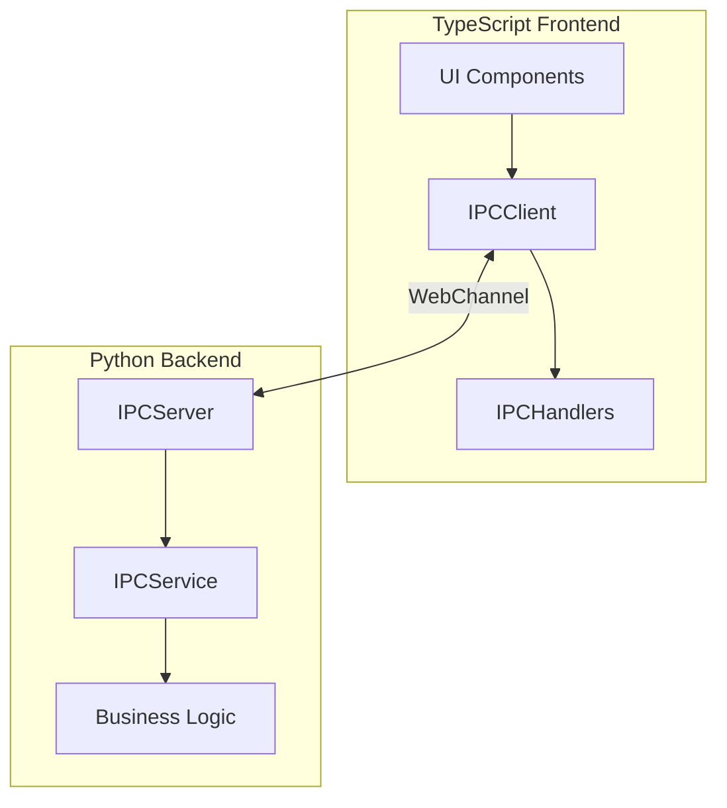
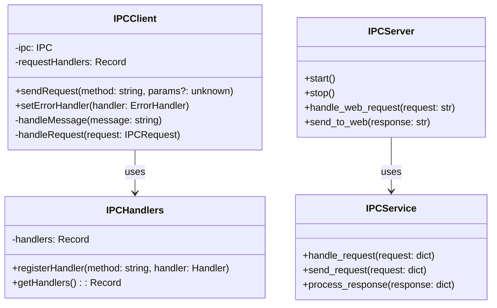
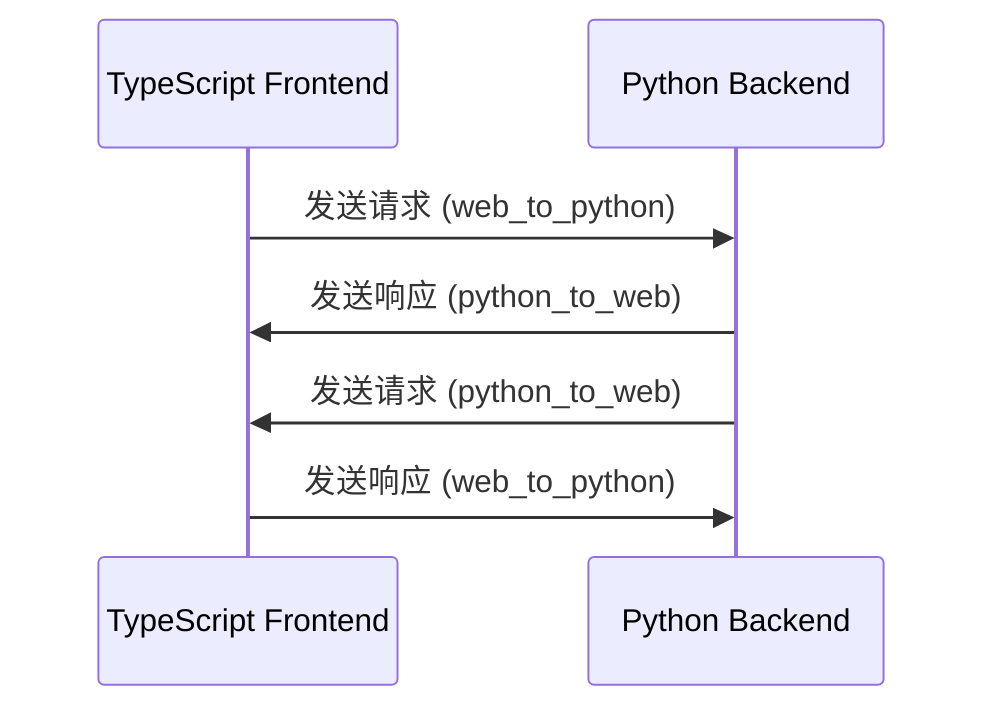
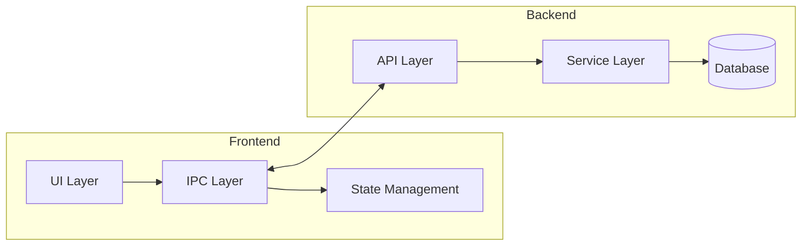

# IPC 架构设计文档

## 1. 整体架构

IPC (进程间通信) 架构采用 WebChannel 技术实现 Python 后端和 TypeScript 前端之间的双向通信。

### 1.1 系统架构图



### 1.2 组件职责



### 1.3 通信流程



### 1.4 数据流图



## 2. 消息数据结构

### 2.1 基础类型定义

```typescript
// 请求处理器类型
type IPCRequestHandler = (request: IPCRequest) => Promise<unknown>;

// 错误处理器类型
type IPCErrorHandler = (error: {
    code: string | number;
    message: string;
    details?: unknown;
}) => void;

// IPC接口定义
interface IPC {
    web_to_python(message: string): Promise<string>;
    python_to_web: {
        connect(callback: (message: string) => void): void;
    };
}
```

### 2.2 请求格式 (IPCRequest)

```typescript
interface IPCRequest {
    id: string;          // 请求唯一标识
    type: 'request';     // 消息类型
    method: string;      // 请求方法名
    params?: unknown;    // 请求参数
    timestamp: number;   // 时间戳
}
```

### 2.3 响应格式 (IPCResponse)

成功响应:
```typescript
interface IPCResponse {
    id: string;          // 对应请求的ID
    type: 'response';    // 消息类型
    status: 'ok';        // 状态
    result: unknown;     // 响应结果
    timestamp: number;   // 时间戳
}
```

错误响应:
```typescript
interface IPCErrorResponse {
    id: string;          // 对应请求的ID
    type: 'response';    // 消息类型
    status: 'error';     // 状态
    error: {
        code: string;    // 错误代码
        message: string; // 错误信息
        details?: unknown; // 错误详情
    };
    timestamp: number;   // 时间戳
}
```

### 2.4 常用数据结构

#### 2.4.1 配置相关

```typescript
// 配置项
interface ConfigItem {
    key: string;
    value: unknown;
    description?: string;
    type: 'string' | 'number' | 'boolean' | 'object';
    default?: unknown;
}

// 配置请求参数
interface ConfigRequestParams {
    key: string;
    value?: unknown;
}
```

#### 2.4.2 仪表盘相关

```typescript
// 仪表盘统计数据
interface DashboardStats {
    overview: number;
    statistics: number;
    recentActivities: number;
    quickActions: number;
}

// 活动记录
interface ActivityRecord {
    id: string;
    type: string;
    timestamp: number;
    details: Record<string, unknown>;
}
```

#### 2.4.3 事件相关

```typescript
// 事件数据
interface EventData {
    event: string;
    data?: unknown;
    timestamp: number;
}

// 事件处理器
interface EventHandler {
    (event: string, data?: unknown): void;
}
```

### 2.5 工具函数

```typescript
// 创建请求
function createRequest(method: string, params?: unknown): IPCRequest {
    return {
        id: generateRequestId(),
        type: 'request',
        method,
        params,
        timestamp: Date.now()
    };
}

// 创建成功响应
function createSuccessResponse(requestId: string, result: unknown): IPCResponse {
    return {
        id: requestId,
        type: 'response',
        status: 'ok',
        result,
        timestamp: Date.now()
    };
}

// 创建错误响应
function createErrorResponse(
    requestId: string,
    code: string,
    message: string,
    details?: unknown
): IPCErrorResponse {
    return {
        id: requestId,
        type: 'response',
        status: 'error',
        error: {
            code,
            message,
            details
        },
        timestamp: Date.now()
    };
}

// 生成请求ID
function generateRequestId(): string {
    return `${Date.now()}-${Math.random().toString(36).substr(2, 9)}`;
}
```

### 2.6 错误代码定义

```typescript
const ErrorCodes = {
    // 初始化错误
    INIT_ERROR: 'INIT_ERROR',
    // 请求处理错误
    HANDLER_ERROR: 'HANDLER_ERROR',
    // 参数验证错误
    VALIDATION_ERROR: 'VALIDATION_ERROR',
    // 发送错误
    SEND_ERROR: 'SEND_ERROR',
    // 解析错误
    PARSE_ERROR: 'PARSE_ERROR',
    // 超时错误
    TIMEOUT_ERROR: 'TIMEOUT_ERROR',
    // 未知错误
    UNKNOWN_ERROR: 'UNKNOWN_ERROR'
} as const;
```

## 3. 双向调用说明

### 3.1 前端调用后端

1. 使用 `IPCClient.sendRequest` 方法:
```typescript
const response = await ipcClient.sendRequest('method_name', params);
```

2. 处理响应:
```typescript
if (response.status === 'ok') {
    const result = response.result;
    // 处理成功响应
} else {
    const error = response.error;
    // 处理错误
}
```

### 3.2 后端调用前端

1. 注册处理器:
```typescript
// 在 IPCHandlers 中注册
this.registerHandler('method_name', this.handleMethod);
```

2. 实现处理器:
```typescript
async handleMethod(request: IPCRequest): Promise<unknown> {
    // 处理请求
    return result;
}
```

### 3.3 错误处理

1. 前端错误处理:
```typescript
ipcClient.setErrorHandler((error) => {
    console.error('IPC error:', error);
});
```

2. 后端错误处理:
```python
try:
    # 处理请求
    response = create_success_response(request_id, result)
except Exception as e:
    response = create_error_response(request_id, str(e))
```

## 4. 最佳实践

1. **请求 ID**: 每个请求必须有唯一 ID，用于匹配请求和响应
2. **错误处理**: 统一使用错误响应格式，包含错误代码和详细信息
3. **类型安全**: 使用 TypeScript 接口确保类型安全
4. **日志记录**: 记录所有 IPC 通信，便于调试
5. **超时处理**: 实现请求超时机制，避免无限等待

## 5. 示例

### 5.1 前端发送请求

```typescript
// 发送请求
const response = await ipcClient.sendRequest('get_config', { key: 'theme' });

// 处理响应
if (response.status === 'ok') {
    const theme = response.result;
    // 使用配置
} else {
    console.error('Failed to get config:', response.error);
}
```

### 5.2 后端发送请求

```python
# 发送请求
request = create_request('refresh_dashboard', {
    'overview': 10,
    'statistics': 20,
    'recentActivities': 30,
    'quickActions': 40
})
response = await ipc_service.send_request(request)

# 处理响应
if response['status'] == 'ok':
    # 处理成功响应
    pass
else:
    # 处理错误
    error = response['error']
    logger.error(f"Error: {error['message']}")
```

## 6. 注意事项

1. 确保请求和响应的 ID 匹配
2. 处理所有可能的错误情况
3. 避免在处理器中执行长时间操作
4. 使用适当的日志级别记录通信过程
5. 定期检查连接状态 