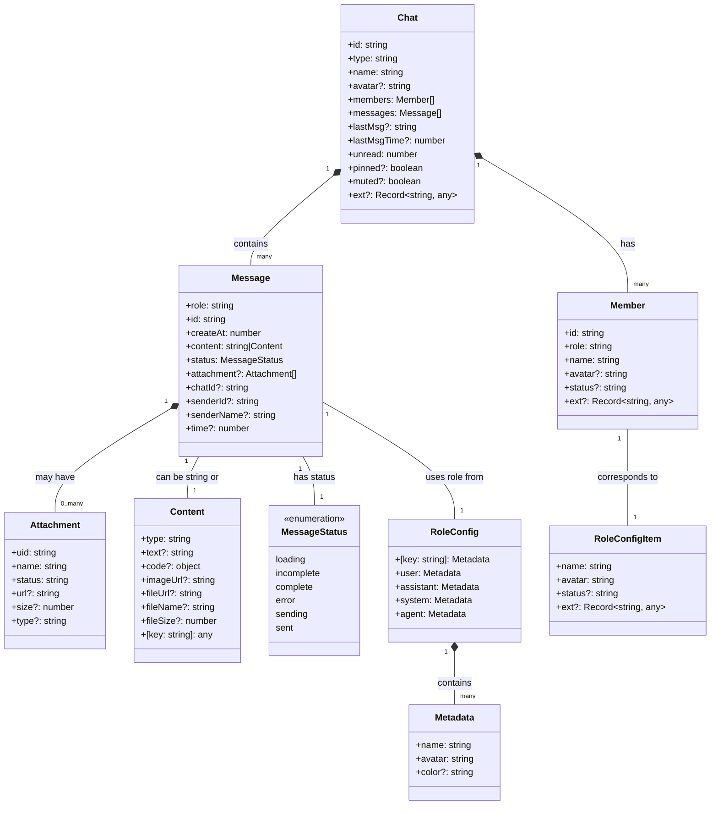

# Chat 数据结构设计文档（与 Semi UI Chat 组件一致）

## 1. Attachment（附件结构）

```ts
export interface Attachment {
  uid: string;      // 附件唯一标识符
  name: string;     // 附件名称
  status: string;   // 附件状态（'done', 'uploading', 'error' 等）
  url?: string;     // 附件访问链接
  size?: number;    // 附件大小（字节）
  type?: string;    // 附件MIME类型
}
```

## 2. MessageStatus（消息状态枚举）

```ts
export type MessageStatus = 'loading' | 'incomplete' | 'complete' | 'error' | 'sending' | 'sent';
```

## 3. Message（消息结构）

```ts
export interface Message {
  role: 'user' | 'assistant' | 'system' | 'agent';  // 消息发送者角色
  id: string;                             // 消息唯一标识符
  createAt: number;                       // 消息创建时间戳
  content: string | Content;              // 消息内容：支持字符串或Content对象
  status: MessageStatus;                  // 消息状态：使用枚举类型
  attachment?: Attachment[];              // 消息附件列表
  
  // 以下字段为应用内部使用，不是Semi Chat组件必需的
  chatId?: string;                        // 所属会话ID
  senderId?: string;                      // 发送者ID
  senderName?: string;                    // 发送者名称
  time?: number;                          // 消息时间戳（可用于替代createAt，保持兼容性）
}
```

## 4. Chat（聊天会话结构）

```ts
export interface Chat {
  id: string;                             // 会话唯一标识符
  type: 'user-system' | 'user-agent' | 'agent-agent' | 'group'; // 会话类型
  name: string;                           // 会话显示名称
  avatar?: string;                        // 会话头像URL
  
  members: Member[];                      // 会话成员列表
  messages: Message[];                    // 会话消息列表
  
  lastMsg?: string;                       // 最后一条消息内容（用于会话列表展示）
  lastMsgTime?: number;                   // 最后一条消息时间
  unread: number;                         // 未读消息数
  
  pinned?: boolean;                       // 是否置顶
  muted?: boolean;                        // 是否静音
  
  ext?: Record<string, any>;              // 扩展字段
}
```

## 5. Member（会话成员结构）

```ts
export interface Member {
  id: string;                             // 成员唯一标识符
  role: string;                           // 成员角色
  name: string;                           // 成员名称
  avatar?: string;                        // 成员头像URL
  status?: 'online' | 'offline' | 'busy'; // 成员状态
  ext?: Record<string, any>;              // 扩展字段
}
```

## 6. Content（消息内容结构）

```ts
export interface Content {
  type: 'text' | 'image' | 'file' | 'code' | 'system' | 'custom'; // 内容类型
  text?: string;                          // 文本内容
  code?: { lang: string; value: string }; // 代码内容
  imageUrl?: string;                      // 图片URL
  fileUrl?: string;                       // 文件URL
  fileName?: string;                      // 文件名称
  fileSize?: number;                      // 文件大小
  // 附件通过 Message.attachment 统一管理，不在 Content 中重复定义
  [key: string]: any;                     // 其他自定义字段
}
```

## 7. RoleConfigItem（角色配置项）

```ts
export interface RoleConfigItem {
  name: string;                           // 角色名称
  avatar: string;                         // 角色头像
  status?: 'online' | 'offline' | 'busy'; // 角色状态
  ext?: Record<string, any>;              // 扩展字段
}
```

## 8. Metadata（Semi UI Chat 角色元数据）

```ts
export interface Metadata {
  name: string;                           // 角色名称
  avatar: string;                         // 角色头像URL
  color?: string;                         // 头像背景颜色，支持 amber、blue、cyan、green 等
}
```

## 9. RoleConfig（Semi UI Chat 角色配置）

```ts
export interface RoleConfig {
  [key: string]: Metadata;                // 索引签名，使其与 Semi UI 兼容
  user: Metadata;                         // 用户角色配置
  assistant: Metadata;                    // 助手角色配置
  system: Metadata;                       // 系统角色配置
  agent: Metadata;                        // 客服代理角色配置
}
```

---

## 10. 数据结构关系详解

### 核心结构关系
1. **Chat 与 Message 的关系**：
   - 一个 Chat（会话）包含多个 Message（消息）
   - Chat.messages 数组存储该会话的所有消息
   - 每个 Message 通过 Message.id 唯一标识

2. **Message 与 Attachment 的关系**：
   - 一个 Message（消息）可以包含 0 到多个 Attachment（附件）
   - Message.attachment 数组存储该消息的所有附件
   - 每个 Attachment 通过 Attachment.uid 唯一标识
   - **优化**: 附件仅通过 Message.attachment 关联，避免数据冗余

3. **Chat 与 Member 的关系**：
   - 一个 Chat（会话）包含多个 Member（成员）
   - Chat.members 数组存储该会话的所有成员
   - 每个 Member 通过 Member.id 唯一标识
   - Message.role 与 Member.role 对应，标识消息发送者角色

4. **Message 与 Content 的关系**：
   - Message.content 支持两种类型：字符串或 Content 对象
   - 当使用字符串时，直接用于 Semi UI Chat 组件显示
   - 当使用 Content 对象时，可以支持更丰富的消息类型和格式
   - **优化**: Content 接口仅用于应用内部消息处理，对 Semi UI Chat 组件使用时需转换为字符串

5. **Message 与 MessageStatus 的关系**：
   - Message.status 使用 MessageStatus 枚举类型
   - 支持 'loading'、'incomplete'、'complete'、'error'、'sending'、'sent' 等状态
   - 提供更清晰的类型定义和状态管理

6. **Member 与 RoleConfigItem 的关系**：
   - Member.role 对应一个 RoleConfigItem
   - RoleConfigItem 定义了角色的显示属性（名称、头像等）

7. **RoleConfig 与 Metadata 的关系**：
   - RoleConfig 包含多个角色的 Metadata
   - 每个角色（user、assistant、system、agent）对应一个 Metadata
   - Metadata 定义了角色在 Semi UI Chat 组件中的显示信息
   - 通过 Message.role 关联到对应的 Metadata
   - **注意**：为了与 Semi UI 兼容，RoleConfig 使用索引签名，允许通过字符串键访问任意角色

### Semi UI Chat 组件集成
- Semi UI Chat 组件直接使用 Message[] 作为输入（chats 属性）
- 每个 Message 对象必须包含 role, id, createAt, content, status 字段
- 可选的 attachment 字段用于展示附件
- 当 Message.content 为 Content 对象时，需转换为字符串后再传给组件
- 通过 roleConfig 属性传入 RoleConfig 对象，定义各角色的显示信息
- 通过 uploadProps 属性配置附件上传功能，必须提供 action 字段
- 无需额外的适配层，直接使用 Message[] 即可驱动组件

### 扩展性设计
- 所有接口都包含可选的扩展字段（ext），用于存储额外信息
- Chat 结构包含 pinned, muted 等应用特定字段，用于增强用户体验
- Message.content 支持字符串和 Content 对象，提供更灵活的消息内容表示
- MessageStatus 枚举提供清晰的状态定义，便于状态管理和转换
- RoleConfig 支持自定义角色（如 agent），方便扩展新角色类型

## 11. 完整数据结构关系图



---

## 12. 示例数据

```ts
// 角色配置示例
export const defaultRoleConfig: RoleConfig = {
  user: {
    name: '用户',
    avatar: '/assets/agent0_100.png',
    color: 'blue'
  },
  assistant: {
    name: 'AI助手',
    avatar: '/assets/icons1_100.png',
    color: 'green'
  },
  system: {
    name: '系统',
    avatar: '/assets/icons0_door_100.png',
    color: 'grey'
  },
  agent: {
    name: '客服代理',
    avatar: '/assets/agent1_100.png',
    color: 'purple'
  }
};

// 消息示例
export const demoChatMessages: Message[] = [
  {
    id: 'msg-1',
    role: 'user',
    createAt: 1710000000000,
    content: '你好，AI助手！',
    status: 'complete',
  },
  {
    id: 'msg-2',
    role: 'assistant',
    createAt: 1710000001000,
    content: '您好，有什么可以帮您？',
    status: 'complete',
  },
  {
    id: 'msg-5',
    role: 'user',
    createAt: 1710000004000,
    content: {
      type: 'text',
      text: '这是一条使用Content对象的消息'
    },
    status: 'complete',
  },
  {
    id: 'msg-9',
    role: 'agent',
    createAt: 1710000008000,
    content: '您好，我是客服代理小王，很高兴为您服务！',
    status: 'complete',
  }
];

// 上传配置示例
const uploadProps = {
  action: 'https://api.mocksample.dev/upload',
  beforeUpload: () => false,
  onSuccess: (response, file) => {
    console.log('Upload success:', response, file);
  },
  onError: (error, file) => {
    console.error('Upload error:', error, file);
  }
};
```